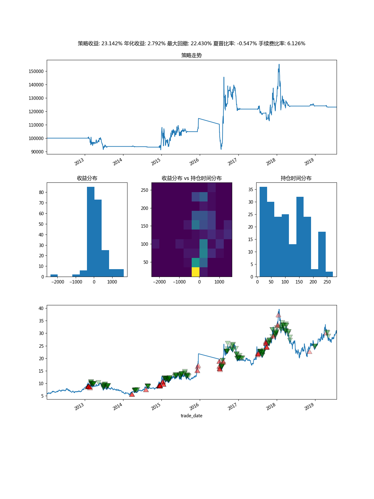

# 用Python徒手撸一个股票回测框架

通过纯Python完成股票回测框架的搭建。
## 什么是回测框架?
无论是传统股票交易还是量化交易，无法避免的一个问题是我们需要检验自己的交易策略是否可行，而最简单的方式就是利用历史数据检验交易策略，而回测框架就是提供这样的一个平台让交易策略在历史数据中不断交易，最终生成最终结果，通过查看结果的策略收益，年化收益，最大回测等用以评估交易策略的可行性。

代码地址在最后。

> 本项目并不是一个已完善的项目, 还在不断的完善。

## 回测框架
回测框架应该至少包含两个部分, 回测类, 交易类.
回测类提供各种钩子函数，用于放置自己的交易逻辑，交易类用于模拟市场的交易平台，这个类提供买入，卖出的方法。

## 代码架构
以自己的回测框架为例。主要包含下面两个文件

```
backtest/
  backtest.py
  broker.py
```

backtest.py主要提供BackTest这个类用于提供回测框架，暴露以下钩子函数.

```
    def initialize(self):
        """在回测开始前的初始化"""
        pass

    def before_on_tick(self, tick):
        pass

    def after_on_tick(self, tick):
        pass

    def before_trade(self, order):
        """在交易之前会调用此函数

        可以在此放置资金管理及风险管理的代码
        如果返回True就允许交易，否则放弃交易
        """
        return True

    def on_order_ok(self, order):
        """当订单执行成功后调用"""
        pass

    def on_order_timeout(self, order):
        """当订单超时后调用"""
        pass

    def finish(self):
        """在回测结束后调用"""
        pass
    
    @abstractmethod
    def on_tick(self, bar):
        """
        回测实例必须实现的方法，并编写自己的交易逻辑
        """
        pass
```
玩过量化平台的回测框架或者开源框架应该对这些钩子函数不陌生，只是名字不一样而已，大多数功能是一致的，除了on_tick.

之所以是on_tick而不是on_bar, 是因为我希望交易逻辑是一个一个时间点的参与交易，在这个时间点我可以获取所有当前时间的所有股票以及之前的股票数据，用于判断是否交易，而不是一个时间点的一个一个股票参与交易逻辑。

而broker.py主要提供buy,sell两个方法用于交易。

```
    def buy(self, code, price, shares, ttl=-1):
        """
        限价提交买入订单

        ---------
        Parameters:
          code:str
                股票代码
          price:float or None
                最高可买入的价格, 如果为None则按市价买入
          shares:int
                买入股票数量
          ttl:int
                订单允许存在的最大时间，默认为-1，永不超时

        ---------
        return:
          dict
             {
                "type": 订单类型, "buy",
                "code": 股票代码,
                "date": 提交日期,
                "ttl": 存活时间, 当ttl等于0时则超时，往后不会在执行
                "shares": 目标股份数量,
                "price": 目标价格,
                "deal_lst": 交易成功的历史数据，如
                    [{"price": 成交价格,
                      "date": 成交时间,
                      "commission": 交易手续费,
                      "shares": 成交份额
                    }]
                ""
            }
        """
        if price is None:
            stock_info = self.ctx.tick_data[code]
            price = stock_info[self.deal_price]
        order = {
            "type": "buy",
            "code": code,
            "date": self.ctx.now,
            "ttl": ttl,
            "shares": shares,
            "price": price,
            "deal_lst": []
        }
        self.submit(order)
        return order
        
    def sell(self, code, price, shares, ttl=-1):
        """
        限价提交卖出订单
        ---------
        Parameters:
          code:str
                股票代码
          price:float or None
                最低可卖出的价格, 如果为None则按市价卖出
          shares:int
                卖出股票数量
          ttl:int
                订单允许存在的最大时间，默认为-1，永不超时

        ---------
        return:
          dict
             {
                "type": 订单类型, "sell",
                "code": 股票代码,
                "date": 提交日期,
                "ttl": 存活时间, 当ttl等于0时则超时，往后不会在执行
                "shares": 目标股份数量,
                "price": 目标价格,
                "deal_lst": 交易成功的历史数据，如
                    [{"open_price": 开仓价格,
                      "close_price": 成交价格,
                      "close_date": 成交时间,
                      "open_date": 持仓时间,
                      "commission": 交易手续费,
                      "shares": 成交份额,
                      "profit": 交易收益}]
                ""
            }
        """
        if code not in self.position:
            return

        if price is None:
            stock_info = self.ctx.tick_data[code]
            price = stock_info[self.deal_price]

        order = {
            "type": "sell",
            "code": code,
            "date": self.ctx.now,
            "ttl": ttl,
            "shares": shares,
            "price": price,
            "deal_lst": []
        }
        self.submit(order)
        return order
```
由于我很讨厌抽象出太多类，抽象出太多类及方法，我怕我自己都忘记了，所以对于对象的选择都是尽可能的使用常用的数据结构，如list, dict.
这里用一个dict代表一个订单。

上面的这些方法保证了一个回测框架的基本交易逻辑，而回测的运行还需要一个调度器不断的驱动这些方法，这里的调度器如下。

```
class Scheduler(object):
    """
    整个回测过程中的调度中心, 通过一个个时间刻度(tick)来驱动回测逻辑

    所有被调度的对象都会绑定一个叫做ctx的Context对象,由于共享整个回测过程中的所有关键数据,
    可用变量包括:
        ctx.feed: {code1: pd.DataFrame, code2: pd.DataFrame}对象
        ctx.now: 循环所处时间
        ctx.tick_data: 循环所处时间的所有有报价的股票报价
        ctx.trade_cal: 交易日历
        ctx.broker: Broker对象
        ctx.bt/ctx.backtest: Backtest对象

    可用方法:
        ctx.get_hist

    """

    def __init__(self):
        """"""
        self.ctx = Context()
        self._pre_hook_lst = []
        self._post_hook_lst = []
        self._runner_lst = []
    def run(self):
        # runner指存在可调用的initialize, finish, run(tick)的对象
        runner_lst = list(chain(self._pre_hook_lst, self._runner_lst, self._post_hook_lst))
        # 循环开始前为broker, backtest, hook等实例绑定ctx对象及调用其initialize方法
        for runner in runner_lst:
            runner.ctx = self.ctx
            runner.initialize()

        # 创建交易日历
        if "trade_cal" not in self.ctx:
            df = list(self.ctx.feed.values())[0]
            self.ctx["trade_cal"] = df.index

        # 通过遍历交易日历的时间依次调用runner
        # 首先调用所有pre-hook的run方法
        # 然后调用broker,backtest的run方法
        # 最后调用post-hook的run方法
        for tick in self.ctx.trade_cal:
            self.ctx.set_currnet_time(tick)
            for runner in runner_lst:
                runner.run(tick)


        # 循环结束后调用所有runner对象的finish方法
        for runner in runner_lst:
            runner.finish()
```

在Backtest类实例化的时候就会自动创建一个调度器对象，然后通过Backtest实例的start方法就能启动调度器，而调度器会根据历史数据的一个一个时间戳不断驱动Backtest, Broker实例被调用。

为了处理不同实例之间的数据访问隔离，所以通过一个将一个Context对象绑定到Backtest, Broker实例上，通过self.ctx访问共享的数据，共享的数据主要包括feed对象，即历史数据，一个数据结构如下的字典对象。
```
{code1: pd.DataFrame, code2: pd.DataFrame}
```
而这个Context对象也绑定了Broker, Backtest的实例, 这就可以使得数据访问接口统一，但是可能导致数据访问混乱，这就要看策略者的使用了，这样的一个好处就是减少了一堆代理方法，通过添加方法去访问其他的对象的方法，真不嫌麻烦，那些人。

绑定及Context对象代码如下:

```
class Context(UserDict):
    def __getattr__(self, key):
        # 让调用这可以通过索引或者属性引用皆可
        return self[key]

    def set_currnet_time(self, tick):
        self["now"] = tick

        tick_data = {}

        # 获取当前所有有报价的股票报价
        for code, hist in self["feed"].items():
            df = hist[hist.index == tick]
            if len(df) == 1:
                tick_data[code] = df.iloc[-1]

        self["tick_data"] = tick_data

    def get_hist(self, code=None):
        """如果不指定code, 获取截至到当前时间的所有股票的历史数据"""
        if code is None:
            hist = {}
            for code, hist in self["feed"].items():
                hist[code] = hist[hist.index <= self.now]
        elif code in self.feed:
            return {code: self.feed[code]}

        return hist
        
class Scheduler(object):
    """
    整个回测过程中的调度中心, 通过一个个时间刻度(tick)来驱动回测逻辑

    所有被调度的对象都会绑定一个叫做ctx的Context对象,由于共享整个回测过程中的所有关键数据,
    可用变量包括:
        ctx.feed: {code1: pd.DataFrame, code2: pd.DataFrame}对象
        ctx.now: 循环所处时间
        ctx.tick_data: 循环所处时间的所有有报价的股票报价
        ctx.trade_cal: 交易日历
        ctx.broker: Broker对象
        ctx.bt/ctx.backtest: Backtest对象

    可用方法:
        ctx.get_hist

    """

    def __init__(self):
        """"""
        self.ctx = Context()
        self._pre_hook_lst = []
        self._post_hook_lst = []
        self._runner_lst = []

    def add_feed(self, feed):
        self.ctx["feed"] = feed

    def add_hook(self, hook, typ="post"):
        if typ == "post" and hook not in self._post_hook_lst:
            self._post_hook_lst.append(hook)
        elif typ == "pre" and hook not in self._pre_hook_lst:
            self._pre_hook_lst.append(hook)

    def add_broker(self, broker):
        self.ctx["broker"] = broker

    def add_backtest(self, backtest):
        self.ctx["backtest"] = backtest
        # 简写
        self.ctx["bt"] = backtest

    def add_runner(self, runner):
        if runner in self._runner_lst:
            return
        self._runner_lst.append(runner)
```

为了使得整个框架可扩展，回测框架中框架中抽象了一个Hook类，这个类可以在在每次回测框架调用前或者调用后被调用，这样就可以加入一些处理逻辑，比如统计资产变化等。

这里创建了一个Stat的Hook对象，用于统计资产变化。


```
class Stat(Base):
    def __init__(self):
        self._date_hist = []
        self._cash_hist = []
        self._stk_val_hist = []
        self._ast_val_hist = []
        self._returns_hist = []

    def run(self, tick):
        self._date_hist.append(tick)
        self._cash_hist.append(self.ctx.broker.cash)
        self._stk_val_hist.append(self.ctx.broker.stock_value)
        self._ast_val_hist.append(self.ctx.broker.assets_value)

    @property
    def data(self):
        df = pd.DataFrame({"cash": self._cash_hist,
                           "stock_value": self._stk_val_hist,
                           "assets_value": self._ast_val_hist}, index=self._date_hist)
        df.index.name = "date"
        return df
```
而通过这些统计的数据就可以计算最大回撤年化率等。


```
    def get_dropdown(self):
        high_val = -1
        low_val = None
        high_index = 0
        low_index = 0
        dropdown_lst = []
        dropdown_index_lst = []

        for idx, val in enumerate(self._ast_val_hist):
            if val >= high_val:
                if high_val == low_val or high_index >= low_index:
                    high_val = low_val = val
                    high_index = low_index = idx
                    continue

                dropdown = (high_val - low_val) / high_val
                dropdown_lst.append(dropdown)
                dropdown_index_lst.append((high_index, low_index))

                high_val = low_val = val
                high_index = low_index = idx

            if low_val is None:
                low_val = val
                low_index = idx

            if val < low_val:
                low_val = val
                low_index = idx

        if low_index > high_index:
            dropdown = (high_val - low_val) / high_val
            dropdown_lst.append(dropdown)
            dropdown_index_lst.append((high_index, low_index))

        return dropdown_lst, dropdown_index_lst

    @property
    def max_dropdown(self):
        """最大回车率"""
        dropdown_lst, dropdown_index_lst = self.get_dropdown()
        if len(dropdown_lst) > 0:
            return max(dropdown_lst)
        else:
            return 0

    @property
    def annual_return(self):
        """
        年化收益率

        y = (v/c)^(D/T) - 1

        v: 最终价值
        c: 初始价值
        D: 有效投资时间(365)
        注: 虽然投资股票只有250天，但是持有股票后的非交易日也没办法投资到其他地方，所以这里我取365

        参考: https://wiki.mbalib.com/zh-tw/%E5%B9%B4%E5%8C%96%E6%94%B6%E7%9B%8A%E7%8E%87
        """
        D = 365
        c = self._ast_val_hist[0]
        v = self._ast_val_hist[-1]
        days = (self._date_hist[-1] - self._date_hist[0]).days

        ret = (v / c) ** (D / days) - 1
        return ret
```

至此一个笔者需要的回测框架形成了。

## 交易历史数据
在回测框架中我并没有集成各种获取数据的方法，因为这并不是回测框架必须集成的部分，规定数据结构就可以了，数据的获取通过查看数据篇，

## 回测报告
回测报告我也放在了回测框架之外，这里写了一个Plottter的对象用于绘制一些回测指标等。结果如下:



## 回测示例
下面是一个回测示例。


```
import json
from backtest import BackTest
from reporter import Plotter


class MyBackTest(BackTest):
    def initialize(self):
        self.info("initialize")

    def finish(self):
        self.info("finish")

    def on_tick(self, tick):
        tick_data = self.ctx["tick_data"]

        for code, hist in tick_data.items():
            if hist["ma10"] > 1.05 * hist["ma20"]:
                self.ctx.broker.buy(code, hist.close, 500, ttl=5)

            if hist["ma10"] < hist["ma20"] and code in self.ctx.broker.position:
                self.ctx.broker.sell(code, hist.close, 200, ttl=1)

if __name__ == '__main__':
    from utils import load_hist
    feed = {}

    for code, hist in load_hist("000002.SZ"):
        # hist = hist.iloc[:100]
        hist["ma10"] = hist.close.rolling(10).mean()
        hist["ma20"] = hist.close.rolling(20).mean()
        feed[code] = hist

    mytest = MyBackTest(feed)
    mytest.start()
    order_lst = mytest.ctx.broker.order_hist_lst
    with open("report/order_hist.json", "w") as wf:
        json.dump(order_lst, wf, indent=4, default=str)
    stats = mytest.stat
    stats.data.to_csv("report/stat.csv")
    print("策略收益： {:.3f}%".format(stats.total_returns * 100))
    print("最大回彻率: {:.3f}% ".format(stats.max_dropdown * 100))
    print("年化收益: {:.3f}% ".format(stats.annual_return * 100))
    print("夏普比率: {:.3f} ".format(stats.sharpe))

    plotter = Plotter(feed, stats, order_lst)
    plotter.report("report/report.png")

```

## 项目地址
https://github.com/youerning/stock_playground

