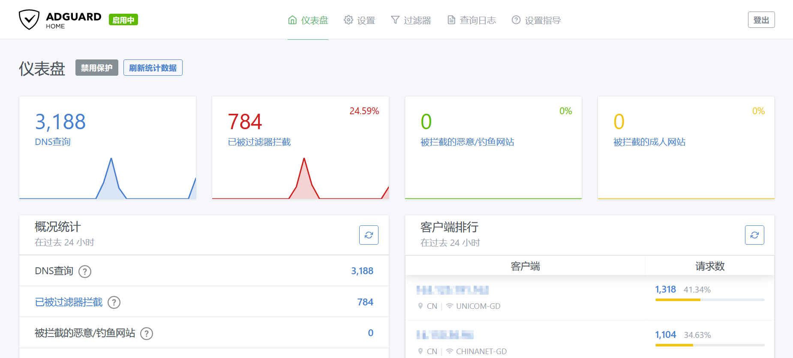
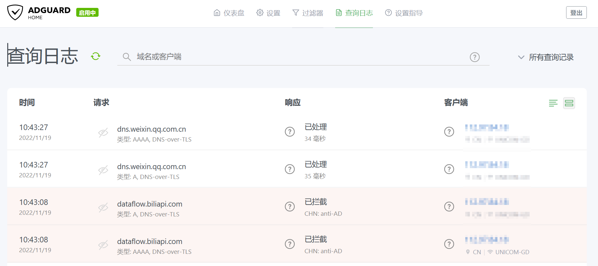
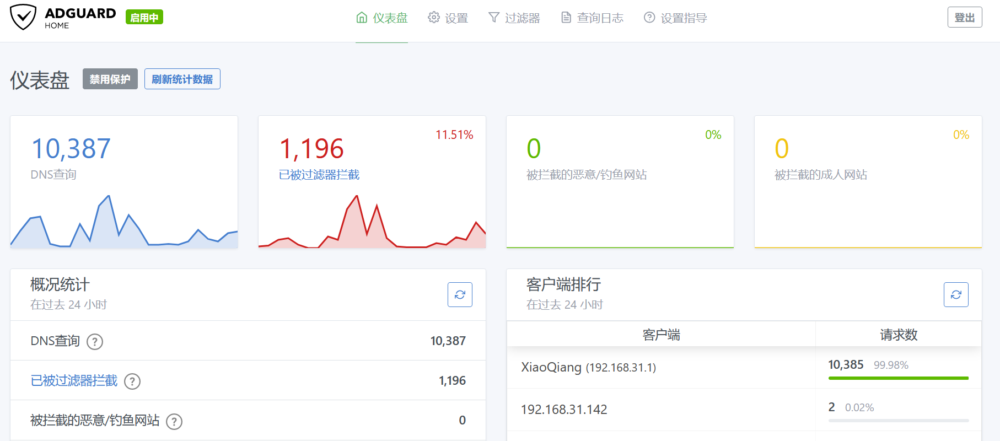
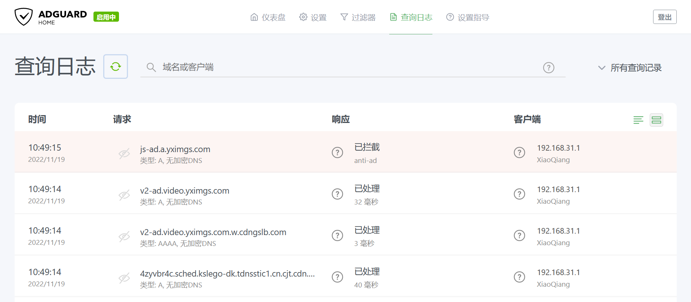
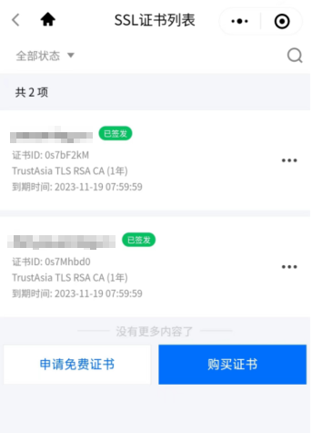
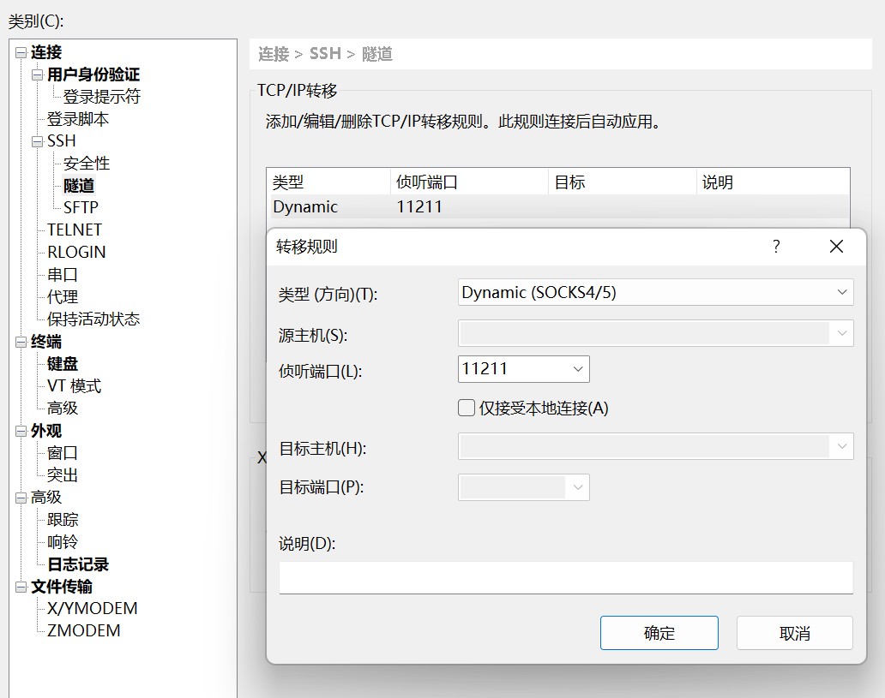
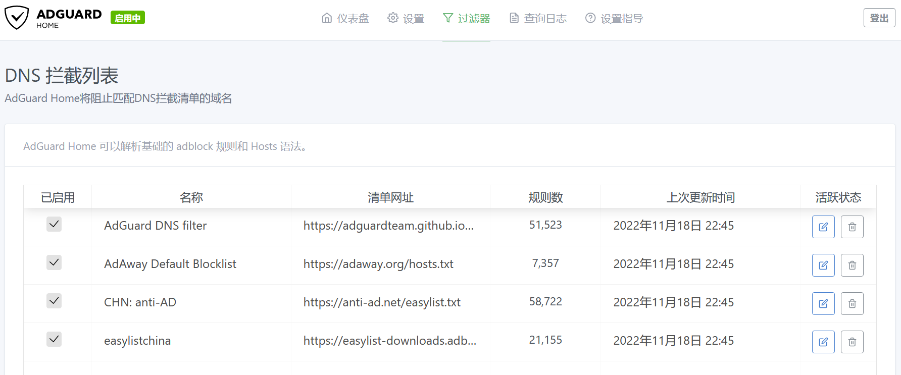

# 打造自己的私人DNS, 反毒化, 反广告, 加速(也许)
如果你对自己的DNS有更高的要求那么你或许可以打造一个专属于自己的DNS, 并且利用这个DNS做一些反广告的操作，又因为这个DNS是用的DNS-Over-TLS(DOT)协议, 所以可以反毒化, 因为TLS的加密特性可以防止数据在传输过程中被篡改. 

打造自己的DNS有两种办法，一是做一个公网可访问的DNS服务器, 二是仅局域网可访问的DNS服务器。

第一种方法需要一个域名，一个公网云主机。

第二种方法需要一个本地的主机(可以是树莓派, 可刷机的电视盒子, 本地电脑， 不用的旧手机等。)

本人是两种方法都搞上了， 本地因为是局域网所以不需要搞DOT, 也就不需要一个跟域名匹配的证书， 而第二种方法因为是
## 效果展示






## 接入方法
接入方法这里介绍两种安卓手机和windows11电脑
### 安卓手机
小米安卓手机是 "设置" -> "连接于共享" -> "私人DNS" -> "私人DNS提供商主机名" 然后填入自己的域名的DOT协议的DNS即可
> 本人只有小米手机, 所以这种方法可能并不一定适合你，但是Android9以上的安卓手机，应该都有一个类似私有DNS的选项。

### windows11电脑
因为自己用的电脑就是在自己已经假设私有dns的局域网, 所以就不需要设置一个公网的dot协议的DNS服务了。
大家可以参考: https://4sysops.com/archives/activate-dns-over-tls-dot-in-windows-11/


## 安装方法
DNS服务选型有两种
1. ADGuardHome
2. CoreDNS
如上文所示, 本文选择的是第一种方式, ADGuardHome的好处在于有一个web控制台, 操作简单好用，对终端用户比较友好, 因为安装方法及占用资源相较于第二种要复杂和稍多一些，但是用户体验要好于第二种太多太多。这里两种办法都会介绍。

两种安装方式可以安装在本地也可以安装在云主机, 安装在本地就是局域网DNS服务, 反之就是公网可访问的DNS服务。**值得注意的云主机一般会有安全组(或者说防火墙, DOT协议用的是853TCP端口, 你需要放行。)**

## 获取证书
获取证书的前提是你需要一个域名, 这里建议通过国内的云服务商(阿里云, 腾讯云等)买一个域名， 这些云厂商可以申请免费的ssl证书, 虽然可以申请let's encrypt的免费证书, 但是亲测发现小米手机无法连接, 也没有更多的报错, 个人怀疑是小米手机对于DOT协议的根证书没有安装let's encrypt的根证书所以不能验证证书的有效性, 但是其他品牌手机的"私人DNS"没有设置, 如果跟完教程并且测试过，可以反馈一下，云厂商赠送的免费ssl证书的还有一个好处是有效期一年!
> 虽然小米手机的私人DNS不能识别这个let's encrypt的证书, 但是并不代表这个证书就没用, 用其他客户端是没有问题的。

腾讯云ssl免费证书申请参考: https://cloud.tencent.com/document/product/400/6814

申请流程很快, 本人申请发现不到十分钟就下来了. 如果是阿里云或者华为云等云厂商可以参考官网对于的文档。
本人是用腾讯云的小程序申请的，截图如下:



证书下来之后就可以去腾讯云的控制台下载证书了。我下载的"Nginx（适用大部分场景）"选项, 下载下来是一个压缩包, 解压后有以下文件:
```shell
dot.example.com.csr  dot.example.com.key  dot.example.com_bundle.crt  dot.example.com_bundle.pem
```
> 假设你的域名是dot.example.com
本文只需要dot.example.com.key, dot.example.com_bundle.crt两个文件即可, 前者是一个私钥, 后者是一个证书。

## 安装DNS服务
这里演示两种DNS的方法，首先演示CoreDNS, 因为它比较简单


### CoreDNS
如果对linux收悉的话, 安装Coredns还是很简单的, 因为Coredns只需要一个配置文件，并且自身是一个可执行的二进制包.
配置文件如下
```corefile
tls://. {
    # tls证书配置
    tls dot.example.com_bundle.crt dot.example.com.key
    # 会打印日志, 显示解析的详情
    log
    # 将dns查询转发给8.8.8.8, .代表所有域名
    forward . 8.8.8.8
}
```
然后再这个配置文件的目录执行coredns即可, 正常运行会显示如下
```shell
[root@localhost download]# coredns
tls://.:853
CoreDNS-1.10.0
linux/amd64, go1.19.1, 596a9f9
```
coredns下载地址: https://github.com/coredns/coredns/releases

下载一个对应版本的coredns即可, 因为coredns是go语言写的, 所以几乎支持所有平台, 比如windows, linux, macos, 安卓手机(推荐termux), 树莓派等.

#### 反广告
但是coredns怎么屏蔽广告呢?
可以使用coredns的hosts插件, 比如我们准备一个这样的hosts文件
```txt
127.0.0.1 baidu.com
```

然后Coredns配置文件就变成了这样
```corefile
tls://. {
    # tls证书配置
    tls dot.example.com_bundle.crt dot.example.com.key
    # 会打印日志, 显示解析的详情
    log
    # 将dns查询转发给8.8.8.8, .代表所有域名
    hosts adhosts.txt
}
```
然后通过doggo(类似dig, 支持更多的dns协议)的dns查询工具查询一下baidu.com
```shell
[root@ye download]# doggo baidu.com @tls://dot.example.com
NAME            TYPE    CLASS   TTL     ADDRESS         NAMESERVER            
baidu.com.      A       IN      3600s   127.0.0.1       dot.example.com:853
```
你会发现baidu.com被解析成127.0.0.1了, 这样就达到了广告屏蔽的效果, 所以为了匹配广告你需要准备一些广告域名, 然后将其改成hosts插件支持的格式.
> doggo工具下载地址: https://github.com/mr-karan/doggo/releases

#### 加速(也许)
既然能hosts插件能够将指定域名解析成指定的ip地址，那么就可以hosts加速, 可自行搜索hosts加速, 这里就不展开了。

### ADGuardHome
ADGuardHome也是用go语言写的, 虽然也能二进制安装, 但是默认会占用一堆的端口, 比如53, 80等端口, 所有一般使用docker安装.
```shell
docker run --name adguardhome\
    --restart unless-stopped\
    -v /my/own/workdir:/opt/adguardhome/work\
    -v /my/own/confdir:/opt/adguardhome/conf\
    -p 80:80/tcp 3000:3000/tcp\
    -p 853:853/tcp\
    -d adguard/adguardhome
```
上面的命令代码启动adguard/adguardhome容器, 并且将本地的80, 3000, 853等端口映射到容器内, 如果你不想映射同样的端口, 比如80端口已经被占用了, 那么你可以将80:80改成8080:80, 即将8080映射到容器的80端口。`/my/own/workdir`应该是主机上一个存在的目录，docker的知识这里就不展开了, 大家需有一定的docker使用基础。

ADGuardHome的安装在云主机稍微有点麻烦, 因为初次启动需要本地访问它的3000端口, 如果通过公网访问会发现无法访问, 所以你需要通过ssh代理来安装。本人用的是xshell的隧道功能, 



这样xshell就会在本地开启一个监听11211端口的socks5代理. 然后通过自浏览器设置一个代理访问云主机的本地地址就可以连接ADGuardHome的3000端口, 安装完成之后你可以不在映射3000端口

安装完成之后就可以通过设置的用户名密码进行登录了。

详细的安装教程可参考以下链接:

https://www.jianshu.com/p/a52ea033615a

https://sspai.com/post/63088

默认情况只有一个DOH的DNS上游服务器, 国内使用需要添加自定义的DNS列表, 本人只设置了如下三个
```txt
# 腾讯dns
119.29.29.29
# 广东联通
210.21.196.6
# 阿里dns
223.5.5.5
```
当然你还可以使用DOT, DOH等协议防止上游DNS毒化, 但是本人不需要, 因为毒化的一般是国外域名, 而国外域名需要梯子, 所以影响并不大。

#### 反广告
通过控制台的 "过滤器" -> "DNS 拦截列表" -> "添加阻止列表"就可以添加广告域名列表了, ADGuardHome内置了一些列表, 可以"从列表中选择"或者"添加一个自定义列表"。本人两者都选择了。



#### 加速(也许)
类似coredns的hosts插件, 添加自定义的域名解析，可以通过"过滤器" -> "DNS重写"实现.但是添加没有coredns那么方便。

## 总结
如果真的需要一个私人的DNS服务, 你可能需要考虑以下云主机的地理位置和带宽, 个人建议是选择一个本省的云主机, 一般本省的云主机的ping速度能够搞到50ms以下, 而外省的延迟可能就比较高了, 对于dns解析也许是难以接受的, 因为大部分时间用在了传输, 而带宽就跟使用的人数有关了。

最后总结以下优点和缺点:
私人DNS
- 优点:
    - 完全可控, 查询日志, 控制策略等。
    - 反毒化
    - 反广告
    - 可加速(也许)
- 缺点:
    - 速度相较于运营商的dns要慢
运营商DNS或公网DNS   
- 优点:
    - 快
- 缺点:
    - 如果没有特别需求, 无
    - 如果有特别需求, 就是没有私人DNS的优点。


