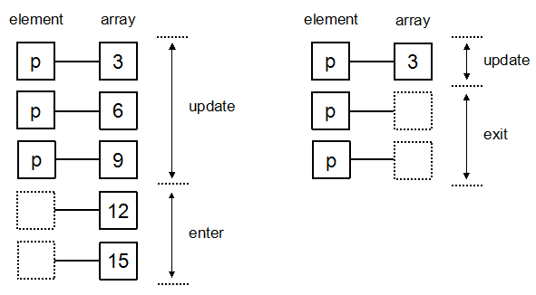

# d3从入门到出门
## 前言
基于d3js 5.5版本基础教程

## 环境配置
下载最新d3js文件, 参考: [d3js官网](https://d3js.org/)

当前版本5.5, d3js v4与v3之间的api有一定的差异。

## 选择元素
d3主要有两个选择器
- select

    选择相应的dom元素, 如果有多个, 选择第一个
- selectAll

    选择所有的指定的dom元素.

通过选择器可以选择相应得dom元素, 而选择器的语法基本就是css选择器的语法.

css选择器语法: http://www.w3school.com.cn/cssref/css_selectors.asp


## 增删查改
假设网页有以下元素, 关于d3的元素操作都将引用本段落
```html
// 省略html,head等标签
<body>
    <input type="checkbox">
    <p>段落1</p>
    <p>段落2</p>
    <p>段落3</p>
    <svg><rect></rect></svg>
    
</body>
```
### 元素增加
- append

    在选择的元素中增加一个子元素, 
    ```
    示例: 
    d3.select("body").append("p") //将会在svg后面增加一个内容为空的p元素
    ```
- insert

    在选择的元素里面或者前面增加一个元素, 
    
    ```
    示例1:
    d3.select("body").insert("p") //与append方法一致
    
    示例2:
    d3.select("body").insert("p", "p") //第一个参数为要插入的元素, 第二个元素为before, 即首先通过第二个参数选择相应位置，在这个选择的元素之前插入一个元素
    
    ```
### 内容修改
- text

    修改元素的文本内容
    
    ```
    示例:
    d3.select("p").text("段落一修改后的内容") // 将段落一的内容修改为text函数传入的参数，如果传入的文本包含html标签，则会被转义
    ```
- html

    修改元素内容
    
    ```
    示例:
    d3.select("p").html("<div>段落一修改后的内容</div>") // 将段落一的内容修改为text函数传入的参数，如果传入的文本包含html标签，不会被转义
    ```
    
### 属性增加修改
- attr

    增加或者修改属性(如果属性已存在)
    ```
    示例:
    d3.select("svg rect").attr("width", 200) //将选择的rect元素width属性修改为200
    ```
- style

    增加或这修改样式(如果属性已存在)
    ```
    示例:
    d3.selectAll("p").style("color", "#ff0000") //选择所有p元素，并将其文字颜色设置为红色
    ```
- property

    增加或这修改样式(如果属性已存在)
    ```
    示例:
    d3.select("input").property("checked",true); //选择第一input元素，将checked属性设置为true
    ```
    

### 元素删除
- remove

    将选定的元素删除
    ```
    示例:
    d3.select("p").remove //选择第一个p元删除
    ```

## 链式操作
d3与jQuery有一样的链式操作, 只要操作合法你可以一直链接下去
```
示例:
//首先选择第一个p元素然后将元素的文本内容修改为'修改后内容',并将其文字颜色设置为红色
d3.select("p")
  .text("修改后内容")
  .style("color", "red") 
```

## 数据绑定与加载

### 数据绑定

- datum

    将一个数据绑定到所有选择的元素上
    ```
    // 通过datum元素将"datum"数据传入, 在text方法里面传入一个箭头函数，而箭头函数直接返回数据
    d3.selectAll("p")
      .datum("datum")
      .text((d, i) => d)
      
    // 修改后的内容如下
    ...省略不相内容
    <p>datum</p>
    <p>datum</p>
    <p>datum</p>
    ```
    
- data

    传入一组数据，分别于选择的元素一一绑定

    ```
    // 通过datum元素将"datum"数据传入, 在text方法里面传入一个箭头函数，而箭头函数直接返回数据
    d3.selectAll("p")
      .data([1,2,3])
      .text((d, i) => d)
     
    // 修改后的内容如下
    ...省略不相关内容
    <p>1</p>
    <p>2</p>
    <p>3</p>
    ```
- update, enter, exit

参考图片内容:


### 网络数据加载
d3内置数据加载的方法，可以解析比较常见的数据格式，主要有以下四种，这里主要以csv文件个数数据作为示例
- d3.csv
- d3.json
- d3.tsv
- d3.xml

```
csv文件内容如下
//data.csv
name, age
zhangsan, 11
wangwu, 22
lisi, 33

// 加载csv
d3.csv("data.csv", (data) => {
    console.log(data)
})

// 输出, d3已经将csv格式的数据解析成可识别的对象
{name: "zhangsan", " age": " 11"}
{name: "wangwu", " age": " 22"}
{name: "lisi", " age": " 33"}

```

## 事件
d3自然也可以监听相应的事件。
常用事件如下:
```
// 选择所有的p元素，当鼠标移到相应的p元素上面，p元素的字体颜色就会变成橙色，移出的时候就会变成红色
d3.selectAll("p")
      .on("mouseover", function(){
          d3.select(this)
            .style("color", "orange");
      })
      .on("mouseout", function() {
        d3.select(this)
            .style("color", "red");
      })
```

## 动画
可以通过以下四个过程使得选定的元素生成动态效果
- transition

    启动动画效果
- duration

    动画时间，单位为毫秒
- ease

    过渡方式, 默认为线性过渡

- delay

    延迟时间，在指定的一段时间后才启动动画
    
```
// 选中第一个元素，先延迟延迟一秒，动画时间2秒，在两秒内同时从默认的颜色渐变到红色，字体大小从默认大小变成50px
d3.select("p")
      .transition()
      .delay(1000)
      .duration(2000)
      .style("background-color", "red")
      .style("font-size", "50px")
```


## 缩放
由于使用的数值与图片中的长宽数值有一定的差异，比如，图片长度为500，但是数值都是在10以内, 我们做出来的图一定是需要尽量的填充整个视图，所以需要对源数据做一定的缩放, 下面介绍两类缩放，d3本身有很多的缩放函数。

### 线性缩放
```
var data = [100, 400, 300, 900, 850, 1000];

var scale = d3.scaleLinear()
            // 源数据数值范围
            .domain([0, d3.max(data)])
            // 真实距离大小范围，一般是展示区长宽
            .range([0, 500]);
console.log(scale(20))
console.log(scale(800))
console.log(scale(1000))

输出
10
400
500
```
### 离散缩放
```
// 常用于选区颜色
var index = [0, 1, 2, 3, 4]
var color = ["red", "blue", "green", "yellow", "black"]
var ordinal = d3.scaleOrdinal()
                .domain(index)
                .range(color)
console.log(ordinal(1))
console.log(ordinal(4))
console.log(ordinal(100))

//输出
blue
black
blue
```

## 坐标轴
常见图标展示一般都会带有坐标轴，因为坐标轴是一个很常用的功能，所以d3有内置的函数用于生成坐标轴

可选坐标轴
- axisTop
- axisRight
- axisBottom
- axisLeft

上面的上下左右主要指坐标周的刻度文字的位置，比如axisTop是指文字在横轴上面
```
var width = 400,
    height = 100;

var data = [10, 15, 20, 25, 30];

// 在body元素内插入一个svg元素 
var svg = d3.select("body")
            .append("svg")
            .attr("width", width)
            .attr("height", height);

// 创建一个线性缩放函数
var scale = d3.scaleLinear()
              .domain([d3.min(data), d3.max(data)])
              .range([0, width - 100]);

// 创建一个坐标轴，需传入缩放函数
var x_axis = d3.axisBottom()
               .scale(scale);

//在svg函数里面加入一个g元素，并创建坐标轴
svg.append("g")
   .call(x_axis);

```

### 坐标轴微调
```
//旋转坐标轴文字
d3.selectAll("svg > g  text")
  .attr("transform", "rotate(45)")
  // 文字沿当前方向距离轴位置大小
  .attr("y", 20)
```


## 柱状图
柱状图示例
参考: http://www.tutorialsteacher.com/d3js/create-bar-chart-using-d3js

## 饼图
参考: http://www.tutorialsteacher.com/d3js/create-pie-chart-using-d3js

## 后记
之所以叫做从入门到出门, 是因为本人学得很快, 忘得更快。

## 参考链接
[https://d3js.org/](https://d3js.org//)
[http://www.tutorialsteacher.com/d3js](http://www.tutorialsteacher.com/d3j)
[http://www.ourd3js.com/wordpress/396/](http://www.ourd3js.com/wordpress/396/)

