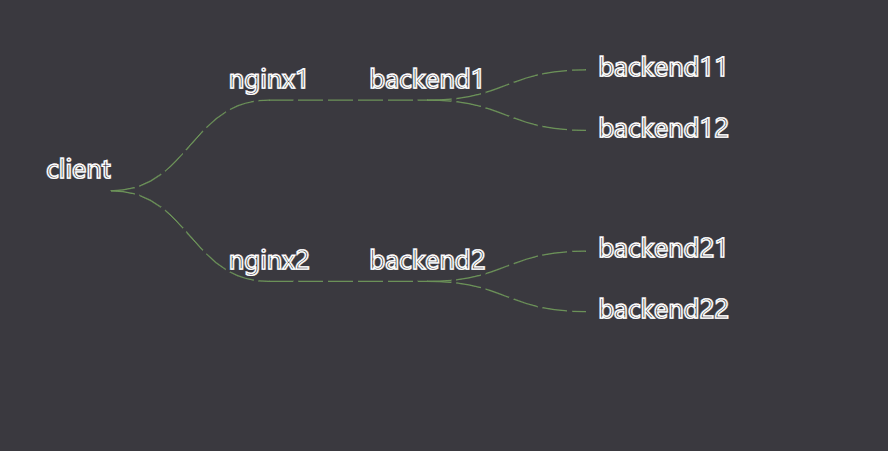
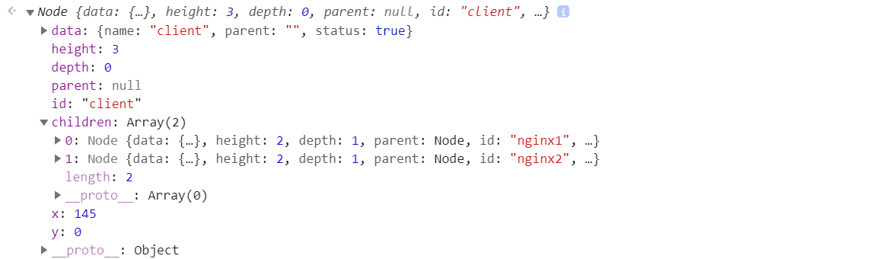

# 数据流可视化
这里的数据流指数据从前端流向后端的过程中途径的所有组件或者说服务，比如用户的http请求先到Nginx, 再到后端服务1, 再到发现服务，再到缓存服务，再到后端服务2, 然后是数据库，以及其他调用，总的来说就是一个请求进入的路径，如果将这样的一个过程可视化出来，我想是不错的，而这样的一个可视化也就可以做成一个监控的可视化，监控测试的连接是否可以完成的完成相应以及发现那个组件出现了问题。

而这里的前端后端并不局限于开发中的前端后端，只有有数据流动的地方就是数据流，比如不同物理机与交换机，路由器之间的网络流动，或者容器之间的数据流动，总的来说所有的数据总会有一个流动的方法，如果可以通过一定的技术获取每个节点的标志，那么就可以将这条路径动态的可视化出来。


## 演示效果


## 技术架构
这里选择JavaScript和SVG, 之所以选择SVG是因为D3以及有对应的layout了,所以可以很方便的将数据进行树状的可视化。

- D3.js


## 数据
这里假设我们要监控的数据流架构如下
```

                                            |---> backend11
           |---> nginx1 ---> backend1 --->  |
           |                                |---> backend12
client --> |
           |                                |---> backend21
           |---> nginx2 ---> backend2 --->  |
                                            |---> backend22
```


那么我们可以用下面两种方式来表示
```
# 将每一行作为一个节点,然后通过parent指向对应的parent节点
rawData1 = [
    {name: "client", parent: "", status: 1},
    {name: "nginx1", parent: "client", status: 1},
    {name: "nginx2", parent: "client", status: 1},
    {name: "backend1", parent: "nginx1", status: 1},
    {name: "backend2", parent: "nginx2", status: 1},
    {name: "backend11", parent: "backend1", status: 1},
    {name: "backend12", parent: "backend1", status: 1},   
    {name: "backend21", parent: "backend2", status: 1},
    {name: "backend22", parent: "backend2", status: 1},   
]

# 通过嵌套的json数据结构来表示
rawData2 = {data:{id: "client"},
    children: [
        {data: {id: "nginx1"},
         children: [
             {data: {id: "backend1"},
              children: [
                  {data: {id: "backend11"}},
                  {data: {id: "backend12"}}
              ]
            }
         ]
        },
        {data: {id: "nginx2"},
         children: [
             {data: {id: "backend2"},
              children: [
                  {data: {id: "backend21"}},
                  {data: {id: "backend22"}}
              ]
            }
         ]
        }
]};

```

## 绘制树状图
通过D3.js绘制树状图主要分为2个部分
1. 将数据转换成D3.js能够识别的形式，上面提到的两种形式D3.js都是可以很好处理的。
2. 绘制树状图的各个部分，节点，各节点之间的连线，各节点的标注文字。
> 树状图的各个部分可以看自己需要绘制相应的部分，比如不绘制节点的标识或者文字。

### 处理数据
通过d3通过的stratify方法将第一种形式的数据处理成可以直接传给d3.tree对象的数据形式
```
var rawData = [
    {name: "client", parent: "", status: 1},
    {name: "nginx1", parent: "client", status: 1},
    {name: "nginx2", parent: "client", status: 1},
    {name: "backend1", parent: "nginx1", status: 1},
    {name: "backend2", parent: "nginx2", status: 1},
    {name: "backend11", parent: "backend1", status: 1},
    {name: "backend12", parent: "backend1", status: 1},   
    {name: "backend21", parent: "backend2", status: 1},
    {name: "backend22", parent: "backend2", status: 1},   
]

// stratify处理完成的数据，至少需要两个字段: id, children
// 通过链式的调用id方法, 可以传入一个回调函数处理数据中的每一行，函数应该返回这一行数据作为id的数值
// 通过链式的调用parentId, 可以传入一个回调函数处理数据中的每一行，函数应该返回这一行数据它指向的parent id
const data = d3.stratify()
                 .id(d => d.name)
                 .parentId(d => d.parent)
                 (rawData);
                 
                 
```
通过d3通过的hierarchy方法将第二种形式的数据处理成可以直接传给d3.tree对象的数据形式
```
var rawData = {data:{id: "client"},
                    children: [
                        {data: {id: "nginx1"},
                         children: [
                             {data: {id: "backend1"},
                              children: [
                                  {data: {id: "backend11"}},
                                  {data: {id: "backend12"}}
                              ]
                            }
                         ]
                        },
                        {data: {id: "nginx2"},
                         children: [
                             {data: {id: "backend2"},
                              children: [
                                  {data: {id: "backend21"}},
                                  {data: {id: "backend22"}}
                              ]
                            }
                         ]
                        }
                    ]};
                    
// 由于上面的数据已经有对应的id, children字段，所以不需要额外的处理，可以直接传给hierarchy.
const data = d3.hierarchy(rawData)
```

无论是hierarchy还是stratify都是将数据转换成一个嵌套的对象，对象的结构是一棵树。

效果如下



### 绘制树状图的各个部分
初始化树对象，将上面处理完成的数据可以直接传给初始化后的d3.tree对象。将data传递调用后会得到一个tree的对象(代码里面的root)，这个对象有两个比较重要的属性, links, descendants.

它们分别对应了树状结构的各个边的路径以及节点的位置。

```
const myTree = d3.tree().size([innerWidth - 400, innerHeight]);
const root = myTree(data);
const links = root.links();
const nodes = root.descendants();
```
> 之所以将innerWidth减去400,是因为这个内置的tree的位置计算方法会根据数据结构来计算图的比例，而不是画布的大小来计算比例，总的来说，如果需要将树的可视化图放到一个合适的位置，这个宽高需要根据数据结构调整一下，大家多试一下就了解了。


绘制树的每条边
```
// 绘制links
svg.selectAll("path").data(links)
    .enter().append("path")
        .attr("d", d3.linkHorizontal()
            .x(d => d.y)
            .y(d => d.x)
        )

```

绘制树的每个节点以及文字
```
// 绘制节点
const circles = g.selectAll("circle").data(nodes, d=>d.data.id)
const circleFill = d => d.data.status ? successColor:failedColor

circles
    .enter().append("circle")
        .attr("r", 0)
        // 注意!x 对于 y, 这很奇葩
        .attr("cx", d => d.y)
        .attr("cy", d => d.x)
        .attr("fill", circleFill)


// 绘制文字
g.selectAll("text").data(nodes)
    .enter().append("text")
        .attr("x", d => d.y)
        .attr("y", d => d.x)
        // 如果该节点有children字段，则说明有子节点，那么x方向的位置不变
        // 反之，位置向右移动10个像素
        .attr("dx", d => d.children? 0: 10)
        // 如果该节点有children字段，则说明有子节点，那么y方向的位置向上移动10个像素
        // 反之，位置向下移动5个像素
        .attr("dy", d => d.children? -10: 5)
        // 如果该节点有没有parent,则说明是root节点，文字的对其方式为end
        // 如果该节点有children字段，则说明有子节点，文字的对其方式为middle
        // 反之，文字的对其方式为middle
        .attr("text-anchor", d => {
            if (!d.parent) {
                return "end"
            } else if (d.children) {
                return "middle"
            } else {
                return "start"
            }
        })
        .attr("font-size",  "1em")
        .text(d=> d.data.name)
```

### 让树的各个边动起来
动画的效果分为两个部分实现，一是在原有路径上加一个Path,二是让这个path通过css动起来。


绘制流动的线条
```
// 绘制流动的线条
g.selectAll("path.flow").data(links)
    .enter().append("path")
        // 注意!x 对于 y, 这很奇葩
        // 通过linkHorizontal将links里面的数据转换成图中对应的path的绘制路径
        .attr("d", d3.linkHorizontal()
            .x(d => d.y)
            .y(d => d.x)
        )
        .attr("class", "flow")
```

配置css样式
```
path.flow {
    fill:transparent;
    stroke:#6D9459;
    stroke-dasharray: 20 4;
    animation: flowpath 4s linear infinite;
}

@keyframes flowpath {
    from {
        stroke-dashoffset: 100;
    }

    to {
        stroke-dashoffset: 0;
    }
}
```

最后的效果将文章开始的动画


### 监听鼠标的缩放，拖动事件
通过鼠标中键的滑动缩放图的大小，通过鼠标也可以移动svg对象。
```
const zoomG = svg.append("g");
const g = zoomG.append("g").attr("transform", `translate(${margin.left} ${margin.top})`);

      // 增加缩放拖动的操作  
      svg.call(d3.zoom().on("zoom", () => {
        zoomG.attr("transform", d3.event.transform)            
    }));
```


## 总结
由于文中的代码部分根据需要切除或者替换了相关的变量，所以只是复制文中的代码运行是有问题的，完整的代码请参考完整的源代码。


## 源代码
https://github.com/youerning/blog/tree/master/dataflow-vis

如果期待后续文章可以关注我的微信公众号(又耳笔记)，头条号(又耳笔记)，github。


## Q&A
### Q:怎么获取获取数据流的的路径?

这里提供两个数据流的监控作为参考:
1. http请求

后端可以为特定的请求配置一个唯一的ID, 这个ID会在各个组件传递，所以每个组件在监控到这个特定的ID就可以将数据发送到自己的监控中心，监控中心为前端提供处理好的数据。

2. 网络之间的连通性

每一个节点都需要设置的代理或者说Agent, 监控中心在按照特定的时间间隔往自己直连的Agent发送ping或者特定的请求以检查网络连通性。

### Q: 这有什么用?

觉得有用的就会有用吧，觉得没用的就没有咯。

### Q: 大多数情况下节点之间的数据结构不是树状结构而是网络结构，这个怎么办?

关于非树状结构就放在后面的文章在说吧，


