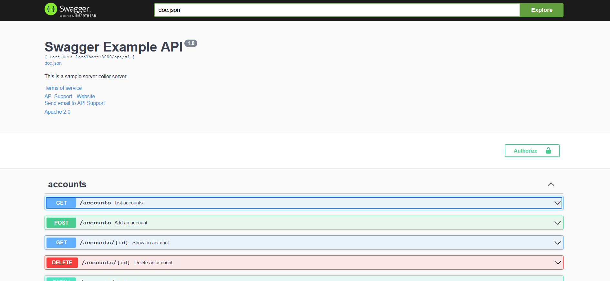
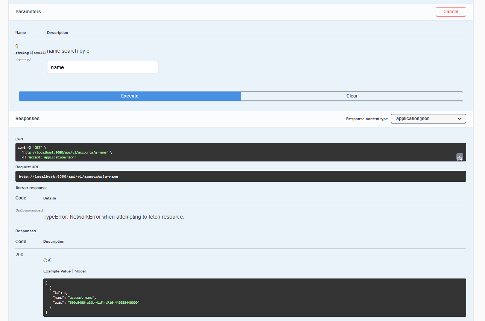
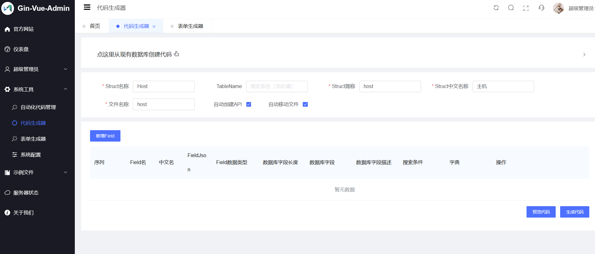
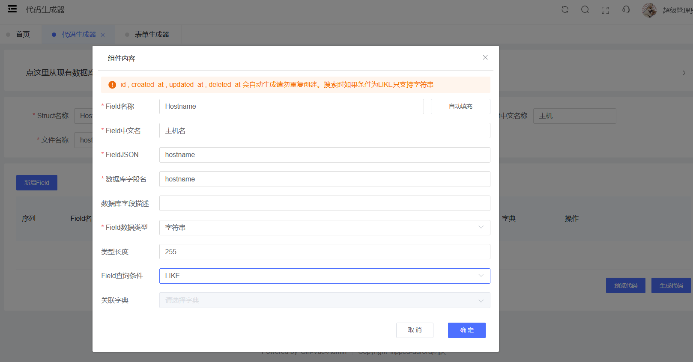
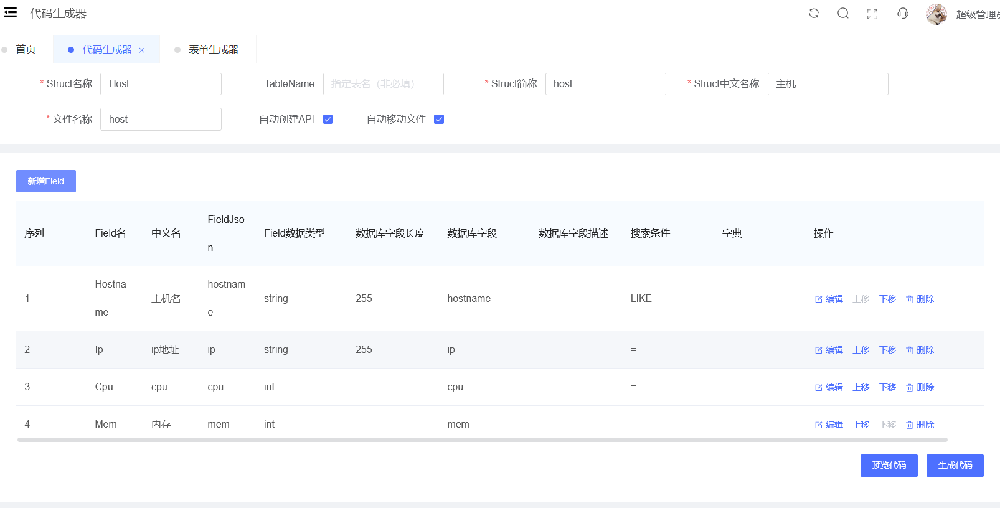
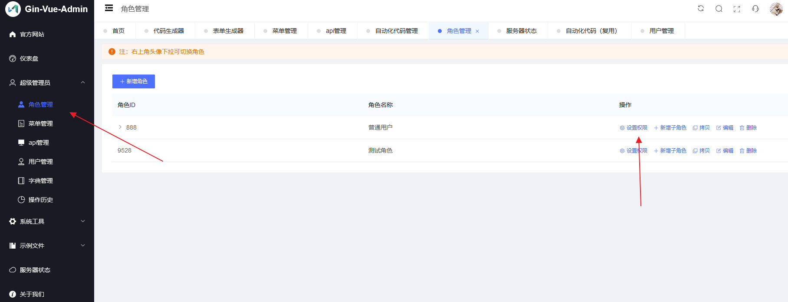
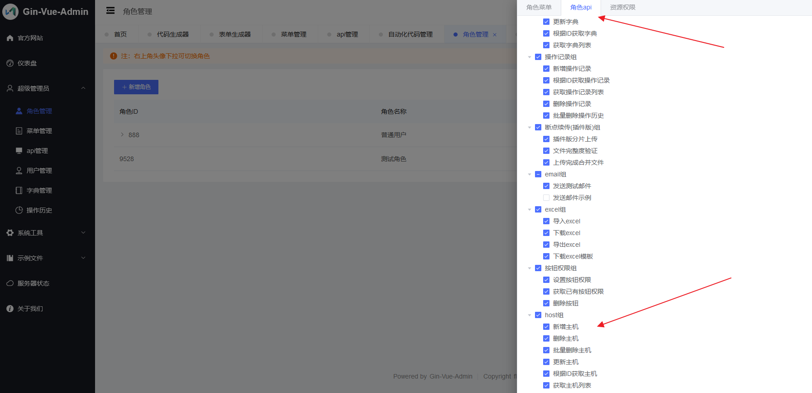
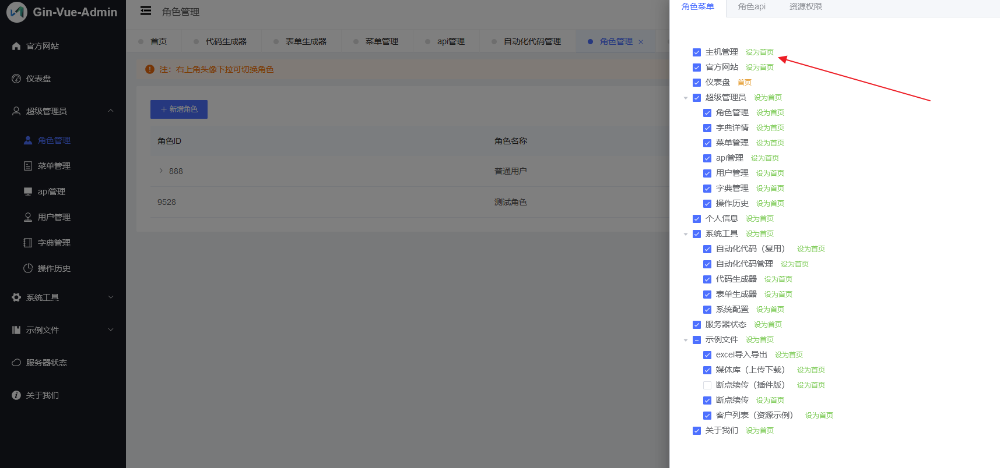
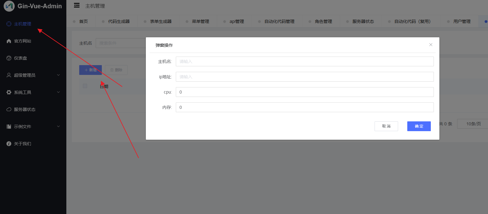
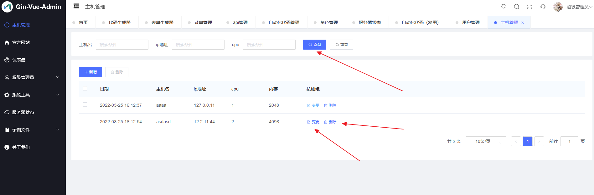

# 一天用Go快速搭建一个运维管理后台

  只要运维成了一定的规模就一定需要一个平台来集成自己的工具链以及自己的管理方法，将自己的经验全部抽离出来变成一个个接口，方便自己也方便他人，可以更便捷的管理自己的工作，管理的东西有很多，比如资产管理(或者说CMDB), 比如运维自动化平台的封装，比如监控，比如日志平台，如果我们做了一个完整的平台往回看，会发现很多东西是比较通用的，并且在编写代码的过程中发现很多没有意思的事情，那就是数据的增删改查，用户权限管理等，这些自然是可以从头写的，但是，也许没多大必要，因为这些东西写起来实在是让人无聊和乏味。那么怎么办呢？如何将这些无聊的工作抽离出来让其他工具或框架完成？答案我想有很多，这边文章写的一个答案是`Gin-Vue-Admin`。

  但是直接用一个这样的工具又会信心不足或者说觉得驾驭不了而觉得过于笨重，那么最好的办法就是先自己完成一个原型在回过头看框架做了什么就会觉得世界变得美好了，无聊的工作就让框架完成吧，自己专注业务即可，现在的低代码不也是这样么，不过作为一个程序员会觉得低代码抽象程度太高，接近代码才会有完全可控的感觉。

> 每个阶段都会贴完整代码，一般说明都放在代码的注释。

## 技术选型

本文适合对Golang及Vue开发熟悉的读者。

后端: Golang + Gin

~~前端: Vue 前端写不好，这里就不写了~~

ORM: Gorm

之所以做这样的选择，是为了对标Gin-Vue-Admin，其实选择什么语言都可以，适合自己就行。

> 其实我更喜欢Python的FastAPI, 它可以自动的生成API文档，不过FastAPI还没有一个类似Gin-Vue-Admin这样一个集成度比较高的框架，对于那些反驳Python性能不行的人我只能笑笑不说话，因为我想一个管理平台大概率是不会有类似百万并发的需求的。

## 进化之路

一步一步的从Hello World到最终的后台，再到Gin-Vue-Admin来代替

### Web框架的Hello world(Stage1)

```go
package main

import (
    "net/http"

    "github.com/gin-gonic/gin"
)

func main() {
    router := gin.Default()

    router.GET("/", func(ctx *gin.Context) {
        ctx.JSON(http.StatusOK, gin.H{
            "msg": "hello world",
        })
    })

    router.Run()
}
```

通过`go run main.go`运行，然后通过`curl`测试

```bash
$ curl 127.0.0.1:8080
{"msg":"hello world"}
```

### 数据库的增删查改(Stage2)

增删查改自然说的是数据库，而操作数据库大致分为两种方法，一是原始的SQL语句，一是ORM, 这里自然选择的是ORM。用原生SQL自然有原生SQL的好处，但是平心而论你真的需要吗？如果你不想也不知道怎么写SQL那就是不需要，还有特定需求特定分析，就一般的增删改查操作用什么区别都不是太大的。

这里用的是**GORM**

这里以要运维要管理地主机为例，简单的做做一个增删查改。

```go
package main

import (
    "fmt"

    "github.com/kr/pretty"
    "gorm.io/driver/sqlite"
    "gorm.io/gorm"
)

type Host struct {
    gorm.Model
    // 城市-区-环境-团队(组)-应用名
    Hostname string
    IP       string
    CPU      uint
    // 以MB为单位
    MEM uint
}

var Hosts = []Host{
    {Hostname: "sh-pd-prd-ops-mysql", IP: "10.20.99.38", CPU: 4, MEM: 8 * 1024},
    {Hostname: "sz-ft-test-dev-es", IP: "10.30.99.138", CPU: 8, MEM: 16 * 1024},
    {Hostname: "hk-st-dev-dev-redis", IP: "10.44.12.28", CPU: 2, MEM: 8 * 1024},
}

func main() {
    var err error
    db, err := gorm.Open(sqlite.Open("test.db"), &gorm.Config{})
    if err != nil {
        panic("连接数据库失败")
    }

    // 迁移 schema
    err = db.AutoMigrate(&Host{})
    if err != nil {
        panic("创建或迁移数据表失败")
    }
    pretty.Println("x")

    // 插入数据
    db.Create(&Hosts)

    var hosts []Host
    var host Host
    // 查询所有数据, 用hosts接收
    db.Find(&hosts)
    pretty.Println(hosts)

    // 查询id为1的单个数据， 用host接收
    db.First(&host, 1)
    fmt.Println("查询")
    fmt.Println("所有数据: ")
    pretty.Println(hosts)
    fmt.Println("单条数据: ")
    pretty.Println(host)
    fmt.Println("修改")
    db.Model(&host).Update("Hostname", "changed")
    db.First(&host, 1)
    pretty.Println("id为1修改后的数据: ")
    pretty.Println(&host)

    // 删除数据
    db.Delete(&host)
    err = db.First(&host, 1).Error
    if err != nil {
        fmt.Println("err: ", err.Error())
    }
}
```

执行结果如下。

```bash
$ go run main.go
[]main.Host{
    {
        Model: gorm.Model{
            ID:        0x1,
            CreatedAt: time.Date(2022, time.March, 22, 22, 31, 23, 247048400, time.Location("")),
            UpdatedAt: time.Date(2022, time.March, 22, 22, 31, 23, 247048400, time.Location("")),
            DeletedAt: gorm.DeletedAt{},
        },
        Hostname: "sh-pd-prd-ops-mysql",
        IP:       "10.20.99.38",
        CPU:      0x4,
        MEM:      0x2000,
    },
    {
        Model: gorm.Model{
            ID:        0x2,
            CreatedAt: time.Date(2022, time.March, 22, 22, 31, 23, 247048400, time.Location("")),
            UpdatedAt: time.Date(2022, time.March, 22, 22, 31, 23, 247048400, time.Location("")),
            DeletedAt: gorm.DeletedAt{},
        },
        Hostname: "sz-ft-test-dev-es",
        IP:       "10.30.99.138",
        CPU:      0x8,
        MEM:      0x4000,
    },
    {
        Model: gorm.Model{
            ID:        0x3,
            CreatedAt: time.Date(2022, time.March, 22, 22, 31, 23, 247048400, time.Location("")),
            UpdatedAt: time.Date(2022, time.March, 22, 22, 31, 23, 247048400, time.Location("")),
            DeletedAt: gorm.DeletedAt{},
        },
        Hostname: "hk-st-dev-dev-redis",
        IP:       "10.44.12.28",
        CPU:      0x2,
        MEM:      0x2000,
    },
}
查询
所有数据:
[]main.Host{
    {
        Model: gorm.Model{
            ID:        0x1,
            CreatedAt: time.Date(2022, time.March, 22, 22, 31, 23, 247048400, time.Location("")),
            UpdatedAt: time.Date(2022, time.March, 22, 22, 31, 23, 247048400, time.Location("")),
            DeletedAt: gorm.DeletedAt{},
        },
        Hostname: "sh-pd-prd-ops-mysql",
        IP:       "10.20.99.38",
        CPU:      0x4,
        MEM:      0x2000,
    },
    {
        Model: gorm.Model{
            ID:        0x2,
            CreatedAt: time.Date(2022, time.March, 22, 22, 31, 23, 247048400, time.Location("")),
            UpdatedAt: time.Date(2022, time.March, 22, 22, 31, 23, 247048400, time.Location("")),
            DeletedAt: gorm.DeletedAt{},
        },
        Hostname: "sz-ft-test-dev-es",
        IP:       "10.30.99.138",
        CPU:      0x8,
        MEM:      0x4000,
    },
    {
        Model: gorm.Model{
            ID:        0x3,
            CreatedAt: time.Date(2022, time.March, 22, 22, 31, 23, 247048400, time.Location("")),
            UpdatedAt: time.Date(2022, time.March, 22, 22, 31, 23, 247048400, time.Location("")),
            DeletedAt: gorm.DeletedAt{},
        },
        Hostname: "hk-st-dev-dev-redis",
        IP:       "10.44.12.28",
        CPU:      0x2,
        MEM:      0x2000,
    },
}
单条数据:
main.Host{
    Model: gorm.Model{
        ID:        0x1,
        CreatedAt: time.Date(2022, time.March, 22, 22, 31, 23, 247048400, time.Location("")),
        UpdatedAt: time.Date(2022, time.March, 22, 22, 31, 23, 247048400, time.Location("")),
        DeletedAt: gorm.DeletedAt{},
    },
    Hostname: "sh-pd-prd-ops-mysql",
    IP:       "10.20.99.38",
    CPU:      0x4,
    MEM:      0x2000,
}
修改
id为1修改后的数据:
&main.Host{
    Model: gorm.Model{
        ID:        0x1,
        CreatedAt: time.Date(2022, time.March, 22, 22, 31, 23, 247048400, time.Location("")),
        UpdatedAt: time.Date(2022, time.March, 22, 22, 31, 23, 315709700, time.Location("")),
        DeletedAt: gorm.DeletedAt{},
    },
    Hostname: "changed",
    IP:       "10.20.99.38",
    CPU:      0x4,
    MEM:      0x2000,
}

[2.547ms] [rows:0] SELECT * FROM `hosts` WHERE `hosts`.`id` = 1 AND `hosts`.`deleted_at` IS NULL AND `hosts`.`id` = 1 ORDER BY `hosts`.`id` LIMIT 1
err:  record not found
```

### Restful接口

因为前后端分离，因为更多的终端，所以后端选择了RESTFul化，这样的话，无论是移动端还是电脑端，后端都不要做太多更改，RESTFul也慢慢变成一个接口事实，后端可以让自己的业务逻辑更纯粹。

一个数据对象一般会暴露以下五个接口。

- GET /items 获取数据列表
- POST /items 创建数据项
- GET /items/{id} 获取单个数据项
- PUT /items/{id} 修改单个数据项
- DELETE /items/{id} 删除单个数据项

还是以上面的主机数据为例，我们可以将GORM与Gin结合起来,并且实现RESTFul规范。

```go
package main

import (
    "net/http"
    "strconv"

    "github.com/gin-gonic/gin"
    "github.com/kr/pretty"
    "gorm.io/driver/sqlite"
    "gorm.io/gorm"
)

var DB *gorm.DB

type Host struct {
    gorm.Model
    // 城市-区-环境-团队(组)-应用名
    Hostname string `json:"hostname"`
    IP       string `json:"ip"`
    CPU      uint   `json:"cpu"`
    // 以MB为单位
    MEM uint `json:"mem"`
}

var Hosts = []Host{
    {Hostname: "sh-pd-prd-ops-mysql", IP: "10.20.99.38", CPU: 4, MEM: 8 * 1024},
    {Hostname: "sz-ft-test-dev-es", IP: "10.30.99.138", CPU: 8, MEM: 16 * 1024},
    {Hostname: "hk-st-dev-dev-redis", IP: "10.44.12.28", CPU: 2, MEM: 8 * 1024},
}

type HostAPI struct{}

func (h *HostAPI) List(offset, limit int) (hosts []Host) {
    DB.Offset(offset).Limit(limit).Find(&hosts)
    return
}

func (h *HostAPI) Create(host *Host) error {
    err := DB.Create(host).Error
    return err
}

func (h *HostAPI) Get(id int) (host Host) {
    DB.Find(&host, id)
    return
}

func (h *HostAPI) Update(id int, updates *Host) error {
    var host *Host
    err := DB.First(&host, id).Error
    if err != nil {
        return err
    }
    err = DB.Model(&host).Updates(updates).Error
    return err
}

func (h *HostAPI) Delete(id int) error {
    var host Host
    err := DB.First(&host, id).Error
    if err != nil {
        return err
    }
    err = DB.Delete(&host).Error
    return err
}

type HostJson struct {
    Hostname string `json:"hostname" form:"hostname"`
    IP       string `json:"ip" form:"ip"`
    CPU      uint   `json:"cpu" form:"cpu" bind:"required,gt=0"`
    // 以MB为单位
    MEM uint `json:"mem" form:"mem" binding:"required,gt=0"`
}

func main() {
    var err error
    DB, err = gorm.Open(sqlite.Open("test.db"), &gorm.Config{})
    if err != nil {
        panic("连接数据库失败")
    }

    // 迁移 schema
    err = DB.AutoMigrate(&Host{})
    if err != nil {
        panic("创建或迁移数据表失败")
    }
    pretty.Println("x")

    // 插入数据
    DB.Create(&Hosts)

    api := &HostAPI{}
    router := gin.Default()
    router.GET("/hosts", func(ctx *gin.Context) {
        offset, limit := 0, 10
        queryOffset := ctx.Query("offset")
        if queryOffset != "" {
            // 削减了错误检查的代码
            offset, _ = strconv.Atoi(queryOffset)
        }
        queryLimit := ctx.Query("limit")
        if queryLimit != "" {
            // 削减了错误检查的代码
            limit, _ = strconv.Atoi(queryLimit)
        }
        ctx.JSON(http.StatusOK, gin.H{
            "msg":  "success",
            "data": api.List(offset, limit),
        })
    })
    router.POST("/hosts", func(ctx *gin.Context) {
        var host Host
        if err := ctx.ShouldBindJSON(&host); err != nil {
            ctx.JSON(http.StatusBadRequest, gin.H{
                "msg": err,
            })
            return
        }

        if err := api.Create(&host); err != nil {
            ctx.JSON(http.StatusBadRequest, gin.H{
                "msg": err,
            })
            return
        }
        ctx.JSON(http.StatusOK, gin.H{
            "msg":  "success",
            "data": host,
        })
    })

    router.GET("/hosts/:id", func(ctx *gin.Context) {
        var id int
        pathId := ctx.Param("id")
        if _id, err := strconv.Atoi(pathId); err != nil {
            ctx.JSON(http.StatusBadRequest, gin.H{
                "msg": "请输入合法的数字值id",
            })
        } else {
            id = _id
        }
        host := api.Get(id)
        ctx.JSON(http.StatusOK, gin.H{
            "msg":  "success",
            "data": host,
        })
    })

    router.PUT("/hosts/:id", func(ctx *gin.Context) {
        var id int
        var updates Host
        pathId := ctx.Param("id")
        if _id, err := strconv.Atoi(pathId); err != nil {
            ctx.JSON(http.StatusBadRequest, gin.H{
                "msg": "请输入合法的数字值id",
            })
            return
        } else {
            id = _id
        }
        if err := ctx.ShouldBindJSON(&updates); err != nil {
            ctx.JSON(http.StatusBadRequest, gin.H{
                "msg": err,
            })
            return
        }

        if err := api.Update(id, &updates); err != nil {
            ctx.JSON(http.StatusOK, gin.H{
                "msg": err.Error(),
            })
        }
        host := api.Get(id)
        ctx.JSON(http.StatusOK, gin.H{
            "msg":  "success",
            "data": host,
        })
    })

    router.DELETE("/hosts/:id", func(ctx *gin.Context) {
        var id int
        pathId := ctx.Param("id")
        if _id, err := strconv.Atoi(pathId); err != nil {
            ctx.JSON(http.StatusBadRequest, gin.H{
                "msg": "请输入合法的数字值id",
            })
            return
        } else {
            id = _id
        }

        if err := api.Delete(id); err != nil {
            ctx.JSON(http.StatusBadRequest, gin.H{
                "msg": err.Error(),
            })
            return
        }
        ctx.JSON(http.StatusOK, gin.H{
            "msg": "success",
        })
    })
    router.Run()
}
```

在代码中数据验证也是可以的: `bind:"required,gt=0"`

gin内置的验证模块功能还是比较全的，比如验证数据类型以及一些数值比较, 比如必须是什么格式的时间字符串，或者数据值大于等于多少等，具体请参考: https://github.com/go-playground/validator/

然后依次测试各个方法:

```bash
curl -X GET   http://127.0.0.1:8080/hosts|python -m json.tool
{
    "data": [
        {
            "ID": 1,
            "CreatedAt": "2022-03-23T22:21:43.1372659+08:00",
            "UpdatedAt": "2022-03-23T22:21:43.1372659+08:00",
            "DeletedAt": null,
            "hostname": "sh-pd-prd-ops-mysql",
            "ip": "10.20.99.38",
            "cpu": 4,
            "mem": 8192
        },
        {
            "ID": 2,
            "CreatedAt": "2022-03-23T22:21:43.1372659+08:00",
            "UpdatedAt": "2022-03-23T22:21:43.1372659+08:00",
            "DeletedAt": null,
            "hostname": "sz-ft-test-dev-es",
            "ip": "10.30.99.138",
            "cpu": 8,
            "mem": 16384
        },
        {
            "ID": 3,
            "CreatedAt": "2022-03-23T22:21:43.1372659+08:00",
            "UpdatedAt": "2022-03-23T22:21:43.1372659+08:00",
            "DeletedAt": null,
            "hostname": "hk-st-dev-dev-redis",
            "ip": "10.44.12.28",
            "cpu": 2,
            "mem": 8192
        }
    ],
    "msg": "success"
}

curl -X GET \
>   http://127.0.0.1:8080/hosts/1 \
>
{"data":{"ID":1,"CreatedAt":"2022-03-23T22:18:06.2894689+08:00","UpdatedAt":"2022-03-23T22:18:06.2894689+08:00","DeletedAt":null,"hostname":"sh-pd-prd-ops-mysql","ip":"10.20.99.38","cpu":4,"mem":8192},"msg":"success"}
```

> 为了减少篇幅就不演示新增/修改/删除等方法了

### 自动生成restful接口文档(stage4)

写接口文档不是一件多么有意思的事情，如果能够在写代码的时候就顺便按照约定写好了接口文档也许是件不错的事情。

> 其实，即使是通过工具在golang中的注释中生成接口文档也不是太有意思的事情，跟代码结合的不是非常紧密，虽然比自己写好一点，但是体验还是不像其他框架那样，比如FastAPI。

这里就直接照搬https://github.com/swaggo/swag/tree/master/example/celler的代码了，也不粘贴出来了，演示一下用浏览器就能完成api测试的好处，生成的swagger的api 文档的一个好处就是如此。

运行代码:

```bash
cd stage4
go mod tidy
go run main.go
```

然后访问:http://127.0.0.1:8080/swagger/index.html

效果如下:





我想这样的API文档大概有以下好处

- 一是可以集中管理，清晰明了，与代码放在一起
- 二是可以直接在浏览器测试，依赖比较少

### Gin-Vue-Admin

终于来到本文最终阶段，前面的所有的铺垫都是为了对比Gin-Vue-Admin的便利。

要运行Gin-Vue-Admin还是比单纯的Go代码复杂一点，你至少需要一个node环境，如果你想修改前端代码就得会JavaScript和Vue的代码，但是如果你觉得Gin-Vue-Admin的默认样式和页面已经足够了那就不用去写前端代码。

初始化及启动请参考:  https://www.gin-vue-admin.com/docs/first_master

这里演示一下同样前面的示例的相关操作。

先是创建struct, 即表名



然后填充字段



所有字段填充之后的效果



最后生成代码

> 在windows平台需要重启后端代码，以加载刚创建的restful api接口路由。

然后创建一个菜单，并指定刚生成的vue代码路径


最后设置权限，添加为当前用户添加该菜单及API的权限。







最后刷新页面。这样我们就有了一个看起来还不错，可以增删查改的前端页面。





除了上面的好处之外，你还附带有一个现成的用户管理，权限管理，认证管理等功能的功能齐全的后台，世界就此变得美好了。

## 后记

解脱一些无聊的工作还是很有必要的，如果你还不会写这些简单的基础代码，比如增删查改，用户权限管理等，最好是自己实现一遍，只有自己实现一遍才会知道框架的好处，不然只会觉得框架过于笨重。

不过从前端编辑应该是有局限，比如如何处理多对多或者一对多的关系，暂时还没看到这样的操作，可能需要在后端做更改。

代码及文章地址: https://github.com/youerning/blog/tree/master/fast-admin
