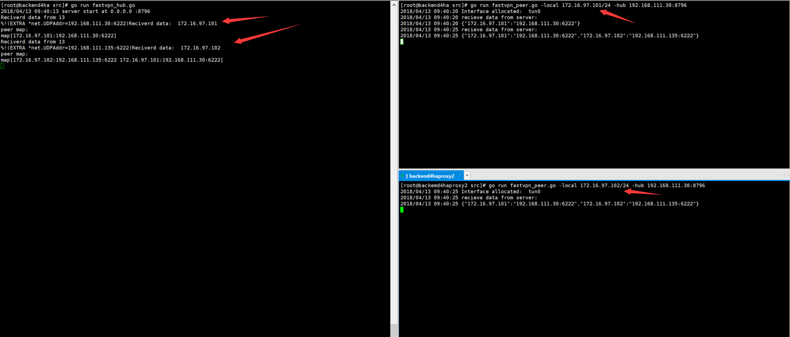
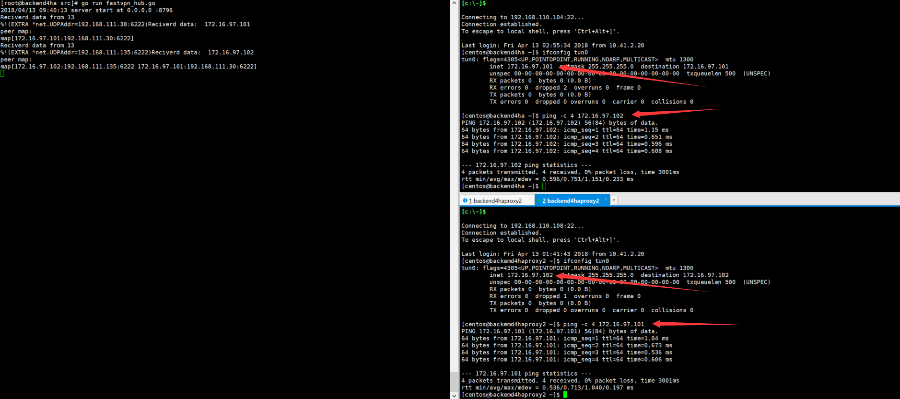

前言: 穷人指没钱或者不愿花太多钱(我既属于前者也属于后者T_T),分布式网络主要指主机网络环境分布在不同的地理环境比如不同省或者不同国家(谁还没有一个比较便宜的国外vps不是\~_\~)

既然没有办法改变世界就改变自己吧.

## 需求
1. 将国内不同地区的云主机以及国外vps网络层打通,要求**尽可能**少的延迟以及高吞吐.

> 注意:我是指**尽可能**的改善当前的网络环境,你当然可以说出一堆的极端环境,不过那真不是我想要解决的.

## 方案调研
1. vpn
2. kcptun
3. 其他

第一种解决方案可以解决主机之间的连通性,但是并没有试图改善网络环境不佳的局面,即,基于当前网络环境.再者各种vpn的安装部署都太负载且装一堆有的没的.

> 其实我不太确定是不是所有ipsec或者其他vpn方式会不会通过一些机制解决网络环境不佳的情况,如有错误,还望指正.


第二种方案中的kcp介绍如下
> KCP是一个快速可靠协议，能以比 TCP浪费10%-20%的带宽的代价，换取平均延迟降低 30%-40%，且最大延迟降低三倍的传输效果。纯算法实现，并不负责底层协议（如UDP）的收发，需要使用者自己定义下层数据包的发送方式，以 callback的方式提供给 KCP。 连时钟都需要外部传递进来，内部不会有任何一次系统调用。

而kcptun则是在kcp协议的基础上,建立隧道,但只是映射某个端口,实在是让人难过,一个一个的端口映射很难维护.

其他方案指代理或者其他vpn

### 总结
我暂时没有在找到比较好的解决方案,所以我打算自己撸一个,但是当下只是写了一个原型(可能没时间写),有兴趣且码代码速度快的参考一下我的设计开发一下,开发好了可以给我用用^_^

## 设计方案
### 编程语言
golang

> google出品必属精品.

### 传输协议
kcp
> 用于这里想解决的问题是网络环境不佳的问题,所以纯udp或者tcp都是不太适合的.

### 功能组件
- hubserver
- peerclient

### 业务逻辑
#### hubserver
##### hub启动流程
1. 监听端口
2. 维护peer列表

##### 心跳流程
1. 验证client
2. 判断ip及端口是否改变，是则更改peer列表，并推送给所有客户端
3. 如果client心跳超时，则该client从peer列表删除
4. 如果推送peer列表给某client失败，则将该client移除

#### peerclient
##### peer启动流程
1. 向hub注册自己
2. 获取peer列表
3. 创建tun设备
4. 建立读写管道

##### peer读写流程
1. 解析数据包头部信息，获取目标地址
2. 查询目标地址是否在peer列表，是则发送，负责不响应

##### 心跳流程
1. 每秒向hub发送心跳，失败后尝试三次，依次为1，3，7秒延迟，尝试失败则不在响应tun设备，日志记录失败


## 原型
本来我的愿景要再大一些的,即不只是在有公网IP的境况下打通网络,且能穿透nat(指一定几率,有一些nat环境的确打不穿.)

由于大部分时间是在研究怎么通过kcp在绑定特定端口的情况下既能充当client发起请求又能作为server接受请求,但是kcp虽然是基于udp,但是把自己包装成了类tcp,所以监听的境况下就不能使用类似WriteToUDP的方法发送了(当下的确没看到类似接口),所以如果使用kcp的方式穿透nat,那么心跳的流程以及存活状态的逻辑就变得比较复杂了,上面的设计方案主要指都拥有公网IP或者两端至少一段拥有公网IP的情况.

所以原型中并没有设计kcp的代码.

**hubserver**

```
// fastvpn_hub.go
package main

import (
	"log"
	"net"
	"os"
	"syscall"
	"time"

	// reuse "github.com/kavu/go_reuseport"
	kcp "github.com/xtaci/kcp-go"
)

func main() {
	var err error
	var conn *net.UDPConn
	if len(os.Args) < 2 {
		os.Exit(-1)
	}
	raddr := os.Args[1]

	localAddr, _ := net.ResolveUDPAddr("udp", ":8887")
	serverAddr, _ := net.ResolveUDPAddr("udp", raddr)
	conn, err = net.DialUDP("udp", laddr, raddr)
	conn.W
	if err != nil {
		log.Println("dial udp err")
		log.Println(err)
	}

	_, err = conn.Write([]byte("hello"))
	if err != nil {
		log.Println("udp write error")
		log.Println(err)
	}

	buf := make([]byte, 1024)
	n, _, err := conn.ReadFromUDP(buf)
	log.Println("udp read data: ", string(buf[:n]))
	conn.Close()
	heartbeat(localAddr, serverAddr)

	klisten, err := kcp.Listen(":8887")
	if err != nil {
		log.Println("listen error")
		log.Println(err)
	}
	log.Println("accept start")
	for {
		conn, err := klisten.Accept()
		if err != nil {
			log.Println("accpet error")
			log.Println(err)
			continue
		}

		go func() {
			for {
				buf := make([]byte, 1024)
				n, err := conn.Read(buf)
				if err != nil {
					log.Println("read error.")
					log.Println(err)
				}
				log.Println("recieve data: ", string(buf[:n]))

				_, err = conn.Write([]byte("hello"))
				if err != nil {
					log.Println("kcp write error")
					log.Println(err)
				}
				log.Println("remote addr: ", conn.RemoteAddr())
				time.Sleep(3 * time.Second)
			}
		}()
	}
}

```

**peerclient.go**
```
package main

import (
	"encoding/json"
	"flag"
	"fmt"
	"log"
	"net"
	"os"
	"os/exec"
	"strings"

	// "fastvpn/common"
	"github.com/songgao/water"
	"golang.org/x/net/ipv4"
)

const (
	BUFFERSIZE = 1500
	MTU        = "1300"
)

var (
	hubServer = flag.String("hub", "", "server addr like 192.168.11.100:8796")
	local     = flag.String("local", "", "local ip like 172.16.97.101")
	listen    = flag.String("listen", ":6222", "udp for bind")
	port      = flag.String("port", "9999", "local port like 9999, default 9999, if you want to run multi clinet in same machine,change the port")
	peerMap   = make(map[string]string)
)

func checkFatalErr(err error, msg string) {
	if err != nil {
		log.Println(msg)
		log.Fatal(err)
	}
}

func runIP(args ...string) {
	cmd := exec.Command("/sbin/ip", args...)
	cmd.Stderr = os.Stderr
	cmd.Stdin = os.Stdin
	cmd.Stdout = os.Stdout

	err := cmd.Run()

	if err != nil {
		log.Fatal("Error runing /sbin/ip:", err)
	}
}

func main() {
	flag.Parse()
	// parse args
	if *hubServer == "" {
		flag.Usage()
		log.Fatal("\nhub Server is not specified")
	}

	if *local == "" {
		flag.Usage()
		log.Fatal("\nlocal ip is not specified")
	}

	if *port == "" {
		*port = fmt.Sprintf(":%s", *port)
	}

	// 将地址字符串解析成*net.UDPAddr
	hubAddr, err := net.ResolveUDPAddr("udp", *hubServer)
	checkFatalErr(err, "Unable to resolve server UDP socket")
	listenAddr, err := net.ResolveUDPAddr("udp", *listen)
	checkFatalErr(err, "Unable to resolve local UDP socket")

	// 初始化创建的tun设备的配置文件
	config := water.Config{
		DeviceType: water.TUN,
	}

	// 创建一个tun设备
	iface, err := water.New(config)
	checkFatalErr(err, "Unable to allocate TUN interface: ")
	log.Println("Interface allocated: ", iface.Name())

	// 设置ip地址并启动设备
	runIP("link", "set", "dev", iface.Name(), "mtu", MTU)
	runIP("addr", "add", *local, "dev", iface.Name())
	runIP("link", "set", "dev", iface.Name(), "up")

	// 监听一个udp socket,通过listenUDP创建的socket,既能发送到指定的ip地址也能接受
	conn, err := net.ListenUDP("udp", listenAddr)
	checkFatalErr(err, "Unable to connect server")
	defer conn.Close()
	privateIP := strings.Split(*local, "/")
	// 将自己的内网IP发送给hubserver
	conn.WriteToUDP([]byte(privateIP[0]), hubAddr)

	go func() {
		buf := make([]byte, BUFFERSIZE)

		// 不停的接受信息
		for {
			n, addr, err := conn.ReadFromUDP(buf)

			if addr.String() == hubAddr.String() {
				log.Println("recieve data from server:")

				// 解析hubserver发送过来的peermap
				err = json.Unmarshal(buf[:n], &peerMap)
				if err != nil {
					log.Println("peermap unmarshal error")
					log.Println(err)
				}
			} else {
				log.Println("recive data from peer:")
			}

			if err != nil || n == 0 {
				fmt.Println("Error: ", err)
				continue
			}
			log.Println(string(buf[:n]))
			// 将对端发送过来的数据写到本地的tun设备
			iface.Write(buf[:n])
		}

	}()

	packet := make([]byte, BUFFERSIZE)

	// 不停的读取本地tun设备接受到的数据包
	for {
		plen, err := iface.Read(packet)
		if err != nil {
			break
		}

		// 解析数据包头部
		header, _ := ipv4.ParseHeader(packet[:plen])
		dstIP := header.Dst.String()
		// 如果数据发送的目标地址在peermap内则通过udp发送到对端
		realDest, ok := peerMap[dstIP]
		if ok {
			realDestAddr, err := net.ResolveUDPAddr("udp", realDest)
			if err != nil {
				log.Println("resolve real dest ip error")
				log.Println(err)
				continue
			}

			fmt.Printf("Sending to remote: %+v (%=v)\n", header, err)
			conn.WriteTo(packet[:plen], realDestAddr)
		} else {
			continue
		}

	}
}

```

依次启动hubserver,peer1,peer2, 效果如下



试试网络是否是通的.



## 总结
这个原型没有验证,也没有kcp,也没有数据加密...仅是最基础的功能被实现了,数据传递.

主要灵感来自这篇文章:https://nsl.cz/using-tun-tap-in-go-or-how-to-write-vpn/

但是我做了一下修改,将数据包转发到指定的对端.加了个hubserver.


参考连接:

https://github.com/skywind3000/kcp

http://colobu.com/2014/12/02/go-socket-programming-UDP/

http://www.cnblogs.com/GO-NO-1/p/7241556.html
