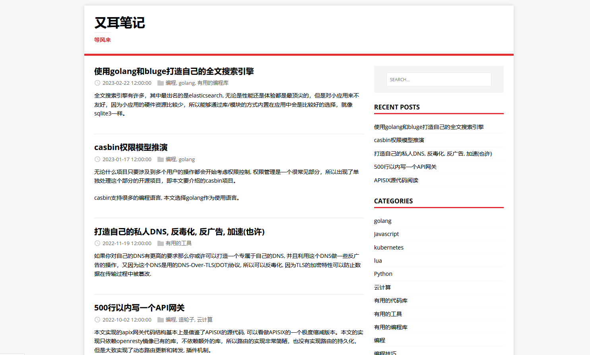
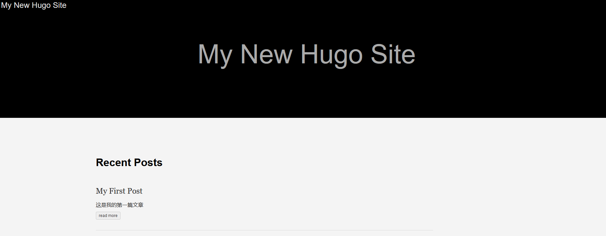
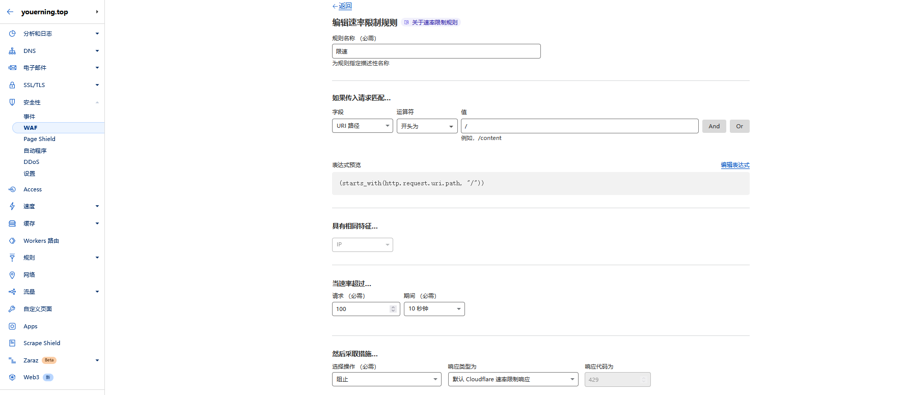
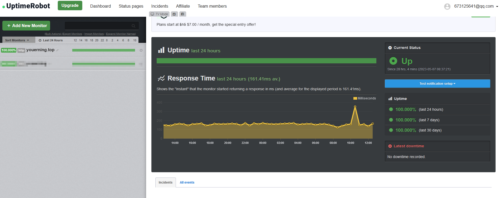
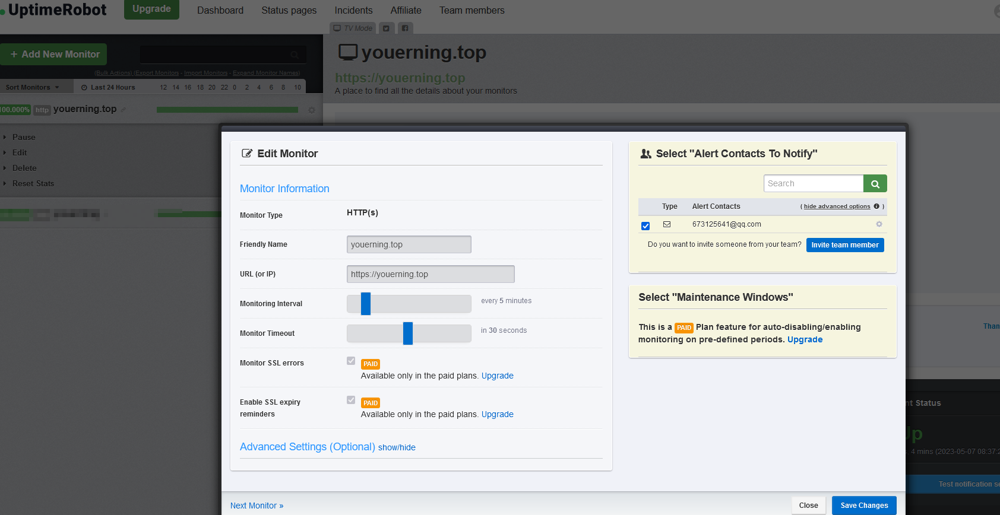
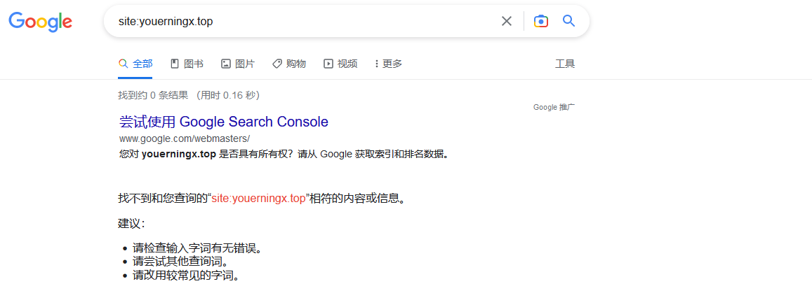
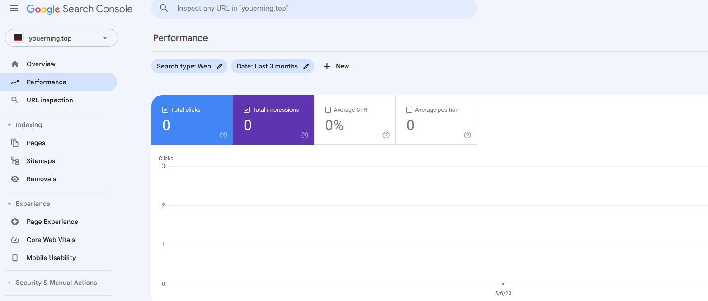
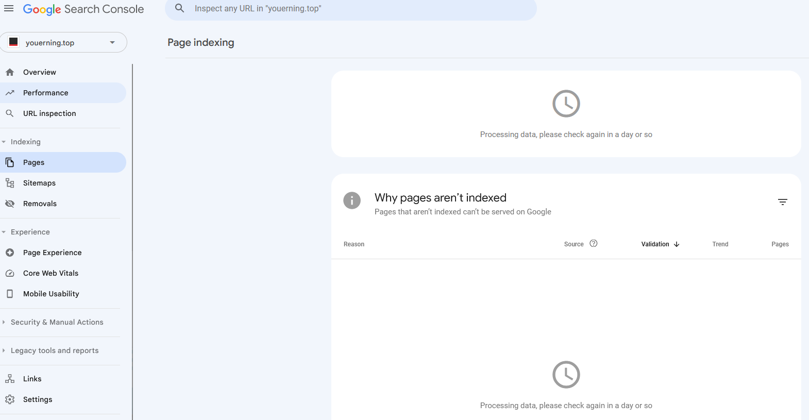

# 使用hugo搭建自己的网站

都2023年了，搭建个网站绝不是太复杂的事情，重点是如何选择而已。

建站一般有四个选择。

1. 使用现成的CMS(内容管理系统)软件直接初始化，比如超级出名的`WordPress`
2. 自己写。
3. 改开源的个人站项目(其实自己写差不多)。
4. 如果非说还有第四个选择，那就是花钱雇人^_^。各大购物平台搜索"建站"都可以找到。


这篇文章介绍的是如何使用hugo搭建自己的个人博客网站, 在线预览: https://youerning.top。

截图如下:




## 前提资源

1. 域名

2. 拥有公网IP的服务器(vps, 云主机)

   > 没什么流量的话，可以选择最便宜的套餐。

其实这两者都可选, 不过本文是在两者都具备的情况下搭建的网站，以后有机会再介绍。

国内跟国外的域名和云服务器主要有两点区别

1. 国内两者做网站都需要备案
2. 国内服务器的带宽一般是限速，而国外不限速(不过有的限量, 比如一个500GB)

具体选择国内还是国外看自己的需求。

> 如果选择国外的域名提供商，记得搜索优惠码哦^_^


## 建站

这一部分主要是介绍hugo的基本是用,  如果需要更详细的教程，可以参考官方文档: https://gohugo.io/getting-started

在此之前，需要先下载hugo的命令行执行文件。

所有的版本下载地址: https://github.com/gohugoio/hugo/releases/

本文用到的版本下载地址: https://github.com/gohugoio/hugo/releases/download/v0.111.3/hugo_extended_0.111.3_windows-amd64.zip


### hugo快速入门

执行以下命令

> 官方教程，需要会git

```sh
# 创建demo目录并初始化网站目录结构
hugo new site demo
cd demo
# 下载hugo的ananke主题
# 如果你不会用git, 就手动的下载主题zip包然后复制到themes/ananke并跳过以下两条命令
git init
git submodule add https://github.com/theNewDynamic/gohugo-theme-ananke themes/ananke
echo "theme = 'ananke'" >> config.toml
# 预览当前网站， --watch参数会让程序不断监听当前目录是否有更新然后实时加载。
hugo server --watch
```

ananke主题包手动下载地址: 

- https://github.com/theNewDynamic/gohugo-theme-ananke/archive/refs/heads/master.zip


最后一条命令的输出类似于:

```bash
<--省略前面的部分-->
Running in Fast Render Mode. For full rebuilds on change: hugo server --disableFastRender
Web Server is available at http://localhost:1313/ (bind address 127.0.0.1)
Press Ctrl+C to stop
```

从输出可以看到预览地址是http://localhost:1313/, 浏览器访问就可得到下面的下面结果


### 新建内容

通过以下命令创建内容

```sh
hugo new posts/my-first-post.md
```

命令的结果就是在content/posts目录下创建一个my-first-post.md的文件, 这个文件就是一个平常的文本文件, 内容如下:

```markdown
---
title: "My First Post"
date: 2023-05-08T14:11:56+08:00
draft: false
---

这是我的第一篇文章
```

你只需要将你内容放在`---`下面即可，当然了，你需要用markdown格式, 然后需要修改自己的标题, 即`title:`对应的字段, 然后写完之后将`draft:`对应的`true`改为`false`, 或者删除这一行, 这样你就可以看到新的内容了。




### 选择主题

其实官方例子中的**ananke**主题并不是太好看，所以去https://themes.gohugo.io/这里选择一个好看的主题吧，我的网站选择的是**Mainroad**这个主题。

下载或者说`git clone`之后网站只需要做两件事

1. 放到指定的位置, 即themes目录下。

   > 如果是下载的zip包, 要注意解压后的目录名与主题名保持一致

2. 在本地的config.toml目录配置`theme = '{你的主题名}'`, 如`theme = 'Mainroad'`


虽然完成上面的两步，但是你会发现，预览的结果与官方的展示效果不一致，比如看不到侧边栏，这是因为这些部分需要额外的配置，具体的配置你要看对应主题的配置文档，但是复原官方的展示效果却很简单，只要将主题里的`exampleSite`目录下的内容覆盖当前的工作目录即可。

可使用以下命令

```sh
cp -ar themes/ananke/exampleSite/* .
```

> 这会覆盖config.toml, 如果你已经配置了许多内容，需要提前备份好。

这样你就得到了一个跟官方预览效果一样的网站，然后你可以根据自己的需要配置一些个人信息，比如网站名，比如作者名，作者介绍等。


### 本地预览与编译

本地预览比较简单，上面已经已经使用过了, 即`hugo server`, 如果你需要实时加载, 可以使用`--watch`参数。

而编译就更简单了, 连参数都不需要, 直接敲`hugo`即可。

执行完`hugo`命令之后，你会发现`public`目录多出来了一些文件和目录，这些文件和目录就是静态的网站文件，找一个web服务器就可以部署了。


### 选择一个web服务器

现在有许多服务器可以选择。

1. Apache 历史久远的老牌
2. Nginx 强大且高效的中流砥柱
3. Caddy 新锐 内置https是它的亮点

本文选择的是Caddy, 因为它是Golang写的，并且内置https，所以笔者比较喜欢。

首先在本地测试一下，创建一个`Caddyfile`的文本文件，内容如下:

```txt
http://localhost:2023 {
    root public
    file_server
    handle_errors {
        rewrite * /{err.status_code}.html
		file_server
    }
}
```

> 注意: 使用http://localhost:2023访问，而不是http://127.0.0.1:2023访问!!!


如果没有问题，我们就可以将public这个目录复制到服务器，然后将`Caddyfile`改成如下

```txt
http://{你的域名} {
    root public
    file_server
    handle_errors {
        rewrite * /{err.status_code}.html
		file_server
    }
    log {
        output file /var/log/youer_domain.log {
            roll_size 100mb
            roll_keep 3
            roll_keep_for 720h
        }
    }
}
```

> 注意: 这里使用的是http://而非https://，之所以使用http, 是因为http的消耗的资源更少，而且会使用cloudflare的HTTPS全托管, 所以即使使用http也是没问题的，不过有一定的劫持风险。
>
> 更安全的方法是使用https://，不过默认的ssl证书获取方式可能会失败, 所以这里为了简单起见才使用的http://，后续会写文章解决这个问题。

然后是用`caddy start`启动服务器，start命令将web服务运行在后台。

停止

```
caddy stop
```

重载配置文件

```sh
caddy reload
```

手动指定配置文件路径(**默认寻到当前目录的Caddyfile**)

```sh
addy run --config /path/to/Caddyfile
```

更多的caddy使用说明可参考: https://caddyserver.com/docs/getting-started


## 持续的维护工作

虽然上面的服务器整个流程走完了，服务器也运行起来了，但是有一些东西是需要一直维护的。比如dns, cdn, 数据同步，网站监控，SEO。


### DNS, CDN, WAF

得益于cloudflare的慷慨，我们免费就能享受到这三者。

在使用之前，需要将域名托管到cloudflare, 参考文档:   ======复制-======

当你托管域名之后，CDN就自己具备了，而WAF，我们可以配置一个速率限制的WAF规则，简单的抵抗一下未知的攻击。




### 同步文件

同步文件的方式有很多，比较出名的是`rsync`，这个简单有效，使用命令如下

```sh
rsync -avzP --delete {localDir} root@{remoteHost}:{remoteDir} 
```

不过我更喜欢rclone, rclone是我正在使用的工具, 以后有机会在介绍。


### 网站监控

网站监控可以做得很复杂也可以做得很简单，复杂可以到监控各个指标，简单可以是仅仅探测网站是否在线，本文只使用简单的监控，即监控网站是否在线即可。

首先注册一个uptimerobot的用户，然后配置如下。





免费的用户就是1分钟探测一次，然后检测失败就发邮件。

如果有其他服务器或者本地服务器, 可以做得在复杂点, 比如Prometheus+Grafana+Alertmanager。


### SEO

除非做网站只是为了随时随地的查看自己的笔记，除此之外，我想大多数人的初衷都是希望更多的人可以看到自己的网站，而持续有效的推广方式之一是SEO.

SEO自然是很大的话题，可以写很多篇文章，但是我们可以简单让Google帮我分析一下，并看看Google怎么看待我们的网站。

首先看看Google有没有收录我们的网站, 搜索"site: 你的域名"



我的网站创建不到一周, 所以会看到什么结果都没有，唯一的结果是Google Search Console的提示，我们可以登录Google账号来认领我们自己的网站，然后手动录入一些结果。

> 域名已经被收录了,所以使用了一个不存在的域名youerningx.top





> 首次录入一般要好几天，截止到2023/05/08我的收录还没完成T_T。


## 总结

实例代码地址:  https://github.com/youerning/blog/tree/master/hugo/demo


至此, 一个静态网站就搭建完了，本文主要介绍的是一个大略的流程以及相关注意事项，而细节部分写得太多，反而写得冗长，所以就此打住。

其实笔者很早之前就想写一个自己的博客，最开始打算用WordPress，但是太复杂了(相对于hugo而言)，WordPress当然异常强大但是不适合我自己而已，后面打算自己写，自己写的好处自然是灵活，但是灵活度太大了，不知道怎么写，而且写出来也不好看，css实在太折磨了，对于一个前端写得比较少的程序员来说。最后返璞归真，尽可能的专注于内容，所以选择了hugo，生成静态网站。
