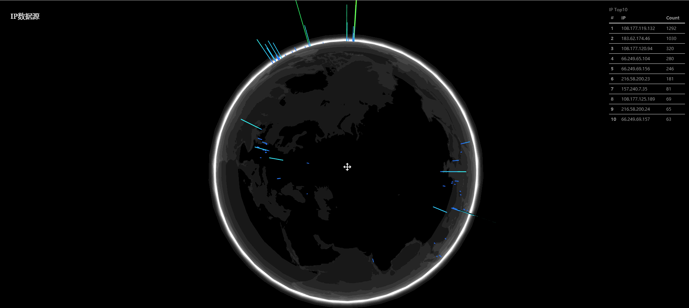

## 前言
我很在意的一件事情是好看,嗯,好看.以及是否有趣.虽然不一定有用.


下面是效果图,由于数据量有限，所以还不够眼花缭乱.





本文的主要内容是通过echarts,threejs将web日志或者任何含有IP数据的文本文件可视化.简单的来说，装逼，可以将这个动态图放在大屏幕上.

所有源码及相关数据文件请访问下面github仓库
[https://github.com/youerning/blog/tree/master/ip-visualize](http://note.youdao.com/)


## 前提条件
- 熟悉python及框架flask
- 熟悉JavaScript

## 获取数据
### IP数据
数据获取方式
- 日志文件
- elk三件套
- 其他

归根结底数据最终来自日志文件, 这里主要指web日志。

这里使用我自己网站的web日志,格式如下.


```
'116.24.64.239 - - [12/Mar/2018:18:58:40 +0800] "GET /example HTTP/2.0" 502 365\n'
...
'116.24.64.239 - - [12/Mar/2018:18:54:55 +0800] "GET / HTTP/2.0" 200 1603\n'
```

通过下面代码将IP地址拿出来.


```
# 打开日志文件
fp = open("website.log")

# 创建ip集合，由于这里只需要IP地址，所以用集合的特性去重
ip_set = set()

# 通过循环每次读取日志一行,如果日志量大建议以下方式，日志文件不大，可以直接readlines，一次性全部读取出来，
while True:
    line = fp.readline()
    if len(line.strip()) < 1:
        break
    ip = line.split()[0]
    ip_set.add(ip)
    
# 访问用户IP的个数
len(ip_set)

# 查看前20个IP
list(ip_set)[:20]
['111.206.36.133',
 '220.181.108.183',
 '40.77.178.63',
 '220.181.108.146',
 '119.147.207.152',
 '112.97.63.49',
 '66.249.64.16',
 '138.246.253.19',
 '123.125.67.164',
 '40.77.179.59',
 '66.249.69.170',
 '119.147.207.144',
 '66.249.79.108',
 '157.55.39.23',
 '123.125.71.80',
 '42.236.10.84',
 '123.125.71.79',
 '111.206.36.10',
 '106.11.152.155',
 '66.249.66.148']


不过为了使用广泛这里使用正则表达式.
import re
pat = "\d{1,3}\.\d{1,3}\.\d{1,3}\.\d{1,3}"
ipfind = re.compile(pat)

line = '116.24.64.239 - - [12/Mar/2018:18:54:55 +0800] "GET / HTTP/2.0" 200 1603\n'

ip = ipfind.findall(line)
if ip:
    ip = ip[0]
    print(ip)
    
下面是完整步骤
    # 创建ip列表
    ip_lis = list()

    # files of logs
    files = glob("logs/*")

    # complie regex
    pat = "\d{1,3}\.\d{1,3}\.\d{1,3}\.\d{1,3}"
    ipfind = re.compile(pat)

    # extract ip from  every file
    for logfile in files:
        with open(logfile) as fp:
            # 通过循环每次读取日志一行,如果日志量大建议以下方式，日志文件不大，可以直接readlines，一次性全部读取出来
            # 如果太大则用readline一行一行的读

            lines = fp.readlines()
            for line in lines:
                if len(line.strip()) < 1:
                    continue
                ip = ipfind.findall(line)
                if ip:
                    ip = ip[0]
                    ip_lis.append(ip)


```

至此，我们将访问文件里面的的IP拿出来了。


> 值得注意的是: 如果你有搭建elk之类的日志集群，那么获取数据会更简单更快，只是方式不同而已.这里就不赘述了.

### IP地址的地理信息
如果只是拿到IP数据，在本文并没有用，因为为了在地图上可视化每一个IP的位置，我们需要知道每个IP地址的地理信息，即，经纬度，所在城市等。

这里使用dev.maxmind.com提供的开源免费的geoip数据库.

下载地址: https://dev.maxmind.com/geoip/geoip2/geolite2/

> 这里不保证IP地址对应的位置信息绝对正确。为了保证IP地址的准确性，可以搜索在线的Geo服务。

为了使用上面下载的数据库，首先得下载相应的模块.

```
pip install geoip2
```


通过下面代码获取指定IP的地理信息

```
# 导入相应模块
import geoip2.database

# 记载下载的数据库文件路径，这里是在代码执行的工作目录
reader = geoip2.database.Reader("GeoLite2-City.mmdb")

response = reader.city("61.141.65.76")

# 查看国家名
response.country.name
Out[115]: 'China'

# 查看城市名
response.city.name
Out[116]: 'Shenzhen'

response.city.names["zh-CN"]
Out[117]: '深圳市'


# 查看经纬度
response.location.latitude
Out[118]: 22.5333

response.location.longitude
Out[119]: 114.1333

```
上面只是用geoip2这个库查看城市，国家, 经纬度,更多信息可自己探索.

## 处理数据
在处理数据之前,我们要知道，我们要处理成什么数据格式,由于画图是一件很费时费力的工作，这里借助的是这个echarts的demo,地址如下:
http://echarts.baidu.com/examples/editor.html?c=lines3d-flights&gl=1


该demo的数据源如下:
http://echarts.baidu.com/examples/data-gl/asset/data/flights.json

数据结构大致如下。


但是这个格式实在是有点让人误导
通过阅读demo的js代码,你会发现,绘制飞线的数据格式为: 
[[[源纬度数据点, 源经度数据点], [目标维度数据点, 目标经度数据点]]..]


而threejs所需的数据格式号如下

```
var data = [
    [
    'seriesA', [ latitude, longitude, magnitude, latitude, longitude, magnitude, ... ]
    ],
    [
    'seriesB', [ latitude, longitude, magnitude, latitude, longitude, magnitude, ... ]
    ]
];
```


关于echarts官网demo的解读可以在下面地址查看.
https://github.com/youerning/blog/blob/master/ip-visualize/ipvis/prototype/lines3d-flights.html


> 代码插入太多太占篇幅。

数据处理如下


```
from functools import lru_cache

@lru_cache(maxsize=512)
def get_info(ip):
    """
    return info of ip

    Returns:
        city, country, sourceCoord, destCoord
    """
    try:
        resp = reader.city(ip)
        city = resp.city.name
        if not city:
            city = "unknow"
        country = resp.country.names["zh-CN"]
        if not country:
            country = "unknow"
    except Exception as e:
        print("the ip is bad: {}".format(ip))
        print("=" * 30)
        print(e)
        return False

    sourceCoord = [resp.location.longitude, resp.location.latitude]
    return city, country, sourceCoord, destCoord

# ip_Lis为上面获取的IP地址列表
ipinfo_lis = [get_info(ip) for ip in ip_lis]

```


## 可视化数据
在处理完数据之后就可以通过一个接口暴露数据,这里使用json数据格式.
然后通过ajax获取数据.


## 数据实时更新
这里只说思路
- 日志文件

    主要是通过python的文件对象的文件位置作为数据是否有新内容写入,如果有就读入,加载数据到暴露的数据接口

- elk stack
    这个就比较简单了，定时查询数据

## demo使用教程

```
#安装依赖
pip install flask, geoip2

# 下载源代码

# 进入到ipvis目录

# 将含有日志文件放到logs目录下
# 启动
python app.py

# 访问web
http://127.0.0.1/p1
http://127.0.0.1/p2
```
> 值得注意的是geoip自定义的数据库查询并不是非常的快，所以当你访问页面的时候会感觉比较慢,主要是ip数据的查询耗时太久, 1.8w条数据大概查询14秒左右

> 还有就是echarts这个库可能有性能问题(至少是这个球形图的时候，即时是官方网站的官方demo)，因为当你打开http://127.0.0.1/p1的时候，可能cpu飙升到100%

## 不足之处
- 不能实时加载数据
- 数据量过大有性能问题
- IP数据分类不够细化
- 图表不够健全

## 总结
一个仅仅于我而言有意思的小项目。不确定你们有没有更多的有意思的想法.


