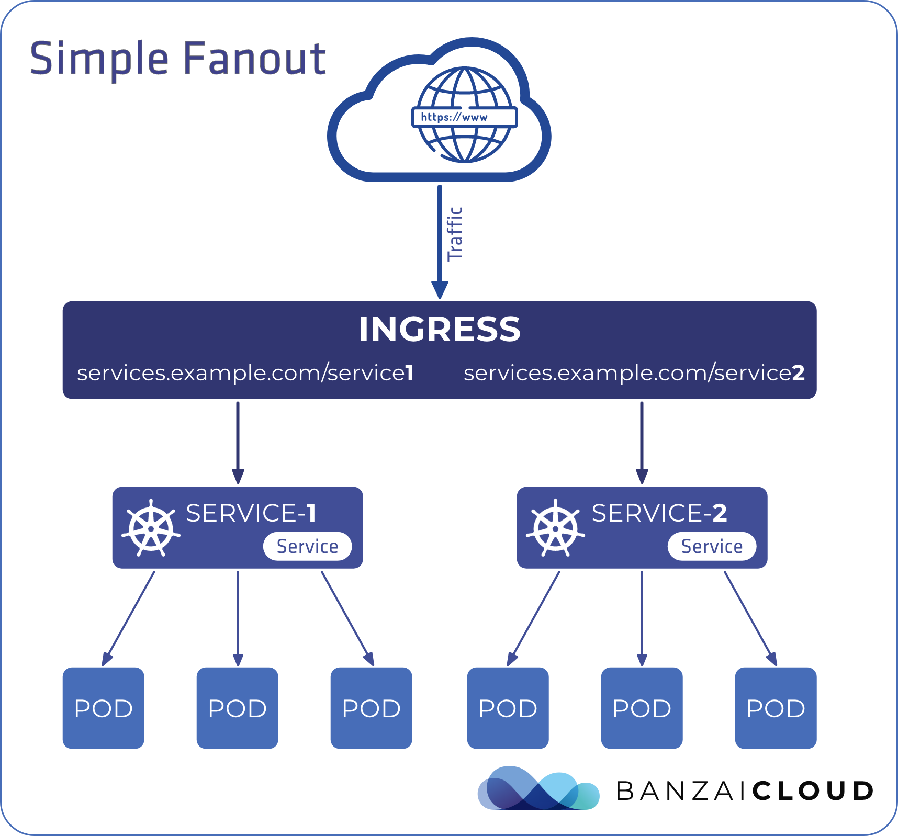

# ingress-nginx 保姆级别源码阅读

  在k8s集群内部，或者说在集群的任一节点上执行命令，访问任何资源都是没什么障碍的，但是，在集群外部呢？我们并不能直接访问pod的IP，或者service的IP，这些IP是一些内部地址，一般在外部是不会设置路由的，那么如何在集群外部访问这些资源呢？最简单的解决方式是hostPort及nodePort，通过hostPort可以在运行pod的节点监听指定接口，好处是没有端口限制，但是外部访问需要知道pod运行在哪个节点，可能会存在单点故障(当然了，你也可以每个节点都运行hostport，但是太浪费端口了)，如果只有一个pod运行的话，相对于hostPort,  nodePort可以在所有节点监听一个指定的端口，这样访问集群的任一节点都可以访问到所需资源，好处是不需要关心pod运行在哪个节点，但是有端口限制。除了这些限制以外，最痛苦的是每个接口一个端口，或者说一个域名一个端口，如果有一个统一的端口并且可以动态的关联配置的服务该多好。

  k8s已经有两个解决方案了，一个loadBalancer, 但是这个需要平台支持，比如阿里云，谷歌云等，不过现在还有一个[MetalLB](https://metallb.universe.tf/)的项目,不过有一定学习曲线，并且生产场景还待验证。那么怎么解决这个问题呢？这个答案可以是ingress。

ingress-nginx可以实的更新后端数据，比如自动找到对应的pod然后根据定义的规则将流量转发，当然了ingress有很多实现，比如apisix，Traefik等，本文介绍的是ingress-nginx,从文章标题就可以知道。

下面是ingress网络拓扑的示意图

 

> 图片来源: https://banzaicloud.com/blog/k8s-ingress/

ingress-nginx的代码主要分为两个部分。

一部分是controller，controller作为deployment或者daemonset运行在k8s集群内部用于监听指定资源的变更情况，如ingress, pod, service, endpoints等资源的增加/更新/删除等变更，然后对比预期的状态与当前状态以判断是否需要执行业务逻辑，比如pod的ip变了，那么controller应该及时的将ip的变化同步到nginx，让nginx将流量代理到正确的后端。

一部分是nginx，nginx部分其实也分为两部分，一部分是nginx的配置文件，主要是一些参数的配置，比如设置代理的http header，location，server_name等指令，另一部分是lua代码部分，这部分主要用于执行用户配置了ingress的代理逻辑，比如代理的负载均衡算法等。

> 虽然代码阅读的文章我会写的很细，但是也不会照顾到一个程序的方方面面，这篇文章的代码阅读主线是nginx-controller如何启动，检测变更，响应。

本文的风格是"talk is cheap, show me the code",  我的代码讲解部分主要是穿插在代码之中，会删除一些不影响主体逻辑的代码，比如错误检查，或者当前思路中不会用到的代码。

**参考ingress配置**

```yaml
apiVersion: networking.k8s.io/v1
kind: Ingress
metadata:
  name: ingress-myservicea
spec:
  ingressClassName: nginx
  rules:
  - host: myservicea.foo.org
    http:
      paths:
      - path: /
        pathType: Prefix
        backend:
          service:
            name: myservicea
            port:
              number: 80
```

## 任务主线

1. 怎么运行的
2. 怎么比对状态的
3. 怎么实现动态加载后端的，以及什么情况下会reload nginx
4. 怎么与nginx交互的

上面这些问题作为代码阅读的主线任务，会在阅读之中得到答案。

## 环境说明

ingress-nginx 版本: controller-v1.1.0 https://github.com/kubernetes/ingress-nginx/tree/controller-v1.1.0

## controller

一个controller的代码结构在无限精简之后可以得到这样的伪代码。

```go
for {
  // 获取期望状态
  desired := getDesiredState()
  // 获取当前状态
  current := getCurrentState()
  // 比对两者状态，如果状态不一致就当前状态变更成期望状态
  makeChanges(desired, current)
}
```

那么怎么获取两者的状态的呢？如果是轮训的话，时间间隔太小就会对服务端造成巨大的压力，比如每秒查询ingress, service, endpoint等资源的状态，即使服务端可以承受这么大的压力，那么也不够实时，因为一秒之后才得到响应，所以需要一种机制来解决这个问题，一是减少服务端的压力，因为k8s集群内部有很多controller的，二是解决实时的问题，这个问题已经有一个现成的回答，就是**informer**。

首先来看一段示例代码

```go
package main

import (
    "flag"
    "fmt"
    "time"

    "k8s.io/klog/v2"

    v1 "k8s.io/api/core/v1"
    meta_v1 "k8s.io/apimachinery/pkg/apis/meta/v1"
    "k8s.io/apimachinery/pkg/fields"
    "k8s.io/apimachinery/pkg/util/runtime"
    "k8s.io/apimachinery/pkg/util/wait"
    "k8s.io/client-go/kubernetes"
    "k8s.io/client-go/tools/cache"
    "k8s.io/client-go/tools/clientcmd"
    "k8s.io/client-go/util/workqueue"
)

type Controller struct {
    // 本地缓存对象，从k8s集群通过来的数据缓存在这里
    indexer  cache.Indexer
    // 工作队列，用于解耦informer与controller之间的强关联
    // 为什么需要一个工作队列呢？我猜测注册的函数会以同步的方式运行
    // 如果监听函数执行时间过长会对informer的主业务逻辑造成影响
    // 但是我还没看informer的代码，所以只是猜测
    queue    workqueue.RateLimitingInterface
    // informer对象，用于k8s集群状态的数据到本地缓存对象
    informer cache.Controller
}

// New*属于go代码风格，因为没有构造函数
func NewController(queue workqueue.RateLimitingInterface, indexer cache.Indexer, informer cache.Controller) *Controller {
    return &Controller{
        informer: informer,
        indexer:  indexer,
        queue:    queue,
    }
}

// 注册到队列的构造函数
// 每次有新的数据进入队列，都会执行
func (c *Controller) processNextItem() bool {
    // 从队列中拿出一个key, 这个key是字符串，通常是"{namespace}-{name}"的形式
    // 工作队列在shutdown之后，quit的值会是true
    key, quit := c.queue.Get()
    if quit {
        return false
    }

    // 告诉工作队列我们已经处理过这个key了，这也是一种解锁的方法，当一个key从队列中取出来之后就会加上锁，那么其他监听函数就会同时处理这个key，这保证了队列的并行安全
    defer c.queue.Done(key)

    // 这里放controller的主要业务逻辑
    // 将key交由controller业务代码处理
    err := c.syncToStdout(key.(string))
    // 处理错误的主要入口
    c.handleErr(err, key)
    return true
}


// 因为是演示作用，所以这个函数的业务逻辑就是简单的将pod的相关信息打印到标准输出
// 如果出现了错误也不处理，原样抛到上一层即可
func (c *Controller) syncToStdout(key string) error {
    // 通过key获取最新的obj,这里是pod对象
    obj, exists, err := c.indexer.GetByKey(key)
    if err != nil {
        klog.Errorf("Fetching object with key %s from store failed with %v", key, err)
        return err
    }

    if !exists {
        fmt.Printf("Pod %s does not exist anymore\n", key)
    } else {
        fmt.Printf("Sync/Add/Update for Pod %s\n", obj.(*v1.Pod).GetName())
    }
    return nil
}

//错误处理函数
func (c *Controller) handleErr(err error, key interface{}) {
    if err == nil {.
        // 为什么既要Done又要Forget呢？
        // Done方法告诉队列，这个数据项已经处理过了，但是是否应该移除，它不管，并且每个key在被调用前，这个数据项不能同时被其他进程处理
        // Forget方法告诉队列，这个数据项忘了吧，无论是已经用完了还是没办法处理，队列会把这个数据项从队列中移除
        c.queue.Forget(key)
        return
    }

    // 看看这个key重新入队了多少次，超过五次就不在放进队列了
    if c.queue.NumRequeues(key) < 5 {
        klog.Infof("Error syncing pod %v: %v", key, err)

        // 再次放入队列中，等待下次调用
        // AddRateLimited会控制队列的流速，控制并发数量
        c.queue.AddRateLimited(key)
        return
    }

    // 丢弃这个数据项
    c.queue.Forget(key)
    // 实在处理不了，把错误往上抛
    runtime.HandleError(err)
    klog.Infof("Dropping pod %q out of the queue: %v", key, err)
}

func (c *Controller) Run(workers int, stopCh chan struct{}) {
    // 捕获未知错误
    defer runtime.HandleCrash()

    // 关闭工作队列，工作进程在get的时候会判断工作队列关闭没有
    defer c.queue.ShutDown()

    // 启动informer
    // informer通常作为一个独立的gorouting运行
    go c.informer.Run(stopCh)

    // 等待第一此数据同步完成，全量数据同步
    if !cache.WaitForCacheSync(stopCh, c.informer.HasSynced) {
        runtime.HandleError(fmt.Errorf("Timed out waiting for caches to sync"))
        return
    }

    // 启动n个工作进程
    for i := 0; i < workers; i++ {
        // 直到stopCh收到退出信号才退出，每秒运行runWorker
        // 因为runWorker其实是一个for的死循环，其实会一直等待runWorker运行完成
        go wait.Until(c.runWorker, time.Second, stopCh)
    }

       // 等待关闭信号
    <-stopCh
    klog.Info("Stopping Pod controller")
}

// 工作进程
func (c *Controller) runWorker() {
    for c.processNextItem() {
    }
}

func main() {
    var kubeconfig string
    var master string

    flag.StringVar(&kubeconfig, "kubeconfig", "", "absolute path to the kubeconfig file")
    flag.StringVar(&master, "master", "", "master url")
    flag.Parse()
    config, err := clientcmd.BuildConfigFromFlags(master, kubeconfig)
    clientset, err := kubernetes.NewForConfig(config)
    // 上面就是为了创建可以与k8s交互的客户端

    //配置监听器监听的对象及参数
    // 这监听默认namespace的pod资源
    podListWatcher := cache.NewListWatchFromClient(clientset.CoreV1().RESTClient(), "pods", v1.NamespaceDefault, fields.Everything())

    // 创建一个带流速控制的工作队列
    queue := workqueue.NewRateLimitingQueue(workqueue.DefaultControllerRateLimiter())

    // 正常情况下，一般创建共享的informer，即SharedInformer，共享的informer可以保证同一主进程下的子进程复用底层连接及资源，比如k8s的controller-manager里面有多个controller，比如deploymentController，daemonsetController,他们都需要监听pod资源，如果每个controller都使用独立的informer就太浪费资源了，这里的代码是为了简单
    // 一个informer可以注册AddFunc，UpdateFunc，DeleteFunc等回调函数，当对应的监听事件触发之后就会调用。
    // 这里的代码很简单，当事件了之后将放入controller的工作队列
    indexer, informer := cache.NewIndexerInformer(podListWatcher, &v1.Pod{}, 0, cache.ResourceEventHandlerFuncs{
        AddFunc: func(obj interface{}) {
            // 基于pod对象创建一个key，格式是{namespace}-{name}
            key, err := cache.MetaNamespaceKeyFunc(obj)
            if err == nil {
                queue.Add(key)
            }
        },
        UpdateFunc: func(old interface{}, new interface{}) {
            key, err := cache.MetaNamespaceKeyFunc(new)
            if err == nil {
                queue.Add(key)
            }
        },
        DeleteFunc: func(obj interface{}) {
            // IndexerInformer uses a delta queue, therefore for deletes we have to use this
            // key function.
            key, err := cache.DeletionHandlingMetaNamespaceKeyFunc(obj)
            if err == nil {
                queue.Add(key)
            }
        },
    }, cache.Indexers{})

    controller := NewController(queue, indexer, informer)

    // 手动创建一个pod
    indexer.Add(&v1dPod{
        ObjectMeta: meta_v1.ObjectMeta{
            Name:      "mypod",
            Namespace: v1.NamespaceDefault,
        },
    })

    // 启动
    stop := make(chan struct{})
    defer close(stop)
    go controller.Run(1, stop)

    // 一直等待
    select {}
}
```

> 源代码参考:  https://github.com/kubernetes/client-go/blob/master/examples/workqueue/main.go

上面就是一个典型的controller示例，创建一个工作队列用来跟informer交互，然后在工作队列中注册一个用于同步的函数用于在收到新的数据项被调用。这里就不深入informer了，大家只要知道informer会基于配置去监听特定对象，然后提供一个接口用于注册钩子函数即可。

以后有机会在写informer相关的文章。

### 启动

我们知道golang很棒的一点就是可以交叉编译，生成的二进制文件可以在多个平台执行，下面是它的的编译命令

```bash
go build \
  -trimpath -ldflags="-buildid= -w -s \
    -X ${PKG}/version.RELEASE=${TAG} \
    -X ${PKG}/version.COMMIT=${COMMIT_SHA} \
    -X ${PKG}/version.REPO=${REPO_INFO}" \
  -o "${TARGETS_DIR}/nginx-ingress-controller" "${PKG}/cmd/nginx"
```

其实这个构建命令挺有意思的，它在构建是将变量注入到了version模块的RELEASE变量里面去了。

从上面我们知道它的命令入口在cmd/nginx。

```go
func main() {
    showVersion, conf, err := parseFlags()

    kubeClient, err := createApiserverClient(conf.APIServerHost, conf.RootCAFile, conf.KubeConfigFile)
    // 检查版本信息
    if !k8s.NetworkingIngressAvailable(kubeClient) {
        klog.Fatalf("ingress-nginx requires Kubernetes v1.19.0 or higher")
    }

    // 关于内置监听:10254端口用于暴露健康检查/healthz以及/metrics等接口的创建就不在这里说明了，mc是一个用于收集指标的collector实例，对我们研究inrgess-nginx-controller没有太多影响
    // 创建、启动等
    ngx := controller.NewNGINXController(conf, mc)
    go ngx.Start()

    handleSigterm(ngx, func(code int) {
        os.Exit(code)
    })
}
```

在controller的启动过程中最重要的是传入的配置信息，即命令行信息，也是一些默认的配置项，另一部分配置项在对应的helm charts里面.

比如

```yaml
{{- define "ingress-nginx.params" -}}
- /nginx-ingress-controller
{{- if .Values.defaultBackend.enabled }}
- --default-backend-service=$(POD_NAMESPACE)/{{ include "ingress-nginx.defaultBackend.fullname" . }}
{{- end }}
{{- if and .Values.controller.publishService.enabled .Values.controller.service.enabled }}
{{- if .Values.controller.service.external.enabled }}
- --publish-service={{ template "ingress-nginx.controller.publishServicePath" . }}
{{- else if .Values.controller.service.internal.enabled }}
- --publish-service={{ template "ingress-nginx.controller.publishServicePath" . }}-internal
{{- end }}
... 等等 ...
```

至于values.*则在values.yaml里面了。

#### 创建NGINXController

```go
func NewNGINXController(config *Configuration, mc metric.Collector) *NGINXController {
    // kubectl describe 命令看到的事件日志就是这个库产生的
    eventBroadcaster := record.NewBroadcaster()
    eventBroadcaster.StartLogging(klog.Infof)
    eventBroadcaster.StartRecordingToSink(&v1core.EventSinkImpl{
        Interface: config.Client.CoreV1().Events(config.Namespace),
    })

    // 就是读取pod里面的/etc/resolv.conf
    h, err := dns.GetSystemNameServers()

    n := &NGINXController{
        isIPV6Enabled: ing_net.IsIPv6Enabled(),
        resolver:        h,
        cfg:             config,
        syncRateLimiter: flowcontrol.NewTokenBucketRateLimiter(config.SyncRateLimit, 1),
        recorder: eventBroadcaster.NewRecorder(scheme.Scheme, apiv1.EventSource{
            Component: "nginx-ingress-controller",
        }),
        stopCh:   make(chan struct{}),
        updateCh: channels.NewRingChannel(1024),
        ngxErrCh: make(chan error),
        stopLock: &sync.Mutex{},
        // 当前运行的配置文件，刚启动是为空，这点很重要
        runningConfig: new(ingress.Configuration),
        Proxy: &TCPProxy{},
        metricCollector: mc,
        // 一个可以调用nginx -c nginx.conf命令的对象，这部分不会深入
        command: NewNginxCommand(),
    }

    // store对象，很重要，数据缓存与k8s交互的接口都在这个对象
    n.store = store.New(
        config.Namespace,
        config.WatchNamespaceSelector,
        config.ConfigMapName,
        config.TCPConfigMapName,
        config.UDPConfigMapName,
        config.DefaultSSLCertificate,
        config.ResyncPeriod,
        config.Client,
        n.updateCh,
        config.DisableCatchAll,
        config.IngressClassConfiguration)

    // 一个工作队列，跟之前的workqueue差不多，这里把syncIngress注册到这个工作队列
    n.syncQueue = task.NewTaskQueue(n.syncIngress)

    // 监听模板文件更新
    onTemplateChange := func() {
        template, err := ngx_template.NewTemplate(nginx.TemplatePath)
        if err != nil {
            // this error is different from the rest because it must be clear why nginx is not working
            klog.ErrorS(err, "Error loading new template")
            return
        }

        n.t = template
        klog.InfoS("New NGINX configuration template loaded")
        n.syncQueue.EnqueueTask(task.GetDummyObject("template-change"))
    }

    ngxTpl, err := ngx_template.NewTemplate(nginx.TemplatePath)
    n.t = ngxTpl

    return n
}
```

#### 创建store

在controller的创建过程中我们看到controller只是创建了自身并监控本地文件的更新，并没有涉及与k8s集群交互的部分，这是因为这部分内容在store里面。

```go
// Store的New方法
func New(...) Storer {

    // store的具体实现是k8sStore
    store := &k8sStore{
        informers:             &Informer{},
        listers:               &Lister{},
        sslStore:              NewSSLCertTracker(),
        updateCh:              updateCh,
        backendConfig:         ngx_config.NewDefault(),
        syncSecretMu:          &sync.Mutex{},
        backendConfigMu:       &sync.RWMutex{},
        secretIngressMap:      NewObjectRefMap(),
        defaultSSLCertificate: defaultSSLCertificate,
    }

    //  kubectl describe 命令看到的事件日志就是这个库产生的
    eventBroadcaster := record.NewBroadcaster()
    eventBroadcaster.StartLogging(klog.Infof)
    eventBroadcaster.StartRecordingToSink(&clientcorev1.EventSinkImpl{
        Interface: client.CoreV1().Events(namespace),
    })
    recorder := eventBroadcaster.NewRecorder(scheme.Scheme, corev1.EventSource{
        Component: "nginx-ingress-controller",
    })

    // 用于提取注释的对象
    // 集中在internal\ingress\annotations目录
    store.annotations = annotations.NewAnnotationExtractor(store)

    // 将数据再缓存一份用于本地查询，缓存的对象正如其名IngressWithAnnotation
    // 会缓存internal\ingress\types.go:Ingress
    // 吐槽:  就不能把名字改成IngressWithAnnotation?
    store.listers.IngressWithAnnotation.Store = cache.NewStore(cache.DeletionHandlingMetaNamespaceKeyFunc)


    // 创建informer工厂函数
    infFactory := informers.NewSharedInformerFactoryWithOptions(client, resyncPeriod,
        informers.WithNamespace(namespace),
    )

    // infFactoryConfigmaps, infFactorySecrets
    // 为了节省篇幅WithTweakListOptions,WithTweakListOptions两个方法不再这里列出了，是为了过滤，跟helm有关
    infFactoryConfigmaps := informers.NewSharedInformerFactoryWithOptions(client, resyncPeriod,
        informers.WithNamespace(namespace),
        informers.WithTweakListOptions(labelsTweakListOptionsFunc),
    )
    infFactorySecrets := informers.NewSharedInformerFactoryWithOptions(client, resyncPeriod,
        informers.WithNamespace(namespace),
        informers.WithTweakListOptions(secretsTweakListOptionsFunc),
    )

    store.informers.Ingress = infFactory.Networking().V1().Ingresses().Informer()
    store.listers.Ingress.Store = store.informers.Ingress.GetStore()
    if !icConfig.IgnoreIngressClass {
        store.informers.IngressClass = infFactory.Networking().V1().IngressClasses().Informer()
        store.listers.IngressClass.Store = cache.NewStore(cache.MetaNamespaceKeyFunc)
    }
    store.informers.Endpoint = infFactory.Core().V1().Endpoints().Informer()
    store.listers.Endpoint.Store = store.informers.Endpoint.GetStore()
    store.informers.Secret = infFactorySecrets.Core().V1().Secrets().Informer()
    store.listers.Secret.Store = store.informers.Secret.GetStore()
    store.informers.ConfigMap = infFactoryConfigmaps.Core().V1().ConfigMaps().Informer()
    store.listers.ConfigMap.Store = store.informers.ConfigMap.GetStore()
    store.informers.Service = infFactory.Core().V1().Services().Informer()
    store.listers.Service.Store = store.informers.Service.GetStore()
    // 上面都是为了创建对应的informer对象，以及informer的缓存对象listers，用来查询最新数据

       // 默认监听整个集群，返回true
    watchedNamespace := func(namespace string) bool {
        if namespaceSelector == nil || namespaceSelector.Empty() {
            return true
        }

        item, ok, err := store.listers.Namespace.GetByKey(namespace)
        if !ok {
            klog.Errorf("Namespace %s not existed: %v.", namespace, err)
            return false
        }
        return namespaceSelector.Matches(labels.Set(ns.Labels))
    }

    ingDeleteHandler := func(obj interface{}) {
        ing, ok := toIngress(obj)
        if !ok {
            // If we reached here it means the ingress was deleted but its final state is unrecorded.
            tombstone, ok := obj.(cache.DeletedFinalStateUnknown)
            if !ok {
                klog.ErrorS(nil, "Error obtaining object from tombstone", "key", obj)
                return
            }
        }

        _, err := store.GetIngressClass(ing, icConfig)
        store.listers.IngressWithAnnotation.Delete(ing)
        key := k8s.MetaNamespaceKey(ing)
        store.secretIngressMap.Delete(key)
        updateCh.In() <- Event{
            Type: DeleteEvent,
            Obj:  obj,
        }
    }

    ingEventHandler := cache.ResourceEventHandlerFuncs{
        AddFunc: func(obj interface{}) {
            ing, _ := toIngress(obj)
            if !watchedNamespace(ing.Namespace) {
                return
            }
            store.syncIngress(ing)
            store.updateSecretIngressMap(ing)
            store.syncSecrets(ing)

            updateCh.In() <- Event{
                Type: CreateEvent,
                Obj:  obj,
            }
        },
        DeleteFunc: ingDeleteHandler,
        UpdateFunc: func(old, cur interface{}) {
            oldIng, _ := toIngress(old)
            curIng, _ := toIngress(cur)

            if !watchedNamespace(oldIng.Namespace) {
                return
            }

            var errOld, errCur error
            var classCur string
            if !icConfig.IgnoreIngressClass {
                _, errOld = store.GetIngressClass(oldIng, icConfig)
                classCur, errCur = store.GetIngressClass(curIng, icConfig)
            }

            store.syncIngress(curIng)
            store.updateSecretIngressMap(curIng)
            store.syncSecrets(curIng)

            updateCh.In() <- Event{
                Type: UpdateEvent,
                Obj:  cur,
            }
        },
    }

    secrEventHandler := cache.ResourceEventHandlerFuncs{
        AddFunc: func(obj interface{}) {},
        UpdateFunc: func(old, cur interface{}) {},
        DeleteFunc: func(obj interface{}) {},
    }

    epEventHandler := cache.ResourceEventHandlerFuncs{
        AddFunc: func(obj interface{}) {
            updateCh.In() <- Event{
                Type: CreateEvent,
                Obj:  obj,
            }
        },
        DeleteFunc: func(obj interface{}) {
            updateCh.In() <- Event{
                Type: DeleteEvent,
                Obj:  obj,
            }
        },
        UpdateFunc: func(old, cur interface{}) {
            oep := old.(*corev1.Endpoints)
            cep := cur.(*corev1.Endpoints)
            if !reflect.DeepEqual(cep.Subsets, oep.Subsets) {
                updateCh.In() <- Event{
                    Type: UpdateEvent,
                    Obj:  cur,
                }
            }
        },
    }
    // 其他的事件监听函数

    store.informers.Ingress.AddEventHandler(ingEventHandler)
    if !icConfig.IgnoreIngressClass {
        store.informers.IngressClass.AddEventHandler(ingressClassEventHandler)
    }
    store.informers.Endpoint.AddEventHandler(epEventHandler)
    store.informers.Secret.AddEventHandler(secrEventHandler)
    store.informers.ConfigMap.AddEventHandler(cmEventHandler)
    store.informers.Service.AddEventHandler(serviceHandler)

    // 在提供的helm charts里面会创建一个默认的configmap, 在这里就马上读取
    ns, name, _ := k8s.ParseNameNS(configmap)
    cm, err := client.CoreV1().ConfigMaps(ns).Get(context.TODO(), name, metav1.GetOptions{})
    if err != nil {
        klog.Warningf("Unexpected error reading configuration configmap: %v", err)
    }

    store.setConfig(cm)
    return store
}
```

上面的事件函数基本就是分别设置对应事件的响应函数，一共有三个时间需要响应AddFunc,DeleteFunc,UpdateFunc.

而成功之后的逻辑一般分为三步

1. 业务逻辑
2. 同步数据到本地(如syncIngress, syncSecrets等)
3. 将数据传递给传递给updateCh, 即交由controller的主循环。

至此ingress-nginx-controller的两个最重要的对象创建完毕。

#### 小结

NGINXController对象并不直接与集群打交道，而是通过将交互接口全部抽象到store对象，ingress, configmap, service等资源的事件响应也全部放在store里面，store负责判断对象是否应该传递给NGINXController的主循环, 然后将数据缓存到本地, 以便后面让NGINXController对象查询，NGINXController对象主要负责怎么将资源的变更同步给nginx，比如怎么渲染模板，是否动态更新数据给nginx。

### 运行

因为go语言的并发特性，并发一个gorouting的成本非常低，所以会启动比较多的gorouting，但是这里肯定不会关注所有的启动进程任务(gorouting)

#### 运行controller

```go
func (n *NGINXController) Start() {
    // 
    n.store.Run(n.stopCh)

    // 选举配置在此略过，我也没太搞懂选举这个机制
    // 似乎是为了更新ingress的loadbalancer的状态

    // 调用nginx -c /etc/nginx/nginx.conf 启动nginx
    cmd := n.command.ExecCommand()
    klog.InfoS("Starting NGINX process")
    n.start(cmd)

    // 运行工作队列
    go n.syncQueue.Run(time.Second, n.stopCh)
    // 马上触发工作队列
    // 为了让controller渲染模板更新后端
    // 更新的流程唯一入口是工作队列,保证数据一致
    n.syncQueue.EnqueueTask(task.GetDummyObject("initial-sync"))

    for {
        select {
        case event := <-n.updateCh.Out():
            // 主循环很简单，就是将时间类型是store.ConfigurationEvent的事件在压入队列的时候标记成不可跳过
            // 反之，可跳过
            if evt, ok := event.(store.Event); ok {
                if evt.Type == store.ConfigurationEvent {
                    n.syncQueue.EnqueueTask(task.GetDummyObject("configmap-change"))
                    continue
                }

                n.syncQueue.EnqueueSkippableTask(evt.Obj)
            } else {
                klog.Warningf("Unexpected event type received %T", event)
            }
        case <-n.stopCh:
            return
        }
    }
}
```

#### 运行工作队列

```go
func (t *Queue) Run(period time.Duration, stopCh <-chan struct{}) {
    wait.Until(t.worker, period, stopCh)
}

func (t *Queue) worker() {
    for {
        key, quit := t.queue.Get()
        if quit {
            if !isClosed(t.workerDone) {
                close(t.workerDone)
            }
            return
        }
        ts := time.Now().UnixNano()

        item := key.(Element)
        // 可不可以跳过的地方就在这，如果是EnqueueTask方法入栈，它的时间戳Timestamp会加上24小时
        // 也就是说二十四小时以内不会被跳过
        if item.Timestamp != 0 && t.lastSync > item.Timestamp {
            klog.V(3).InfoS("skipping sync", "key", item.Key, "last", t.lastSync, "now", item.Timestamp)
            t.queue.Forget(key)
            t.queue.Done(key)
            continue
        }

        klog.V(3).InfoS("syncing", "key", item.Key)
        // 这里的sync就是之前传入的n.syncIngress
        if err := t.sync(key); err != nil {
            klog.ErrorS(err, "requeuing", "key", item.Key)
            t.queue.AddRateLimited(Element{
                Key:       item.Key,
                Timestamp: 0,
            })
        } else {
            t.queue.Forget(key)
            t.lastSync = ts
        }

        t.queue.Done(key)
    }
}
```

workqueue的实现主要分为三个数据对象, []queue, dirty, processing.

```go
type Type struct {
    queue []t
    dirty set
    processing set
    // 当然还有其他字段，这里略过
}
```

其中queue一般是一个控制速率的队列，然后dirty, processing是一个map。

当一个数据来到队列的时候将将其加入到queue,dirty中，如果取出的时候就从queue, dirty中删除，然后放入processing。

t.queue.Forget(key)方法告诉队列，这个数据可以舍弃了。

t.queue.Done(key)方法告诉队列，这个数据已经处理完成了，会从processing中删除。

#### 运行store

```go
func (s *k8sStore) Run(stopCh chan struct{}) {
    //就是启动之前创建的所有informer
    s.informers.Run(stopCh)
}
```

#### 小结

至此，整个controller运行起来了，store初始化的informer会监听指定资源，如果资源创建、更新、删除, 那么注册的事件函数就会首先判断是否有必要响应或者验证一番，然后将数据同步到本地缓存(**syncIngress**)，最后将时间传给NGINXController的主循环， 主循环就会将数据压入队列， 队列的工作进程就会调用配置的**syncIngress**函数进行更新。

> 注意: NGINXController，k8sStore都有一个syncIngress方法

### 更新

在上面我们已经知道当informer监听到资源变动事件后就会分别触发store和controller的syncIngress方法，那么我们分别研究一下两者的同步函数吧

#### store的syncIngress

```go
func (s *k8sStore) syncIngress(ing *networkingv1.Ingress) {
    key := k8s.MetaNamespaceKey(ing)

    // k8s的controller模式，一个很重要的范式就是，不要直接修改informer传递过来的对象
    // 因为这个对象可能被多个controller引用，所以才叫共享的informer嘛(SharedInformer)
    copyIng := &networkingv1.Ingress{}
    ing.ObjectMeta.DeepCopyInto(&copyIng.ObjectMeta)
    ing.Spec.DeepCopyInto(&copyIng.Spec)
    ing.Status.DeepCopyInto(&copyIng.Status)

    // 处理一些ingress的rules
    for ri, rule := range copyIng.Spec.Rules {
        if rule.HTTP == nil {
            continue
        }

        for pi, path := range rule.HTTP.Paths {
            if path.Path == "" {
                copyIng.Spec.Rules[ri].HTTP.Paths[pi].Path = "/"
            }
        }
    }
    // 和上面的操作差不多
    k8s.SetDefaultNGINXPathType(copyIng)

    // 将数据更新到IngressWithAnnotation
    // 这个ingress是带注释的，即ParsedAnnotations字段
    err := s.listers.IngressWithAnnotation.Update(&ingress.Ingress{
        Ingress:           *copyIng,
        ParsedAnnotations: s.annotations.Extract(ing),
    })
}
```

#### NGINXController的syncIngress

```go
// 注意，这里根本不关心传入的参数是啥
func (n *NGINXController) syncIngress(interface{}) error {
    // 获取最所有的ingress对象, 这个ingress对象是有ParsedAnnotations字段的
    ings := n.store.ListIngresses()
    // 通过getConfiguration方法将ingress分为hosts,servers，pcfg三个部分
    // host是ingress定义的域名
    // servers对应nginx里的每个server指令所需的数据, 每个域名会创建一个server {server_name xxx; ....}的配置
    // pcfg是后面用来渲染nginx的模板
    hosts, servers, pcfg := n.getConfiguration(ings)

    // 判断当前配置与集群中的数据是否一致
    // controller刚启动的时候runningCOnfig为空，所以首次触发就会更新模板
    if n.runningConfig.Equal(pcfg) {
        klog.V(3).Infof("No configuration change detected, skipping backend reload")
        return nil
    }

    // 判断是否有必要重新渲染模板并执行nginx -s reload
    // 如果只是backend更新，不会重新渲染模板的
    if !n.IsDynamicConfigurationEnough(pcfg) {
        // 更新模板并reload
        err := n.OnUpdate(*pcfg)
    }

    // 如果是第一次启动，等待一秒，让nginx有时间监听端口以便后续的动态更新
    isFirstSync := n.runningConfig.Equal(&ingress.Configuration{})
    if isFirstSync {
        klog.InfoS("Initial sync, sleeping for 1 second")
        time.Sleep(1 * time.Second)
    }

    // 重试机制
    retry := wait.Backoff{
        Steps:    15,
        Duration: 1 * time.Second,
        Factor:   0.8,
        Jitter:   0.1,
    }

    // 这里可以看到，无论数据是否更新都会调用configureDynamically
    // configureDynamically会判断是否有必要更新后端
    err := wait.ExponentialBackoff(retry, func() (bool, error) {
        err := n.configureDynamically(pcfg)
        if err == nil {
            klog.V(2).Infof("Dynamic reconfiguration succeeded.")
            return true, nil
        }

        klog.Warningf("Dynamic reconfiguration failed: %v", err)
        return false, err
    })

    // 更新指标数据
    ri := getRemovedIngresses(n.runningConfig, pcfg)
    re := getRemovedHosts(n.runningConfig, pcfg)
    n.metricCollector.RemoveMetrics(ri, re)

    n.runningConfig = pcfg

    return nil
}
```

#### 动态更新是否就足够了(IsDynamicConfigurationEnough)

```go
func (n *NGINXController) IsDynamicConfigurationEnough(pcfg *ingress.Configuration) bool {
    copyOfRunningConfig := *n.runningConfig
    copyOfPcfg := *pcfg

    // 可以看到，在比较配置文件的时候，backend字段会设置为空格
    // 所以只是backend字段更新不会触发reload
    copyOfRunningConfig.Backends = []*ingress.Backend{}
    copyOfPcfg.Backends = []*ingress.Backend{}

    clearL4serviceEndpoints(&copyOfRunningConfig)
    clearL4serviceEndpoints(&copyOfPcfg)

    clearCertificates(&copyOfRunningConfig)
    clearCertificates(&copyOfPcfg)

    return copyOfRunningConfig.Equal(&copyOfPcfg)
}
```

#### 动态更新

```go
func (n *NGINXController) configureDynamically(pcfg *ingress.Configuration) error {
    // 比对backend是否变化
    backendsChanged := !reflect.DeepEqual(n.runningConfig.Backends, pcfg.Backends)
    if backendsChanged {
        err := configureBackends(pcfg.Backends)
        if err != nil {
            return err
        }
    }
    return nil
}

func configureBackends(rawBackends []*ingress.Backend) error {
    backends := make([]*ingress.Backend, len(rawBackends))

    for i, backend := range rawBackends {
        var service *apiv1.Service
        if backend.Service != nil {
            service = &apiv1.Service{Spec: backend.Service.Spec}
        }
        luaBackend := &ingress.Backend{
            Name:                 backend.Name,
            Port:                 backend.Port,
            SSLPassthrough:       backend.SSLPassthrough,
            SessionAffinity:      backend.SessionAffinity,
            UpstreamHashBy:       backend.UpstreamHashBy,
            LoadBalancing:        backend.LoadBalancing,
            Service:              service,
            NoServer:             backend.NoServer,
            TrafficShapingPolicy: backend.TrafficShapingPolicy,
            AlternativeBackends:  backend.AlternativeBackends,
        }

        // 其实我不太懂为啥要这样赋值
        var endpoints []ingress.Endpoint
        for _, endpoint := range backend.Endpoints {
            endpoints = append(endpoints, ingress.Endpoint{
                Address: endpoint.Address,
                Port:    endpoint.Port,
            })
        }

        luaBackend.Endpoints = endpoints
        backends[i] = luaBackend
    }

    //
    statusCode, _, err := nginx.NewPostStatusRequest("/configuration/backends", "application/json", backends)

    if statusCode != http.StatusCreated {
        return fmt.Errorf("unexpected error code: %d", statusCode)
    }

    return nil
}

func NewPostStatusRequest(path, contentType string, data interface{}) (int, []byte, error) {
    // http://127.0.0.1:10246/configuration/backends
    url := fmt.Sprintf("http://127.0.0.1:%v%v", StatusPort, path)
    buf, err := json.Marshal(data)

    client := http.Client{}
    res, err := client.Post(url, contentType, bytes.NewReader(buf))
    defer res.Body.Close()

    body, err := io.ReadAll(res.Body)
    return res.StatusCode, body, nil
}
```

#### servers和backends

server对象用来描述一个网站，即nginx的server指令

```go
type Server struct {
    // Hostname returns the FQDN of the server
    Hostname string `json:"hostname"`
    // Locations list of URIs configured in the server.
    Locations []*Location `json:"locations,omitempty"`
    // 其他字段略去
}
```

backend用来描述一个后端，即upstream, 但又不是太贴切，因为nginx里面只会创建一个http的upstream。

```go
type Backend struct {
    // Name represents an unique apiv1.Service name formatted as <namespace>-<name>-<port>
    Name    string             `json:"name"`
    Service *apiv1.Service     `json:"service,omitempty"`
    Port    intstr.IntOrString `json:"port"`
    // SSLPassthrough indicates that Ingress controller will delegate TLS termination to the endpoints.
    SSLPassthrough bool `json:"sslPassthrough"`
    // Endpoints contains the list of endpoints currently running
    Endpoints []Endpoint `json:"endpoints,omitempty"`
    // StickySessionAffinitySession contains the StickyConfig object with stickiness configuration
    SessionAffinity SessionAffinityConfig `json:"sessionAffinityConfig"`
    // 其他字段略去
}
```

### 总结

k8s集群里监听的资源(ingress, configmap, service, endpoint等)发生变化之后就会触发syncIngress方法，syncIngress方法会比对当前的配置与集群的配置是否一致，如果一致就跳过，如果不一致就判断是否只要动态更新，如果动态更新不能满足要求就重新生成配置文件并执行命令 nginx -s reload, 最后判断是否需要动态更新，如果需要就发送POST请求到nginx执行动态更新。

可以用下面三个场景描述

假设用户使用开篇的ingress.yaml配置，因为文章比较长，这里再次引用一下。

```yaml
apiVersion: networking.k8s.io/v1
kind: Ingress
metadata:
  name: ingress-myservicea
spec:
  ingressClassName: nginx
  rules:
  - host: myservicea.foo.org
    http:
      paths:
      - path: /
        pathType: Prefix
        backend:
          service:
            name: myservicea
            port:
              number: 80
```

**1. 创建了一个ingress**

controller发现创建了一个ingress，那么就需要生成新的模板然后执行nginx -s reload

**2. ingress的host字段变了**

因为字段变了，所以需要修改配置文件，因此需要生成新的模板然后执行nginx -s reload, 但是service以及对应的endpoint没变，所以不需要动态更新

**3. service的对应的endpoint变了**

如果service对应的资源(比如deployment)变化了(比如扩缩容)，那么对应的endpoint就会变化，就需要动态更新后端(nginx的upstream)，但是不要重新渲染模板和reload nginx。

## nginx

nginx 的部分主要分为两个部分，一个是nginx的配置文件，一个是加载的lua代码

配置文件由模板渲染而成，lua代码负责具体的流量转发逻辑

### nginx配置文件

值得一提的是，在渲染过程中注入了一些自定义的模板函数

```go
// internal\ingress\controller\template\template.go
var (
    funcMap = text_template.FuncMap{
        "empty": func(input interface{}) bool {
            check, ok := input.(string)
            if ok {
                return len(check) == 0
            }
            return true
        },
        "escapeLiteralDollar":             escapeLiteralDollar,
        "buildLuaSharedDictionaries":      buildLuaSharedDictionaries,
        "luaConfigurationRequestBodySize": luaConfigurationRequestBodySize,
        "buildLocation":                   buildLocation,
        "buildAuthLocation":               buildAuthLocation,
        "shouldApplyGlobalAuth":           shouldApplyGlobalAuth,
        "buildAuthResponseHeaders":        buildAuthResponseHeaders,
        "buildAuthProxySetHeaders":        buildAuthProxySetHeaders,
        "buildProxyPass":                  buildProxyPass,
        "filterRateLimits":                filterRateLimits,
        "buildRateLimitZones":             buildRateLimitZones,
        "buildRateLimit":                  buildRateLimit,
        "configForLua":                    configForLua,
        "locationConfigForLua":            locationConfigForLua,
        "buildResolvers":                  buildResolvers,
        "buildUpstreamName":               buildUpstreamName,
        "isLocationInLocationList":        isLocationInLocationList,
        "isLocationAllowed":               isLocationAllowed,
        "buildDenyVariable":               buildDenyVariable,
        "getenv":                          os.Getenv,
        "contains":                        strings.Contains,
        "split":                           strings.Split,
        "hasPrefix":                       strings.HasPrefix,
        "hasSuffix":                       strings.HasSuffix,
        "trimSpace":                       strings.TrimSpace,
        "toUpper":                         strings.ToUpper,
        "toLower":                         strings.ToLower,
        "formatIP":                        formatIP,
        "quote":                           quote,
        "buildNextUpstream":               buildNextUpstream,
        "getIngressInformation":           getIngressInformation,
        "serverConfig": func(all config.TemplateConfig, server *ingress.Server) interface{} {
            return struct{ First, Second interface{} }{all, server}
        },
        "isValidByteSize":                    isValidByteSize,
        "buildForwardedFor":                  buildForwardedFor,
        "buildAuthSignURL":                   buildAuthSignURL,
        "buildAuthSignURLLocation":           buildAuthSignURLLocation,
        "buildOpentracing":                   buildOpentracing,
        "proxySetHeader":                     proxySetHeader,
        "buildInfluxDB":                      buildInfluxDB,
        "enforceRegexModifier":               enforceRegexModifier,
        "buildCustomErrorDeps":               buildCustomErrorDeps,
        "buildCustomErrorLocationsPerServer": buildCustomErrorLocationsPerServer,
        "shouldLoadModSecurityModule":        shouldLoadModSecurityModule,
        "buildHTTPListener":                  buildHTTPListener,
        "buildHTTPSListener":                 buildHTTPSListener,
        "buildOpentracingForLocation":        buildOpentracingForLocation,
        "shouldLoadOpentracingModule":        shouldLoadOpentracingModule,
        "buildModSecurityForLocation":        buildModSecurityForLocation,
        "buildMirrorLocations":               buildMirrorLocations,
        "shouldLoadAuthDigestModule":         shouldLoadAuthDigestModule,
        "shouldLoadInfluxDBModule":           shouldLoadInfluxDBModule,
        "buildServerName":                    buildServerName,
        "buildCorsOriginRegex":               buildCorsOriginRegex,
    }
)
```

这些模板方法就不展开了

nginx模板简化之后，大致如下。

> 关于参数配置及tcp/udp等部分会被简化掉

```nginx
# rootfs\etc\nginx\template\nginx.tmpl
{{ $all := . }}
{{ $servers := .Servers }}
{{ $cfg := .Cfg }}
{{ $IsIPV6Enabled := .IsIPV6Enabled }}
{{ $healthzURI := .HealthzURI }}
{{ $backends := .Backends }}
{{ $proxyHeaders := .ProxySetHeaders }}
{{ $addHeaders := .AddHeaders }}

# setup custom paths that do not require root access
pid {{ .PID }};

daemon off;

events {
    use                 epoll;
}

http {
    // lua模块路径配置
    lua_package_path "/etc/nginx/lua/?.lua;;";

    // 创建lua_shared_dict
    {{ buildLuaSharedDictionaries $cfg $servers }}

    init_by_lua_block {
        collectgarbage("collect")

        -- init modules
        local ok, res

        ok, res = pcall(require, "lua_ingress")
        if not ok then
          error("require failed: " .. tostring(res))
        else
          lua_ingress = res
          lua_ingress.set_config({{ configForLua $all }})
        end

        ok, res = pcall(require, "configuration")
        if not ok then
          error("require failed: " .. tostring(res))
        else
          configuration = res
          configuration.prohibited_localhost_port = '{{ .StatusPort }}'
        end

        ok, res = pcall(require, "balancer")
        if not ok then
          error("require failed: " .. tostring(res))
        else
          balancer = res
        end

        {{ if $all.EnableMetrics }}
        ok, res = pcall(require, "monitor")
        if not ok then
          error("require failed: " .. tostring(res))
        else
          monitor = res
        end
        {{ end }}

        ok, res = pcall(require, "certificate")
        if not ok then
          error("require failed: " .. tostring(res))
        else
          certificate = res
          certificate.is_ocsp_stapling_enabled = {{ $cfg.EnableOCSP }}
        end

        ok, res = pcall(require, "plugins")
        if not ok then
          error("require failed: " .. tostring(res))
        else
          plugins = res
        end
        -- load all plugins that'll be used here
        plugins.init({ {{ range  $idx, $plugin := $cfg.Plugins }}{{ if $idx }},{{ end }}{{ $plugin | quote }}{{ end }} })
    }

    init_worker_by_lua_block {
        lua_ingress.init_worker()
        balancer.init_worker()
        {{ if $all.EnableMetrics }}
        monitor.init_worker({{ $all.MonitorMaxBatchSize }})
        {{ end }}

        plugins.run()
    }

    include /etc/nginx/mime.types;

    log_format upstreaminfo {{ if $cfg.LogFormatEscapeJSON }}escape=json {{ end }}'{{ $cfg.LogFormatUpstream }}';

    # 可以看到，这里只创建了一个upstream,所有流量交给balancer.balance()方法
    upstream upstream_balancer {
        server 0.0.0.1; # placeholder

        balancer_by_lua_block {
          balancer.balance()
        }
    }


    # 可以看到，每个Server对象对应nginx里面的server配置
    {{ range $server := $servers }}
    ## start server {{ $server.Hostname }}
    server {
        server_name {{ buildServerName $server.Hostname }} {{range $server.Aliases }}{{ . }} {{ end }};
        {{ template "SERVER" serverConfig $all $server }}
        {{ template "CUSTOM_ERRORS" (buildCustomErrorDeps "upstream-default-backend" $cfg.CustomHTTPErrors $all.EnableMetrics) }}
    }
    ## end server {{ $server.Hostname }}

    {{ end }}


    # default server, used for NGINX healthcheck and access to nginx stats
    server {
        listen 127.0.0.1:{{ .StatusPort }};
        set $proxy_upstream_name "internal";

        location /is-dynamic-lb-initialized {
            content_by_lua_block {
                local configuration = require("configuration")
                local backend_data = configuration.get_backends_data()
                if not backend_data then
                    ngx.exit(ngx.HTTP_INTERNAL_SERVER_ERROR)
                    return
                end

                ngx.say("OK")
                ngx.exit(ngx.HTTP_OK)
            }
        }

        # /nginx_status
        # 用来暴露nginx状态给controller来统计数据
        location {{ .StatusPath }} {
            stub_status on;
        }

        // 动态后端的接口
        location /configuration {
            client_max_body_size                    {{ luaConfigurationRequestBodySize $cfg }};
            client_body_buffer_size                 {{ luaConfigurationRequestBodySize $cfg }};
            proxy_buffering                         off;

            content_by_lua_block {
              configuration.call()
            }
        }

        location / {
            content_by_lua_block {
                ngx.exit(ngx.HTTP_NOT_FOUND)
            }
        }
    }
}


{{/* definition of server-template to avoid repetitions with server-alias */}}
{{ define "SERVER" }}
        {{ $all := .First }}
        {{ $server := .Second }}

        {{ buildHTTPListener  $all $server.Hostname }}
        {{ buildHTTPSListener $all $server.Hostname }}

        location {{ $path }} {
            set $proxy_upstream_name {{ buildUpstreamName $location | quote }};
            # 一般是生成指令proxy_pass http://upstream_balancer
            {{ buildProxyPass $server.Hostname $all.Backends $location }}
        {{ end }}
        {{ end }}
{{ end }}
```

### nginx的lua脚本

#### 初始化

```nginx
init_worker_by_lua_block {
        lua_ingress.init_worker()
        balancer.init_worker()
        plugins.run()
 }
```

在nginx工作进程启动的时候,会调用上面的函数，这里关于负载均衡需要关注的是balancer.init_worker()

```lua
function _M.init_worker()
  -- 首先同步一遍backend
  sync_backends()

  -- BACKENDS_SYNC_INTERVAL = 1
  -- 可以看到，这里在nginx的定时器注册了一个函数sync_backend, 即每秒同步一下backends
  ok, err = ngx.timer.every(BACKENDS_SYNC_INTERVAL, sync_backends)
  if not ok then
    ngx.log(ngx.ERR, "error when setting up timer.every for sync_backends: ", err)
  end
end
```

#### 动态更新

```nginx
location /configuration {
    client_max_body_size                    {{ luaConfigurationRequestBodySize $cfg }};
        client_body_buffer_size                 {{ luaConfigurationRequestBodySize $cfg }};
        proxy_buffering                         off;

    content_by_lua_block {
        configuration.call()
    }
}
```

从nginx的配置文件可以看到，动态更新调用configuration.call()

```lua
function _M.call()
  if ngx.var.request_method ~= "POST" and ngx.var.request_method ~= "GET" then
    ngx.status = ngx.HTTP_BAD_REQUEST
    ngx.print("Only POST and GET requests are allowed!")
    return
  end

  if ngx.var.request_uri == "/configuration/backends" then
    handle_backends()
    return
  end

  ngx.status = ngx.HTTP_NOT_FOUND
  ngx.print("Not found!")
end


local function handle_backends()
  -- 如果是GET方法就打印当前配置
  if ngx.var.request_method == "GET" then
    ngx.status = ngx.HTTP_OK
    ngx.print(_M.get_backends_data())
    return
  end

  local backends = fetch_request_body() 

  -- 如果是POST就将数据存在configuration_data, 是一个lua_shared_dict对象
  local success, err = configuration_data:set("backends", backends)
  if not success then
    ngx.log(ngx.ERR, "dynamic-configuration: error updating configuration: " .. tostring(err))
    ngx.status = ngx.HTTP_BAD_REQUEST
    return
  end

  ngx.status = ngx.HTTP_CREATED
end
```

可以看到，更新配置是很简单的，存在shared_dict里面就可以了，甚至不要解析数据，但是怎么更新后端？

还记得前面的init_worker方法吗？那里会每秒去同步backends

为了让流程更清晰，这里借用开篇的ingress生成的backend作为参考, controller会传递一个json数组到nginx

```json
[{
    "name": "default-myservicea-80",
    "port": 80,
    "endpoints": [{"address": "10.10.10.100", "port": 80}, {"address": "10.10.10.101", "port": 80}]
}]
```

当然，上面的数据还是简化的。

>  name的组成是"{namespace}-{service name}-{service port}"

#### sync_backends

```lua
local function sync_backends()
  local backends_data = configuration.get_backends_data()
  local new_backends, err = cjson.decode(backends_data)

  local balancers_to_keep = {}
  -- backends是一个数组
  for _, new_backend in ipairs(new_backends) do
    if is_backend_with_external_name(new_backend) then
      local backend_with_external_name = util.deepcopy(new_backend)
      backends_with_external_name[backend_with_external_name.name] = backend_with_external_name
    else
      sync_backend(new_backend)
    end
    balancers_to_keep[new_backend.name] = true
  end

  for backend_name, _ in pairs(balancers) do
    -- 删除已不要的balancer
    if not balancers_to_keep[backend_name] then
      balancers[backend_name] = nil
      backends_with_external_name[backend_name] = nil
    end
  end
  backends_last_synced_at = raw_backends_last_synced_at
end


local function sync_backend(backend)
  -- 根据backend的配置选择负载均衡算法实现，默认是round_robin
  local implementation = get_implementation(backend)
  local balancer = balancers[backend.name]

  -- 如果当前balance人没有包含就创建对应的balancer实现
  if not balancer then
    balancers[backend.name] = implementation:new(backend)
    return
  end

  balancer:sync(backend)
end


-- 可以看到，默认还是支持不少负载均衡算法的
-- 这里就只是看下默认的负载均衡算法吧
local function get_implementation(backend)
  local name = backend["load-balance"] or DEFAULT_LB_ALG

  if backend["sessionAffinityConfig"] and
     backend["sessionAffinityConfig"]["name"] == "cookie" then
    if backend["sessionAffinityConfig"]["mode"] == "persistent" then
      name = "sticky_persistent"
    else
      name = "sticky_balanced"
    end

  elseif backend["upstreamHashByConfig"] and
         backend["upstreamHashByConfig"]["upstream-hash-by"] then
    if backend["upstreamHashByConfig"]["upstream-hash-by-subset"] then
      name = "chashsubset"
    else
      name = "chash"
    end
  end

  local implementation = IMPLEMENTATIONS[name]
  if not implementation then
    ngx.log(ngx.WARN, backend["load-balance"], "is not supported, ",
            "falling back to ", DEFAULT_LB_ALG)
    implementation = IMPLEMENTATIONS[DEFAULT_LB_ALG]
  end

  return implementation
end
```

至此，nginx根据controller传来的配置创建了对应的balancer，那么这个balancer有啥用？怎么被调用？

首先让我们看看当我们以域名**myservicea.foo.org** 访问nginx会这么走流量

从nginx的配置文件来看，我们知道流量都会到upstream upstream_balancer, 那么这个upstream怎么响应请求的呢？

```nginx
upstream upstream_balancer {
    server 0.0.0.1; # placeholder

    balancer_by_lua_block {
        balancer.balance()
    }
}
```

直接调用balancer.balance(), 那我们来看看这部分lua代码吧

```lua
function _M.balance()
  -- 获得一个balance人对象
  local balancer = get_balancer()
  if not balancer then
    return
  end

  -- 调用它的balance方法，获得一个可以路由的后端，即k8s里面的endpoint地址,比如"10.10.10.100:80"
  local peer = balancer:balance()
  ngx_balancer.set_more_tries(1)

  -- 设置后端，然后流量转发
  local ok, err = ngx_balancer.set_current_peer(peer)
  if not ok then
    ngx.log(ngx.ERR, "error while setting current upstream peer ", peer,
            ": ", err)
  end
end

local function get_balancer()
  if ngx.ctx.balancer then
    return ngx.ctx.balancer
  end

  -- proxy_upstream_name在生成配置文件的时候会配置
  local backend_name = ngx.var.proxy_upstream_name

  local balancer = balancers[backend_name]
  if not balancer then
    return nil
  end

  ngx.ctx.balancer = balancer

  return balancer
end
```

#### 负载均衡算法

这些负载均衡的算法基本来自resty这个模块，让我看看round_robin算法创建的balancer是怎样的。

```lua
local balancer_resty = require("balancer.resty")
local resty_roundrobin = require("resty.roundrobin")
local util = require("util")

local setmetatable = setmetatable

local _M = balancer_resty:new({ factory = resty_roundrobin, name = "round_robin" })

function _M.new(self, backend)
  -- 将endpoints转成{"10.10.10.100:80":1, "10.10.10.101:80":1}这种形式，然后传给resty_roundrobin
  local nodes = util.get_nodes(backend.endpoints)
  local o = {
    instance = self.factory:new(nodes),
    traffic_shaping_policy = backend.trafficShapingPolicy,
    alternative_backends = backend.alternativeBackends,
  }
  setmetatable(o, self)
  self.__index = self
  return o
end

-- 实现balance方法，返回一个peer
function _M.balance(self)
  return self.instance:find()
end

return _M
```

当然了，resty还支持很多其他的负载均衡算法，这里就不一一列举了。

### 总结

ingress-nginx-controller会为每一个host创建一个server配置，然后将对应的backends传给nginx，nginx的配置中将流量全部转发到upstream_balancer，upstream_balancer会根据配置的backends数据创建对应的balancer，然后响应请求。

## 后记

关于ingress-nginx的代码阅读大概到这里，梳理了它的运行流程以及一些比较重要的点，比如怎么判断是否需要重新渲染配置文件及reload nginx。但是一些点比如ingress对象是如何生成配置文件的，以后有机会在说。

这里挖一个坑，有机会写一个简单的ingress-controller。

说一些vs code看代码的技巧吧

1. ALT + <-或->(键盘左右键)  在引用之间调用跳转很有用
2. 用go mod vendor将依赖代码复制到当前代码空间，方便查看外部调用代码
3. 如果看不惯编辑器提示的错误，用remote ssh去一台linux机器上看代码，因为这个代码里面有些代码是平台相关的，不想看到那些error就这样做。
4. 
