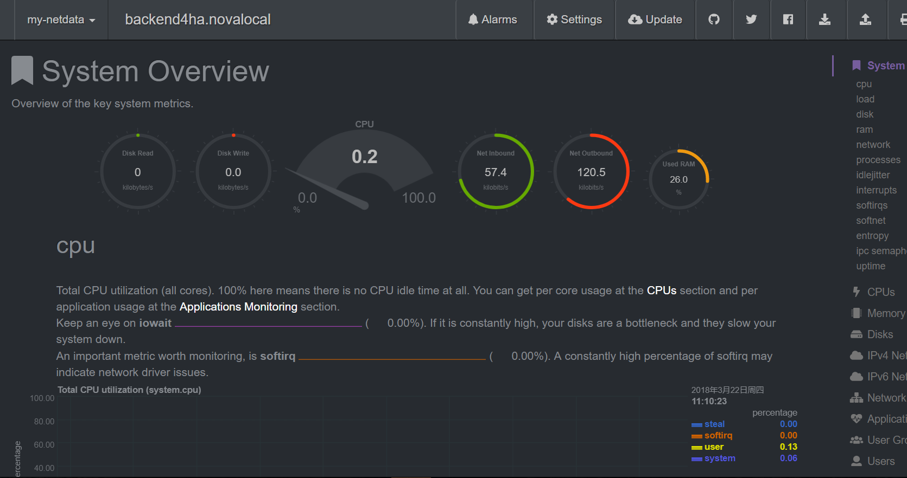
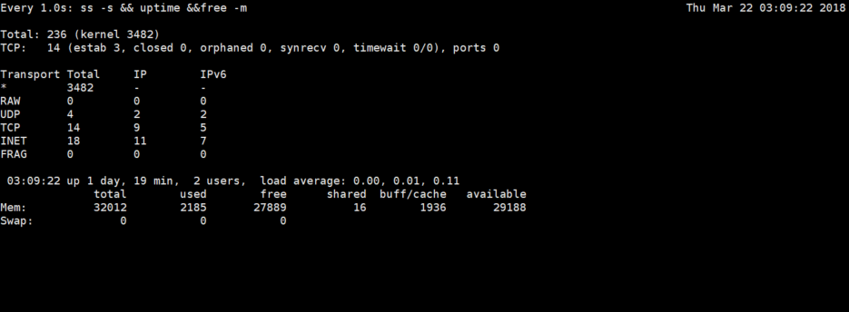
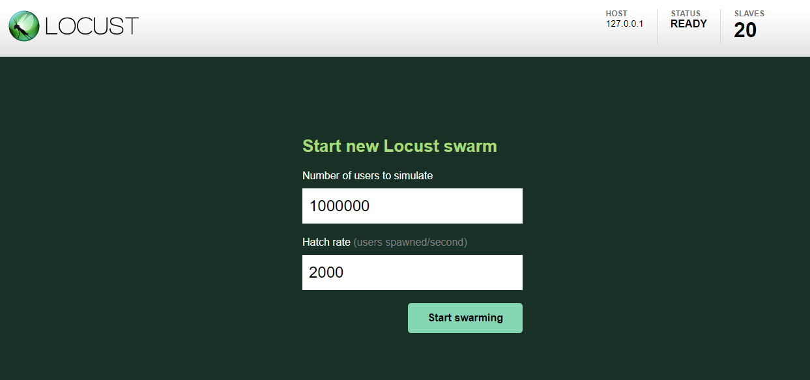
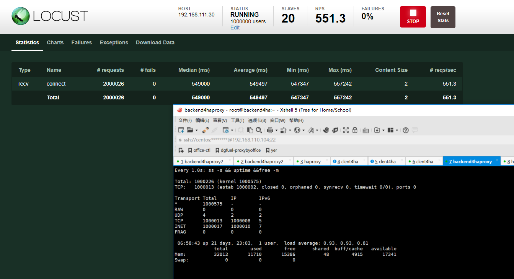
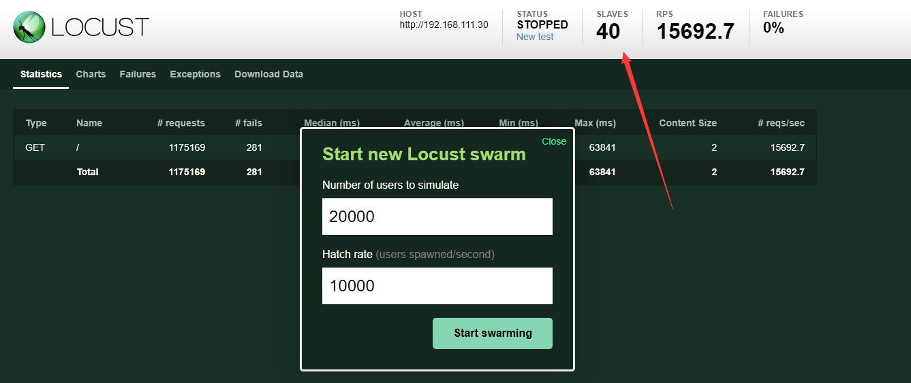
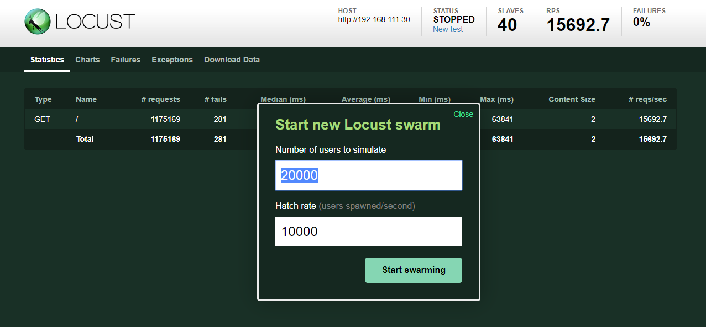
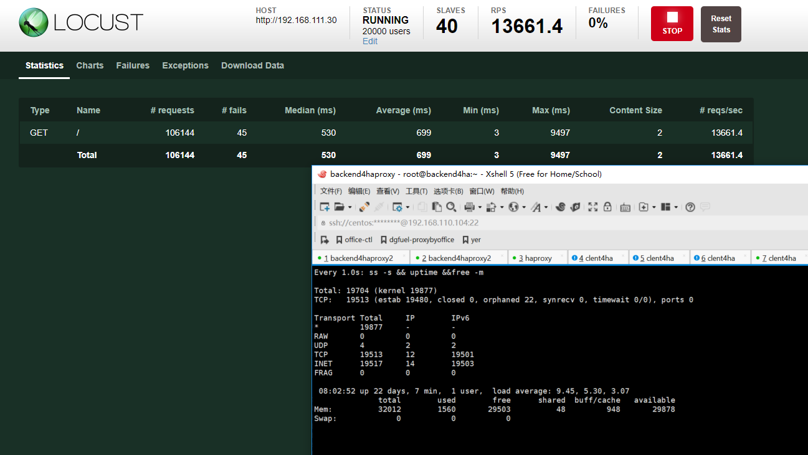
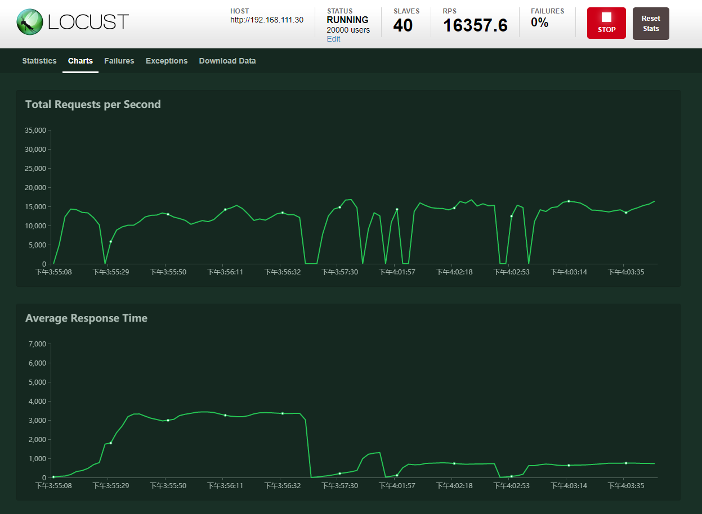

## 前言
都说haproxy很牛x, 可是测试的结果实在是不算满意, 越测试越失望,无论是长连接还是并发, 但是测试的流程以及工具倒是可以分享分享。也望指出不足之处。


本文有两个难点,我算不上完全解决。
- 后端代码的性能.
- linux内核参数的优化.


## 环境说明
下面所有的测试机器都是基于openstack云平台，kvm虚拟化技术创建的云主机。

由于一个socket连接一般占用8kb内存，所以百万连接至少需要差不多8GB内存.

建立长连接主要是需要内存hold住内存，理论上只需要内存就足够了，不会消耗太多cpu资源, 相对内存而言.

而并发则对cpu很敏感，因为需要机器尽可能快的处理客户端发起的连接。

> 本文的并发主要指**每秒**处理的请求.


### 硬件配置

类型 | 配置 | 数量
---|---|---
后端 | 16核32GB | 1
客户端 | 2核4GB | 21

### 软件配置
类型 | 长连接 | 并发
---|---|---
后端 | python && gevent | golang
客户端 | locust && pdsh | locust & pdsh

### IP地址
haproxy 192.168.111.111
client-master 192.168.111.31
client-slave 192.168.111.1[13-32]


## 测试步骤

### 系统调优
- 最大文件打开数
- 进程数
- socket设置

#### 客户端

在/etc/sysctl.conf加入以下内容

```
# 系统级别最大打开文件
fs.file-max = 100000

# 单用户进程最大文件打开数
fs.nr_open = 100000

# 是否重用, 快速回收time-wait状态的tcp连接
net.ipv4.tcp_tw_reuse = 1
net.ipv4.tcp_tw_recycle = 1

# 单个tcp连接最大缓存byte单位
net.core.optmem_max = 8192

# 可处理最多孤儿socket数量，超过则警告，每个孤儿socket占用64KB空间
net.ipv4.tcp_max_orphans = 10240

# 最多允许time-wait数量
net.ipv4.tcp_max_tw_buckets = 10240

# 从客户端发起的端口范围,默认是32768 61000，则只能发起2w多连接，改为一下值，可一个IP可发起差不多6.4w连接。
net.ipv4.ip_local_port_range = 1024 65535
```

在/etc/security/limits.conf加入以下内容

```
# 最大不能超过fs.nr_open值, 分别为单用户进程最大文件打开数，soft指软性限制,hard指硬性限制
* soft nofile 100000
* hard nofile 100000
root soft nofile 100000
root hard nofile 100000
```


#### 服务端

在/etc/sysctl.conf加入以下内容

```
# 系统最大文件打开数
fs.file-max = 20000000

# 单个用户进程最大文件打开数
fs.nr_open = 20000000

# 全连接队列长度,默认128
net.core.somaxconn = 10240
# 半连接队列长度，当使用sysncookies无效，默认128
net.ipv4.tcp_max_syn_backlog = 16384
net.ipv4.tcp_syncookies = 0

# 网卡数据包队列长度  
net.core.netdev_max_backlog = 41960

# time-wait 最大队列长度
net.ipv4.tcp_max_tw_buckets = 300000

# time-wait 是否重新用于新链接以及快速回收
net.ipv4.tcp_tw_reuse = 1  
net.ipv4.tcp_tw_recycle = 1

# tcp报文探测时间间隔, 单位s
net.ipv4.tcp_keepalive_intvl = 30
# tcp连接多少秒后没有数据报文时启动探测报文
net.ipv4.tcp_keepalive_time = 900
# 探测次数
net.ipv4.tcp_keepalive_probes = 3

# 保持fin-wait-2 状态多少秒
net.ipv4.tcp_fin_timeout = 15  

# 最大孤儿socket数量,一个孤儿socket占用64KB,当socket主动close掉,处于fin-wait1, last-ack
net.ipv4.tcp_max_orphans = 131072  


# 每个套接字所允许得最大缓存区大小
net.core.optmem_max = 819200

# 默认tcp数据接受窗口大小
net.core.rmem_default = 262144  
net.core.wmem_default = 262144  
net.core.rmem_max = 16777216  
net.core.wmem_max = 16777216

# tcp栈内存使用第一个值内存下限, 第二个值缓存区应用压力上限, 第三个值内存上限, 单位为page,通常为4kb
net.ipv4.tcp_mem = 786432 4194304 8388608
# 读, 第一个值为socket缓存区分配最小字节, 第二个，第三个分别被rmem_default, rmem_max覆盖
net.ipv4.tcp_rmem = 4096 4096 4206592
# 写, 第一个值为socket缓存区分配最小字节, 第二个，第三个分别被wmem_default, wmem_max覆盖
net.ipv4.tcp_wmem = 4096 4096 4206592
```


在/etc/security/limits.conf加入一下内容

```
# End of file
root      soft    nofile          2100000
root      hard    nofile          2100000
*         soft    nofile          2100000
*         hard    nofile          2100000

```


重启使上述内容生效
不愿意重启就使用以下命令
```
sysctl -p
```

#### 宿主机
一般宿主机都会启用防火墙，所以防火墙会记录每一条tcp连接记录，所以如果当虚拟机建立的tcp数量超过宿主机的防火最大记录数,则会drop掉后来的tcp.主要通过/etc/sysctl.conf下的这个配置项。


```
# 将连接改为200w+以满足单机100w长连接.
net.nf_conntrack_max=2048576
```


### 测试工具选取
#### locust

一个用python编写的非常出色的测试框架，满足大多数测试场景.内置http client, 可自定义client, 支持水平扩展.

下载安装参考: [https://docs.locust.io/en/latest/index.html](https://docs.locust.io/en/latest/index.html)

#### pdsh

用于调试启动多个locust客户端以及一些批量操作.

下载安装使用参考:
https://github.com/chaos/pdsh

http://kumu-linux.github.io/blog/2013/06/19/pdsh/


### server脚本编写
长连接通过tcp协议测试, 借助gevent框架.

脚本如下

```
#coding: utf-8
from __future__ import print_function
from gevent.server import StreamServer
import gevent

# sleeptime = 60


def handle(socket, address):
    # print(address)
    # data = socket.recv(1024)
    # print(data)
    while True:
        gevent.sleep(sleeptime)
        try:
            socket.send("ok")
        except Exception as e:
            print(e)


if __name__ == "__main__":
    import sys
    port = 80
    if len(sys.argv) > 2:
        port = int(sys.argv[1])
        sleeptime = int(sys.argv[2])
    else:
        print("需要两个参数!!")
        sys.exit(1)
    # default backlog is 256
    server = StreamServer(('0.0.0.0', port), handle, backlog=4096)
    server.serve_forever()


```


并发通过http协议测试，借助golang, 因为golang可以充分利用多核且效率高.
脚本如下


```
package main

import (
	// "fmt"
	"io"
	"log"
	"net/http"
	"os"
	"time"
)

type myHandler struct{}

func (*myHandler) ServeHTTP(w http.ResponseWriter, r *http.Request) {
	// time.Sleep(time.Second * 1)
	io.WriteString(w, "ok")
}

func main() {
	var port string
	port = ":" + os.Args[1]

	srv := &http.Server{
		Addr:         port,
		Handler:      &myHandler{},
		ReadTimeout:  30 * time.Second,
		WriteTimeout: 30 * time.Second,
	}

	log.Fatal(srv.ListenAndServe())
}

```


### client脚本编写
长连接脚本


```
#coding: utf-8
import time
from gevent import socket
from locust import Locust, TaskSet, events, task


class SocketClient(object):
    """
    Simple, sample socket client implementation that wraps xmlrpclib.ServerProxy and
    fires locust events on request_success and request_failure, so that all requests
    gets tracked in locust's statistics.
    """

    def __init__(self):
        self._socket = socket.socket(socket.AF_INET, socket.SOCK_STREAM)
        self.__connected = False

    def __getattr__(self, name):
        skt = self._socket

        def wrapper(*args, **kwargs):
            start_time = time.time()
            if not self.__connected:
                try:
                    skt.connect(args[0])
                    self.__connected = True
                except Exception as e:
                    total_time = int((time.time() - start_time) * 1000)
                    events.request_failure.fire(request_type="connect", name=name, response_time=total_time, exception=e)
            else:
                try:
                    data = skt.recv(1024)
                    # print(data)
                except Exception as e:
                    total_time = int((time.time() - start_time) * 1000)
                    events.request_failure.fire(request_type="recv", name=name, response_time=total_time, exception=e)
                else:
                    total_time = int((time.time() - start_time) * 1000)
                    if data == "ok":
                        events.request_success.fire(request_type="recv", name=name, response_time=total_time, response_length=len(data))
                    elif len(data) == 0:
                        events.request_failure.fire(request_type="recv", name=name, response_time=total_time, exception="server closed")
                    else:
                        events.request_failure.fire(request_type="recv", name=name, response_time=total_time, exception="wrong data: {}".format(data))

        return wrapper


class SocketLocust(Locust):
    """
    This is the abstract Locust class which should be subclassed. It provides an XML-RPC client
    that can be used to make XML-RPC requests that will be tracked in Locust's statistics.
    """

    def __init__(self, *args, **kwargs):
        super(SocketLocust, self).__init__(*args, **kwargs)
        self.client = SocketClient()


class SocketUser(SocketLocust):
    # 目标地址
    host = "192.168.111.30"
    # 目标端口
    port = 80
    min_wait = 100
    max_wait = 1000

    class task_set(TaskSet):
        @task(1)
        def connect(self):
            self.client.connect((self.locust.host, self.locust.port))

```


并发脚本


```
#coding: utf-8
from __future__ import print_function
from locust import HttpLocust, TaskSet, task


class WebsiteUser(HttpLocust):
    host = "http://192.168.111.30"
    # 目标端口
    port = 80
    min_wait = 100
    max_wait = 1000

    class task_set(TaskSet):
        @task(1)
        def index(self):
            self.client.get("/")

```


### 监控工具选择
netdata

通过本工具可以直观的感受到系统的各项指标的变化

效果图如下




下载安装参考:https://github.com/firehol/netdata/wiki/Installation


本机脚本

```
watch -n 1 "ss -s && uptime &&free -m"
```

简单查看本机连接数，负载，内存情况。

效果图如下




### 长连接测试步骤

#### 启动客户端
- locust master

```
locust -f /root/loadtest/socket_load_backend.py --master
```


- locust slave

```
pdsh -w 192.168.111.1[13-32] "locust -f /root/loadtest/socket_load_backend.py --slave --master-host=192.168.111.31"
```

> 注意: 在slave端一样需要又socket_load_backend.py文件.

#### 启动后端

```
nohup python /root/loadtest/tcpserver.py 80 550 &> /var/log/tcpserver1.log &
```

#### 开始测试
登陆locust的web页面: http://192.168.111.31:8089


开始参数如下.



Number of users to simulate
代表最终创建多少的用户.

Hatch rate (users spawned/second)代表每秒创建多少的用户

> 由上图可知，每秒2000个用户数增长，增长大盘100w需要500秒，所以在后端每个连接保持550秒，以保证至少550秒内达到100w连接.当建立一百万用户以后就会每隔一段时间执行自定义的任务,时间间隔在min_wait与max_wait时间范围内.

#### 测试结果




从面结果可以看出,一共完成了200w左右的请求, 每秒请求数量差不多在1800左右.然后负载在1左右,说明cpu资源差不多达到了100%.因为这里的后端是单进程的.再者内存使用量在11GB左右,还算合理.


### 并发测试步骤

#### 启动客户端
- locust master

```
locust -f /root/loadtest/http_load_backend.py --master
```
 

- locust slave

```

pdsh -w 192.168.111.1[13-32] "locust -f /root/loadtest/http_load_backend.py --slave --master-host=192.168.111.31"

# 多新建一个终端再次执行以下命令,因为它是单线程的,所以启动的数量一般与cpu个数相等,而上面的长连接消耗的主要是内存,所以不需要多启动一倍的客户端
pdsh -w 192.168.111.1[13-32] "locust -f /root/loadtest/http_load_backend.py --slave --master-host=192.168.111.31"

```
启动后可以发现有40个slave,效果如下.




#### 启动后端

```
nohup go run go/src/server.go 80 &> /var/log/goServer.log &
```


#### 开始测试
注意这地方的测试应该是1w 1.5w 2w的数量依次的往上加,即,第一次user用户数填10000,Hatch rate填10000,然后依次分别增加.

这里就贴最终的结果了.



#### 测试结果





从面结果可以看出,一共完成了10w左右的请求, 每秒请求数量差不多在16000左右.然后负载在9左右,远远没有想想中的强势...其中主要受两方面限制, 一是内核参数, 再者就是宿主机性能的限制.

而性能调优暂时不在这篇文章内容内,主要是积累还不够.再者本文主要是测试.


## 总结
之所以想写一篇大数量级的测试方式，是因为，网上大多数文章要么是给测试代码或者工具，要么是给一堆解释的不是很清楚的参数,再者就是只贴连接数的数量，如果只是达到这么多的连接，却不给出成功失败率，实在是有点耍流氓。

有意思的是这么强势的测试框架居然相关内容这么少,有空读读源码.

### 最后的最后


参考文档:
Linux之TCPIP内核参数优化:
https://www.cnblogs.com/fczjuever/archive/2013/04/17/3026694.html


理解 Linux backlog/somaxconn 内核参数:
https://jaminzhang.github.io/linux/understand-Linux-backlog-and-somaxconn-kernel-arguments/

Linux下Http高并发参数优化之TCP参数:
https://kiswo.com/article/1017

单台服务器百万并发长连接支持:
http://blog.csdn.net/mawming/article/details/51941771

结合案例深入解析orphan socket产生与消亡：
https://m.aliyun.com/yunqi/articles/91966
