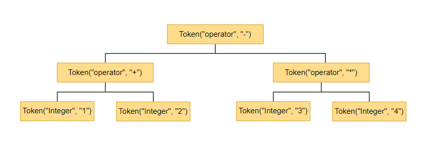
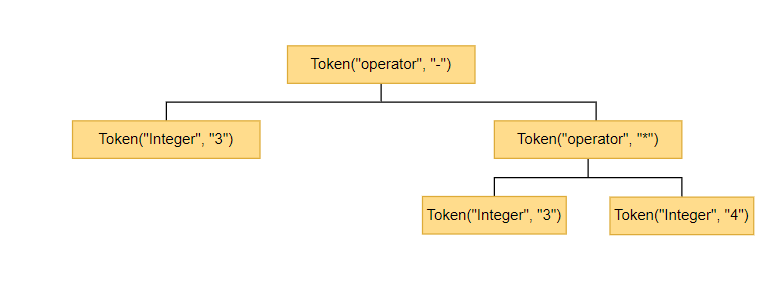
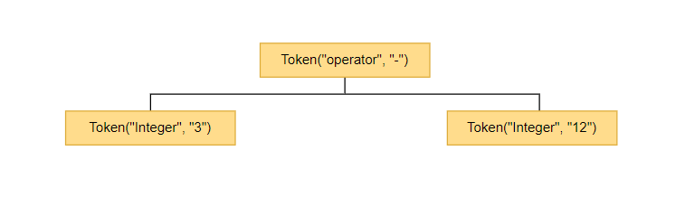

## 前言
如果你会编译原理，对其中的词法分析算法，语法分析算法足够了解，那么用什么语言来做这样的一件事情都是可以的，之所以使用Python只是因为本人会的编程语言中, Python的使用时间最长，也最得心应手。所谓性能什么的不在本文的考虑范围内, 本文主要重点是语法分析的表达式的解析，语法解析使用的是普拉特分析法，一种自顶向下的语法解析方法。


文章目录如下:
- 四则运算的问题
- 词法分析
- 语法分析与解释执行
- 参考链接
- 后记
- 这有什么用
- 源代码


## 四则运算的问题
怎么解决让代码算出以下解决结果?(假设问题代码保存文1.txt)
```
1 + 2 * 3 - 4 / 5 
```
不用语法分析, 最简答的解决办法就是
```

with open("1.txt") as rf:
    print(eval(rf.read()))
# 输出结果 6.2
```
那么如果是以下面的代码呢?(假设问题代码保存文2.txt)
```
add(1, add(1,2))
```
不用语法分析, 最简单的解决办法是
```
def add(a, b):
    return a + b
    
with open("2.txt") as rf:
    print(eval(rf.read()), dict(add=add))
# 输出结果
4 {'add': <function add at 0x0000013E8033AD90>}
```
如果要求加法的优先级大于乘法呢？就是说先加后乘,比如1+2*3=9而不是正常情况下的准确答案7。理论上可以通过重载python的加减乘除来解决这个问题，但是这里就不研究这个方法了，这个问题就留在文章的末尾解决吧。

> PS: 怎么可能会有这么坑爹的需求？作为程序猿遇到的坑爹需求还少么？

总的来说上面的解决办法总是差点意思，我们没有更深入的研究它的语法结构，也就没办法获得更多的控制权。

## 词法分析
词法分析就是讲文本里面的代码分成一个个最小的组成部分, 这个最小的组成部分大家称之为Token.

什么是token呢？首先看下面的python代码。
```
1+2*3
```
如果通过词法分析处理，那么上面的代码大概是这样的表示
```
Token("整型数字", "1") Token("运算符", "+") Token("整型数字", 2) Token("运算符", "*") Token("整型数字", "3")
```
所以1,2,3分别是一个Token, +,*分别也是一个Token。


> PS: 一个抽象的东西总喜欢用抽象的名词来解释。


### 语法定义
这里主要分析一种语法的结构。
1. 四则运算的表达式

> 四则表达式虽然看起来很简单，但是应该算的上是编译原理中一个比较难的部分了吧，主要是算数优先级的问题。

首先定义基本组成元素:

1. 数字: 只能由整型组成, 比如: 111, 123123
3. 加减乘除: 分别对于符号 + - * /


四则运算的表达式定义如下:

```
1. 数字
2. 数字(加减乘除 数字)*

# 加减乘除代表+-*/中的任意一个算术符, （加减乘除 数字)+代表+ 1或者 * 2 这样的结构能够重复一到无数次
# 比如: 1 或者 1 + 2 或者 1+2+3
```

> PS: 对于这种语法的定义有一种专门的语法来表示，叫做BNF, 如果本文用BNF来说明就是两个问题了，所以这里就用中文来表示了。毕竟本文是从无到有系列，如果我的解释，定义看不懂可以学习一下BNF，在回来看应该就明白了。


所以本文中以下语法是合法的:
```
1+2-3*412/53
12
1-4
```

以下语法是不合法的:
```
1 +
* 1
1+2+
```

### 实现原理
以下面代码为例。
```
1 + 2 - 3 *  4  /     5
```
通过对上面的语法定义，以及对代码的观察，我们可以总结出以下两点:
1. 代码里面的空格对语法没有没有任何意义，所以我们应该忽略代码中的空格。
2. 数字可能是单个或者多个整数组成，这意味着我们需要判断下一个字符是不也是数字。


### 代码实现
```
# -*- coding: utf-8 -*-
from __future__ import print_function
import string
from collections import namedtuple

# 定义一个namedtuple类型的Token类型用于表示Token
Token = namedtuple("Token", ["type", "value"])


class Lexer(object):
    # 所有整型数字
    numbers = set(map(str, range(10)))
    # {'2', '9', '1', '0', '6', '3', '7', '5', '8', '4'}
    
    # 所有大小写英文字母
    letters = set(string.ascii_letters)
    # {'W', 'b', 'g', 'a', 'V', 'G', 'h', 'I', 'N', 'X', 'S', 'r', 'e', 'M', 'p', 'F', 'O', 'Z', 't', 'j', 'q', 'L', 'd', 'J', 'R', 'k', 'Y', 'D', 's', 'K', 'o', 'x', 'u', 'A', 'H', 'T', 'i', 'w', 'm', 'n', 'v', 'f', 'C', 'y', 'c', 'E', 'Q', 'P', 'l', 'B', 'z', 'U'}
    
    # 加减乘除
    ADD = "+"
    SUB = "-"
    MUL = "*"
    DIV = "/"
    operators = set([ADD, SUB, MUL, DIV])
    
    # END OF FILE 表示文本终结的Token
    EOF = Token("EOF", "")

    def parse(self, text):
        self.tokens = []
        self.text = text
        self.cur_pos = 0
        self.cur_char = self.text[self.cur_pos]

        while self.cur_char is not self.EOF:
            if self.cur_char == " ":
                self.next()
                continue
            elif self.cur_char in self.numbers:
                token = self.read_integer()
            elif self.cur_char in self.operators:
                token = Token("operator", self.cur_char)
                self.next()
            else:
                raise "未知字符: %s" % self.cur_char

            self.tokens.append(token)

        # 加一个EOF是为了标识整段代码已经到尽头
        self.tokens.append(self.EOF)
        return self.tokens

    def next(self):
        """使当前字符的位置不断的向右移动"""
        self.cur_pos += 1
        if self.cur_pos >= len(self.text):
            self.cur_char = self.EOF
        else:
            self.cur_char = self.text[self.cur_pos]
    
    def read_integer(self):
        integer = self.cur_char
        self.next()
        while self.cur_char in self.numbers:
            integer += self.cur_char
            self.next()

        return Token("Integer", integer)


if __name__ == "__main__":
    text = "1 + 2"
    mylexer = Lexer()
    print("1+2")
    print(mylexer.parse("1+2"))
    print()
    print("3  *4/ 5")
    print(mylexer.parse("3  *4/ 5"))

```
程序输出如下:
```
1+2
[Token(type='Integer', value='1'), Token(type='operator', value='+'), Token(type='Integer', value='2'), Token(type='EOF', value='EOF')]

3  *4/ 5
[Token(type='Integer', value='3'), Token(type='operator', value='*'), Token(type='Integer', value='4'), Token(type='operator', value='/'), Token(type='Integer', value='5'), Token(type='EOF', value='EOF')]
```

至此，我们将代码分成了一个一个的Token.


## 语法分析
上面我们将要执行的代码分成了一个一个的Token,这一节要将这一个个的Token组成一颗语法树。以下面代码为例。

```
1 + 2 - 3 * 4
```
代码生成的语法树是这样的。




为什么要用一棵树来表示呢？因为树这样的结构可以将优先级的问题解决.

我们只要自下而上的依次执行，那么获得结果就是正确的优先级执行的结果。根据图中的树我们可以这样计算，先计算[Token(type='Integer', value='1'), Token(type='Integer', value='2'), 这两个Token的计算结果分别是1和2，然后将其与父节点，即Token(type='operator', value='+')结合，那么结果是下图



然后同理计算右边，得到结果如下



最后计算3 - 12，得到结果如下。


> 绘图软件来源: https://online.visual-paradigm.com/

### 代码实现
```
import operator


class Node(object):
    """表示语法树中的一个节点"""
    
    def eval(self):
        """子类应该实现的方法, 计算自身节点的方式"""
        # 不想写这句话用abc模块
        raise "需要子类实现"

    def repr(self):
        """子类应该实现的方法，用于数据展示"""
        raise "需要子类实现"
    
    def __str__(self):
        return self.repr()

    def __repr__(self):
        return self.repr()


class Interger(Node):
    """代表一个整数节点"""

    def __init__(self, token):
        self.token = token
    
    def eval(self):
        return int(self.token.value)

    def repr(self):
        return self.token.value


class OperatorExpression(Node):
    """代表一个算数表达式, 比如1+2"""
    operator_map = {
        "+": operator.add,
        "-": operator.sub,
        "*": operator.mul,
        "/": operator.truediv
    }
    
    def __init__(self, token, left, right):
        self.token = token
        self.op = self.operator_map[self.token.value]
        self.left = left
        self.right = right

    def eval(self):
        # 注意这里的left, right也可以是一个OperatorExpression，所以会递归调用
        return self.op(self.left.eval(), self.right.eval())

    def repr(self):
        # 注意这里的left, right也可以是一个OperatorExpression，所以会递归调用
        return "(" + self.left.repr() + self.token.value + self.right.repr() + ")"


class Parser(object):
    # 定义每个操作符的优先级，默认+-小于*/
    operator_precedence_map = {
        "EOF": 0,
        "+": 1,
        "-": 1,
        "*": 2,
        "/": 2,
    }

    def __init__(self, precedences=None):
        if precedences:
            self.operator_precedence_map = precedences
    
    def parse_infix_expression(self, token, left):
        """
        解析中序表达式
        
        中序表达式是指操作符在两个对象之间, 比如+-*/, 有中序自然还有前序及后续，但是这里不涉及
        """
        precedence = self.operator_precedence_map[token.value]
        # 这里会递归调用parse_expression,但是传入的precedence最2，所以不会进入while循环
        right = self.parse_expression(precedence)
        expr = OperatorExpression(token, left, right)

        return expr

    def parse_integer(self, token):
        return Interger(token)

    def parse_expression(self, precedence=0):
        current_token = self.next_token
        self.next_token = self.next()
        left_expr = self.parse_integer(current_token)

        # 默认的precedence是0，所以当下一个token是+-*/的时候都会进入while循环，将表达式进行左结合，不断的递归
        # 而最后到EOF的时候，EOF的优先级是0, 所以导致while循环终止，返回最终的表达式
        while precedence < self.operator_precedence_map[self.next_token.value]:
            current_token = self.next_token
            self.next_token = self.next()

            left_expr = self.parse_infix_expression(current_token, left_expr)
        return left_expr

    def next(self):
        return next(self.iter_tokens)

    def parse(self, tokens):
        self.tokens = tokens
        self.iter_tokens = iter(tokens)
        self.next_token = self.next()
        return self.parse_expression()

    def eval(self, expression):
        return expression.eval()


if __name__ == "__main__":
    from xlexer import Lexer
    text = "1 + 2 - 3 * 4 / 5"
    mylexer = Lexer()
    myparser = Parser()
    tokens = mylexer.parse(text)
    expr = myparser.parse(tokens)
    print(expr)
    print(myparser.eval(expr))

```
输出如下:
```
((1+2)-((3*4)/5))
0.6000000000000001
```

现在让我们回到文章开始的问题，如果+-的优先级大于*/怎么让其实现，

我们只需要传入一个我们自定义的优先级字典。代码如下
```
custom_precedences = {
        "+": 2,
        "-": 2,
        "*": 1,
        "/": 1,
    }

if __name__ == "__main__":
    from xlexer import Lexer
    from xparser import Parser

    text = "1 + 2 - 3 * 4 / 5"
    mylexer = Lexer()
    myparser = Parser(custom_precedences)
    tokens = mylexer.parse(text)
    expr = myparser.parse(tokens)
    print(expr)
    print(myparser.eval(expr))

```
输出结果如下
```
((((1+2)-3)*4)/5)
0.0
```
"1 + 2 - 3 * 4 / 5"正确答案的是0.6, 但是将优先级调换后，结果变成了0，符合预期。


## 参考链接
1. https://study.163.com/course/courseMain.htm?courseId=1004632002      
   这个不是我的课程, 该课程的作者是使用的JavaScript完成词法分析，语法分析，语法解析运行的。我是学了这个教程才有的这篇文章。
2. https://github.com/cameronp98/pratt   
   一个普拉特解析法的Python实现，该作者实在是惜字如金，写得太短小精悍了。


## 这有什么用?
主要的用处集中在特定语法组成的代码分析及转换，语法可能是特定编程语言的语法，也可能是某个工具的DSL(领域特定语言).我暂时能想到的就下面两个，用到的只有第二个，第三个。

1. 编程语言的翻译   
   通过构造指定编程语言的语法分析器，进行编程语言之间的转换，翻译, 虽然整套语言的翻译或者说完全的兼容很难，但是代码的片段不会太难。
2. 代码片段的生成   
   和翻译大体相同，不过侧重于生成代码片段，比如一些DSL，jenkins的pipeline语法。
3. 代码片段的格式化
   将代码片段按照一定的标准进行缩进
4. 代码的语法检查


## 后记
表达式的解析应该是最难的部分了。

后面可能会完成这个系列吧，定义一套完整的语法，然后完成该语法的词法分析，语法分析，语法执行。

一套完整的语法应该包括赋值语句，控制结构，如if，while，函数定义及调用，如果需要面向对象则还需要类。

其实除了解释执行还可以将代码通过继承编译工具编译成二进制执行文件，这样子就像一个编译语言了，不过这是后话了

其实通过学习编译原理，可以增加一种看待编程语法的角度，在各个编程语言之间游刃有余，应该会更快的学会一门之前没接触过的编程语言吧。


## 源代码
https://github.com/youerning/blog/tree/master/new_program


如果期待后续文章可以关注我的同名微信公众号，同名头条号，github。
