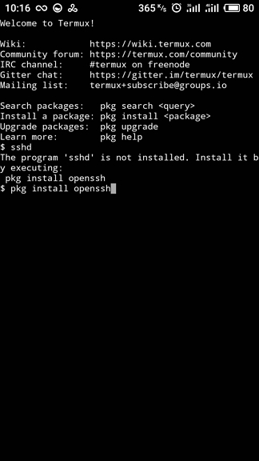
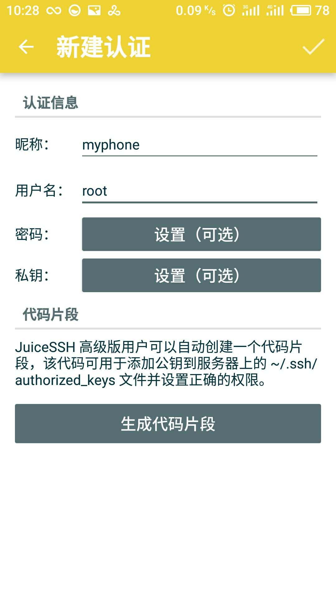
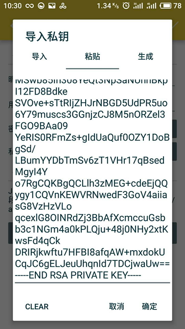
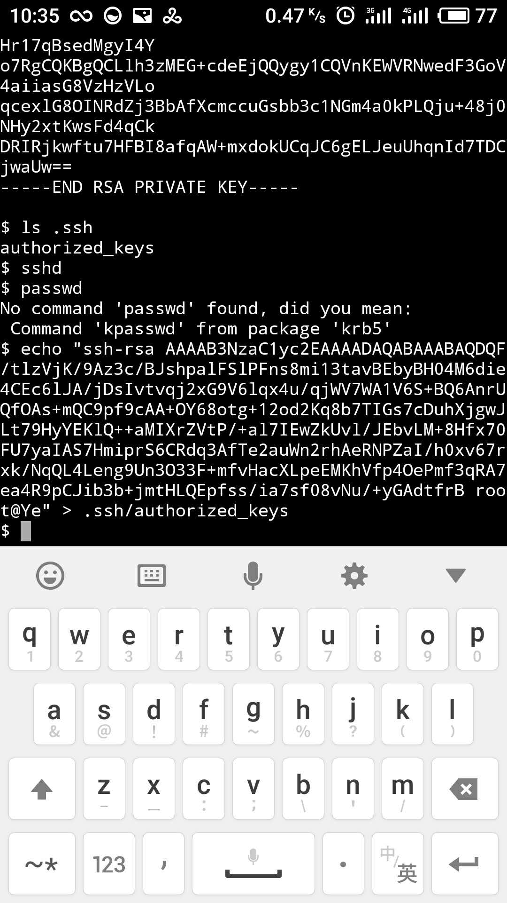

这里的手机指安卓机。
大家都知道安卓机用的是Linux内核，所以理论上Linux可做的事情，手机都能做，下面列举一些有意思的事情。


**必备技能**: 会Linux。


## 安装Linux发行版
其实这个比较简单，只需装一个App, 但是有些技巧可以讲讲。

**所需材料**
- 安卓手机 必须
- 拥有公网IP的机器  非必须
- 无限流量卡 非必须
- root权限 必须

### Root
root手机根据手机信号的不同，会有不同的办法，所以这里就不细讲，请自行百度，或google.

### 安装linux deploy
通过某个应用市场下载并安装

### 在线安装
在线安装是比较扯淡的，因为在国内实在是比较慢的，原因你懂的。

### 离线安装
通过以下地址可下载自己所需的镜像
[http://sourceforge.net/projects/linuxonandroid/files/ ](http://sourceforge.net/projects/linuxonandroid/files/ )

用户名/密码:android/changeme

推荐安装ssh客户端: JuiceSSH

最好的安卓ssh客户端,没有之一。

## 个人网站
其实这个这个章节有点泛指的意思，任何你觉得需要在公网上能做的事情，都可以在内网完成，因为在内网里面你可能有旧电脑，旧服务器，旧手机。一切被限制在内网的资源(有内存，cpu。)

**所需材料**
- 安卓手机 必须
- 拥有公网IP的机器  非必须
- 无限流量卡 非必须
- root权限 非必须


### 系统环境
这里的环境你可以用上面的Linux deploy部署的Linux环境也可以使用下面要说的方式，不同的在于下面的方式不需要root

#### Linux deploy
如上

#### termux
通过某的应用商店下载并安装
安装JucieSSH

> 之所以不用termux自带的shell环境，是因为较于JuiceSSH来说，实在时太难用了。

##### 安装openssh
打开termux后，在终端输入pkg install sshd以安装openssh




执行sshd命令启动sshd，这样就可以通过其他ssh客户端连接了，但是默认只能用密钥登陆

##### 使用JuiceSSH连接
1. 首先在电脑端，通过ssh命令生成密钥,然后将公钥私钥的文本传到手机.

2. 在打开JucieSSH之后，依次点击
连接 ->  认证  -> 点击认证页面下面左下角的"+".

3. 昵称，用户名可随便填，然后点击私钥。如下图所示




4. 粘贴第一步生成的密钥。如下图所示



5. 最后点击完成

6.在termux中导入公钥。如下图所示



7.使用JucieSSH连接.在JuiceSSH中新建连接，如下图所示


8.点击新建的连接，连接成功后，如下图

##### 使用电脑连接
只要保障在同一局域网，然后用上面生成的私钥连接即可


#### 总结
准备好环境后，你就可以使用termux做linux下几乎所有可做的事情了，比如安装python,golang,nodejs等开发环境，以及一些其他的软件。

termux比较易用，但是前面的连接实在时比较麻烦，上面是我的连接办法，如果有更好的连接办法还望告知。


### 内网穿透
由于众所周知的原因，大多数时候家庭网络都是不会分配公网IP的，所以我们需要一些手段得到能够从公网访问的路径。下面介绍三种。我主要说第三种。

####  NATAPP
这是一个专门做内网穿透服务的网站，有免费服务，不过需要实名认证。

地址如下

https://natapp.cn/

#### ngrok
这个应该时比较出名的内网穿透方式了，可是由于服务器在国外，再者是免费的，所以可能不稳地以及延迟大。


#### frp
这个是属于比较新起之秀了，但是门槛较之上面两种，比较高。
需要一个有公网IP的服务器，可以使用云服务器或者及其便宜的vps。

项目地址:https://github.com/fatedier/frp


### 网站搭建
其实看到这里你也许会有疑问，我有公网服务器或者云主机，为啥还要用手机呢。主要有以下两点

1. 如果是便宜的vps，可能内存只有256MB或者192MB, 因为我们主要需要的是公网IP。但是很多手机内存都是1GB或者2GB甚至更高的。即，可以将负载高的东西放在本地，公网IP所在的服务器只是转发流量。

2. 这里只是一个抛砖引玉的示例，只要能内网穿透，你就可以将很多内网的东西放到内网了。


#### 软件环境
这里以golang web的hello world为例，你当然可以用其他任何的语言以及方式运行一个web服务。


##### 安装golang
在手机上执行pkg install golang

##### 创建程序软件
包含以下内容
```
package main

import (
	"fmt"
	"net/http"
)

func main() {
	http.HandleFunc("/", func(w http.ResponseWriter, r *http.Request) {
		fmt.Fprintf(w, "helo world")
	})

	http.ListenAndServe(":8088", nil)
}
```

##### 运行程序
go run main.go &

##### 浏览器访问http://<IP>:8088


### 映射公网地址到内网
分别下载服务器版本的frp以及安卓手机的frp

服务器如果是linux，就根据32或者64位下载相应以linux开头的frp，如frp_0.16.0_linux_386.tar.gz

安卓手机下载以arm结尾的frp版本，如
frp_0.16.0_linux_arm.tar.gz

下载地址:[https://github.com/fatedier/frp/releases](https://github.com/fatedier/frp/releases)


#### 配置服务端
创建配置文件web-server.conf
# frps.ini
[common]
bind_port = 7777
privilege_allow_ports = 60000-60105
privilege_token = secret.

[web]
type = tcp
auth_token = secret.
listen_port = 60000


#### 配置客户端
创建配置文件web-client.conf
[common]
server_addr = <Server-IP>
server_port = 7777
privilege_token = secret.

[web]
type = tcp
local_ip = 127.0.0.1
local_port = 8088
remote_port = 60000
sk = secret.

#### 运行
服务端
frps -c web-server.conf

客户端
frpc -c web-client.conf


> 这里只是一个展示，其实关于http转发有更多可以设置的细节，参考:https://github.com/fatedier/frp


## 爬虫代理
这里暂时还只是一个概念，有一个暂时没有克服的问题。相较于网上的一堆代理网站也不一定可行。

你也许不知道的是，每当你将手机设置飞行模式然后解除飞行模式，那么你的公网出口IP就会改变，所以如果通过某个IP能够调取手机开关飞行模式API，那么在手机上运行爬虫会是一个不错的选择，因为有大量的IP可切换,不怕被封IP。


**所需材料**
- 安卓手机 必须
- 拥有公网IP的机器  非必须
- 无限流量卡 必须
- root权限 非必须


## 其他想法
- 做一个私用的Pass平台。因为计算机内存资源主要用内网环境的，但是可以通过公网访问。
- 做一个下载器。
- 做一个私有云盘。
- 做一个....

## 总结
理论上在Linux上能做的事情，安卓手机上都能做。其实叫做Linux的威力也许更适合。

### 最后的最后
关注一下再走呗^_^


