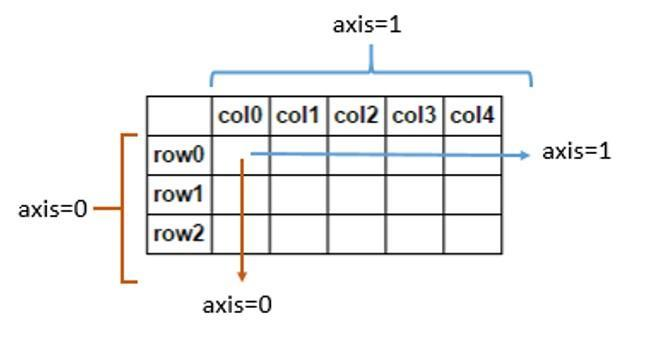
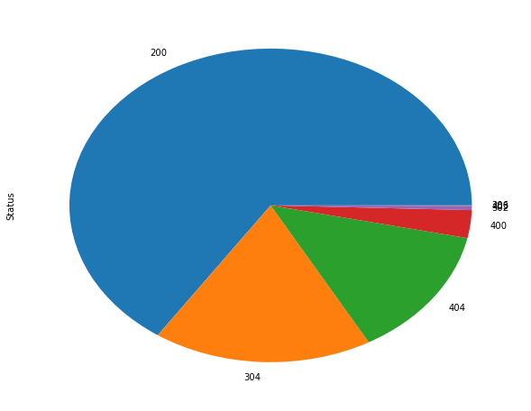
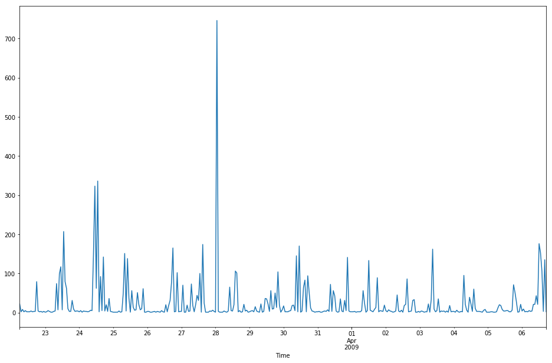
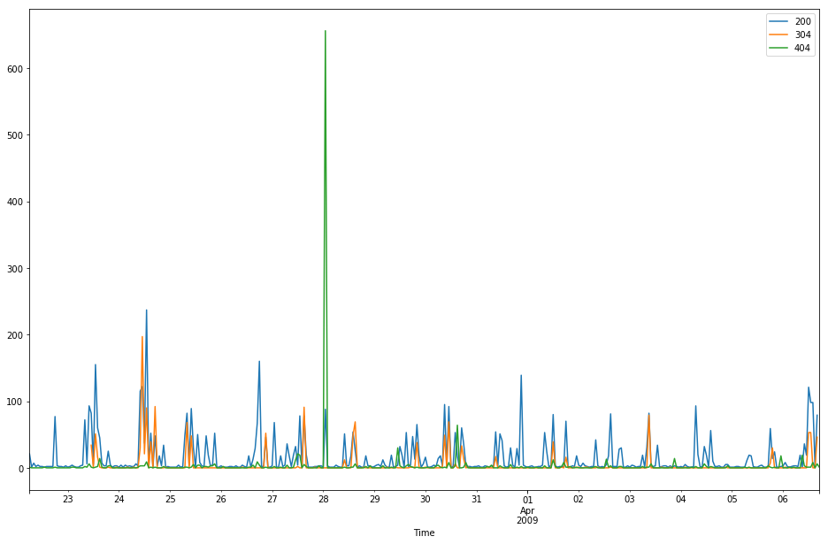

# pandas从入门到上楼
## 数据对象
pandas主要有两种数据对象
1. Series
2. DataFrame
> 注: 后面代码使用pandas版本0.20.1,通过import pandas as pd引入
### Series
Series是一种带有索引的序列对象
#### 创建方式
简单创建如下
```
# 通过传入一个序列给pd.Series初始化一个Series对象, 比如list
s1 = pd.Series(list("1234"))
print(s1)
0    1
1    2
2    3
3    4
dtype: object

```

### DataFrame
类似与数据库table有行列的数据对象
#### 创建方式如下
```
# 通过传入一个numpy的二维数组或者dict对象给pd.DataFrame初始化一个DataFrame对象

# 通过numpy二维数组
import numpy as np
df1 = pd.DataFrame(np.random.randn(6,4))
print(df1)
    0	1	2	3
0	-0.646340	-1.249943	0.393323	-1.561873
1	0.371630	0.069426	1.693097	0.907419
2	-0.328575	-0.256765	0.693798	-0.787343
3	1.875764	-0.416275	-1.028718	0.158259
4	1.644791	-1.321506	-0.337425	0.820689
5	0.006391	-1.447894	0.506203	0.977295

# 通过dict字典
df2 = pd.DataFrame({ 'A' : 1.,
                     'B' : pd.Timestamp('20130102'),
                     'C' : pd.Series(1,index=list(range(4)),dtype='float32'),
                     'D' : np.array([3] * 4,dtype='int32'),
                     'E' : pd.Categorical(["test","train","test","train"]),
                     'F' : 'foo' })
print(df2)

    A	B	C	D	E	F
0	1.0	2013-01-02	1.0	3	test	foo
1	1.0	2013-01-02	1.0	3	train	foo
2	1.0	2013-01-02	1.0	3	test	foo
3	1.0	2013-01-02	1.0	3	train	foo
```

### 索引
不管是Series对象还是DataFrame对象都有一个对对象相对应的索引, Series的索引类似于每个元素, DataFrame的索引对应着每一行
#### 查看
在创建对象的时候，每个对象都会初始化一个起始值为0，自增的索引列表, DataFrame同理

```
# 打印对象的时候，第一列就是索引
print(s1)
0    1
1    2
2    3
3    4
dtype: object

# 或者只查看索引, DataFrame同理
print(s1.index)
```

## 增删查改
这里的增删查改主要基于DataFrame对象
> 为了有足够数据用于展示，这里选择tushare的数据

tushare安装

```
pip install tushare
```

> 创建数据对象如下

```
import tushare as ts
df = ts.get_k_data("000001")

```

DataFrame 行列,axis 图解




### 查询

查看每列的数据类型


```
# 查看df数据类型
df.dtypes
date       object
open      float64
close     float64
high      float64
low       float64
volume    float64
code       object
dtype: object

```


查看指定指定数量的行

> head函数默认查看前5行,tail函数默认查看后5行，可以传递指定的数值用于查看指定行数
```
查看前5行
df.head()
	date	open	close	high	low	volume	code
0	2015-12-23	9.927	9.935	10.174	9.871	1039018.0	000001
1	2015-12-24	9.919	9.823	9.998	9.744	640229.0	000001
2	2015-12-25	9.855	9.879	9.927	9.815	399845.0	000001
3	2015-12-28	9.895	9.537	9.919	9.537	822408.0	000001
4	2015-12-29	9.545	9.624	9.632	9.529	619802.0	000001
# 查看后5行
df.tail()
	date	open	close	high	low	volume	code
636	2018-08-01	9.42	9.15	9.50	9.11	814081.0	000001
637	2018-08-02	9.13	8.94	9.15	8.88	931401.0	000001
638	2018-08-03	8.93	8.91	9.10	8.91	476546.0	000001
639	2018-08-06	8.94	8.94	9.11	8.89	554010.0	000001
640	2018-08-07	8.96	9.17	9.17	8.88	690423.0	000001
# 查看前10行
df.head(10)
    date	open	close	high	low	volume	code
0	2015-12-23	9.927	9.935	10.174	9.871	1039018.0	000001
1	2015-12-24	9.919	9.823	9.998	9.744	640229.0	000001
2	2015-12-25	9.855	9.879	9.927	9.815	399845.0	000001
3	2015-12-28	9.895	9.537	9.919	9.537	822408.0	000001
4	2015-12-29	9.545	9.624	9.632	9.529	619802.0	000001
5	2015-12-30	9.624	9.632	9.640	9.513	532667.0	000001
6	2015-12-31	9.632	9.545	9.656	9.537	491258.0	000001
7	2016-01-04	9.553	8.995	9.577	8.940	563497.0	000001
8	2016-01-05	8.972	9.075	9.210	8.876	663269.0	000001
9	2016-01-06	9.091	9.179	9.202	9.067	515706.0	000001
```

查看某一行或多行,某一列或多列

```
# 查看第一行
df[0:1]
    date	open	close	high	low	volume	code
0	2015-12-23	9.927	9.935	10.174	9.871	1039018.0	000001

# 查看 10到20行
df[10:21]
	date	open	close	high	low	volume	code
10	2016-01-07	9.083	8.709	9.083	8.685	174761.0	000001
11	2016-01-08	8.924	8.852	8.987	8.677	747527.0	000001
12	2016-01-11	8.757	8.566	8.820	8.502	732013.0	000001
13	2016-01-12	8.621	8.605	8.685	8.470	561642.0	000001
14	2016-01-13	8.669	8.526	8.709	8.518	391709.0	000001
15	2016-01-14	8.430	8.574	8.597	8.343	666314.0	000001
16	2016-01-15	8.486	8.327	8.597	8.295	448202.0	000001
17	2016-01-18	8.231	8.287	8.406	8.199	421040.0	000001
18	2016-01-19	8.319	8.526	8.582	8.287	501109.0	000001
19	2016-01-20	8.518	8.390	8.597	8.311	603752.0	000001
20	2016-01-21	8.343	8.215	8.558	8.215	606145.0	000001

# 查看看Date列前5个数据
df["date"].head() # 或者df.date.head()
0    2015-12-23
1    2015-12-24
2    2015-12-25
3    2015-12-28
4    2015-12-29
Name: date, dtype: object

# 查看看Date列,code列, open列前5个数据
df[["date","code", "open"]].head()
    date	code	open
0	2015-12-23	000001	9.927
1	2015-12-24	000001	9.919
2	2015-12-25	000001	9.855
3	2015-12-28	000001	9.895
4	2015-12-29	000001	9.545
```
使用行列组合条件查询

```
# 查看date, code列的第10行
df.loc[10, ["date", "code"]]

date    2016-01-07
code        000001
Name: 10, dtype: object

# 查看date, code列的第10行到20行
df.loc[10:20, ["date", "code"]]


    date	code
10	2016-01-07	000001
11	2016-01-08	000001
12	2016-01-11	000001
13	2016-01-12	000001
14	2016-01-13	000001
15	2016-01-14	000001
16	2016-01-15	000001
17	2016-01-18	000001
18	2016-01-19	000001
19	2016-01-20	000001
20	2016-01-21	000001

# 查看第一行,open列的数据
df.loc[0, "open"]
9.9269999999999996

```
通过==位置==查询
> 值得注意的是上面的索引值就是特定的位置

```
# 查看第1行()
df.iloc[0]
date      2015-12-24
open           9.919
close          9.823
high           9.998
low            9.744
volume        640229
code          000001
Name: 0, dtype: object

# 查看最后一行
df.iloc[-1]
date      2018-08-08
open            9.16
close           9.12
high            9.16
low              9.1
volume         29985
code          000001
Name: 640, dtype: object


# 查看第一列，前5个数值
df.iloc[:,0].head()
0    2015-12-24
1    2015-12-25
2    2015-12-28
3    2015-12-29
4    2015-12-30
Name: date, dtype: object

# 查看前2到4行，第1，3列
df.iloc[2:4,[0,2]]

date	close
2	2015-12-28	9.537
3	2015-12-29	9.624
```
通过条件筛选

```
查看open列大于10的前5行
df[df.open > 10].head()


    date	open	close	high	low	volume	code
378	2017-07-14	10.483	10.570	10.609	10.337	1722570.0	000001
379	2017-07-17	10.619	10.483	10.987	10.396	3273123.0	000001
380	2017-07-18	10.425	10.716	10.803	10.299	2349431.0	000001
381	2017-07-19	10.657	10.754	10.851	10.551	1933075.0	000001
382	2017-07-20	10.745	10.638	10.880	10.580	1537338.0	000001

# 查看open列大于10且open列小于10.6的前五行
df[(df.open > 10) & (df.open < 10.6)].head()

	date	open	close	high	low	volume	code
378	2017-07-14	10.483	10.570	10.609	10.337	1722570.0	000001
380	2017-07-18	10.425	10.716	10.803	10.299	2349431.0	000001
387	2017-07-27	10.550	10.422	10.599	10.363	1194490.0	000001
388	2017-07-28	10.441	10.569	10.638	10.412	819195.0	000001
390	2017-08-01	10.471	10.865	10.904	10.432	2035709.0	000001

# 查看open列大于10或open列小于10.6的前五行
df[(df.open > 10) | (df.open < 10.6)].head()


    date	open	close	high	low	volume	code
0	2015-12-24	9.919	9.823	9.998	9.744	640229.0	000001
1	2015-12-25	9.855	9.879	9.927	9.815	399845.0	000001
2	2015-12-28	9.895	9.537	9.919	9.537	822408.0	000001
3	2015-12-29	9.545	9.624	9.632	9.529	619802.0	000001
4	2015-12-30	9.624	9.632	9.640	9.513	532667.0	000001
```
### 增加
在前面已经简单的说明Series, DataFrame的创建,这里说一些常用有用的创建方式


```
# 创建2018-08-08到2018-08-15的时间序列，默认时间间隔为Day
s2 = pd.date_range("20180808", periods=7)
print(s2)

DatetimeIndex(['2018-08-08', '2018-08-09', '2018-08-10', '2018-08-11',
               '2018-08-12', '2018-08-13', '2018-08-14'],
              dtype='datetime64[ns]', freq='D')

# 指定2018-08-08 00：00 到2018-08-09 00:00 时间间隔为小时
# freq参数可使用参数, 参考: http://pandas.pydata.org/pandas-docs/stable/timeseries.html#offset-aliases
s3 = pd.date_range("20180808", "20180809", freq="H")
print(s2)

DatetimeIndex(['2018-08-08 00:00:00', '2018-08-08 01:00:00',
               '2018-08-08 02:00:00', '2018-08-08 03:00:00',
               '2018-08-08 04:00:00', '2018-08-08 05:00:00',
               '2018-08-08 06:00:00', '2018-08-08 07:00:00',
               '2018-08-08 08:00:00', '2018-08-08 09:00:00',
               '2018-08-08 10:00:00', '2018-08-08 11:00:00',
               '2018-08-08 12:00:00', '2018-08-08 13:00:00',
               '2018-08-08 14:00:00', '2018-08-08 15:00:00',
               '2018-08-08 16:00:00', '2018-08-08 17:00:00',
               '2018-08-08 18:00:00', '2018-08-08 19:00:00',
               '2018-08-08 20:00:00', '2018-08-08 21:00:00',
               '2018-08-08 22:00:00', '2018-08-08 23:00:00',
               '2018-08-09 00:00:00'],
              dtype='datetime64[ns]', freq='H')

# 通过已有序列创建时间序列
s4 = pd.to_datetime(df.date.head())
print(s4)

0   2015-12-24
1   2015-12-25
2   2015-12-28
3   2015-12-29
4   2015-12-30
Name: date, dtype: datetime64[ns]


```


### 修改

```
# 将df 的索引修改为date列的数据,并且将类型转换为datetime类型
df.index = pd.to_datetime(df.date)
df.head()

	date	open	close	high	low	volume	code
date							
2015-12-24	2015-12-24	9.919	9.823	9.998	9.744	640229.0	000001
2015-12-25	2015-12-25	9.855	9.879	9.927	9.815	399845.0	000001
2015-12-28	2015-12-28	9.895	9.537	9.919	9.537	822408.0	000001
2015-12-29	2015-12-29	9.545	9.624	9.632	9.529	619802.0	000001
2015-12-30	2015-12-30	9.624	9.632	9.640	9.513	532667.0	000001

# 修改列的字段
df.columns = ["Date", "Open","Close","High","Low","Volume","Code"]
print(df.head())

                  Date   Open  Close   High    Low    Volume    Code
date                                                                
2015-12-24  2015-12-24  9.919  9.823  9.998  9.744  640229.0  000001
2015-12-25  2015-12-25  9.855  9.879  9.927  9.815  399845.0  000001
2015-12-28  2015-12-28  9.895  9.537  9.919  9.537  822408.0  000001
2015-12-29  2015-12-29  9.545  9.624  9.632  9.529  619802.0  000001
2015-12-30  2015-12-30  9.624  9.632  9.640  9.513  532667.0  000001


# 将Open列每个数值加1, apply方法并不直接修改源数据，所以需要将新值复制给df
df.Open = df.Open.apply(lambda x: x+1)
df.head()

	Date	Open	Close	High	Low	Volume	Code
date							
2015-12-24	2015-12-24	10.919	9.823	9.998	9.744	640229.0	000001
2015-12-25	2015-12-25	10.855	9.879	9.927	9.815	399845.0	000001
2015-12-28	2015-12-28	10.895	9.537	9.919	9.537	822408.0	000001
2015-12-29	2015-12-29	10.545	9.624	9.632	9.529	619802.0	000001
2015-12-30	2015-12-30	10.624	9.632	9.640	9.513	532667.0	000001

# 将Open，Close列都数值上加1,如果多列，apply接收的对象是整个列
df[["Open", "Close"]].head().apply(lambda x: x.apply(lambda x: x+1))

            Open	Close
date		
2015-12-24	11.919	10.823
2015-12-25	11.855	10.879
2015-12-28	11.895	10.537
2015-12-29	11.545	10.624
2015-12-30	11.624	10.632

```

### 删除
通过drop方法drop指定的行或者列
> 注意: drop方法并不直接修改源数据，如果需要使源dataframe对象被修改，需要传入inplace=True

> 通过之前的axis图解，知道行的值(或者说label)在axis=0，列的值(或者说label)在axis=1

```
# 删除指定列,删除Open列
df.drop("Open", axis=1).head() #或者df.drop(df.columns[1])

	Date	Close	High	Low	Volume	Code
date						
2015-12-24	2015-12-24	9.823	9.998	9.744	640229.0	000001
2015-12-25	2015-12-25	9.879	9.927	9.815	399845.0	000001
2015-12-28	2015-12-28	9.537	9.919	9.537	822408.0	000001
2015-12-29	2015-12-29	9.624	9.632	9.529	619802.0	000001
2015-12-30	2015-12-30	9.632	9.640	9.513	532667.0	000001

# 删除第1，3列. 即Open,High列
df.drop(df.columns[[1,3]], axis=1).head() # 或df.drop(["Open", "High], axis=1).head()

	    Date	Close	Low	Volume	Code
date					
2015-12-24	2015-12-24	9.823	9.744	640229.0	000001
2015-12-25	2015-12-25	9.879	9.815	399845.0	000001
2015-12-28	2015-12-28	9.537	9.537	822408.0	000001
2015-12-29	2015-12-29	9.624	9.529	619802.0	000001
2015-12-30	2015-12-30	9.632	9.513	532667.0	000001
```

## pandas常用参数
### 数值显示格式
当数值很大的时候pandas默认会使用科学计数法

```
# float数据类型以{:.4f}格式显示，即显示完整数据且保留后四位
pd.options.display.float_format = '{:.4f}'.format
```

## 常用函数
### 统计

```
# descibe方法会计算每列数据对象是数值的count, mean, std, min, max, 以及一定比率的值
df.describe()


        Open	Close	High	Low	Volume
count	641.0000	641.0000	641.0000	641.0000	641.0000
mean	10.7862	9.7927	9.8942	9.6863	833968.6162
std	1.5962	1.6021	1.6620	1.5424	607731.6934
min	8.6580	7.6100	7.7770	7.4990	153901.0000
25%	9.7080	8.7180	8.7760	8.6500	418387.0000
50%	10.0770	9.0960	9.1450	8.9990	627656.0000
75%	11.8550	10.8350	10.9920	10.7270	1039297.0000
max	15.9090	14.8600	14.9980	14.4470	4262825.0000

# 单独统计Open列的平均值
df.Open.mean()
10.786248049922001

# 查看居于95%的值, 默认线性拟合
df.Open.quantile(0.95)
14.187

# 查看Open列每个值出现的次数
df.Open.value_counts().head()

9.8050    12
9.8630    10
9.8440    10
9.8730    10
9.8830     8
Name: Open, dtype: int64
```

### 缺失值处理
删除或者填充缺失值

```
# 删除含有NaN的任意行
df.dropna(how='any')

# 删除含有NaN的任意列
df.dropna(how='any', axis=1)

# 将NaN的值改为5
df.fillna(value=5)
```

### 排序
按行或者列排序, 默认也不修改源数据

```
# 按列排序
df.sort_index(axis=1).head()


    Close	Code	Date	High	Low	Open	Volume
date							
2015-12-24	9.8230	000001	2015-12-24	9.9980	9.7440	10.9190	640229.0000
2015-12-25	1.0000	000001	2015-12-25	1.0000	9.8150	10.8550	399845.0000
2015-12-28	1.0000	000001	2015-12-28	1.0000	9.5370	10.8950	822408.0000
2015-12-29	9.6240	000001	2015-12-29	9.6320	9.5290	10.5450	619802.0000
2015-12-30	9.6320	000001	2015-12-30	9.6400	9.5130	10.6240	532667.0000

# 按行排序，不递增
df.sort_index(ascending=False).head()


        Date	Open	Close	High	Low	Volume	Code
date							
2018-08-08	2018-08-08	10.1600	9.1100	9.1600	9.0900	153901.0000	000001
2018-08-07	2018-08-07	9.9600	9.1700	9.1700	8.8800	690423.0000	000001
2018-08-06	2018-08-06	9.9400	8.9400	9.1100	8.8900	554010.0000	000001
2018-08-03	2018-08-03	9.9300	8.9100	9.1000	8.9100	476546.0000	000001
2018-08-02	2018-08-02	10.1300	8.9400	9.1500	8.8800	931401.0000	000001


```
安装某一列的值排序

```
# 按照Open列的值从小到大排序
df.sort_values(by="Open")
	    Date	Open	Close	High	Low	Volume	Code
date							
2016-03-01	2016-03-01	8.6580	7.7220	7.7770	7.6260	377910.0000	000001
2016-02-15	2016-02-15	8.6900	7.7930	7.8410	7.6820	278499.0000	000001
2016-01-29	2016-01-29	8.7540	7.9610	8.0240	7.7140	544435.0000	000001
2016-03-02	2016-03-02	8.7620	8.0400	8.0640	7.7380	676613.0000	000001
2016-02-26	2016-02-26	8.7770	7.7930	7.8250	7.6900	392154.0000	000001
```

### 合并
concat, 按照行方向或者列方向合并

```
# 分别取0到2行，2到4行，4到9行组成一个列表，通过concat方法按照axis=0，行方向合并, axis参数不指定，默认为0
split_rows = [df.iloc[0:2,:],df.iloc[2:4,:], df.iloc[4:9]]
pd.concat(split_rows)

	Date	Open	Close	High	Low	Volume	Code
date							
2015-12-24	2015-12-24	10.9190	9.8230	9.9980	9.7440	640229.0000	000001
2015-12-25	2015-12-25	10.8550	1.0000	1.0000	9.8150	399845.0000	000001
2015-12-28	2015-12-28	10.8950	1.0000	1.0000	9.5370	822408.0000	000001
2015-12-29	2015-12-29	10.5450	9.6240	9.6320	9.5290	619802.0000	000001
2015-12-30	2015-12-30	10.6240	9.6320	9.6400	9.5130	532667.0000	000001
2015-12-31	2015-12-31	10.6320	9.5450	9.6560	9.5370	491258.0000	000001
2016-01-04	2016-01-04	10.5530	8.9950	9.5770	8.9400	563497.0000	000001
2016-01-05	2016-01-05	9.9720	9.0750	9.2100	8.8760	663269.0000	000001
2016-01-06	2016-01-06	10.0910	9.1790	9.2020	9.0670	515706.0000	000001

# 分别取2到3列，3到5列，5列及以后列数组成一个列表，通过concat方法按照axis=1，列方向合并
split_columns = [df.iloc[:,1:2], df.iloc[:,2:4], df.iloc[:,4:]]
pd.concat(split_columns, axis=1).head()

	Open	Close	High	Low	Volume	Code
date						
2015-12-24	10.9190	9.8230	9.9980	9.7440	640229.0000	000001
2015-12-25	10.8550	1.0000	1.0000	9.8150	399845.0000	000001
2015-12-28	10.8950	1.0000	1.0000	9.5370	822408.0000	000001
2015-12-29	10.5450	9.6240	9.6320	9.5290	619802.0000	000001
2015-12-30	10.6240	9.6320	9.6400	9.5130	532667.0000	000001
```
追加行, 相应的还有insert, 插入插入到指定位置

```
# 将第一行追加到最后一行
df.append(df.iloc[0,:], ignore_index=True).tail()

Date	Open	Close	High	Low	Volume	Code
637	2018-08-03	9.9300	8.9100	9.1000	8.9100	476546.0000	000001
638	2018-08-06	9.9400	8.9400	9.1100	8.8900	554010.0000	000001
639	2018-08-07	9.9600	9.1700	9.1700	8.8800	690423.0000	000001
640	2018-08-08	10.1600	9.1100	9.1600	9.0900	153901.0000	000001
641	2015-12-24	10.9190	9.8230	9.9980	9.7440	640229.0000	000001
```


### 对象复制
由于dataframe是引用对象，所以需要显示调用copy方法用以复制整个dataframe对象

## 绘图
pandas的绘图是使用matplotlib,如果想要画的更细致, 可以使用matplotplib，不过简单的画一些图还是不错的

因为上图太麻烦，这里就不配图了，可以在资源文件里面查看pandas-blog.ipynb文件或者自己敲一遍代码。
```
# 这里使用notbook，为了直接在输出中显示，需要以下配置
%matplotlib inline
# 绘制Open,Low,Close.High的线性图
df[["Open", "Low", "High", "Close"]].plot()

# 绘制面积图
df[["Open", "Low", "High", "Close"]].plot(kind="area")

```


## 数据读写
读写常见文件格式,如csv,excel,json等, 甚至是读取==系统的剪切板==.这个功能有时候很有用。直接将鼠标选中复制的内容读取创建dataframe对象。


```
# 将df数据保存到当前工作目录的stock.csv文件
df.to_csv("stock.csv")

# 查看stock.csv文件前5行
with open("stock.csv") as rf:
    print(rf.readlines()[:5])
    
['date,Date,Open,Close,High,Low,Volume,Code\n', '2015-12-24,2015-12-24,9.919,9.823,9.998,9.744,640229.0,000001\n', '2015-12-25,2015-12-25,9.855,9.879,9.927,9.815,399845.0,000001\n', '2015-12-28,2015-12-28,9.895,9.537,9.919,9.537,822408.0,000001\n', '2015-12-29,2015-12-29,9.545,9.624,9.632,9.529,619802.0,000001\n']

# 读取stock.csv文件并将第一行作为index
df2 = pd.read_csv("stock.csv", index_col=0)
df2.head()

	Date	Open	Close	High	Low	Volume	Code
date							
2015-12-24	2015-12-24	9.9190	9.8230	9.9980	9.7440	640229.0000	1
2015-12-25	2015-12-25	9.8550	9.8790	9.9270	9.8150	399845.0000	1
2015-12-28	2015-12-28	9.8950	9.5370	9.9190	9.5370	822408.0000	1
2015-12-29	2015-12-29	9.5450	9.6240	9.6320	9.5290	619802.0000	1
2015-12-30	2015-12-30	9.6240	9.6320	9.6400	9.5130	532667.0000	1

# 读取stock.csv文件并将第一行作为index，并且将000001作为str类型读取, 不然会被解析成整数
df2 = pd.read_csv("stock.csv", index_col=0, dtype={"Code": str})
df2.head()
```

## 简单实例
这里以处理web日志为例,也许不太实用 ,因为ELK处理这些绰绰有余，不过喜欢什么自己来也未尝不可
### 分析access.log
日志文件: https://raw.githubusercontent.com/Apache-Labor/labor/master/labor-04/labor-04-example-access.log

#### 日志格式及示例

```
# 日志格式
# 字段说明, 参考:https://ru.wikipedia.org/wiki/Access.log
％h％l％u％t \“％r \”％> s％b \“％{Referer} i \”\“％{User-Agent} i \”

# 具体示例
75.249.65.145 US - [2015-09-02 10:42:51.003372] "GET /cms/tina-access-editor-for-download/ HTTP/1.1" 200 7113 "-" "Mozilla/5.0 (compatible; Googlebot/2.1; +http://www.google.com/bot.html)" www.example.com 124.165.3.7 443 redirect-handler - + "-" Vea2i8CoAwcAADevXAgAAAAB TLSv1.2 ECDHE-RSA-AES128-GCM-SHA256 701 12118 -% 88871 803 0 0 0 0
```

#### 读取并解析日志文件
解析日志文件

```
HOST = r'^(?P<host>.*?)'
SPACE = r'\s'
IDENTITY = r'\S+'
USER = r"\S+"
TIME = r'\[(?P<time>.*?)\]'
# REQUEST = r'\"(?P<request>.*?)\"'
REQUEST = r'\"(?P<method>.+?)\s(?P<path>.+?)\s(?P<http_protocol>.*?)\"'
STATUS = r'(?P<status>\d{3})'
SIZE = r'(?P<size>\S+)'
REFER = r"\S+"
USER_AGENT = r'\"(?P<user_agent>.*?)\"'


REGEX = HOST+SPACE+IDENTITY+SPACE+USER+SPACE+TIME+SPACE+REQUEST+SPACE+STATUS+SPACE+SIZE+SPACE+IDENTITY+USER_AGENT+SPACE
line = '79.81.243.171 - - [30/Mar/2009:20:58:31 +0200] "GET /exemples.php HTTP/1.1" 200 11481 "http://www.facades.fr/" "Mozilla/4.0 (compatible; MSIE 7.0; Windows NT 5.1; .NET CLR 1.0.3705; .NET CLR 1.1.4322; Media Center PC 4.0; .NET CLR 2.0.50727)" "-"'
reg = re.compile(REGEX)
reg.match(line).groups()
```

将数据注入DataFrame对象

```
COLUMNS = ["Host", "Time", "Method", "Path", "Protocol", "status", "size", "User_Agent"]

field_lis = []
with open("access.log") as rf:
    for line in rf:
        # 由于一些记录不能匹配,所以需要捕获异常, 不能捕获的数据格式如下
        # 80.32.156.105 - - [27/Mar/2009:13:39:51 +0100] "GET  HTTP/1.1" 400 - "-" "-" "-"
        # 由于重点不在写正则表达式这里就略过了
        try:
            fields = reg.match(line).groups()
        except Exception as e:
            #print(e)
            #print(line)
            pass
        field_lis.append(fields)
        

log_df  = pd.DataFrame(field_lis)
# 修改列名
log_df.columns = COLUMNS

def parse_time(value):
    try:
        return pd.to_datetime(value)
    except Exception as e:
        print(e)
        print(value)

# 将Time列的值修改成pandas可解析的时间格式
log_df.Time = log_df.Time.apply(lambda x: x.replace(":", " ", 1))
log_df.Time = log_df.Time.apply(parse_time)

# 修改index, 将Time列作为index，并drop掉在Time列
log_df.index = pd.to_datetime(log_df.Time)
log_df.drop("Time", inplace=True)
log_df.head()

	Host	Time	Method	Path	Protocol	status	size	User_Agent
Time								
2009-03-22 06:00:32	88.191.254.20	2009-03-22 06:00:32	GET	/	HTTP/1.0	200	8674	"-
2009-03-22 06:06:20	66.249.66.231	2009-03-22 06:06:20	GET	/popup.php?choix=-89	HTTP/1.1	200	1870	"Mozilla/5.0 (compatible; Googlebot/2.1; +htt...
2009-03-22 06:11:20	66.249.66.231	2009-03-22 06:11:20	GET	/specialiste.php	HTTP/1.1	200	10743	"Mozilla/5.0 (compatible; Googlebot/2.1; +htt...
2009-03-22 06:40:06	83.198.250.175	2009-03-22 06:40:06	GET	/	HTTP/1.1	200	8714	"Mozilla/4.0 (compatible; MSIE 7.0; Windows N...
2009-03-22 06:40:06	83.198.250.175	2009-03-22 06:40:06	GET	/style.css	HTTP/1.1	200	1692	"Mozilla/4.0 (compatible; MSIE 7.0; Windows N...
```
查看数据类型

```
# 查看数据类型
log_df.dtypes

Host                  object
Time          datetime64[ns]
Method                object
Path                  object
Protocol              object
status                object
size                  object
User_Agent            object
dtype: object
```
由上可知, 除了Time字段是时间类型，其他都是object，但是Size, Status应该为数字


```
def parse_number(value):
    try:
        return pd.to_numeric(value)
    except Exception as e:
        pass
        return 0
    
    
# 将Size，Status字段值改为数值类型
log_df[["Status","Size"]] = log_df[["Status","Size"]].apply(lambda x: x.apply(parse_number))
log_df.dtypes

Host                  object
Time          datetime64[ns]
Method                object
Path                  object
Protocol              object
Status                 int64
Size                   int64
User_Agent            object
dtype: object
```
统计status数据

```
# 统计不同status值的次数
log_df.Status.value_counts()

200    5737
304    1540
404    1186
400     251
302      37
403       3
206       2
Name: Status, dtype: int64
```
绘制pie图
```
log_df.Status.value_counts().plot(kind="pie", figsize=(10,8))
```


查看日志文件时间跨度

```
log_df.index.max() - log_df.index.min()

Timedelta('15 days 11:12:03')
```
分别查看起始，终止时间


```
print(log_df.index.max())
print(log_df.index.min())

2009-04-06 17:12:35
2009-03-22 06:00:32
```
> 按照此方法还可以统计Method, User_Agent字段        ，不过User_Agent还需要额外清洗以下数据

统计top 10 IP地址

```
91.121.31.184     745
88.191.254.20     441
41.224.252.122    420
194.2.62.185      255
86.75.35.144      184
208.89.192.106    170
79.82.3.8         161
90.3.72.207       157
62.147.243.132    150
81.249.221.143    141
Name: Host, dtype: int64
```
绘制请求走势图
```
log_df2 = log_df.copy()
# 为每行加一个request字段，值为1
log_df2["Request"] = 1
# 每一小时统计一次request数量，并将NaN值替代为0，最后绘制线性图，尺寸为16x9
log_df2.Request.resample("H").sum().fillna(0).plot(kind="line",figsize=(16,10))
```




分别绘图


```
分别对202，304，404状态重新取样，并放在一个列表里面
req_df_lis = [
log_df2[log_df2.Status == 200].Request.resample("H").sum().fillna(0),
log_df2[log_df2.Status == 304].Request.resample("H").sum().fillna(0),
log_df2[log_df2.Status == 404].Request.resample("H").sum().fillna(0)
]

# 将三个dataframe组合起来
req_df = pd.concat(req_df_lis,axis=1)
req_df.columns = ["200", "304", "404"]
# 绘图
req_df.plot(figsize=(16,10))
```


## 参考链接
https://pandas.pydata.org/pandas-docs/stable/index.html
## 源代码等资源文件


