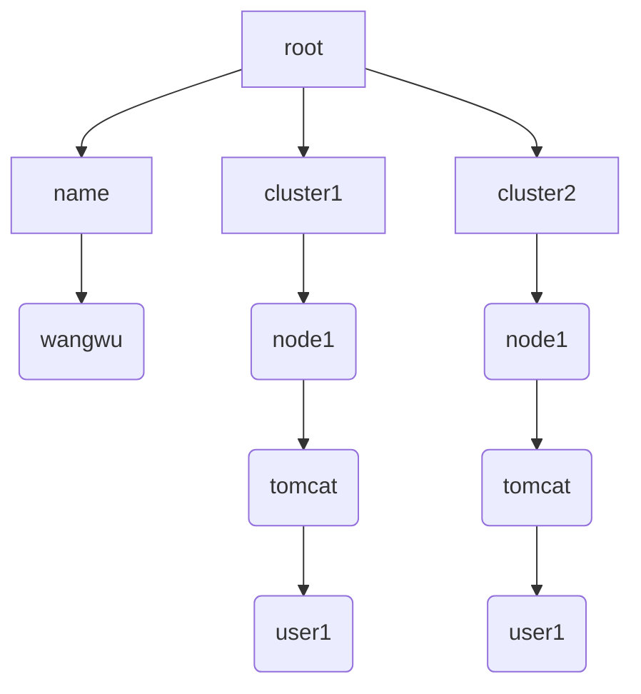

# Python处理yaml和嵌套数据结构的一些技巧

分享一些用Python处理yaml和嵌套数据结构的的一些技巧，首先从修改yaml格式文件的问题出发，演变出了各个解决办法，又从最后的解决办法中引申出了普适性更强的嵌套数据结构的定位方法。

1. 保留注释修改yaml文件
2. 定位嵌套数据结构
3. 定位嵌套数据结构2

## 保留注释修改yaml文件

yaml比之json文件的其中一个区别就是可以注释，这些注释有时候是很重要的内容，就像代码中的注释一样，如果是手动编辑自然是没有问题的，那么如何在保留注释的情况下用代码修改yaml文件呢？

假设我们要修改的yaml文件如下:

```yaml
# 主要维护人
name: zhangsan

# 各集群运维人员
cluster1:
  node1:
    tomcat: user11

cluster2:
  node1:
    tomcat: user21
```

### 不保留注释

为了演示处理yaml的各个方法，这里把不保留注释的方法也纳入到本文了。

```python
def ignore_comment():
    data = yaml.load(text, Loader=yaml.Loader)
    data["name"] = "wangwu"
    print(yaml.dump(data))
```

输出如下:

```yaml
cluster1:
  node1:
    tomcat: user11
cluster2:
  node1:
    tomcat: user21
name: wangwu
```

很显然，这不是我们要的结果， 那么就淘汰这个方法吧。

> 此方法只适用于不需要保留注释的修改。

### 正则表达式

既然load, dump方法会丢弃注释，那么用正则表达式不就可以了么，处理文本一定有正则表达式一席之地的。

假设还是将`name: zhangsan`改成`name: wangwu`。

```python
def regex1():
    pattern = "name:\s+\w+"
    pat = re.compile(pattern=pattern)
    # 首先匹配到对应的字符串
    sub_text = pat.findall(text)[0]
    # 根据这个字符串找到在文本的位置
    start_index = text.index(sub_text)
    # 根据起始位置计算结束位置
    end_index = start_index + len(sub_text)
    print(start_index, end_index, text[start_index:end_index])

    # 将根据索引替换内容
    replace_text = "name: wangwu"
    new_text = text[:start_index] + replace_text + text[end_index:]
    print("="*10)
    print(new_text)
```

输出如下:

```
8 22 name: zhangsan
==========
# 主要维护人
name: wangwu

# 各集群运维人员
cluster1:
  node1:
    tomcat: user11

cluster2:
  node1:
    tomcat: user21
```

看起来不错，好像能够满足需求，但是这里有一个问题就是，假设修改是`cluster2.node1.tomcat`的值呢？

因为文本中有两个`tomcat`的值，所以只是通过正则表达式不能一击即中，需要多一些判断条件，比如首先找到cluster2的起始位置，然后过滤掉小于这个起始位置的索引值，但是如果还有cluster3,cluster4呢？总的来说还 是需要人工的过一遍，然后根据观察结果来编写正则表达式，但是这样太不智能，太不自动了。

> 此方法适用于比较容器匹配的文本。

### 语法树

其实整个文本的数据结构大致如下:



无论是编程语言还是数据文本，如json, yaml, toml都可以得到这样的语法树，通过搜索这颗语法树，我们就能找到对应的键值对。

```yaml
def tree1():
    tree = yaml.compose(text)
    print(tree)
```

输出如下:

```python
MappingNode(tag='tag:yaml.org,2002:map', value=[(ScalarNode(tag='tag:yaml.org,2002:str', value='name'), ScalarNode(tag='tag:yaml.org,2002:str', value='zhangsan')), (ScalarNode(tag='tag:yaml.org,2002:str', value='cluster1'), MappingNode(tag='tag:yaml.org,2002:map', value=[(ScalarNode(tag='tag:yaml.org,2002:str', value='node1'), MappingNode(tag='tag:yaml.org,2002:map', value=[(ScalarNode(tag='tag:yaml.org,2002:str', value='tomcat'), ScalarNode(tag='tag:yaml.org,2002:str', value='user11'))]))])), (ScalarNode(tag='tag:yaml.org,2002:str', value='cluster2'), MappingNode(tag='tag:yaml.org,2002:map', value=[(ScalarNode(tag='tag:yaml.org,2002:str', value='node1'), MappingNode(tag='tag:yaml.org,2002:map', value=[(ScalarNode(tag='tag:yaml.org,2002:str', value='tomcat'), ScalarNode(tag='tag:yaml.org,2002:str', value='user21'))]))]))])
```

通过`yaml.compose`方法我们就能得到一颗节点树，并且每个节点会包括该节点的文本信息，比如起始，终止的文本索引。

通过观察我们能找到`name: zhangsan`的两个节点,  键`name`是一个ScalarNode节点,  值`zhangsan`也是一个ScalarNode, 所以我们可以打印一下看看是否和正则表达式的结果一致。

```python
def tree2():
    tree = yaml.compose(text)
    key_name_node = tree.value[0][0]
    value_name_node = tree.value[0][1]
    print(key_name_node.start_mark.pointer, value_name_node.end_mark.pointer, key_name_node.value, value_name_node.value)
```

输出如下:

```
8 22 name zhangsan
```

结果与正则表达式一致，所以说明这种方法可行并且准确。

得到了修改文本的索引位置，就可以替换了，这里就不再演示了。

> 此方法适合保留注释的修改，并且定位嵌套结构较之正则表达式要简单，并且不需要人工介入。

那么如何定位嵌套结构呢？

## 定位嵌套数据结构

从上一节我们了解到了数据结构可以抽象成一颗语法树, 那么利用一些树的搜索算法就可以定位到目标文本了。

这里展示一下不包含列表节点的搜索算法。

```python
def find_slice(tree: yaml.MappingNode, keys: List[str]) -> Tuple[Tuple[int, int], Tuple[int, int]]:
    """
    找到yaml文件中对应键值对的索引, 返回一个((key起始索引, key结束索引+1), (value起始索引, value结束索引+1))的元组
    暂时只支持键值对的寻找.

    比如:
    >>> find_slice("name: zhangsan", ["name"])
    ((0, 4), (6, 14))
    """
    if isinstance(tree, str):
        tree = yaml.compose(tree, Loader=yaml.Loader)
    assert isinstance(tree, yaml.MappingNode), "未支持的yaml格式"
    target_key = keys[0]
    for node in tree.value:
        if target_key == node[0].value:
            key_node, value_node = node
            if len(keys) == 1:
                key_pointers = (key_node.start_mark.pointer, key_node.end_mark.pointer)
                value_pointers = (value_node.start_mark.pointer, value_node.end_mark.pointer)
                return (key_pointers, value_pointers)

            return find_slice(node[1], keys[1:])

    return ValueError("没有找到对应的值")
```

算法核心在于递归。

> 这里的实现并没有处理列表节点(SequenceNode)。

假设我们要找`cluster1.node1.tomcat`并将其值改成`changed`, 代码如下:

```python
def tree3():
    slices = find_slice(text, ["cluster1", "node1", "tomcat"])
    value_start_index, value_end_index = slices[1]
    replace_text = "changed"
    new_text = text[:value_start_index] + replace_text + text[value_end_index:]
    print(new_text)
```

输出如下

```
# 主要维护人
name: zhangsan

# 各集群运维人员
cluster1:
  node1:
    tomcat: changed

cluster2:
  node1:
    tomcat: user21
```

上面的算法只能定位key-value类型的数据结构，现在在此优化一下，让其 支持序列。

```python
def find_slice2(tree: yaml.MappingNode, keys: List[str]) -> Tuple[Tuple[int, int], Tuple[int, int]]:
    """
    找到yaml文件中对应键值对的索引, 返回一个((key起始索引, key结束索引+1), (value起始索引, value结束索引+1))的元组
    暂时只支持键值对的寻找.

    比如:
    >>> find_slice2("name: zhangsan", ["name"])
    ((0, 4), (6, 14))
    """
    if isinstance(tree, str):
        tree = yaml.compose(tree, Loader=yaml.Loader)
    target_key = keys[0]

    assert isinstance(tree, yaml.MappingNode) or isinstance(tree, yaml.SequenceNode), "未支持的yaml格式"

    ret_key_node = None
    ret_value_node = None
    value_pointers= (-1, -1)

    if isinstance(tree, yaml.SequenceNode):
        assert isinstance(target_key, int), "错误的数据格式"
        # 索引可以是负索引, 比如[1,2,3][-1]
        if len(tree.value) < abs(target_key):
            raise IndexError("索引值大于列表长度")

        node = tree.value[target_key]
        if len(keys) > 1:
            return find_slice2(tree.value[target_key], keys[1:])

        if isinstance(node, yaml.MappingNode):
            ret_key_node, ret_value_node = node.value[0]
        else:
            ret_key_node = node

    if isinstance(tree, yaml.MappingNode):
        for node in tree.value:
            if target_key == node[0].value:
                key_node, value_node = node
                if len(keys) > 1:
                    return find_slice2(node[1], keys[1:])
                ret_key_node = key_node
                ret_value_node = value_node

    if ret_key_node:
        key_pointers = (ret_key_node.start_mark.pointer, ret_key_node.end_mark.pointer)

    if ret_value_node:
        value_pointers = (ret_value_node.start_mark.pointer, ret_value_node.end_mark.pointer)

    if ret_key_node:
        return (key_pointers, value_pointers)

    return ValueError("没有找到对应的值")
```

假设yaml文件如下:

```yaml
# 用户列表
users:
  - user1: wangwu
  - user2: zhangsan

# 集群中间件版本
cluster:
  - name: tomcat
    version: 9.0.63
  - name: nginx
    version: 1.21.6
```

然后运行代码:

```python
def tree4():
    slices = find_slice2(text2, ["cluster", 1, "version"])
    value_start_index, value_end_index = slices[1]
    replace_text = "1.22.0"
    new_text = text2[:value_start_index] + replace_text + text2[value_end_index:]
    print(new_text)
```

输出如下:

```
# 用户列表
users:
  - user1: wangwu
  - user2: zhangsan

# 集群中间件版本
cluster:
  - name: tomcat
    version: 9.0.63
  - name: nginx
    version: 1.22.0
```

结果符合预期。

## 定位嵌套数据结构2

上面介绍了如何定位嵌套的数据结构树，这一节介绍一下如何定位较深的树结构(主要指python字典)。

### 链式调用get

在获取api数据的时候因为想要的数据结构比较深，用索引会报错，那么就 需要捕获异常，这样很麻烦，并且代码很冗长，比如:

```python
data1 = {"message": "success", "data": {"limit": 0, "offset": 10, "total": 100, "data": ["value1", "value1"]}}
data2 = {"message": "success", "data": None}
data3 = {"message": "success", "data": {"limit": 0, "offset": 10, "total": 100, "data": None}}
```

上面的数据结构很有可能来自同一个api结构，但是数据结构却不太一样。

如果直接用索引，就需要捕获异常，这样看起来很烦，那么可以利用字典的get方法。

```python
ret = data1.get("data", {}).get("data", [])
if ret:
    pass # 做一些操作
if data2.get("data"):
    ret = data2["data"].get("data", [])
ret = data3.get("data", {}).get("data", [])
```

通过给定一个预期的数据空对象，让get可以一致写下去。

### 写一个递归的get

起始在之前的find_slice方法中，我们就发现递归可以比较好的处理这种嵌套的数据结构，我们可以写一个递归处理函数，用来处理很深的数据结构。

假设数据结构如下:

```python
data = {"message": "success", "data": {"data": {"name": "zhangsan", "scores": {"math": {"mid-term": 88, "end-of-term": 90}}}}}
```

我们的目标就是获取数据中张三期中数学成绩: 88

实现的递归调用如下:

```python
def super_get(data: Union[dict, list], keys: List[Union[str, int]]):
    assert isinstance(data, dict) or isinstance(data, list), "只支持字典和列表类型"
    key = keys[0]

    if isinstance(data, list) and isinstance(key, int):
        try:
            new_data = data[key]
        except IndexError as exc:
            raise IndexError("索引值大于列表长度") from exc
    elif isinstance(data, dict) and isinstance(key, str):
        new_data = data.get(key)
    else:
        raise ValueError(f"数据类型({type(data)})与索引值类型(f{type(key)}不匹配")

    if len(keys) == 1:
        return new_data

    if not isinstance(new_data, dict) and not isinstance(new_data, list):
        raise ValueError("找不到对应的值")
    return super_get(new_data, keys[1:])
```

然后执行代码:

```python
def get2():
    data = {"message": "success", "data": {"data": {"zhangsan": {"scores": {"math": {"mid-term": 88, "end-of-term": 90}}}}}}
    print(super_get(data, ["data", "data", "zhangsan", "scores", "math", "mid-term"]))
    # 输出 88
    data = {"message": "success", "data": {"data": {"zhangsan": {"scores": {"math": [88, 90]}}}}}
    print(super_get(data, ["data", "data", "zhangsan", "scores", "math", 0]))
    # 输出 88
    data = {"message": "success", "data": {"data": {"zhangsan": {"scores": {"math": [88, 90]}}}}}
    print(super_get(data, ["data", "data", "zhangsan", "scores", "math", -1]))
    # 输出 90 
```

### 第三方库

其实有语法比较强大的库，比如jq, 但是毕竟多了一个依赖，并且需要一定的学习成本，但是，如果确定自己需要更多的语法，那么可以去安装一下第三方库。

## 总结

如果遇到较深的嵌套，递归总能很好的解决，如果实在想不出比较好的算法，那就找个第三方库吧，调库嘛，不寒碜。


源代码地址: https://github.com/youerning/blog/tree/master/py_yaml_nested_data