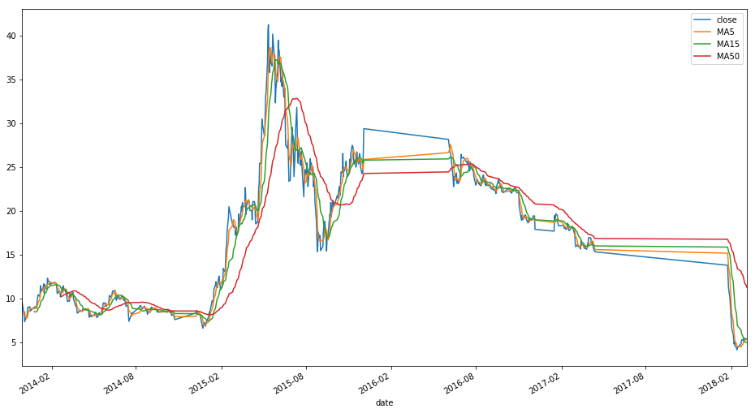
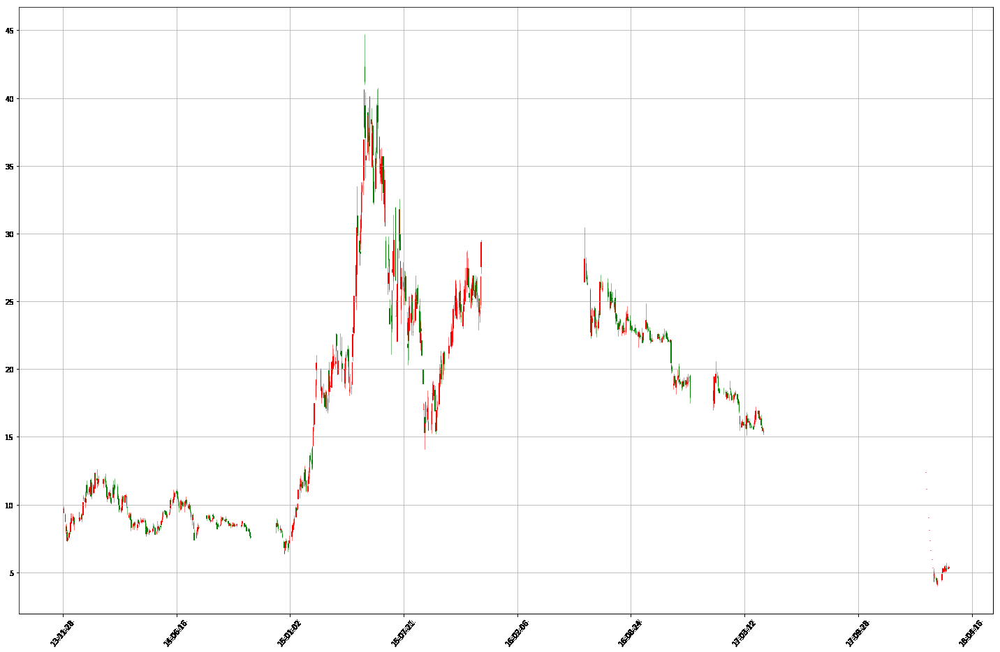

## 前言
由于笔者并无深厚的数学功底也无深厚的金融知识, 所以不会在本文中引用各种高深的投资模型或数学模型，参考书籍主要是《海龟交易法则》《以交易为生》


## 交易系统
在交易之前，我们应该首先有一个交易系统用于交易，这个交易系统不一定有什么范式，交易体系应该就是一个交易的依据，至于这个依据可不可行，科不科学那就见仁见智。

当然了,这里的交易系统不一定是程序，只是指你自己的交易原则或者遵守的一些技巧或者方法，你可以手动执行也可以借助编程语言，编程语言不就是一套用来使用的工具么.

这里参考海龟交易法则里面的交易体系(这里只是参考).
建立一个完善的交易体系，我们至少应该思考一下六个方面。
- 1、市场----买卖什么
- 2、头寸规模----买卖多少
- 3、入市----何时买入
- 4、止损----何时退出亏损的头寸
- 5、止盈----何时退出盈利的头寸
- 6、离市----何时离市

下面是简单的示例。
- 买卖A股
- 全仓
- 当日涨幅超过3%买入。
- 当持有头寸亏损超过3%，平仓
- 当日跌幅大于3%或者三个连续阴线


> 分析: 这个交易策略其实只有在行情以波浪形状向上的行情时候才能获利，如果是盘整的情况下，怕是会亏的很惨。这里之所以写的这么简单粗暴是为了后面策略测试撸代码简单。


## 数据获取及处理
因为这里说的是用python炒股，所以应该采用程序的方式去获取数据，如果人工炒股，下载任何股票行情软件都是可以的，但是人工的执行是需要花费比较多的精力的。

而python语言中用于获取股票行情数据的库，最有名莫过于tushare了。

这里以上证乐视的股票为例吧。
### python环境安装
    安装Anaconda(python2版本)
下载地址:https://www.anaconda.com/download/
注:如果没安装过这个环境的经验，就百度或者谷歌一下吧,如果不是安装anaconda则需要艰难的自行解决依赖。

### 安装tushare

```
pip install tushare
```

参考: http://tushare.org/

### 获取行情数据

```
import pandas as pd
import tushare as ts

# 通过股票代码获取股票数据,这里没有指定开始及结束日期
df = ts.get_k_data("300104")

# 查看前十条数据
df.head()

# 查看后十条数据
df.tail()

# 将数据的index转换成date字段对应的日期
df.index = pd.to_datetime(df.date)

# 将多余的date字段删除
df.drop("date", inplace=True, axis=1)
```

> 注:关于股票数据的相关处理需要由pandas,matplotlib的知识，参考:http://pandas.pydata.org/pandas-docs/version/0.20/10min.html


### 计算常用指标

```
# 计算5,15,50日的移动平均线, MA5, MA15, MA50
days = [5, 15, 50]
for ma in days:
    column_name = "MA{}".format(ma)
    df[column_name] = pd.rolling_mean(df.close, ma)


# 计算浮动比例
df["pchange"] = df.close.pct_change()
# 计算浮动点数
df["change"] = df.close.diff()
```


最终处理完成后的结果如下:

```
df.head()
Out[13]: 
             open  close   high    low    volume    code     MA5  MA15  MA50  \
date                                                                           
2013-11-29  9.396  9.741  9.870  9.389  146587.0  300104     NaN   NaN   NaN   
2013-12-02  9.298  8.768  9.344  8.768  177127.0  300104     NaN   NaN   NaN   
2013-12-03  8.142  8.414  8.546  7.890  176305.0  300104     NaN   NaN   NaN   
2013-12-04  8.391  8.072  8.607  8.053  120115.0  300104     NaN   NaN   NaN   
2013-12-05  7.983  7.366  8.108  7.280  253764.0  300104  8.4722   NaN   NaN   

             pchange  change  
date                          
2013-11-29       NaN     NaN  
2013-12-02 -0.099887  -0.973  
2013-12-03 -0.040374  -0.354  
2013-12-04 -0.040647  -0.342 
```


### 可视化
#### 走势图
所谓一图胜前言，将数据可视化可以非常直观的感受到股票的走势。
个人觉得，如果用程序炒股还是应该一切都量化的，不应该有过多的主观观点，如果过于依赖直觉或者当时心情，那么实在没必要用程序分析了。

```
df[["close", "MA5", "MA15", "MA50"]].plot(figsiz=(10,18))
```
效果如下:



### k线图
```
import matplotplib.pyplot as plt
from matplotlib.daet import DateFormatter
from matplotlib.finance import date2num, candlestick_ohlc

def candlePlot(data, title=""):
    data["date"] = [date2num(pd.to_datetime(x)) for x in data.index]
    dataList = [tuple(x) for x in data[
        ["date", "open", "high", "low", "close"]].values]

    ax = plt.subplot()
    ax.set_title(title)
    ax.xaxis.set_major_formatter(DateFormatter("%y-%m-%d"))
    candlestick_ohlc(ax, dataList, width=0.7, colorup="r", colordown="g")
    plt.setp(plt.gca().get_xticklabels(), rotation=50,
             horizontalalignment="center")
    fig = plt.gcf()
    fig.set_size_inches(20, 15)
    plt.grid(True)

candlePlot(df)
```
效果如下:



> 注: 这里只是一个示例，说明matplotlib的强大以及小小的演示，如果遇到什么奇怪的问题就查api或者google吧。

## 策略测试
### 手动撸代码
这里用最近买过的一只股票吧，京东方A(000725)。


```
# 导入相关模块
import tushare as ts
import pandas as pd

# 获取数据
df = ts.get_k_data("000725")

# 处理数据
df.index = pd.to_datetime(df.date)
df.drop("date", axis=1, inplace=True)

# 计算浮动比例
df["pchange"] = df.close.pct_change()
# 计算浮动点数
df["change"] = df.close.diff()

# 查看当前数据数据前五行
             open  close   high    low      volume    code   pchange  change
date                                                                        
2015-07-20  4.264  4.234  4.342  4.165  13036186.0  000725       NaN     NaN
2015-07-21  4.136  4.195  4.274  4.096   8776773.0  000725 -0.009211  -0.039
2015-07-22  4.175  4.146  4.214  4.067   9083703.0  000725 -0.011681  -0.049
2015-07-23  4.136  4.254  4.283  4.096  12792734.0  000725  0.026049   0.108
2015-07-24  4.224  4.136  4.254  4.106  13009620.0  000725 -0.027739  -0.118

# 设定回撤值
withdraw = 0.03
# 设定突破值
breakthrough = 0.03
# 设定账户资金
account = 10000
# 持有仓位手数
position = 0

def buy(bar):
    global account, position
    print("{}: buy {}".format(bar.date, bar.close))
    # 一手价格
    one = bar.close * 100
    position = account // one
    account = account - (position * one)

def sell(bar):
    global account, position
    # 一手价格
    print("{}: sell {}".format(bar.date, bar.close))
    one = bar.close * 100
    account += position * one
    position = 0

print("开始时间投资时间: ", df.iloc[0].date)
for date in df.index:
    bar = df.loc[date]
    if bar.pchange and bar.pchange > breakthrough and position == 0:
        buy(bar)
    elif bar.pchange and bar.pchange < withdraw and position > 0:
        sell(bar)


print("最终可有现金: ", account)
print("最终持有市值: ", position * df.iloc[-1].close * 100)
```
输出如下:

```
开始时间投资时间:  2015-07-20
2015-07-29: buy 3.83
2015-07-30: sell 3.653
2015-08-04: buy 3.752
......
2018-02-27: sell 5.71
2018-03-06: buy 5.79
最终可有现金:  333.3
最终持有市值:  7527.0
```


> 结论: 通过上面的测试发现资亏了两千多...


### 借助测试框架
借助测试框架才是正确的回撤姿势,因为框架包含了更多的功能。这里使用pyalgotrade。

#### 简单使用

```
from pyalgotrade import strategy
from pyalgotrade import technical
from pyalgotrade.barfeed import yahoofeed

# 自定义事件窗口类
class DiffEventWindow(technical.EventWindow):
    def __init__(self, period):
        assert(period > 0)
        super(DiffEventWindow, self).__init__(period)
        self.__value = None

    def onNewValue(self, dateTime, value):
        super(DiffEventWindow, self).onNewValue(dateTime, value)
        if self.windowFull():
            lastValue = self.getValues()[0]
            nowValue = self.getValues()[1]
            self.__value = (nowValue - lastValue) / lastValue

    def getValue(self):
        return self.__value

# 自定义指标
class Diff(technical.EventBasedFilter):
    def __init__(self, dataSeries, period, maxLen=None):
        super(Diff, self).__init__(dataSeries, DiffEventWindow(period), maxLen)

# 定义自己的策略
class MyStrategy(strategy.BacktestingStrategy):
    def __init__(self, feed, instrument, diffPeriod=2):
        # 传入feed及初始账户资金
        super(MyStrategy, self).__init__(feed, 10000)
        self.__instrument = instrument
        self.__position = None
        self.setUseAdjustedValues(True)
        self.__prices = feed[instrument].getPriceDataSeries()
        self.__diff = Diff(self.__prices, diffPeriod)
        self.__break = 0.03
        self.__withdown = -0.03

    def getDiff(self):
        return self.__diff

    def onEnterCanceled(self, position):
        self.__position = None

    def onEnterOk(self, position):
        execInfo = position.getEntryOrder().getExecutionInfo()
        self.info("BUY at $%.2f" % (execInfo.getPrice()))

    def onExitOk(self, position):
        execInfo = position.getExitOrder().getExecutionInfo()
        self.info("SELL at $%.2f" % (execInfo.getPrice()))
        self.__position = None

    def onExitCanceled(self, position):
        # If the exit was canceled, re-submit it.
        self.__position.exitMarket()

    def onBars(self, bars):
        account = self.getBroker().getCash()
        bar = bars[self.__instrument]
        if self.__position is None:
            one = bar.getPrice() * 100
            oneUnit = account // one
            if oneUnit > 0 and self.__diff[-1] > self.__break:
                self.__position = self.enterLong(self.__instrument, oneUnit * 100, True)
        elif self.__diff[-1] < self.__withdown and not self.__position.exitActive():
            self.__position.exitMarket()


def runStrategy():
    feed = yahoofeed.Feed()
    feed.addBarsFromCSV("jdf", "jdf.csv")

    myStrategy = MyStrategy(feed, "jdf")

    myStrategy.run()
    print("Final portfolio value: $%.2f" % myStrategy.getResult())

runStrategy()

```
**输出如下**

``` simpleStrategy.py
2015-07-30 00:00:00 strategy [INFO] BUY at $3.78
2015-07-31 00:00:00 strategy [INFO] SELL at $3.57
2015-08-05 00:00:00 strategy [INFO] BUY at $3.73
2015-08-06 00:00:00 strategy [INFO] SELL at $3.56
...
2018-02-13 00:00:00 strategy [INFO] BUY at $5.45
Final portfolio value: $7877.30
```

猛地一看会发现，用框架似乎写了更多的代码,但是框架内置了更多分析工具。
下面简单介绍。

### 策略可视化

```
from pyalgotrade import strategy
from pyalgotrade import technical
from pyalgotrade.barfeed import yahoofeed
from pyalgotrade import plotter
from pyalgotrade.stratanalyzer import returns


# An EventWindow is responsible for making calculations using a window of values.
class DiffEventWindow(technical.EventWindow):
    def __init__(self, period):
        assert(period > 0)
        super(DiffEventWindow, self).__init__(period)
        self.__value = None

    def onNewValue(self, dateTime, value):
        super(DiffEventWindow, self).onNewValue(dateTime, value)
        if self.windowFull():
            # print("full")
            lastValue = self.getValues()[0]
            nowValue = self.getValues()[1]
            self.__value = (nowValue - lastValue) / lastValue
            # print(nowValue, lastValue, self.__value)

    def getValue(self):
        return self.__value


class Diff(technical.EventBasedFilter):
    def __init__(self, dataSeries, period, maxLen=None):
        super(Diff, self).__init__(dataSeries, DiffEventWindow(period), maxLen)


class MyStrategy(strategy.BacktestingStrategy):
    def __init__(self, feed, instrument, diffPeriod=2):
        super(MyStrategy, self).__init__(feed, 10000)
        self.__instrument = instrument
        self.__position = None
        # self.setUseAdjustedValues(True)
        self.__prices = feed[instrument].getPriceDataSeries()
        self.__diff = Diff(self.__prices, diffPeriod)
        self.__break = 0.03
        self.__withdown = -0.03

    def getDiff(self):
        return self.__diff

    def onEnterCanceled(self, position):
        self.__position = None

    def onEnterOk(self, position):
        execInfo = position.getEntryOrder().getExecutionInfo()
        self.info("BUY at $%.2f" % (execInfo.getPrice()))

    def onExitOk(self, position):
        execInfo = position.getExitOrder().getExecutionInfo()
        self.info("SELL at $%.2f" % (execInfo.getPrice()))
        self.__position = None

    def onExitCanceled(self, position):
        # If the exit was canceled, re-submit it.
        self.__position.exitMarket()

    def onBars(self, bars):
        account = self.getBroker().getCash()
        bar = bars[self.__instrument]
        # self.info("{}:{} ".format(bar.getPrice(), self.__diff[-1]))
        # If a position was not opened, check if we should enter a long position.
        # account = account - (position * one)
        if self.__position is None:
            one = bar.getPrice() * 100
            oneUnit = account // one
            # print(oneUnit * one)
            if oneUnit > 0 and self.__diff[-1] > self.__break:
                self.__position = self.enterLong(self.__instrument, oneUnit * 100, True)
        elif self.__diff[-1] < self.__withdown and not self.__position.exitActive():
            self.__position.exitMarket()


def runStrategy():
    feed = yahoofeed.Feed()
    feed.addBarsFromCSV("jdf", "jdf.csv")

    myStrategy = MyStrategy(feed, "jdf")

    returnsAnalyzer = returns.Returns()
    myStrategy.attachAnalyzer(returnsAnalyzer)
    plt = plotter.StrategyPlotter(myStrategy)
    plt.getInstrumentSubplot("jdf")
    plt.getOrCreateSubplot("returns").addDataSeries("Simple returns", returnsAnalyzer.getReturns())

    myStrategy.run()
    print("Final portfolio value: $%.2f" % myStrategy.getResult())
    plt.plot()

runStrategy()

```

图片输出如下


> 注: 这里的策略测试股票选择以及时间选择并不严谨，仅作功能展示，测试结果可能有很大的巧合性。Pyalgotrade详细介绍皆使用参考:http://gbeced.github.io/pyalgotrade/docs/v0.18/html/index.html


## 股价监控
根据这个需求写了一个股价监控的半成品，通过邮箱监控。
项目参考: https://github.com/youerning/UserPyScript/tree/master/monitor

> 技巧:在微信的辅助功能里面启用QQ邮箱提醒的功能，那么股价变动的通知就会很及时了,因为微信几乎等同于短信了。
这里简单说一下各个配置项及使用方法。

**default段落**

breakthrough代表突破的比例，需要传入两个值,项目里面的突破比例依次是3%，5%.
withdraw代表回撤，也需要两个值，示例为3%，5%.
attention代表关注的股票列表，填入关注的股票代码，用空格隔开
注:这里暂时没有考虑关注股票的情况，所以很多的关注股票也许有性能上的问题。


**mail段落**

依次输入用户名及密码以及收件人的邮箱

**position段落**

当前持仓的股票以及其持仓成本。
如持有京东方A(000725)以5.76的股价。
000725 = 5.76
如果多个持仓就多个如上的相应的键值对。

使用方法参考该脚本的readme
https://github.com/youerning/UserPyScript/blob/master/monitor/README.md


==PS:很难过的是英文水平不好还用因为注释，以及用英文词汇做变量名,如果词不达意请见谅。==


## 下单
这一部分本人暂时没有让程序自动执行，因为暂时还没有打磨出来一套适合自己并相信的体系，所以依靠股价监控的通知，根据不断修正的体系在手动执行交易。

## 后记 
由于入市不到一年，所以就不用问我走势或者收益了, 当前战绩是5局3胜,微薄盈利。

最后以下图结束.


