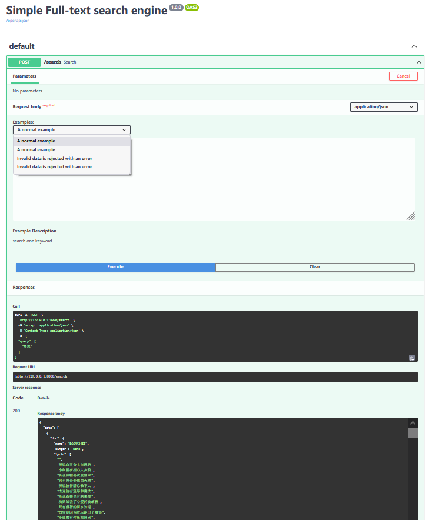
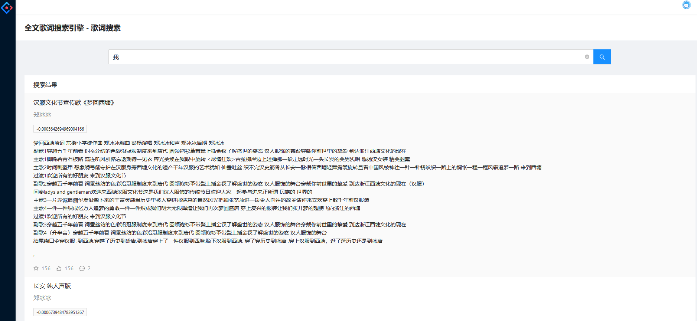

# 从后端到前端: 写一个全文搜索引擎(Python)
[](https://go.deta.dev/deploy)

研究了一下搜索引擎的大概原理，一个可以商用的搜索引擎是比较复杂的，但是搜索引擎的内核(自认为的)还是可以写写的。

> What i cannot create, i do not understand

一个全文搜索引擎应该至少解决两个问题: 
1. 快速的定位到有关键字的内容(比如说网页，比如说文章文本)
2. 将定位到的文章排序，与关键字相关性最高的文章应该排在最前面(最相关的不应该是谁出钱最高嘛\doge 也许会有人说 :) )

这里以Python举例，毕竟我最常用的编程语言就是Python了，了解了原理，我想用什么语言都是一样的，没必要纠结于编程语言的选择。

在可能的情况下我尽量不会借助第三方库。

环境如下:       
后端: 
- Python 3.6.8
- FastAPI 强烈推荐
- jieba

前端：
- Antd Pro(下次用VUE版本的)

## 选择数据源
歌词结构如下:
```json
[
    {
        "name": "《Young and dream》原创吉他弹唱demo",
        "singer": "郑冰冰",
        "lyric": [
            "《少年与梦》G调",
            "作曲 郑冰冰",
            "演唱 郑冰冰",
            "",
            ....]
    }
    ....

```

> 数据来自github 仓库: https://github.com/dengxiuqi/ChineseLyrics


这里将上面的仓库下载到本地目录并保存在**ChineseLyrics**目录，目录结构如下
```
ChineseLyrics
├── README.md
├── lyrics1.json
├── lyrics2.json
├── lyrics2.json
├── lyrics2.json
└── lyrics5.json
```

然后尝试将搜索的文本全部加载到内存
```python
import json
from glob import glob

files = glob("ChineseLyrics/*json")

docs = []
for file in files:
    with open(file, encoding="utf8") as rf:
        data = json.load(rf)
        for doc in data:
            # 将歌词的文本列表转换成一个字符串
            doc["lyric2"] = "\n".join(doc["lyric"])
        docs.extend(data)

print(len(docs)) # 102198  

# 
```
至此我们有了需要搜索的文档


## 定位关键字1
定位关键字还是很简单的，但是怎么快速的定位到我们所需要的关键字，这是一个问题，首先尝试一下最直观的方法吧，**遍历**。

假设搜索的关键字是: 梦想
```python
from  typing import List

def search(keyword: str, docs: List[dict]) -> List[dict]:
    ret = []

    for index, doc in enumerate(docs):
        lyric = doc["lyric2"]
        # 统计歌词中关键词出现的次数
        count = lyric.count(keyword)
        if count > 1:
            ret.append({
                "doc": doc,
                "index": index,
                "count": count
            })
    return ret

ret = search("梦想", docs)

# 搜索结果
print(len(ret)) # 2235

# 通过歌词中关键字出现的次数排序
ret2 = sorted(ret, key=lambda x:x["count"], reverse=True)

print(ret2[0])
# {'doc': {'name': '你是我的梦想',
#  'singer': '蛋堡',
#   'lyric': ['',
#     '你是我的梦想 ending之后的掌声',
#     '省略...'
#    ''],
#   'lyric2': '\n你是我的梦想 ending之后的掌声\n你是我的梦想 帅气灌篮的男人\n你是我的梦想 那只想要牵的手\n还有 喔还有你 七十二色彩色笔\n你们是曾经 我究竟得到或放弃\n我是否曾经 曾经接受或抗议\n后来都忘记 成为模糊的色块\n现实把我们带离情感的热带\n因为一首喜欢下雨的歌 喜欢上跳舞\n因为大片的气垫觊觎篮框的高度\n爱上她长发 在某个没睡的中午\n开始拿起笔画图 是因为七龙珠\n已重复整个下午  我耗着转书转笔\n外表一入神 我的心里在想你\n磨平的鞋底 布满涂鸦的讲义\n第一次一起出去 我带了即可拍相机\n最初在追逐的 退出前飞舞的\n飞舞的梦想 你是我的梦想\n追逐后退出的 飞舞在最初的\n最初的梦想 你是我的梦想\n退出前飞舞着 最初在追逐着\n追逐着梦想 你是我的梦想\n飞舞着最初的 追逐着退出的\n退出的梦想 你是我的梦想\n第一个正确的动作 第一次上篮得分\n第一次拿笔上了色 第一次畅谈人生\n第 一次 了解 实现 定义是 成为现实\n虽然说 终于 也是另一个开始\n开始了追逐 开始了飞舞\n开始无条件付出 开始没有退路\n追得太快 有时候太超过\n突然之间回头 初衷已飞走\n\n当终于跳起来能摸到了篮框\n离开了南方 爱情又绽放\n褪色的涂鸦被淡忘\n门口的球鞋塞进鞋柜 没带走\n只带着新的责任 开始新的人生\n期待着新的可能 绣上新的纹身\n那个图案 是用来纪念浪漫的抗战\n最怕自己忘了同党分离的傍晚\n最初在 追逐的 退出前飞舞的\n飞舞的梦想 你是我的梦想\n追逐后退出的 飞舞在最初的\n最初的梦想 你是我的梦想\n退出前飞舞着 最初在追逐着\n追逐着梦想 你是我的梦想\n飞舞着最初的 追逐着退出的\n退出的梦想 你是我的梦想\n叙旧的夜晚我问自己\n\n安静的夜晚我问自己\n酗酒的夜晚我问自己\n清醒的夜晚我问自己\n想问自己这问题 但是又\n问自己 怕自己又内疚\n困着自己 逆了还是顺了自己\n我问自己 到底还认不认识你\n为什么 长越大梦想却越小\n说什么 越被揣测分享或炫耀\n做什么 人的惰性很难去戒掉\n我干了什么 究竟拿了时间换了什么\n要怎么定义什么才是成功\n又要怎么失败才算沉重\n我不很懂 有时决定下得太慎重\n 却让后悔成为偶尔的阵痛\n最初在追逐的 退出前飞舞的\n飞舞的梦想 你是我的梦想\n追逐后退出的 飞舞在最初的\n最初的梦想 你是我的梦想\n退出前飞舞着 最初在追逐着\n追逐着梦想 你是我的梦想\n退出的梦想 你是我的梦想\n退出的梦想 你是我的梦想\n'},
#  'index': 70990,
#  'count': 30}
```
上面通过遍历的方式搜索我们想找的关键字，然后通过出现的次数对我们的结果进行排序，不过出现的次数肯定不是很棒的相关性指标，这里暂时按下不表，在看看搜索的性能如何。

```
%timeit ret = search("梦想", docs)
70.7 ms ± 398 µs per loop (mean ± std. dev. of 7 runs, 10 loops each)
```
看起来还不错的样子，10w+的数据量，不到0.01秒就搜索完成了。

不过让我们看看Google的搜索结果。

> About 337,000,000 results (0.60 seconds) 

**极端假设**google只储存的337,000,000个网页，且网页的内容大小跟上面的歌词差不多，那么我们的搜索方法至少应该花费 (337000000 / 102198) * 0.07  = 230.82643495958825(秒)。 也就是说，就查找梦想这个关键字而言，我们至少要花费解决四分钟，这显然不是一个很好的结果，那么放弃吧，寻找其他方法。

## 定位关键字2
第一个方法显然不行，所以这里介绍第二个方法，**倒排索引**。

### 倒排索引
假设有以下文本
```
doc1: 你是我的梦想 之后的掌声 你是我的梦想 帅气灌篮的男人
doc2: 有一天我从座位的窗口望下去 看见一群入职的新同学
doc3: 如果我可以 教会你 飞天遁地 能不能 跟着我 一起逃离 你的姓 我的名
```
我们可以将上面的内容转换成下面的内容
```
{'doc1': ['你', '是', '我', '的', '梦', '想', '之', '后', '的', '掌', '声', '你', '是', '我', '的', '梦', '想', '帅', '气', '灌', '篮', '的', '男', '人'], 
'doc2': ['有', '一', '天', '我', ' 从', '座', '位', '的', '窗', '口', '望', '下', '去', '看', '见', '一', '群', '入', '职', '的', '新', '同', '学'],
'doc3': ['如', '果', '我', '可', '以', '教', '会', '你', '飞', '天', '遁', '地', '能', '不', '能', '跟', '着', '我', '一', '起', '逃', '离', '你', '的', '姓', '我', '的', '名']}
```
在上面的基础上，可以在进行转换成下面的结构
```python
from pprint import pprint
from collections import defaultdict

index = defaultdict(list)
for k, v in data.items():
    for idx, w in enumerate(v):
        index[w] = {"doc_ref": k, "doc_offset": idx}

pprint(dict(index))
# {'一': [{'doc_offset': 1, 'doc_ref': 'doc2'},
#        {'doc_offset': 15, 'doc_ref': 'doc2'},
#        {'doc_offset': 18, 'doc_ref': 'doc3'}],
#  '下': [{'doc_offset': 11, 'doc_ref': 'doc2'}],
#  '不': [{'doc_offset': 13, 'doc_ref': 'doc3'}],
#  '之': [{'doc_offset': 6, 'doc_ref': 'doc1'}],
#  '人': [{'doc_offset': 23, 'doc_ref': 'doc1'}],
#  '从': [{'doc_offset': 4, 'doc_ref': 'doc2'}],
#  '以': [{'doc_offset': 4, 'doc_ref': 'doc3'}],
#  '会': [{'doc_offset': 6, 'doc_ref': 'doc3'}],
#  '位': [{'doc_offset': 6, 'doc_ref': 'doc2'}],
#  '你': [{'doc_offset': 0, 'doc_ref': 'doc1'},
#        {'doc_offset': 11, 'doc_ref': 'doc1'},
#        {'doc_offset': 7, 'doc_ref': 'doc3'},
#        {'doc_offset': 22, 'doc_ref': 'doc3'}],
#  '入': [{'doc_offset': 17, 'doc_ref': 'doc2'}],
#  '去': [{'doc_offset': 12, 'doc_ref': 'doc2'}],
#  '口': [{'doc_offset': 9, 'doc_ref': 'doc2'}],
#  '可': [{'doc_offset': 3, 'doc_ref': 'doc3'}],
#  '同': [{'doc_offset': 21, 'doc_ref': 'doc2'}],
#  '名': [{'doc_offset': 27, 'doc_ref': 'doc3'}],
#  '后': [{'doc_offset': 7, 'doc_ref': 'doc1'}],
#  '地': [{'doc_offset': 11, 'doc_ref': 'doc3'}],
#  '声': [{'doc_offset': 10, 'doc_ref': 'doc1'}],
#  '天': [{'doc_offset': 2, 'doc_ref': 'doc2'},
#        {'doc_offset': 9, 'doc_ref': 'doc3'}],
#  '如': [{'doc_offset': 0, 'doc_ref': 'doc3'}],
#  '姓': [{'doc_offset': 24, 'doc_ref': 'doc3'}],
#  '学': [{'doc_offset': 22, 'doc_ref': 'doc2'}],
#  '帅': [{'doc_offset': 17, 'doc_ref': 'doc1'}],
# ....省略...
```
通过观察上面的结果，我们可以很方便的知道，关键字"你"存在于三个文档里面，"名"指存在于文档doc3中，显然易见，这种方法要比第一种方法快的多。

但是在实现这个搜索办法之前，还有几个问题没有解决(当然不解决并不影响这个算法，不过结果并不是我们想要的。）
1. 文本中的空白字符，无用字符应该去除
2. 不是所有的词都应该放在索引里面，这里没用的词叫做停用词(stop words), 比如"的", "了"(语气词时)
3. 应该区分词跟字，比如"梦想"应该是一个词，而不是"梦", "想"两个字。

第一个问题比较好解决，后面两个问题比较难，如此，只能使用万能办法"第三方调库"。

#### 去除特殊符号
通过以下方法将文本中的特殊符号去掉
```python
doc4 = '《少年与梦》G调\n作曲 郑冰冰\n演唱 郑冰冰\n\n主歌1\n有一天我从座位的窗口望下去，\n看见一群入职的新同学，\n他们的笑脸天真又充满期许，\n一瞬间想起了那时候的自己。\n\n主歌2\n在创业大 厦戴上工牌的那一天起，\n我的人生好像改变了轨迹，\n那些尘世中的苟且与卑离，\n已经慢慢离我远去。\n\n过渡\n虽然还是会有不开心的故事，\n虽然迷惘也会偶尔的来袭，\n但这是一个真实的地方，\n还有一群人让你无所畏惧。\n\n副歌1\n梦想你好吗 不知不觉十八年\n梦想你还记得吗 那群小小的少年\n曾经我们在湖畔许下的誓言，\n到今天，到永远，也不会改变\n\n副歌2\n梦想你好吗 也许再过很多年\n梦想你还记得 呀 这群追梦的少年\n曾经我们在湖畔许下的誓言，\n到今天，到永远，也不会改变\n\n间奏\n\n主歌3\n第一次在阿里大声哭泣，\n你们递过来纸巾和双臂，\n你们说怕什么有我们在一起，\n就像候鸟成群翱翔在天际。\n\n主歌4\n百阿的片段像电影一样想起，\n内网的标签又被贴满了一地，\n我也羡慕我那从不加班的弟弟，\n但我更爱五年陈的时候有我也有你。\n\n过渡2\n生命就像是一个一个誓言\n既要用力嘶吼也要温柔兑现\n别人看来我们已经站在了山巅\n但我们却更加向往彩虹和云间\n\n\n副歌 啦啦啦大合唱\n\n结尾\n我爱你 阿里巴巴（爸爸）\n'

print("".join(filter(str.isalnum, doc4)))
# 少年与梦G调作曲郑冰冰演唱郑冰冰主歌1有一天我从座位的窗口望下去看见一群入职的新同学他们的笑脸天真又充满期许一瞬间想起了那时候的自己主歌2在创业大厦戴上工牌的那一天起我的人生好像改变了轨迹那些 尘世中的苟且与卑离已经慢慢离我远去过渡虽然还是会有不开心的故事虽然迷惘也会偶尔的来袭但这是一个真实的地方还有一群人让你无所畏惧副歌1梦想你好吗不知不觉十八年梦想你还记得吗那群小小的少年曾经我 们在湖畔许下的誓言到今天到永远也不会改变副歌2梦想你好吗也许再过很多年梦想你还记得呀这群追梦的少年曾经我们在湖畔许下的誓言到今天到永远也不会改变间奏主歌3第一次在阿里大声哭泣你们递过来纸巾和双臂你们说怕什么有我们在一起就像候鸟成群翱翔在天际主歌4百阿的片段像电影一样想起内网的标签又被贴满了一地我也羡慕我那从不加班的弟弟但我更爱五年陈的时候有我也有你过渡2生命就像是一个一个誓言既要用力嘶吼也要温柔兑现别人看来我们已经站在了山巅但我们却更加向往彩虹和云间副歌啦啦啦大合唱结尾我爱你阿里巴巴爸爸
```

### 分词
为了解决分词的问题，这里使用第三方库 jieba

安装: 
```bash
pip install jieba
```

使用
```python
import jieba

doc1 = '你是我的梦想之后的掌声你是我的梦想帅气灌篮的男人'
doc2 = '有一天我从座位的窗口望下去看见一群入职的新同学'
doc3 = '如果我可以教会你飞天遁地能不能跟着我一起逃离你的姓我的名'

print(list(jieba.cut_for_search(doc1)))
# ['你', '是', '我', '的', '梦想', '之后', '的', '掌声', '你', '是', '我', '的', '梦想', '帅气', '灌篮', '的', '男人']
```
简单观察就知道这要比单个字要"准确"太多


### 完整实现
通过倒排索引及分词，现在我们可以实现第二个版本的搜索引擎。
```python
# search2.py

from glob import glob
from typing import List
from collections import defaultdict

import jieba

files = glob("ChineseLyrics/*json")

docs = []
for file in files:
    with open(file, encoding="utf8") as rf:
        data = json.load(rf)
        for doc in data:
            # 将歌词的文本列表转换成一个字符串
            lyric = "".join(doc["lyric"])
            # 去除特殊符号
            lyric = "".join(filter(str.isalnum, lyric))
            # 分词
            lyric2 = list(jieba.cut_for_search(lyric))
            data["lyric2"] = lyric2

        docs.extend(data)

index = defaultdict(list)
for doc_index, doc in enumerate(docs):
    for word in doc["lyric2"]:
        index[word].append({
            "doc_index": doc_index,
        })


def search(keyword: str, index: dict) -> List[dict]:
    return index.get(keyword)

ret = search("梦想", index)

# 这里的结果跟上面不一样，我想是因为有的句子是xxx梦 想xxxx，因为我在分词前把所有特殊符号去掉了，所以有些地方可能有歧义，或者不准确，过建立所以要一两分钟，这里就不细致处理了，有兴趣的可以自己在细致的处理一下
print(len(ret)) #4509

print(ret.most_common(10))
# 结果还是70990
# [(70990, 30), (39809, 21), (41760, 20), (87130, 16), (44325, 15), (338, 14), (83351, 14), (93432, 14), (16683, 12), (69966, 12)]

```

看看搜索的速度
```
%timeit ret = search("梦想", index)
279 ns ± 1.43 ns per loop (mean ± std. dev. of 7 runs, 1000000 loops each)
```
百度一下，时间单位换算 76 毫秒=76000000 纳秒

那么倒排索引的结果要快前者76000000 / 279 = 272401.4336917563(倍)，差不多快27w倍。

在引用google搜索的极短假设，时间可以缩短到231 / 272401 = 0.0008480(秒)，这个时间对于搜索引擎要友好很多了。

> 注: 这里没有考虑现实的相关性排序以及内存的使用情况，所以结果会比较夸张，现实情况下，这些数据一个机器根本装不下，必然涉及分布式，大数据架构。而且我们测试的文本内容也不大。


### 小结
显而易见，倒排索引要比遍历快太多太多，不过在前期的处理过程中要比遍历要复杂一些，大部分时间花在的索引的建立上，但是作为一个搜索引擎而言，搜索的次数要远远大于写入的次数的，因此倒排索引几乎是全文搜索引擎的标配。

## 排序
排序有很多办法，这里介绍一下tf-idf(主要其他算法比较复杂:))。
**词频**（term frequency，TF）指的是某一个给定的词语在该文件中出现的频率。

**逆向文件频率**（inverse document frequency，IDF）是一个词语普遍重要性的度量。某一特定词语的IDF，可以由总文件数目除以包含该词语之文件的数目，再将得到的商取以10为底的对数得到：


例子: 有很多不同的数学公式可以用来计算TF-IDF。这边的例子以上述的数学公式来计算。词频 (TF) 是一词语出现的次数除以该文件的总词语数。假如一篇文件的总词语数是100个，而词语“母牛”出现了3次，那么“母牛”一词在该文件中的词频就是3/100=0.03。一个计算文件频率 (IDF) 的方法是文件集里包含的文件总数除以测定有多少份文件出现过“母牛”一词。所以，如果“母牛”一词在1,000份文件出现过，而文件总数是10,000,000份的话，其逆向文件频率就是 lg(10,000,000 / 1,000)=4。最后的TF-IDF的分数为0.03 * 4=0.12。

> 摘自百度百科: https://baike.baidu.com/item/tf-idf/8816134?fr=aladdin

这里通过以下示例举例(这里就直接用分好的词了):
```python
# 来自歌词索引70990
doc1 =  ['你', '是', '我', '的', '梦想', 'ending', '之后', '的', '掌声', '你', '是', '我', '的', '梦想', '帅气', '灌篮', '的', '男人', '你', '是', '我', '的', '梦想', '那', '只', '想要', '牵', '的', '手', '还有', '喔', '还有', '你', '七十', '十二', '七十二', '色', '彩色', '色笔', '彩色笔', '你们', '是', '曾经', '我', '究竟', '得到', '或', '放弃', '我', '是否', '曾经', '曾经', '接受', '或', '抗议', '后来', '都', '忘记', '成为', '模糊', '的', '色块', '现实', '把', '我们', '带离', '情感', '的', '热带', '因为', '一首', '喜欢', '下雨', '的', '歌', '喜欢', '上', '跳舞', '因为', '大片', '的', '气垫', '觊觎', '篮框', '的', '高度', '爱上', '她', '长发', '在', '某个', '没睡', '的', '中午', '开始', '拿', '起', '笔画', '图', '因为', '是因为', '七龙珠', '已', '重复', '整个', '下午', '我', '耗着', '转书', '转笔', '外表', '一', '入神', '我', '的', '心里', '在', '想', '你', '磨平', '的', '鞋底', '布满', '涂鸦', '的', '讲义', '第一', '一次', '第一次', '一起', '出去', '我', '带', '了', '即可', '拍', '相机', '最初', '在', '追逐', '的', '退出', '前', '飞舞', '的', '飞舞', '的', '梦想', '你', '是', '我', '的', '梦想', '追逐', '后', '退出', '的', '飞舞', '在', '最初', '的', '最初', '的', '梦想', '你', '是', '我', '的', '梦想', '退出', '前', '飞舞', '着', '最初', '在', '追逐', '着', '追逐', '着', '梦想', '你', '是', '我', '的', '梦想', '飞舞', '着', '最初', '的', '追逐', '着', '退出', '的', '退出', '的', '梦想', '你', '是', '我', '的', '梦想', '第一', '一个', '第一个', '正确', '的', '动作', '第一', '一次', '第一次', '上篮', '得分', '上篮得分', '第一', '一次', '第一次', '拿笔', '上', '了', '色', '第一', '一次', '第一次', '畅谈', '人生', '第一', '一次', '第一次', '了解', '实现', '定义', '是', '成为', '现实', '虽然', '说', '终于', '也', '是', '另', '一个', '开始', '开始', '了', '追逐', '开始', '了', '飞舞', '开始', '条件', '无条件', '付出', '开始', '没有', '退路', '追得', '太快', '有时', '时候', '有时候', '太', '超过', '突然', '之间', '回头', '初衷', '已飞', '走', '当', '终于', '跳', '起来', '能', '摸', '到', '了', '篮框', '离开', '了', '南方', '爱情', '又', '绽放', '褪色', '的', '涂鸦', '被', '淡忘', '门口', '的', '球鞋', '塞进', '鞋柜', '没', '带走', '只带', '着', '新', '的', '责任', '开始', '新', '的', '人生', '期待', '着', '新', '的', '可能', '绣', '上', '新', '的', '纹身', '那个', '图案', '是', '用来', '纪念', '浪漫', '的', '抗战', '最', '怕', '自己', '忘', '了', '同党', '分离', '的', '傍晚', '最初', '在', '追逐', '的', '退出', '前', '飞舞', '的', '飞舞', '的', '梦想', '你', '是', '我', '的', '梦想', '追逐', '后', '退出', '的', '飞舞', '在', '最初', '的', '最初', '的', '梦想', '你', '是', '我', '的', '梦想', '退出', '前', '飞舞', '着', '最初', '在', '追逐', '着', '追逐', '着', '梦想', '你', '是', '我', '的', '梦想', '飞舞', '着', '最初', '的', '追逐', '着', '退出', '的', '退出', '的', '梦想', '你', '是', '我', '的', '梦想', '叙旧', '的', '夜晚', '我', '问', '自己', '安静', '的', '夜晚', '我', '问', '自己', '酗酒', '的', '夜晚', '我', '问', '自己', '清醒', '的', '夜晚', '我', '问', '自己', '想', '问', '自己', '这', '问题', '但是', '又', '问', '自己', '怕', '自己', '又', '内疚', '困着', '自己', '逆', '了', '还是', '顺', '了', '自己', '我', '问', '自己', '到底', '还认', '不', '认识', '你', '什么', '为什么', '长越', '大', '梦想', '却', '越', '小说', '什么', '越', '被', '揣测', '分享', '或', '炫耀', '做', '什么', '人', '的', '惰性', '很难', '去', '戒掉', '我', '干', '了', '什么', '究竟', '拿', '了', '时间', '换', '了', '什么', '要', '怎么', '定义', '什么', '才', '是', '成功', '又', '要', '怎么', '失败', '才', '算', '沉重', '我', '不', '很', '懂', '有时', '决定', '下得', '太', '慎重', '却', '让', '后悔', '成为', '偶尔', '的', '阵痛', '最初', '在', '追逐', '的', '退出', '前', '飞舞', '的', '飞舞', '的', '梦想', '你', '是', '我', '的', '梦想', '追逐', '后', '退出', '的', '飞舞', '在', '最初', '的', '最初', '的', '梦想', '你', '是', '我', '的', '梦想', '退出', '前', '飞舞', '着', '最初', '在', '追逐', '着', '追逐', '着', '梦想', '你', '是', '我', '的', '梦想', '退出', '的', '梦想', '你', '是', '我', '的', '梦想', '退出', '的', '梦想', '你', '是', '我', '的', '梦想']
# 来自歌词索引39809
doc2 = ['梦想', '你', '站', '在', '我', '的', '前方', '挡住', '我', '的', '去向', '梦想', '听', '起来', '多么', '迷惘', '我', '却', '不', '彷徨', '每当', '我', '走进', '梦想', '停', '在', ' 我', '身旁', '每当', '我', '走出', '梦想', '已', '不知', '去向', '不知去向', '梦想', '我', '分秒', '都', '在', '等待', '今夜', '走入', '梦想', '梦想', '因为', '那', '里面', '有', '你', '所以', '我', '才', '向往', '梦想', '你', '站', '在', '我', '的', '前方', '挡住', '我', '的', '去向', '梦想', '听', '起来', '多么', '迷惘', '我', '却', '不', '彷徨', '每当', '我', '走进', '梦想', '停', '在', '我', '身旁', '每当', '我', '走出', '梦想', '已', '不知', '去向', '不知去向', '梦想', '我', '分秒', '都', '在', '等待', '今夜', '走入', '梦想', '梦想', '因为', '那', '里面', '有', '你', '所以', '我', '才', '向往', '梦想', '你', '站', '在', '我', '的', '前方', '挡住', '我', '的', '去向', '梦想', '听', '起来', '多么', '迷惘', '我', '却', '不', '彷徨', '每当', '我', '走进', '梦想', '停', '在', '我', '身旁', '每当', '我', '走出', '梦想', '已', '不知', '去向', '不知去向', '梦想', '我', '分秒', '都', '在', '等待', '今夜', '走入', '梦想', '梦想', '因为', '那', '里面', '有', '你', '所以', '我', '才', '向往']
# 来自歌词索引1
doc3 =  ['风雨', '里', '作词', '白以', '白', '作曲', '郑', '冰冰', '编曲', '彭扬', '演唱', '郑', '冰冰', '和', '声', '郑', '冰冰', '后期', '郑', '冰冰', '主歌', '1', '如果', '我', '可以', '教会', ' 你', '飞天', '遁', '地能', '不能', '跟着', '我', '一起', '逃离', '你', '的', '姓', '我', '的', '名', '写', '在手', '心里', '太', '任性', '不', '哭泣', '不', '认命', '主歌', '2', '如果', '我', '拥有', '超能', '能力', '超能力', '重塑', '世纪', '新世纪', '这', '世界', '一定', '会', '变得', '更', '美丽', '暴风', '风雨', '暴风雨', '只当', '为', '下', '一个', '黎明', '洗礼', '过渡', '1', '天气', '预报', '天气预报', '静悄', '是', '暴风', '风雨', '暴风雨', '前兆', '天气', '欲', '爆往', '哪里', '可以', '逃', 'yeahyeah', '过渡', '2', '听', '天气', '预报', '天气预报', '喧嚣', '世界', '全世界', '陷入', '狂躁', '当', '天气', '欲', '爆', '别逃', '把', '心握', '牢', '副歌', '1', '我', '做', '我', '自己', '的', '明星', '在', '风雨', '里', '砥砺', '前行', '下', '一秒', '天明', '副', '2', '我', '相信', '自己', '一定', '赢', '丹田', '赌', '一口', '口气', '一口气', '越是', '糟心', '越', '平静', '攒足', '了', '勇气', '下', '一秒', '翻转', '剧情', '翻转', ' 过渡', '3', '或许', '从', '你', '的', '眼睛', '只能', '看', '得到', '恐惧', '所以', '我', '更', '坚信', '更', '笃定', '用', '倔强', '在', '黑夜', '创造', '出', '奇迹', '让', '顽强', '石破天', '石破天惊']
```

假设我们要算的词是"梦想"
```python
import math

def tf(word: str, doc: List[str]) -> float:
    return doc.count(word) / len(doc)

def idf(word: str, docs: List[List[str]]) -> float:
    # 多少文档包含word
    doc_included = len([d for d in docs if d.count(word)])
    return math.log(len(docs) / doc_included)

def tf_idf(word: str, doc: List[str], docs: List[List[str]]) -> float:
    return tf(word, doc) * idf(word, docs)

```
计算结果如下
```
In [247]: tf("梦想", doc1)
Out[247]: 0.052083333333333336

In [248]: idf("梦想", [doc1, doc2, doc3])
Out[248]: 0.4054651081081644

In [249]: tf_idf("梦想", doc1, [doc1, doc2, doc3])
Out[249]: 0.021117974380633564

In [250]: tf_idf("梦想", doc2, [doc1, doc2, doc3])
Out[250]: 0.05160465012285728

In [251]: tf_idf("梦想", doc4, [doc1, doc2, doc3])
Out[251]: 0.003037191821034939
```
肉眼可见，"梦想"在文档doc1的份值要大于后两者。

之前一直回避了一个问题，那就是多个关键字怎么办，其实多个关键字很容易不，就是分别将每个关键字在每个文档的tf-idf计算出来相加就可以了
> 当然，这是一直过于简单的办法，因为这样不够"准确"**不同的算法处理起来会不一样，比如有的算法基于tf-idf通过加权的处理来处理每个关键字, 生产实现的排序算法自己搜索吧。


其实上面已经有索引了，所以现在在索引的基础上来计算tf-idf。

```Python
def tf(word: str, doc_index: List[str], docs: List[dict]) -> float:
    return docs[doc_index]["lyric2"].count(word) / len(docs[doc_index]["lyric2"])

@lru_cache()
# 因为参数需要哈希缓存，所以docs, index不放在参数中传递了
def idf(word: str) -> float:
    # 多少文档包含word
    doc_included = len(index.get(word, []))
    return math.log(doc_included / len(docs))

def tf_idf(word: str, doc_index: List[str], docs: List[List[str]], index: List[dict]) -> float:
    return tf(word, doc_index, docs) * idf(word)
```


### 完整实现
```python
# search3.py
import json
import math
from glob import glob
from typing import List, Tuple
from collections import defaultdict
from functools import lru_cache

import jieba

files = glob("ChineseLyrics/*json")

docs = []
for file in files:
    with open(file, encoding="utf8") as rf:
        data = json.load(rf)
        for doc in data:
            # 将歌词的文本列表转换成一个字符串
            lyric = "".join(doc["lyric"])
            # 去除特殊符号
            lyric = "".join(filter(str.isalnum, lyric))
            # 分词
            lyric2 = list(jieba.cut_for_search(lyric))
            doc["lyric2"] = lyric2

        docs.extend(data)

# 注意: 这里我改了index的数据结构
index = defaultdict(set)
for doc_index, doc in enumerate(docs):
    for word in doc["lyric2"]:
        index[word].add(doc_index)


def tf(word: str, doc_index: List[str], docs: List[dict]) -> float:
    return docs[doc_index]["lyric2"].count(word) / len(docs[doc_index]["lyric2"])

@lru_cache()
# 因为参数需要哈希缓存，所以docs, index不放在参数中传递了
def idf(word: str) -> float:
    # 多少文档包含word
    doc_included = len(index.get(word, []))
    return math.log(doc_included / len(docs))

def tf_idf(word: str, doc_index: List[str], docs: List[List[str]], index: List[dict]) -> float:
    return tf(word, doc_index, docs) * idf(word)


def search(keywords: str, docs: List[dict], index: dict) -> List[Tuple]:
    doc_indexs = list()
    for keyword in keywords:
        doc_indexs.extend(index.get(keyword, []))

    if not doc_indexs:
        return []

    # 所有包含关键字的doc_index去重
    doc_indexs = set(doc_indexs)

    scores = []
    for doc_index in doc_indexs:
        keywords_scores = []

        for keyword in keywords:
            score = tf_idf(keyword, doc_index, docs, index)
            keywords_scores.append(score)

        scores.append((doc_index, sum(keywords_scores)))

    return sorted(scores, key=lambda x:x[1], reverse=True)


ret = search(["梦想", "美丽"], docs, index)
print(ret)
# [(98681, -0.001023203909718683), (98554, -0.0011754563874454042), (98555, -0.0011754563874454042), (74995, -0.0012518398350050332), (97457, -0.0013457683090416334), (76533, -0.0013949602277144233), (97032, -0.001496086629274951), (23045, -0.0014963654000406399), (100827, -0.0015260815201308302), (76546, -0.0016037187608774655)]
```

看看速度
```
In [261]: %timeit search(["梦想"], docs, index)
40.9 ms ± 1.77 ms per loop (mean ± std. dev. of 7 runs, 10 loops each)

In [259]: %timeit search(["梦想", "美丽"], docs, index)
167 ms ± 806 µs per loop (mean ± std. dev. of 7 runs, 10 loops each)
```
> 好像不是很快的样子T_T

### 小结
其实最后的版本应该还可以优化，比如tf可以提前算出来，不过没关系了，即使算了的tf还是比第一版要快一些。

至此一个全文搜索引擎的小轮子就完成了。


## 后端
因为FastAPI有一个清爽的接口，并且强大而简洁的验证系统，再者就是自带一个调试API文档，所以自从有了FastAPI，世界变得美好了 :).

因为只打算写一个接口，所以直接写了，就不解释了，基于search3.py的基础上完成，所以搜索引擎部分不粘贴了。


```python
# backend/app.py
from fastapi import FastAPI, HTTPException, Body
from fastapi.responses import JSONResponse
from pydantic import BaseModel, Field


LOG_LEVEL = logging.DEBUG
logger = logging.getLogger(__name__)
fmt = logging.Formatter("%(asctime)s - %(filename)s[line:%(lineno)d] - %(levelname)s: %(message)s")
console_handler = logging.StreamHandler()
console_handler.setFormatter(fmt)
logger.addHandler(console_handler)

logger.setLevel(LOG_LEVEL)
console_handler.setLevel(LOG_LEVEL)


app = FastAPI(
    title="Simple Full-text search engine",
    version="1.0.0",
)


# 请求数据结构
class SearchPayload(BaseModel):
    query: List[str]
    size: int = Field(10, le=100, gt=0, description="The query size must be greater than zero")


exmaples = {
    "one keyword": {
        "summary": "A normal example",
        "description": "search one keyword",
        "value": {
            "query": ["梦想"]
        },
    },
    "two keyword": {
        "summary": "A normal example",
        "description": "search one keyword",
        "value": {
            "query": ["梦想", "美丽"]
        },
    },
    "invalid data type": {
        "summary": "Invalid data is rejected with an error",
        "value": {
             "query": "梦想"
        },
    },
    "invalid data size": {
        "summary": "Invalid data is rejected with an error",
        "value": {
             "query": ["梦想"],
             "size": -1
        },
    },
}

# 响应数据结构
class ResponseModel(BaseModel):
    data: list

class SuccessResponseModel(ResponseModel):
    status: str = "ok"

class ErrorResponseModel(BaseModel):
    status: str = "error"
    msg: str


@app.post("/search",
    status_code=200,
    response_model=SuccessResponseModel,
    response_model_exclude_none=True,
    responses={501: {"model": ErrorResponseModel}})
async def search(payload: SearchPayload = Body(
    ..., examples=exmaples
)):
    query = payload.query
    size = payload.size
    # 仅返回指定数量结果
    try:
        ret = full_text_search(query, docs, index)[:size]
    except Exception:
        msg = "unexpected search error"
        logger.exception(msg)
        return JSONResponse(status_code=501, content={"status": "error", "msg": msg})

    data = []
    for doc_index, score in ret:
        value = {}
        value["doc"] = docs[doc_index]
        value["score"] = score
        data.append(value)
    # logger.debug(data)

    return SuccessResponseModel(data=data)

```

通过scripts/start_backend.sh启动

> 即使没有linux环境，用git bash也是可以的, 不过使用powershell会有颜色高亮，比较好看

自带API文档页面截图


## 前端
如果你终于搞懂了react全家桶以及dva，那么就用antd pro吧，省事! 


安装步骤如下，参考: https://umijs.org/zh-CN/docs/getting-started

```bash
cd frontend
# 创建项目
yarn create @umijs/umi-app
# 安装依赖
yarn
# 启动开发服务器
yarn start

```

> 现在的前端也是太复杂了，不写写很快就忘了T_T
```typescript
//  index.tsx
import React from 'react';
import { useState } from 'react';
import { Tag, Row, Col, Input, Typography } from 'antd';
import { MessageOutlined, LikeOutlined, StarOutlined } from '@ant-design/icons';
import { PageContainer } from '@ant-design/pro-layout';
import ProList from '@ant-design/pro-list';
import request from 'umi-request';

const { Paragraph, Text } = Typography;
const { Search } = Input;

const IconText = ({ icon, text }: { icon: any; text: string }) => (
  <span>
    {React.createElement(icon, { style: { marginRight: 8 } })}
    {text}
  </span>
);


const styles = {
  marginBottom: "30px"
}

export default () => {
  const [data, setData] = useState([]);

  const onSearch = value => {  
    console.log(value);

    request
    .post("/api/search", {
      data: {
        query: value.split()
      }
    })
    .then(function(response) {
      setData(response.data)
    })
    .catch(function(error) {
      setData([])
    });
  };


  return (
    <PageContainer
      header={{title: "全文歌词搜索引擎 - 歌词搜索"}}
    >
      <Row>
        <Col span={18} offset={3}>
          <Search placeholder="搜索关键词" allowClear onSearch={onSearch} enterButton size="large" style={styles} />
        </Col>
      </Row>
      <ProList<{ title: string }>
            itemLayout="vertical"
            rowKey="id"
            headerTitle="搜索结果"
            dataSource={data}
            metas={{
              title: {},
              subTitle: {},
              description: {
                render: (_, entity) => {
                  // console.log(entity)
                  return (
                  <>
                    <Tag>{entity.score}</Tag>
                  </>
                )},
              },
              actions: {
                render: () => [
                  <IconText icon={StarOutlined} text="156" key="list-vertical-star-o" />,
                  <IconText icon={LikeOutlined} text="156" key="list-vertical-like-o" />,
                  <IconText icon={MessageOutlined} text="2" key="list-vertical-message" />,
                ],
              },
              content: {
                render: (_, entity) => {
                  return (
                    <div>
                     <Paragraph ellipsis={{ rows: 4, expandable: true, symbol: 'more' }}>
                        {entity.doc.lyric.map((item) => {
                          return item? item: <br/>
                        })}
                      </Paragraph>,
                      
                    </div>
                  );
                },
              },
            }}
          />
    </PageContainer>  
  );
};
```
代码写得不够健壮，但是实现心态有点崩了，我发誓我前两个月antd pro还写得很顺的，这个数据流新引入的useRequest, useModel一下子看不懂，所以就这样吧，卧槽。。。。所以还是得写点文章，写点项目把代码留下来，以后直接抄就行。

一些配置文件具体配置就看源代码，只配置了自己用的。

最后展示一下效果:



### 打包
```
yarn build
```

打包之后会有一个dist目录,里面有index.html, umi.js, umi.css


## 部署
其实docker会是非常不错的选择的。


## 使用caddy部署
caddy版本: v2.4.3 h1:Y1FaV2N4WO3rBqxSYA8UZsZTQdN+PwcoOcAiZTM8C0I=

配置文件Caddyfile
```
http://localhost {
	root * frontend/dist
	reverse_proxy /api/* localhost:8000
	file_server
}
```


所以最终启动顺序如下
首先启动后端
```bash
sh scripts/start_backend.sh
```

最后启动http服务器
```
sh scripts/start_server.sh
```

### deta部署
非常推荐的一个小项目的部署方案，因为免费版本也就内存128mb, 但是做一个demo还是不错的。

#### 注册登录
注册登录之后会一个账号，还有一个project key，这里暂时用不到


#### 安装deta
参考 https://docs.deta.sh/docs/cli/install


#### 创建项目
```powershell
deta new search_engine --python
```

创建完成之后会给一个自动生成的域名
```
Successfully created a new micro
{
        "name": "search_engine",
        "runtime": "python3.7",
        "endpoint": "https://e0h61n.deta.dev",
        "visor": "enabled",
        "http_auth": "disabled"
}
```

#### 目录结构
```
search_engine
│   index.html
│   main.py
│   requirements.txt
│   test.json
│
├───.deta
│       prog_info
│       state
│
├───static
│       umi.css
│       umi.js
```

每个deta项目(Python)需要一个main.py(即上文的app.py)以及requirements.txt

#### 代码修改
因为deta只是部署一个app，并不是一个独立的服务器，所以需要做一些修改，这里需要修改两个地方。
1. main.py
2. index.html

##### main.py
```
import json
import math
import logging
from glob import glob
from typing import List, Optional, Union, Tuple
from collections import defaultdict
from functools import lru_cache

import jieba
from fastapi import FastAPI, Body
from fastapi.staticfiles import StaticFiles
from fastapi.responses import JSONResponse, HTMLResponse
from pydantic import BaseModel, Field


LOG_LEVEL = logging.DEBUG
logger = logging.getLogger(__name__)
fmt = logging.Formatter("%(asctime)s - %(filename)s[line:%(lineno)d] - %(levelname)s: %(message)s")
console_handler = logging.StreamHandler()
console_handler.setFormatter(fmt)
logger.addHandler(console_handler)

logger.setLevel(LOG_LEVEL)
console_handler.setLevel(LOG_LEVEL)

files = glob("*json")

# 因为index.html部署之后就不会更改了，所以直接最开始就加载到内存
with open("index.html") as rf:
    html = rf.read()

docs = []
for file in files:
    with open(file, encoding="utf8") as rf:
        data = json.load(rf)
        for doc in data:
            # 将歌词的文本列表转换成一个字符串
            lyric = "".join(doc["lyric"])
            # 去除特殊符号
            lyric = "".join(filter(str.isalnum, lyric))
            # 分词
            lyric2 = list(jieba.cut_for_search(lyric))
            doc["lyric2"] = lyric2

        docs.extend(data)

index = defaultdict(set)
for doc_index, doc in enumerate(docs):
    for word in doc["lyric2"]:
        index[word].add(doc_index)


def tf(word: str, doc_index: List[str], docs: List[dict]) -> float:
    return docs[doc_index]["lyric2"].count(word) / len(docs[doc_index]["lyric2"])

@lru_cache()
# 因为参数需要哈希缓存，所以docs, index不放在参数中传递了
def idf(word: str) -> float:
    # 多少文档包含word
    doc_included = len(index.get(word, []))
    return math.log(doc_included / len(docs))

def tf_idf(word: str, doc_index: List[str], docs: List[List[str]], index: List[dict]) -> float:
    return tf(word, doc_index, docs) * idf(word)


def full_text_search(keywords: List[str], docs: List[dict], index: dict) -> List[Tuple]:
    doc_indexs = list()
    for keyword in keywords:
        doc_indexs.extend(index.get(keyword, []))

    if not doc_indexs:
        return []

    # 所有包含关键字的doc_index去重
    doc_indexs = set(doc_indexs)

    scores = []
    for doc_index in doc_indexs:
        keywords_scores = []

        for keyword in keywords:
            score = tf_idf(keyword, doc_index, docs, index)
            keywords_scores.append(score)

        scores.append((doc_index, sum(keywords_scores)))

    return sorted(scores, key=lambda x:x[1], reverse=True)


app = FastAPI(
    title="Simple Full-text search engine",
    version="1.0.0",
)

app.mount("/static", StaticFiles(directory="static"), name="static")

# 请求数据结构
class SearchPayload(BaseModel):
    query: List[str]
    size: int = Field(10, le=100, gt=0, description="The query size must be greater than zero")


exmaples = {
    "one keyword": {
        "summary": "A normal example",
        "description": "search one keyword",
        "value": {
            "query": ["梦想"]
        },
    },
    "two keyword": {
        "summary": "A normal example",
        "description": "search one keyword",
        "value": {
            "query": ["梦想", "美丽"]
        },
    },
    "invalid data type": {
        "summary": "Invalid data is rejected with an error",
        "value": {
             "query": "梦想"
        },
    },
    "invalid data size": {
        "summary": "Invalid data is rejected with an error",
        "value": {
             "query": ["梦想"],
             "size": -1
        },
    },
}

# 响应数据结构
class ResponseModel(BaseModel):
    data: list

class SuccessResponseModel(ResponseModel):
    status: str = "ok"

class ErrorResponseModel(BaseModel):
    status: str = "error"
    msg: str


@app.get("/", response_class=HTMLResponse)
def index_page():
    return html


@app.post("/api/search",
    status_code=200,
    response_model=SuccessResponseModel,
    response_model_exclude_none=True,
    responses={501: {"model": ErrorResponseModel}})
async def search(payload: SearchPayload = Body(
    ..., examples=exmaples
)):
    query = payload.query
    size = payload.size
    # 仅返回指定数量结果
    try:
        ret = full_text_search(query, docs, index)[:size]
    except Exception:
        msg = "unexpected search error"
        logger.exception(msg)
        return JSONResponse(status_code=501, content={"status": "error", "msg": msg})

    data = []
    for doc_index, score in ret:
        value = {}
        doc = docs[doc_index]

        value["doc"] = doc
        
        value["title"] = doc["name"]
        value["key"] = doc["name"]
        value["subTitle"] = doc.get("singer", "")
        value["score"] = score
        data.append(value)
    # logger.debug(data)

    return SuccessResponseModel(data=data)
```

##### index.html
```
<!DOCTYPE html>
<html>
  <head>
    <meta charset="utf-8" />
    <meta
      name="viewport"
      content="width=device-width, initial-scale=1, maximum-scale=1, minimum-scale=1, user-scalable=no"
    />
    <link rel="stylesheet" href="/static/umi.css" />
    <script>
      window.routerBase = "/";
    </script>
    <script>
      //! umi version: 3.5.13
    </script>
  </head>
  <body>
    <div id="root"></div>

    <script src="/static/umi.js"></script>
  </body>
</html>
```
这里主要是将js,css文件的访问路径从根目录(/)改到/static目录
> 当然了，umijs有配置项可以配置的，这里不增加额外的文件了。

### demo地址
自动生成的域名
https://e0h61n.deta.dev/

自定义的域名
http://youer_search_engine.deta.dev/

如果你有域名的话，还可以使用自己的域名。

因为资源有限制，所以这里的测试json数据非常小，如果在初始化之前花费太多时间(资源)，那么这个微服务就会挂起，后台的逻辑应该是"卧槽，怎么加载这么久，重新加载试试", 所以一直在重新加载，那么就不能正常运行。


## 总结
通过写一个个比较完善的项目, 可以让自己以后抄自己的代码 :)


## 代码地址
https://github.com/youerning/blog/tree/master/search_engine


## 参考链接
[中文歌词十万首](https://github.com/dengxiuqi/ChineseLyrics)

[结巴中文分词](https://github.com/fxsjy/jieba)

[FastAPI](https://fastapi.tiangolo.com/)

[Antd Pro](https://pro.ant.design/zh-CN/)
