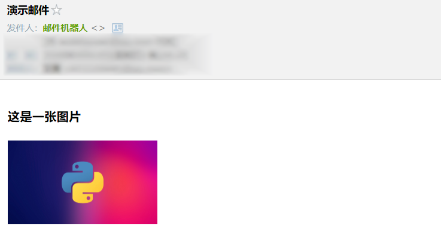
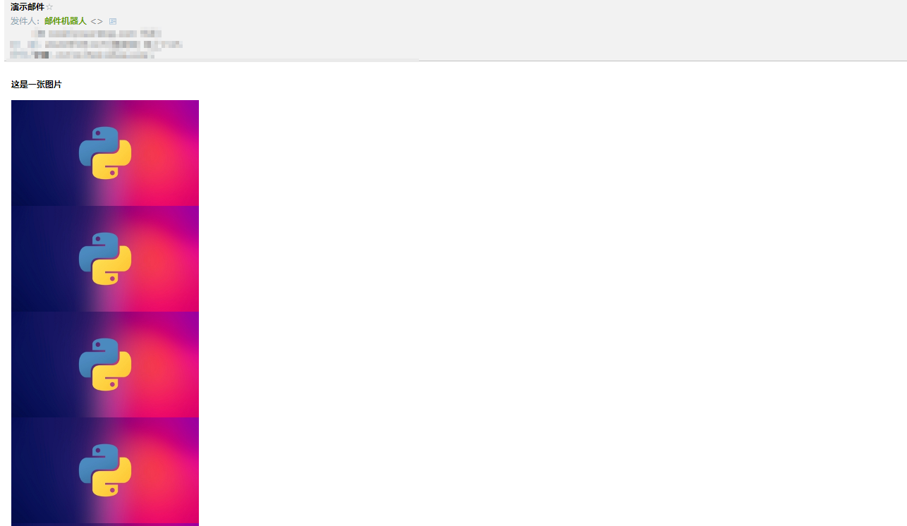
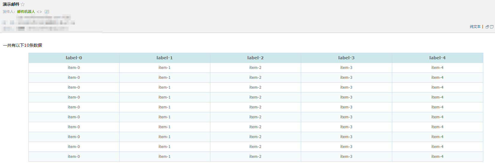

最近使用了不少通讯工具的接口, 比如企业微信机器人，钉钉，微信公众号的接口(未认证的订阅公众号)，相对于邮件来说，它们的表现形式太弱。比如没有更丰富的版本方式。当然了，并不是说表现形式越棒就是越好的通知手段，这个依个人情况而定，而我恰恰需要比较丰富的表现形式，最终还是回到了邮件，邮件真香!

> 而个人微信号的接口我没有合适的微信号可以登录，如果网页版微信没有被封的话，我想这个是表现形式与消息时效性结合的最好的方式。

## 环境
虽说就发邮件这么个小事，很容易兼容Python2, Python3, 但是大家还是拥抱Python3吧, 我这里没有做python2的兼容写法，所以需要python3以上。

## 邮件的格式
邮件的格式主要就两种: plain和html

plain就像一个普通的文本, 没有格式。

html就如其名, 是html的格式，相当于一个邮件就是一个**静态**的网页，这样的话可玩性就很高了，你可以通过css控制表现形式.

> 注意: 这里的css虽然语法一样，但，是否与浏览器渲染结果完全一致, 是不一定的。

> 那么可能有人要问了，我要发一个动态的网页怎么办? 发个链接呀

## 邮箱账号
无论是QQ邮箱抑或网易邮箱都是没有问题的，重要的是有一个可以通过smtp服务器发送邮件的账户名及密码，这里大家百度吧。


## 发送邮件的代码
因为发送邮件的代码在下面每个步骤都是一样的所以先贴出来

```
def send_email(msg, mail_to, smtp_host, smtp_username, smtp_password, subject, from_):
    msg["Subject"] = Header(subject, "utf-8")
    msg["From"] = Header(from_, "utf-8")
    if not isinstance(mail_to, list):
        mail_to = [mail_to]
    msg["To"] = COMMASPACE.join(mail_to)

    try:
        print("准备连接smtp邮件服务器: %s" % smtp_host)
        client = smtplib.SMTP(smtp_host)
        print("连接成功")
        # client = smtplib.SMTP("localhost")
        # client.set_debuglevel(1)
        # print(self.mail_user, self.mail_pass)
        client.login(smtp_username, smtp_password)
        print("登录成功")
        # print("=====>", self.mail_from, mail_to)
        print("通过邮箱[%s]发送邮件给 %s" % (smtp_username, COMMASPACE.join(mail_to)))
        client.sendmail(smtp_username, mail_to, msg.as_string())
        print("发送成功...")
        return True
    except Exception:
        print("发送邮件失败")
    finally:
        client.quit()
```

> 如果遇到邮件发送的问题可以将client.set_debuglevel(1)的注释取消，这样会显示足够多的debug信息用于排查问题。


## 发送本地图片
这里发送图片的意思是指, 图片内嵌在邮件中而不是以附件的形式出现。

效果如下:



代码如下:
```
EMAIL_IMAGE_TEMPLATE = """<html>
<head>
<title>Page Title</title>
</head>
<body>
<h3>这是一张图片</h3>
<p></p>
</body>
</html>
"""


def create_image_eamil_contant(fp):
    tpl = Template(EMAIL_IMAGE_TEMPLATE)
    if not path.exists(fp):
        sys.exit("要发送的本地图片不存在")

    msg = MIMEMultipart("related")
    image_name = "demo"

    with open(fp, "rb") as rf:
        mime_image = MIMEImage(rf.read())
        # 注意: 一定需要<>括号
        mime_image.add_header("Content-ID", "<%s>" % image_name)
        msg.attach(mime_image)

    # 渲染邮件文本内容
    text = tpl.render(image_name=image_name)
    msg_alternative = MIMEMultipart("alternative")
    msg_alternative.attach(MIMEText(text, "html", "utf-8"))

    msg.attach(msg_alternative)

    return msg
```

如果你使用过python的web框架，你对文本的渲染一定不陌生，因为大多数web框架都支持文本渲染，这里使用的jinja2.


## 发送程序生成的照片
其实这里跟上面没什么区别的，唯一的区别就是是否保存在本地，既然能发送本地图片，我就先保存到本地然后再按照上面的方式不就可以了么? 首先这个方法是没有问题的，不过多了一次IO, 能在内存中解决的事为什么要放到本地呢？

> 这种情况主要是应对回去图片的方式是从其他接口获取到的，或者实时生成的时候。虽然很简单，但觉得说说也挺有意思的。

这里的模拟方式是假设在网上获取到了多张base64编码的图片，需要将其组合在一起，然后在不保存在本地情况下直接发送这张照片。

> 这个base64编码的图片已经保存在本地了，名字是demo_base64.txt

效果如下:



代码如下:
```
EMAIL_ONLINE_IMAGE_TEMPLATE = """<html>
<head>
<title>Page Title</title>
</head>
<body>
<h3>这是一张图片</h3>
<p></p>
</body>
</html>
"""

def create_online_image_content():
    from PIL import Image

    tpl = Template(EMAIL_ONLINE_IMAGE_TEMPLATE)
    fp = "demo_base64.txt"
    if not path.exists(fp):
        sys.exit("要发送的base64编码的图片不存在")

    msg = MIMEMultipart("related")
    image_name = "demo"

    with open(fp, "rb") as rf:
        base64_data = rf.read()
        img_data = base64.b64decode(base64_data)
        # 因为open方法需要一个file-like文件对象，而我们解码后的对象类型是bytes类型
        # bytes类型没有文件对象的read, close方法，所以我们需要通过BytesIO对象包装一下，它会返回一个file-like文件对象
        img = Image.open(BytesIO(img_data))
        img_width, img_height = img.size

        repeat_times = 5
        # compose images
        ret_img  = Image.new(img.mode, (img_width, img_height * repeat_times))
        for index in range(repeat_times):
            ret_img.paste(img, box=(0, index * img_height))

        # 因为MIMEImage需要一个bytes对象，所以们需要获取图片编码后的二进制数据而不是图片的array数据
        img_bytes = BytesIO()
        # 如果不指定图片格式，会因为没有文件名而报错
        ret_img.save(img_bytes, "png")

        mime_image = MIMEImage(img_bytes.getvalue())
        # 注意: 一定需要<>括号
        mime_image.add_header("Content-ID", "<%s>" % image_name)
        msg.attach(mime_image)

    # 渲染邮件文本内容
    text = tpl.render(image_name=image_name)
    msg_alternative = MIMEMultipart("alternative")
    msg_alternative.attach(MIMEText(text, "html", "utf-8"))

    msg.attach(msg_alternative)

    return msg
```

> 这里很有意思一点是用BytesIO模拟file-like对象。这里需要安装PIL哦


## 发送一个带样式的静态网页
前面的代码已经足够说明图片怎么发了，这里通过一个写了css样式的表格进行演示

效果如下:



代码如下:
```
EMAIL_TEMPLATE = """<html>
<head>
    <style type="text/css">
        table
        {
            border-collapse: collapse;
            margin: 0 auto;
            text-align: center;
        }
 
        table td, table th
        {
            border: 1px solid #cad9ea;
            color: #666;
            height: 30px;
        }
 
        table thead th
        {
            background-color: #CCE8EB;
            width: 100px;
        }
 
        table tr:nth-child(odd)
        {
            background: #fff;
        }
 
        table tr:nth-child(even)
        {
            background: #F5FAFA;
        }
    </style> 
</head>
<body>
<p>一共有以下{{record_size}}条数据</p>
<table width="90%" class="table">
    <thead>
        <tr>
        
            <th>{{label}}</th>
        
        </tr>
    </thead>
    <tbody>

    <tr>
    
        <td>{{value}}</td>
    
    </tr>

    </tbody>
</table>
</html>"""

def create_html_content():
    tpl = Template(EMAIL_TEMPLATE)

    record_size = 10
    label_size = 5
    labels = ["label-%s" % i for i in range(label_size)]
    items = []

    for _ in range(record_size):
        item = ["item-%s" % value_index for value_index in range(label_size)]
        items.append(item)

    text = tpl.render(record_size=record_size, items=items, labels=labels)
    msg = MIMEText(text, "html", "utf-8")
    return msg
```


## 源代码地址
[https://github.com/youerning/blog/tree/master/sendmail](https://github.com/youerning/blog/tree/master/sendmail)

如果期待后续文章可以关注我的微信公众号(又耳笔记)，头条号(又耳笔记)，github.


## 后记
其实发送一个附件也是不错的方式，比如发送一个生成的PDF, PDF是一个很棒的文件格式。但是PDF暂时没用到，以后有机会再说吧。最后要注意的是，手机端的显示效果跟电脑网页版的显示效果是不一样的。


## 参考链接
[https://www.runoob.com/python/python-email.html](https://www.runoob.com/python/python-email.html)


