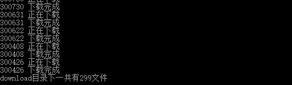
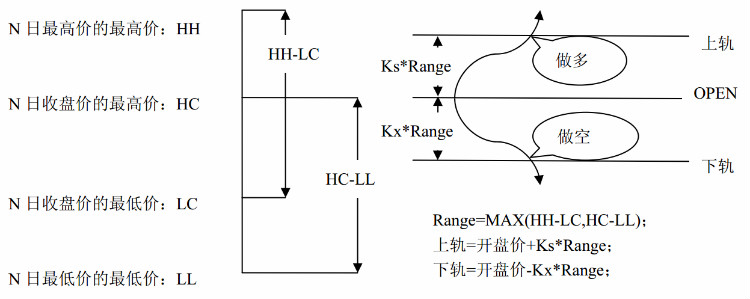
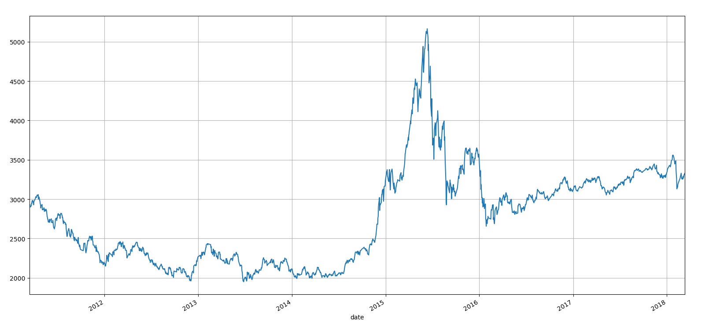
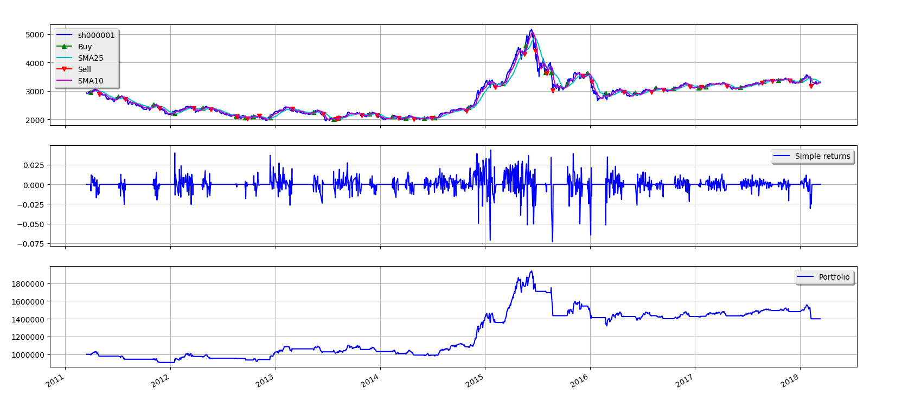

## 前言
这里并不是为了说明技术分析可行，也不是为了说明技术分析不可行，仅是以我浅薄的知识验证一些事情，测试方法及测试结果都会公布如下.

至于测试方法是否严谨, 就请读者自行判断吧。

## 数据获取
这里随机选择300支股票，并下载最近七年的日内行情数据.

### 导入必要库

```
import tushare as ts
import random
import os
import json
import datetime
```

### 筛选股票

```
num = 300
code_lis = []

# 获取中小板数据
zxb_df = ts.get_gem_classified()
zxb_lis = list(zxb_df.code)

# 获取沪深三百
hs300_df = ts.get_hs300s()
hs300_lis = list(hs300_df.code)

# 依次从中小板，沪深300中随机选取 num/2支股票代码
zxb_rand = random.sample(zxb_lis, int(num / 2))
hs300_rand = random.sample(hs300_lis, int(num / 2))

# 保存到code_lis并保存
code_lis.extend(zxb_rand)
code_lis.extend(hs300_rand)
with open(code_file, "w") as wf:
    json.dump(code_lis, wf)

return code_lis
```

> 筛选说明: 随机从中小板以及沪深300里面随机各选择150支股票用于此次测试。

### 下载数据

```
download_path = "download"
now = datetime.datetime.now()
start_time = now - datetime.timedelta(days=years * 365)
start = start_time.strftime("%Y-%m-%d")

try:
    print("{} 正在下载".format(code))
    df = ts.get_k_data(code, start=start)
    print("{} 下载完成".format(code))
except Exception as e:
    print("{} 下载失败".format(code))
    return

# 新建Adj Close字段
df["Adj Close"] = df.close

# 将tushare下的数据的字段保存为pyalgotrade所要求的数据格式
df.columns = ["Date", "Open", "Close", "High", "Low", "Volume", "code", "Adj Close"]

# 将数据保存成本地csv文件
df.to_csv(save_path, index=False)
```

 可直接执行源代码 里面的downloader.py文件
 
 执行结果如下
 
 

最后数据文件结构如下:

```
Date,Open,Close,High,Low,Volume,code,Adj Close
2011-03-10,5.606,5.488,5.606,5.477,308493.0,000001,5.488
2011-03-11,5.464,5.42,5.501,5.413,230166.0,000001,5.42
2011-03-14,5.403,5.461,5.467,5.4,217999.0,000001,5.461
2011-03-15,5.41,5.349,5.437,5.302,284381.0,000001,5.349
2011-03-16,5.356,5.386,5.403,5.315,242075.0,000001,5.386
2011-03-17,5.342,5.305,5.369,5.295,207262.0,000001,5.305
2011-03-18,5.366,5.346,5.366,5.319,145243.0,000001,5.346
2011-03-21,5.336,5.326,5.366,5.309,160157.0,000001,5.326
```
> 注: 这里下载每只股票最近七年的日内行情数据，但是并不是所有的公司都上市了七年。
> 源代码参考:[donwloader.py](https://github.com/youerning/blog/blob/master/stock-analysis/downloader.py)


## 策略选取
策略的选择原则是不会涵盖大量的计算。单纯通过开收高低、前复权收盘价、交易量这些基本数据用于决策买入卖出。
> 注: 关于策略的选择以及其参数这里有很大的主观成分。

**选择策略如下**
### 双均线策略
双均线策略应该是最简单的策略了，主要原理是,选择一条短期的移动平均线，一条长期的移动平均线，当短期移动平均线向上突破长期移动平均线则买入，反之，则卖出。

这里选择10日的短期移动平均线，25日的长期移动平均线。


### 随机策略
这个策略用来随机选择买入时间点,然后20个交易日后卖出.

瞧瞧随机的力量。

### 海龟交易策略
- 市场: A股市场
- 仓位: 通过市场波动性调整及管理仓位.具体计算流程如下。
    1. True Range

        True Range = Maximum(H − L, H − PDC, PDC − L)
        > 公式中, True Range代表一天内的波动量,H为当日最高价, L为当日最低价, PDC为前一日收盘价.
    
    2. N
    
        N= (19 * PDN + TR) / 20

        > 公式中:TR为True Range,即一天波动量,PDN为前一日N值。如果没有PDN则取TR的二十日平均值.
    
    3. Doller Volatility
    
        Dollar Volatility =N  ∗DollarsPerPoint
        
        > 公式中, Dollar Volatility指的是波动的价格，Dollars per Point指的是标的股票每波动一个最小单位，1手股票的总价格变化量。在国内最小变化量是0.01元，1手是100股。所以Dollars per Point就是0.01×100=1
    
    4. Unit
    
        Unit = (1 % of AccountMarketDollar) / Volatility
        
        > 公式中, Unit即为我们买卖的单位，1% of Account是总资产的1%，Market Dollar Volatility就是我们之前算出的Dollar Volatility，通过此公式计算出的Unit就是我们要买入的单位数量。此公式的意义是在一般情况下（市场波动率不大的时候），如果买入1Unit单位的资产，当天震幅使得总资产的变化不超过1%
        
- 入市: 海龟有两个交易系统，可以自由选择，这里只选择系统一。

    **系统一**
    
    1.若当前价格高于过去20日的最高价，则买入一个Unit（注意是分钟回测）
    
    2.加仓：若股价在上一次买入（或加仓）的基础上上涨了0.5N，则加仓一个Unit
    
    **系统二**
    
    与系统一相一致，但当如破55日最高价时才购买
    
    1.若当前价格高于过去55日的最高价，则买入一个Unit.
    
    1.加仓：若股价在上一次买入（或加仓）的基础上上涨了0.5N，则加仓一个Unit

    > Example：若某只股票A的N为2，20日最高价为100，则当股价突破100时买入一个Unit，当股价突破100+0.5×2=101时加仓一个Unit，当股价突破101+0.5×2=102时加仓一个Unit。

- 止盈:

    **系统一**

    当股价跌破10日内最低价时（10日唐奇安通道下沿），清空头寸结束本次交易

    **系统二**

    当股价跌破20日内最低价时（20日唐奇安通道下沿），清空头寸结束本次交易


- 技巧: 资金的调整。

    开始时设定两个比例：Loss和Adjust。若交易结束后损失的资金占总资金比例大于Loss，则今后只用现有投资资金的Adjust比例。
    > Example：若初始资金为100万，设定Loss=80%，Adjust=90%。则当总资产低于100×80%=80万时，进行一次资金调整，以后只使用80×90%=72万的资金用于投资行为

> 参考链接:https://www.joinquant.com/post/c1747eae8096b5028e471892bef0cf1d?f=stydy&m=algorithm

### Dual Thrust交易策略
- 计算触发值

  1)N日High的最高价HH, N日Close的最低价LC;
  
  (2)N日Close的最高价HC，N日Low的最低价LL;
  
  (3)Range = Max(HH-LC,HC-LL)
  
  (4)BuyLine = Open + K * Range
  
  (5)SellLine = Open + K * Range

策略模型参考下图



- 入市

  (1)当价格向上突破上轨时，如果当时持有空仓，则先平仓，再开多仓；如果没有仓位，则直接开多仓；
  
  (2)当价格向下突破下轨时，如果当时持有多仓，则先平仓，再开空仓；如果没有仓位，则直接开空仓；
  
  > 用于A股只能做过所以不用卖空策略卖空策略用于离市.K值使用0.3, 由于这个k值没有参数调优过，完全是随便想的值，所以可能让dual thrust策略的效果没有发挥到最大。

- 止损: 无

这里N日的值取15天。

> 参考链接: https://www.joinquant.com/post/274


### 源代码
> 由于代码段并非几十行, 会占据文章很大篇幅,请参考GitHub链接:[stock-analysis](https://github.com/youerning/blog/tree/master/stock-analysis)

## 测试结果分析
> 分析说明: 由于个人水平有限，所以只能以我浅薄的知识来解释我看到的，如果你有兴趣做出自己的解读，可以翻看源代码，自行测试。就不用说我业余了，我的确是业余玩家^_^

再者这里的测试**至少是存在以下问题的**。
1. 实际交易中,在涨停板或跌停板不一定能买得进去或卖的出去.
2. 实际交易中买入或卖出的价格并没有回测中那么理想
3. 实际交易中，不会只买一只股票。

我关注的测试结果主要如下:
- 该策略是否适用于所有股票，即测试的所有股票都能盈利么，如果不是，那么盈利的概率如何。
- 回撤比例。

所以选择以下指标用于分析结果
- 最终收益情况
- 最大回测比例
- 交易次数

最终产生数据格式如下
```
code,cum return,end,max drawdown,start,trade count
000008,99.6340721572,2018-03-12,37.6096792448,2011-03-22,24
000060,-34.5886186243,2018-03-12,49.0665092914,2011-03-15,35
000063,36.5405019876,2018-03-12,44.1047335728,2011-03-15,38
000069,-61.6228879039,2018-03-12,64.7843454103,2011-03-15,41
000100,88.7160620486,2018-03-12,44.7998410399,2011-03-15,29
```

> 这里的cum return指累计收益，max drawdown指最大回撤比例，单位都是%

### 上证指数走势图

首先瞧瞧上证指数走势图
执行以下命令
```
python index_data.py
```




这里选择近七年的数据，我觉得还是可以的，因为有横盘期，上涨期，下跌期，所以可以检验策略是否能够逃过下跌期，以及能不能在横盘期有所作为。因为本文可能更注重的是如何获取数据，及编写策略，最后数据分析


以下输出通过执行以下命令:

```
python strategy_sma.py index
python strategy_random.py index
python strategy_dual_trust.py index

```

#### 上证指数双均线策略收益图
输出如下
```
start at 2011-03-16
Total trades: 35
Final portfolio value: $1399434.50
Cumulative returns: 39.94 %
Max. drawdown: 31.97 %
end at 2018-03-13
```
收益图如下



#### 上证指数随机策略收益图
输出如下
```
Total trades: 73
Final portfolio value: $1173928.61
Cumulative returns: 17.39 %
Max. drawdown: 38.10 %
end at 2018-03-13
```

收益图如下


#### 上证指数daul thrust策略收益图
输出如下
```
start at 2011-03-16
Total trades: 32
Final portfolio value: $1860958.06
Cumulative returns: 86.10 %
Max. drawdown: 21.70 %
end at 2018-03-13
```
收益图如下


> 值得注意的是用tushare下载的上证指数的数据可能是有问题的,因为2015-03-27这天的最低价(Low)居然大于开盘价(Open)!!!

> 这里对上证指数的回测是基于上证指数可买，并且价格是指数值，并且可买一股。

### 股票双均线策略结果
```
# 读取双均线策略输出结果
sma = pd.read_csv("result/strategy_sma.csv")

# 查看数据前5条
sma.head()
   code  cum return         end  max drawdown       start  trade count
0     8   99.634072  2018-03-12     37.609679  2011-03-22           24
1    60  -34.588619  2018-03-12     49.066509  2011-03-15           35
2    63   36.540502  2018-03-12     44.104734  2011-03-15           38
3    69  -61.622888  2018-03-12     64.784345  2011-03-15           41
4   100   88.716062  2018-03-12     44.799841  2011-03-15           29

# 统计结果
sma.describe()
                code   cum return  max drawdown  trade count
count     299.000000   299.000000    299.000000   299.000000
mean   348897.023411    52.958878     46.737723    24.498328
std    202821.008968   127.114389     14.790231    12.048942
min         8.000000   -70.380766      4.832993     0.000000
25%    300140.500000   -16.502707     37.721394    13.000000
50%    300452.000000    20.156509     46.572972    29.000000
75%    600192.500000    73.175792     58.063121    34.000000
max    603858.000000  1236.661103     78.002843    42.000000
```

### 股票随机策略结果
```
rand = pd.read_csv("result/strategy_random.csv")

rand.head()
Out[120]: 
   code  cum return         end  max drawdown       start  trade count
0     8   57.171853  2018-03-12     42.133326  2011-03-22           41
1    60    0.717321  2018-03-12     64.914506  2011-03-15           64
2    63   38.541158  2018-03-12     63.594804  2011-03-15           58
3    69  -13.064397  2018-03-12     48.498738  2011-03-15           70
4   100   48.973887  2018-03-12     42.911270  2011-03-15           58

rand.describe()
Out[121]: 
                code  cum return  max drawdown  trade count
count     299.000000  299.000000    299.000000   299.000000
mean   348897.023411   37.561896     53.839700    40.755853
std    202821.008968   98.958464     15.073869    20.628316
min         8.000000  -78.754755      6.127005     1.000000
25%    300140.500000  -29.201594     43.073549    22.000000
50%    300452.000000    5.418000     54.826874    45.000000
75%    600192.500000   69.043188     64.120164    59.000000
max    603858.000000  651.783545     90.516418    73.000000
```

### 股票dual thrust策略结果
```
dual = pd.read_csv("result/strategy_dual_trust.csv")

dual.head()
Out[123]: 
   code  cum return         end  max drawdown       start  trade count
0     8   -1.724564  2018-03-12     47.924826  2011-03-22           21
1    60  -15.859906  2018-03-12     48.323636  2011-03-15           30
2    63   46.218235  2018-03-12     59.273602  2011-03-15           35
3    69   22.708655  2018-03-12     33.797895  2011-03-15           34
4   100  140.985523  2018-03-12     39.504217  2011-03-15           24

dual.describe()
Out[24]: 
                code  cum return  max drawdown  trade count
count     299.000000  299.000000    299.000000   299.000000
mean   348897.023411   43.451147     46.518626    21.548495
std    202821.008968   95.254409     17.610361    11.283421
min         8.000000  -71.021800      0.000000     0.000000
25%    300140.500000  -17.341418     33.842472    11.000000
50%    300452.000000   17.209486     46.212199    25.000000
75%    600192.500000   75.395195     60.644285    31.000000
max    603858.000000  838.836061     82.656125    46.000000
```

> 由于pyalgotrade框架自身的限制，我在这个交易策略中按照EventWindow的模式自行建立一个EventWindow的类。

### 海龟交易策略结果
以后补上

### 收益分析
从上面的回测结果你会发现累计收益无论是最大值还是平均值都是双均线策略.

交易频繁的是dual thrust

但是上面的分析其实是有问题的，因为这些股票中有很多的股票可能上市事件不长，所以会产生很大的误导，因为太短时间的回测有很大的随机性，这会导致，以为这个策略很好但是，其实知识恰好而已。

当然了, 我这里的测试，其实也有一个很大的随机因素的占比。

这里让我们将上市时间小于七年的股票去除，再次查看收益情况

回测股票数据如下
```
python strategy_sma.py
python strategy_randome.py
python strategy_dual_trust.py
```


#### 双均线策略
```
sma[sma.start > pd.to_datetime("2011-03-15")].describe()
Out[32]: 
                code  cum return  max drawdown  trade count
count     151.000000  151.000000    151.000000   151.000000
mean   332525.701987   31.358881     44.409062    15.390728
std    143561.914878  112.389358     16.168624    10.214352
min         8.000000  -70.380766      4.832993     0.000000
25%    300299.500000  -23.127234     33.424244     6.000000
50%    300470.000000    2.206130     44.971140    13.000000
75%    300637.500000   33.425479     56.288630    24.500000
max    603858.000000  828.628299     78.002843    37.000000
```
#### 随机策略
```
rand[sma.start > pd.to_datetime("2011-03-15")].describe()
Out[33]: 
                code  cum return  max drawdown  trade count
count     151.000000  151.000000    151.000000   151.000000
mean   332525.701987   17.033825     52.263797    24.821192
std    143561.914878   86.767753     16.254297    15.643140
min         8.000000  -70.347804      6.127005     1.000000
25%    300299.500000  -34.364267     42.012492    10.500000
50%    300470.000000   -4.734439     54.193410    22.000000
75%    300637.500000   40.879252     63.065449    38.500000
max    603858.000000  651.783545     88.746525    60.000000
```

#### dual thrus策略
```
dual[sma.start > pd.to_datetime("2011-03-15")].describe()
Out[34]: 
                code  cum return  max drawdown  trade count
count     151.000000  151.000000    151.000000   151.000000
mean   332525.701987   24.231603     43.172343    13.284768
std    143561.914878   74.396766     19.763869     9.501142
min         8.000000  -65.661905      0.000000     0.000000
25%    300299.500000  -22.606043     28.152275     5.000000
50%    300470.000000   -0.466305     42.328093    11.000000
75%    300637.500000   48.149141     60.095440    21.500000
max    603858.000000  328.261149     82.357505    35.000000
```

最后瞧瞧获得收益的概率
这里假设最低基准是支付宝的收益，即4%，如果七年后的收益小于31%都是亏损的，计算方法如下。

```
from math import pow

pow(1.04, 7)
Out[38]: 1.3159317792358403
```

双均线策略盈利概率
```
len(sma[sma.start > pd.to_datetime("2011-03-15")][sma["cum return"] > 31])/len(sma[sma.start > pd.to_datetime("2011-03-15")])

Out[40]: 0.271523178807947

```

随机策略盈利概率
```
len(rand[sma.start > pd.to_datetime("2011-03-15")][rand["cum return"] > 31])/len(rand[sma.start > pd.to_datetime("2011-03-15")])

Out[42]: 0.2913907284768212
```

dual thrust策略盈利概率
```
len(dual[sma.start > pd.to_datetime("2011-03-15")][dual["cum return"] > 31])/len(dual[sma.start > pd.to_datetime("2011-03-15")])

Out[43]: 0.2847682119205298
```

## 总结
好吧，就收益分析而言居然随机策略的盈利概率居然大于其他两个策略,而且概率都小于50%.

这里的分析还是有很大的局限性，比如数据的频度，以及样本的大小。

所以就就这个不太严谨的回测分析会发现，在时间长度为七年的条件下，单纯技术分析似乎胜率不大，但是这里没有在回测之前筛选一些股票，是一个不太现实的问题，比如一些基本面的数据。再者这里没有设置调仓，且是全仓。这里当且仅当是股票分析的一篇分析层次超浅的文章吧。

后面会写pyalgotrade的源码分析以及使用说明.


### 最后的最后
关注以下再走吧。。。^_^

