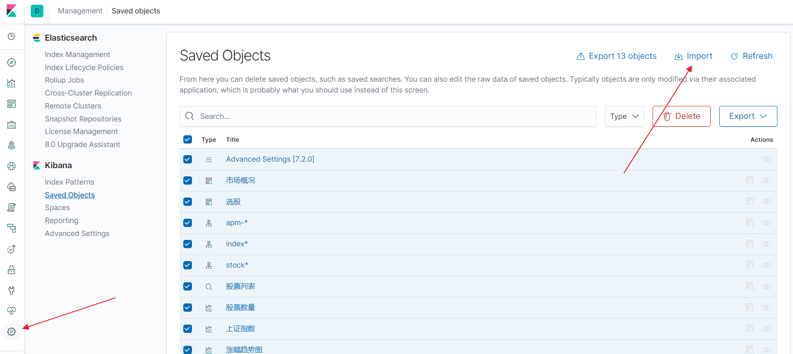
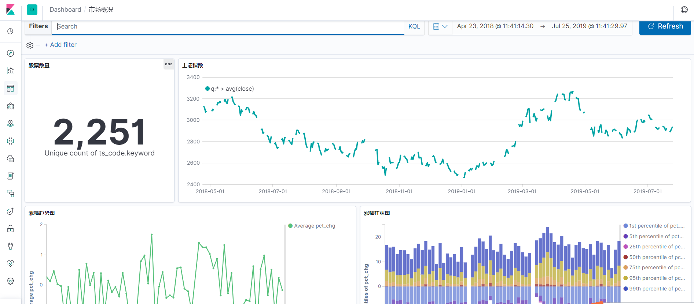
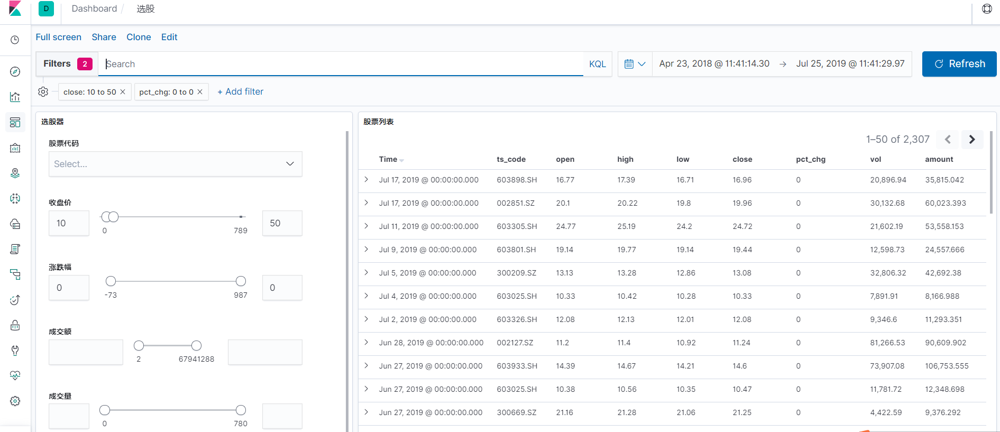

# python股票市场数据探索指北
## 前言
虽然同花顺之类的金融理财应用的数据足够好了，但还是有自己定制的冲动, 数据自然不会不会比前者好很多，但是按照自己的想法来定制还是不错的。

## 目标
通过免费的数据接口获取数据，每日增量更新标的历史交易数据, 然后通过Kibana做可视化及数据分析.

其实自己通过echarts之类的可视化框架做可视化也是个不错的选择，不过前期成本太大。还有就是pandas+matplotlib已经足以应付大部分需求了，可是交互感太弱，所以借助一个可视化应用是很有必要的，这里选择的是kibana, 它的竞品有Grafana.

这个目标应该会一直下去吧，大家可以通过以下链接获取代码

https://github.com/youerning/stock_playground

## 环境配置
Python3(推荐Anaconda安装)

安装相关依赖：

```
pip install -r requirement.txt
```

配置eleasticsearch, kibana环境(推荐使用docker)

> Elasticsearch, Logstash, Kibana 7.2.0


## 数据源
获取数据的方式有很多种，收费或者免费，作为业余爱好者自然选择免费的，这里选择 tushare.pro, 但其实tushare会有一点限制, 如获取数据的频率有一定的限制，并且接口也有限制, 需要很多积分。如果大家对这个有兴趣注册，就通过我的推荐链接注册呗, 这样我可以跟大家分享更多关于数据可视化的内容,以及将我下载下来的数据分享出来。

> https://tushare.pro/register?reg=277890

> 值得注意的是, tushare其实也是有几乎没限制的免费版本的. 但是pro版本数据更全，为了避免后期维护成本，所以选择pro版本。

其实还有其他的免费的数据获取方式的，大家可以自己尝试
1. [pytdx](https://github.com/rainx/pytdx)
2. [fooltrader](https://github.com/foolcage/fooltrader)
3. [QUANTAXIS](https://github.com/QUANTAXIS/QUANTAXIS)

## 获取数据
配置自己的token
```
import tushare as ts
ts.set_token("<your_token>")
pro = ts.pro_api("<your_token>")
```

关于Token的获取可以参考一下链接
> https://tushare.pro/document/1?doc_id=39

尝试手动获取数据
```
通过日期取历史某一天的全部历史
df = pro.daily(trade_date='20190725')

df.head()
ts_code	trade_date	open	high	low	close	pre_close	change	pct_chg	vol	amount	value
0	000032.SZ	20190725	9.49	9.60	9.47	9.56	9.49	0.07	0.7376	12658.35	12075.625	8906.981000
1	000060.SZ	20190725	4.39	4.40	4.35	4.36	4.39	-0.03	-0.6834	129331.65	56462.292	-38586.330353
2	000078.SZ	20190725	3.37	3.38	3.35	3.38	3.37	0.01	0.2967	76681.00	25795.633	7653.564311
3	000090.SZ	20190725	5.66	5.66	5.56	5.61	5.64	-0.03	-0.5319	105582.72	59215.389	-31496.665409
4	000166.SZ	20190725	4.97	4.98	4.93	4.96	4.97	-0.01	-0.2012	268122.48	132793.120	-26717.975744

获取某一只股票的日线行情数据
data = ts.pro_bar(ts_code="601668.SH", adj='qfq', start_date="20120101")
data.head()
ts_code	trade_date	open	high	low	close	pre_close	change	pct_chg	vol	amount
0	601668.SH	20190726	6.01	6.06	5.98	6.03	6.04	-0.01	-0.17	696833.16	419634.547
1	601668.SH	20190725	6.05	6.07	6.02	6.04	6.04	0.00	0.00	543074.55	327829.380
2	601668.SH	20190724	6.09	6.11	6.02	6.04	6.05	-0.01	-0.17	788228.12	477542.609
3	601668.SH	20190723	5.93	6.07	5.92	6.05	5.94	0.11	1.85	1077243.46	650250.021
4	601668.SH	20190722	6.02	6.03	5.92	5.94	6.00	-0.06	-1.00	811369.73	485732.343
```

数据的获取自然是需要自动化的，但是由于接口的限制，所以需要考虑以下问题。
1. 股票列表
2. 判断是否超出接口限制，如果是，则暂停一段时间

关键代码部分

```
def save_data(code, start_date, fp):
    print("下载股票(%s)日线数据到 %s" % (code, fp))

    try:
        data = ts.pro_bar(ts_code=code, adj='qfq', start_date=start_date)
        # 当超过调用次数限制返回None
        if data is None:
            time.sleep(10)
            return
        pass_set.add(code)
    except Exception:
        time.sleep(10)
        print("股票: %s 下载失败" % code)
        return

    if len(data) == 0:
        pass_set.add(code)
        return

    try:
        data.trade_date = pd.to_datetime(data.trade_date)
        data = data.sort_values("trade_date")
        if path.exists(fp):
            data.to_csv(fp, mode="a", header=False, index=False)
        else:
            data.to_csv(fp, index=False)
    except Exception:
        print("股票:%s 保存失败" % code)
```

大家可以参考我GitHub仓库的save_data.py, 通过以下命令就可以自动下载数据了

```
python save_data.py
```

代码里面配置的起始时间是2012-01-01,有需要的课自行更改，值得注意的是需要在同级目录配置一个config.json, 内容如下

```
{
    "token": "<your_token>"
}
```
> 配上自己的token

## 配置elasticsearch, kibana
这里使用的是docker进行配置。

```
# 拉取镜像
docker pull sebp/elk:720

# 启动docker环境
docker run -p 5601:5601 -p 9200:9200 -p 5044:5044 -v /home/elasticsearch/:/var/lib/elasticsearch -itd  sebp/elk:720
```

## 转存数据
将数据上传到elasticsearch里面以便数据分析

配置settings.py

```
# 将ip:port改成自己elasticsearch地址，如192.168.56.102:9200
config["es_host"] = ["ip:port"]
```

运行代码

```
# 上传股票数据
python cmd.py dump

# 上传上证指数数据
python cmd.py dump_index
```

## 可视化
配置kibana是需要一定的时间的，好在kibana现在是大多数配置都支持导入导出，所以大家可以通过我仓库的export.ndjson文件直接导入




## 效果展示




由于现在接口受限，获取的股票因子有限，所以等我的积分更多了，我会加入更多的dashboard, 以及visualization.


## 后记
希望可以完成自己的从无到有搭建交易系统系列文章, 然后通向工作时间地点自由之路.

> 不求绝对财富自由, 但愿时间地点自由^_^

