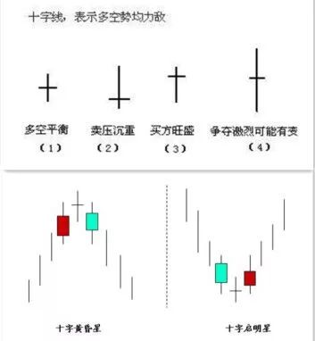

# 用Python选一个自己的股票池1
人的精力是有限的，所以将目光聚焦在更小的范围内，也许能够得到性价比最高的效果。

股票很多很多，但是我们关心的也许并不多，将自己关心或者符合自己买入股票的前提条件的股票纳入一个股票池，然后再一定时间内只关注这些股票，也许是一个不错的选择，


> 入市有风险，投资需谨慎，本文不作为任何投资参考依据。

## 数据源
这里主要指免费的，收费的ben也没用过。

比较推荐的数据源有两个tushare或者baostock.

tushare需要注册(如果你需要质量更高的数据的话)。对获取频率或者小于日线频率的数据有限制。

### 其他数据源
-  baostock    
数据不需要注册，数据有维护者维护
- akshare    
数据源来源于各类财经网站
- pytdx    
通过通达信的数据接口获取的数据

> 如果大家想注册tushare的话, 可以使用我的分享链接: https://tushare.pro/register?reg=277890  这样我能多50积分^_^

使用何种方式获取数据都是可以的，看自己喜欢。

### 安装
安装很简单
```
pip install tushare
pip install baostock
pip install akshare
pip install pytdx
```

## 数据获取

这里使用为了接下来的操作需要将一定历史范围的股票数据下载下来，这里下载起始时间为20160101，截至时间为运行代码的时间范围的历史日线数据。

这里以tushare为例, tushare获取历史数据有两种方式。

第一种是以迭代历史交易日的方式获取所有历史数据，假设获取三年的历史数据，一年一般220个交易日左右，那么3年需要请求660多次左右，如果以这种方式的话，就下载数据的时间只需要1分钟多点的样子。

第二种是以迭代所有股票代码的方式获取所有历史数据，股票数量有大概3800多个，需要请求3800多次，但是在积分有限的情况下一分钟最多请求500次，也就意味着仅下载数据的时间至少需要大概8分钟时间。


> 理论上，你获取的历史范围超过17.3年，那么使用第一种方式才比第二种方式快。


这两种方式我实现了，大家可以参考以下代码.

首先是一些必要的设置及额外的重试机制。
```
DATE_FORMAT = "%Y%m%d"
TS_TOKEN = "<你的Tushare Token>"
ts.set_token(TS_TOKEN)
pro = ts.pro_api(TS_TOKEN)

def retry(fn, max_retry=3, sleep_init=14):
    """简单的retry函数"""
    count = 1
    while count < max_retry:
        count += 1
        try:
            return fn()
        except Exception as e:
            # traceback.print_exc("")
            # 等待时间递增
            time_sleep = sleep_init * count + 1
            print("遇到异常%s, 在%s秒后再次尝试第%s次" % (e, time_sleep, count))
            time.sleep(time_sleep)
            
def save_to_csv(ret, data_path="stock"):
    if not path.exists(data_path):
        # 如果父目录不存在不会报错
        os.makedirs(data_path)

    for ts_code, df in ret.items():
        fname = "-".join([ts_code, ".csv"])
        fp = path.join(data_path, fname)

        df.to_csv(fp, index=False)
```

第一种方式
```
def download_by_trade_date(start_date, end_date, data_path="by_trade_date", worker_size=2, debug=False):
    """
    通过交易日来遍历时间范围内的数据，当交易日的个数小于股票的数量时，效率较高.
    
    一年一般220个交易日左右，但是股票却有3800多个，那么通过交易日来下载数据就高效的多了
    """
    now = datetime.now()
    start_time = now
    try:
        start_date_ = datetime.strptime(start_date, DATE_FORMAT)
        end_date_ = datetime.strptime(end_date, DATE_FORMAT)
        
        if end_date_ < start_date_:
            sys.exit("起始时间应该大于结束时间")

        if start_date_ > now:
            sys.exit("起始时间应该大于当前时间")            

        if end_date_ > now:
            end_date = now.strftime(DATE_FORMAT)

    except Exception:
        traceback.print_exc("")
        sys.exit("传入的start_date[%s]或end_date[%s]时间格式不正确, 格式应该像20200101" % (start_date, end_date))

    # 获取交易日历
    try:
        trade_cal = pro.trade_cal(exchange="SSE", is_open="1", 
                                    start_date=start_date, 
                                    end_date=end_date,
                                    fields="cal_date")
    except Exception:
        sys.exit("获取交易日历失败")

    trade_date_lst = trade_cal.cal_date
    pool = ThreadPoolExecutor(max_workers=worker_size)
    print("准备开始获取 %s到%s 的股票数据" % (start_date, end_date))

    def worker(trade_date):
        # 用偏函数包装一下
        # pro = ts.pro_api(TS_TOKEN)
        fn = partial(pro.daily, trade_date=trade_date)
        return retry(fn)

    # 最终保存到一个列表中
    ret = defaultdict(list)
    # future 列表
    fs_lst = []

    # 通过线程并发获取数据
    for trade_date in trade_date_lst:
        # print(trade_date)
        # 这里不使用pool.map的原因是, map返回的future列表会乱序
        # submit的位置参数不需要需要放到可迭代对象里面(一般是元组), 卧槽。。。
        fs = pool.submit(worker, trade_date)
        fs_lst.append(fs)
        # break

    # *****************************
    # 获取每个交易日的股票数据
    # *****************************
    for trade_date, fs in zip(trade_date_lst, fs_lst):
        if debug:
            print("开始获取交易日[%s]的数据" % trade_date)

        # 如果有异常或者结果为空的话
        if fs.exception() or not isinstance(fs.result(), pd.DataFrame):
            print(fs.exception())
            sys.exit("在交易日[%s]超过重试最大的次数也没有获取到数据" % trade_date)

        day_df = fs.result()
        columns = day_df.columns
        # 遍历一个交易日的所有股票数据
        # print(datetime.now())
        # 遍历day_df.values 大概2ms 
        # 2 ms ± 63.2 µs per loop (mean ± std. dev. of 7 runs, 1000 loops each)
        # 遍历day_df.iterrows() 大概285ms
        # 285 ms ± 2.64 ms per loop (mean ± std. dev. of 7 runs, 1 loop each)
        for row in day_df.values:
            ts_code = row[0]

            ret[ts_code].append(row)
        
        # print(datetime.now())
    
    merge_start_time = datetime.now()
    new_ret = {}
    for key, value in ret.items():
        new_ret[key] = pd.DataFrame(value, columns=columns) 
    merge_end_time = datetime.now()
    # 组合[series...] 需要142ms
    # 142 ms ± 1.12 ms per loop (mean ± std. dev. of 7 runs, 10 loops each)
    # 组合[array....] 需要6.56ms
    # 6.56 ms ± 66.9 µs per loop (mean ± std. dev. of 7 runs, 100 loops each)
    print("合并共花费时间: %s" % (merge_end_time - merge_start_time))
    # *****************************
    # 获取将结果保存到本地的csv文件中
    # *****************************
    print("数据已经获取完毕准备保存到本地")
    save_to_csv(new_ret, data_path=data_path)
    end_time = datetime.now()
    print("*****************************")
    print("下载完成, 共花费时间%s" % (end_time - start_time))
    print("*****************************")
```

第二种方式
```
def download_by_ts_code(start_date, end_date, data_path="by_ts_code", debug=False, worker_size=3):
    """因为按股票代码的方式实在太慢了(如果你宽带速度比较快的话), 也就没必要多线程了"""
    now = datetime.now()
    start_time = now
    try:
        start_date_ = datetime.strptime(start_date, DATE_FORMAT)
        end_date_ = datetime.strptime(end_date, DATE_FORMAT)
        
        if end_date_ < start_date_:
            sys.exit("起始时间应该大于结束时间")

        if start_date_ > now:
            sys.exit("起始时间应该大于当前时间")

        if end_date_ > now:
            end_date = now.strftime(DATE_FORMAT)

    except Exception:
        traceback.print_exc("")
        sys.exit("传入的start_date[%s]或end_date[%s]时间格式不正确, 格式应该像20200101" % (start_date, end_date))
    
    def worker(ts_code):
        fn = partial(ts.pro_bar, ts_code=ts_code, adj='qfq', start_date=start_date, end_date=end_date)
        return retry(fn)

    pool = ThreadPoolExecutor(max_workers=worker_size)
    print("准备开始获取 %s到%s 的股票数据" % (start_date, end_date))
    # 不指定任何参数会获取5000条最近的数据，ts_code会重复
    day = pro.daily()

    # 固定顺序，set是无法包装有序的
    all_ts_code = list(set(day.ts_code))
    fs_lst = []

    for ts_code in all_ts_code:
        fs_lst.append(pool.submit(worker, ts_code))
        # break

    for ts_code, fs in zip(all_ts_code, fs_lst):
        # 如果有异常或者结果为空的话
        if fs.exception() or not isinstance(fs.result(), pd.DataFrame):
            print(fs.exception())
            sys.exit("在交易日[%s]超过重试最大的次数也没有获取到数据" % trade_date)

        df = fs.result()
        # %timeit df.sort_index()
        # 192 µs ± 3.73 µs per loop (mean ± std. dev. of 7 runs, 10000 loops each)

        # %timeit df.sort_index(inplace=True)
        # 2.54 µs ± 177 ns per loop (mean ± std. dev. of 7 runs, 100000 loops each)
        df.sort_index(inplace=True, ascending=False)

        if not isinstance(df, pd.DataFrame):
            sys.exit("在股票[%s]超过重试最大的次数也没有获取到数据" % ts_code)

        save_to_csv({ts_code: df}, data_path=data_path)
        if debug:
            print("股票[%s]历史数据下载保存完成" % ts_code)

        
        
    end_time = datetime.now()
    print("*****************************")
    print("下载完成, 共花费时间%s" % (end_time - start_time))
    print("*****************************")
```

我感觉我写了好多注释以及一些方法之间性能对比，关于各个方法之间的性能对比大家还是需要注意的，因为虽然平时感受不出来，但是在较多次数的循环的时候就会发现性能差异了。

至此需要的历史数据就得到了。

> 如果对读写速度很在意的话，存储在sqlite数据库或者其他其他数据会快很多。

## 股票池的选择条件
无论是主观交易还是量化交易，选股的方式个人认为大概分为以下三类。

1. 技术选股    
通过技术指标比如MACD, KDJ或者K线形态等技术指标来选股。
2. 基本面选股
通过财务报表或者一些金融指标来选股。
3. 消息选股   
新闻消息或者小道消息选股。


本文主要集中在以下几种方式
1. 形态选股   
通过k线的形态找到股票中的十字星等形态。
2. 交易额/流通股本选股    
通过对交易额或者流通股本排序选择前面的股票。
3. 相似度选股   
通过选定基准股票趋势，发现相似的股票。
4. 趋势选股    
挑选最近六个月股票趋势向上的股票。


### 形态选股
股票的形态多种多样，这里以选择股票中的黄昏(早晨)十字星为例。

黄昏十字星与早晨十字星的区别在于所处趋势不一样。
图示如下:



如果需要程序判断，那么这些长度需要量化，不能模棱两可。所以根据十字星的定义，量化如下:

实体长度: 超过2.5%才算长实体，而且上下影线不能超过0.3%

十字星: 实体长度不超过1.5%

趋势: 包括十字星在内往前数6根k线，其中的第1根k线收盘价均小于它后面4根收盘价为向上趋势，反之趋势向下，并且幅度超过2.5%。


> 这里我只是主观的量化没有任何交易经验的选择，如果不认同的话，可以自行修改代码。

代码如下:
```
def select_doji():
    # fp = "by_ts_code/600249.SH-.csv"
    fp = "by_ts_code/300130.SZ-.csv"
    df = pd.read_csv(fp, index_col="trade_date", parse_dates=["trade_date"])
    df = df[["open", "high", "low", "close"]]
    
    # k线数量
    k_size = 6

    # 起始幅度大小
    treand_threshold = 0.025

    # 长实体最小长度
    entity_length_threshold = 0.025
    # 长实体上下最大影线长度
    entity_shadow_line_length_threshold = 0.03

    # 十字星实体长度最大长度
    doji_entity_length_threshold = 0.015
    # 十字星上下影线长度最小长度
    # doji_shadow_line_length_threshold = 0.005

    trend_map = {1: "向上", -1: "向下"}

    def up_or_down_trend(row):
        """1代表向上, -1代表向下, 0代表震荡"""
        first = row[0]
        last = row[-1]

        if all(first > row[1:]) and first > (last * treand_threshold):
            return -1
        elif all(first < row[1:]) and last > (first * treand_threshold):
            return 1
        else:
            return 0

    df["trend"] = df.close.rolling(k_size).apply(up_or_down_trend, raw=True)
    df.fillna(value=0, inplace=True)

    def k_sharp(k):
        """返回k线的上下影线长度, 实体长度"""
        open_, high, low, close = k[:4]
        if open_ > close:
            upper_line_length = (high - open_) / high
            lower_line_length = (close - low) / close
            entity_length = (open_ - close) / open_
        else:
            upper_line_length = (high - close) / high
            lower_line_length = (open_ - low) / open_
            entity_length = (close - open_) / close

        return upper_line_length, lower_line_length, entity_length

    def is_up_or_down_doji(k_lst, trend):
        # open, high, low, close
        if len(k_lst) != 3:
            sys.exit("判断十字星需要三根K线")

        is_ok = False
        k1, k2, k3 = k_lst

        # 判断是否跳空
        # 通过high, close过于严格      
        if trend > 0:
            # 趋势向上时,最低点是否大于两个实体的最高价
            if k2[0] < k1[1] or k2[0] < k3[1]:
            # if k2[0] < k1[1] :
                return is_ok
        else:
            # 趋势向下时,最高点是否小于两个实体的最高价
            if k2[0] > k1[2] or k2[0] > k3[2]:
                return is_ok 

        k1_sharp = k_sharp(k1)
        # print("k1 sharp")
        # print(k1_sharp)
        # 判断是否为长实体
        if (k1_sharp[2] < entity_length_threshold 
            or k1_sharp[0] > entity_shadow_line_length_threshold 
            or k1_sharp[1] > entity_shadow_line_length_threshold):
            return is_ok

        k3_sharp = k_sharp(k3)
        # print("k3 sharp")        
        # print(k3_sharp)
        if (k3_sharp[2] < entity_length_threshold 
            or k3_sharp[0] > entity_shadow_line_length_threshold 
            or k3_sharp[1] > entity_shadow_line_length_threshold):
            return is_ok

        # print("ok")
        # 判断是否为十字星
        k2_sharp = k_sharp(k2)
        # print("k2 sharp")        
        # print(k2_sharp)
        # 实体长度不超过0.2%, 上下影线长度超过0.6%, 如果规定上下影线的长度不太好找
        # if (k2_sharp[2] > doji_entity_length_threshold
        #     or k2_sharp[0] < doji_shadow_line_length_threshold
        #     or k2_sharp[1] < doji_shadow_line_length_threshold):
        
        if k2_sharp[2] > doji_entity_length_threshold:
            return is_ok

        return True

    df_values = df.values
    ret = []

    for index in range(len(df_values)):
        if index < k_size:
            continue
        
        trend = df_values[index - 1][-1]
        if trend == 0:
            continue

        val_slice = slice(index-2, index+1)
        k_lst = df_values[val_slice]
        if is_up_or_down_doji(k_lst, trend):
            ret.append(index-1)
            print("在>>%s<<<找到趋势为[%s]的十字星" % (df.index[index-1], trend_map[trend]))

    if not ret:
        print("没有发现任何十字星")
    
    ax = ohlc_plot(df[["open", "high", "low", "close"]])
    for i in ret:
        # print(i)
        mark_x = df.index[i]
        # mark_y = df.loc[mark_x].low
        # print(mark_x, mark_y)
        ax.axvline(mark_x)
    plt.show()

    return ret
```
结果如下:


说实话标准的不太好找，所以代码的条件设置不是很严格。

> 形态选股很有意思，以后有机会单独出一篇文章。


### 交易额/流通股本选股
通过交易额过滤，选择股票最近一百个交易日的成交额平均值，然后进行排序。

交易额排序
```
def select_by_amount(data_path, top_size=20):
    # 或许交易日比较好
    day_range = 100

    all_df = load_all_local_data(data_path, tail_size=day_range)
    ret = []
    for ts_code, df in all_df.items():
        df["amount_avg"] = df.amount.rolling(day_range).mean()
        amount_avg = df["amount_avg"][-1]

        # NaN的布尔值为True, 所以需要np.isnan判断
        if np.isnan(amount_avg):
            continue

        ret.append((ts_code, amount_avg))

    ret.sort(key=lambda x:x[1])
    print("交易额排名前%s的结果如下" % top_size)
    print(ret[-top_size:])
    return ret[-top_size:]
```


结果如下。
```
[('002714.SZ', 2162871.9387400015), ('000002.SZ', 2294273.739109999), ('002460.SZ', 2372975.2177099977), ('600745.SH', 2461243.4350499995), ('601990.SH', 2551214.2825800003), ('603986.SH', 2679324.4020000002), ('600703.SH', 2759167.96963), ('002456.SZ', 2759314.642220001), ('000651.SZ', 2782179.0211499995), ('000100.SZ', 2853012.22389), ('002185.SZ', 3149773.6836400027), ('000858.SZ', 3168871.2845699983), ('002475.SZ', 3392269.47999), ('300750.SZ', 3511882.7076800014), ('600030.SH', 4039920.83439), ('000725.SZ', 4189700.4488400007), ('300059.SZ', 4447245.855129998), ('600519.SH', 4448082.42745), ('601318.SH', 4892206.13003), ('000063.SZ', 5128169.27109)]
```

流通市值排序
```
def select_by_float_market_value(trade_date, top_size=20):
    df = pro.daily_basic(ts_code='', trade_date=trade_date, fields="ts_code,close,float_share")

    ret = []
    for row in df.values:
        ts_code = row[0]
        float_market_value = row[1] * row[2]

        if np.isnan(float_market_value) or not float_market_value:
            continue
        
        ret.append((ts_code, float_market_value))

    ret.sort(key=lambda x:x[1])
    print("流通市值名前%s的结果如下" % top_size)
    print(ret[-top_size:])
    return ret[-top_size:]
```
结果如下
```
交易额排名前20的结果如下
[('000002.SZ', 24443367.828188002), ('000001.SZ', 25072232.462559998), ('601088.SH', 26237241.386405), ('600000.SH', 28497216.593586), ('601166.SH', 30952865.369478), ('000651.SZ', 33204757.629185997), ('603288.SH', 36720702.433056), ('600900.SH', 36894000.0), ('000333.SZ', 39063915.66100799), ('600028.SH', 40612052.69455), ('600276.SH', 42312945.987192), ('000858.SZ', 54753808.6884), ('601628.SH', 54786707.43), ('600036.SH', 69375140.114727), ('601857.SH', 70759948.006466), ('601988.SH', 72081806.077332), ('601318.SH', 75958643.459976), ('601288.SH', 99096634.04564801), ('601398.SH', 136154167.33219498), ('600519.SH', 166848191.796)]
```

> 这种方式比较简单，但是一般还需要一些其他的条件相互配合。


## 参考链接
[如何优雅高效的撸数据？](https://tushare.pro/document/1?doc_id=230)

[How To Make Your Pandas Loop 71803 Times Faster](https://towardsdatascience.com/how-to-make-your-pandas-loop-71-803-times-faster-805030df4f06)
