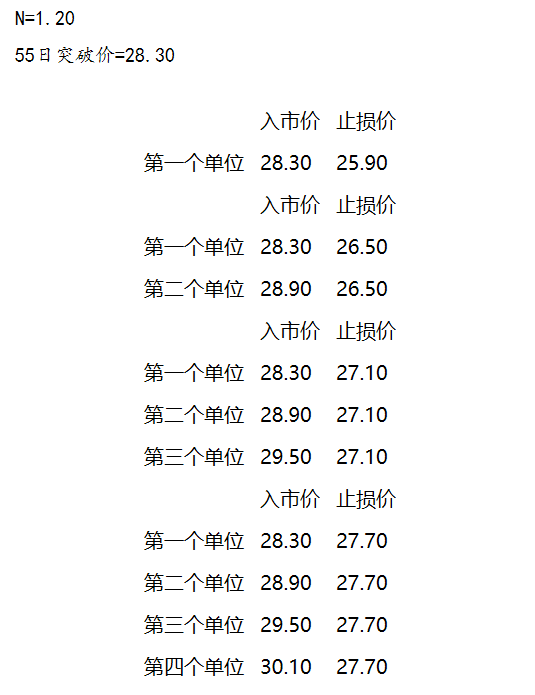
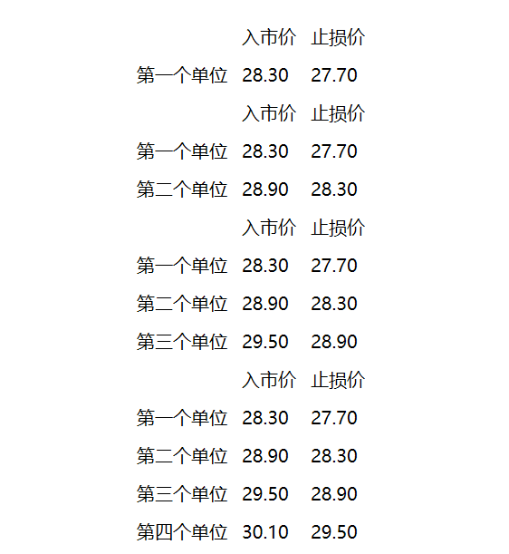

# 《趋势永存》-《海龟交易法则》读后感

虽然任何标的的市场趋势无法预测，但我坚信，一定存在趋势，无论看不看图表它都存在，只要是人参与的市场。

## 前言

通过一段时间的主观交易，最终得出的结论是，自己没有中短线交易的天赋，因为没有打磨出一个预期收益为正的交易系统，也不能很好的执行自己想出来的策略，在放弃了主观交易之后， 转而尝试趋势交易，通过简单的趋势跟随的量化交易策略在近期获得了一个还不错的收益，所以坚定了长线交易的方向，比较无奈，比较好笑。

~~我想我有必要写篇文章来梳理梳理自己对交易的看法以及趋势交易的灵感来源。~~

## 趋势永存: 打败市场的动量策略

这本书介绍了一个动量策略，这个动量策略的交易规则如下。

- 只在周三进行交易
这里我们讨论的是一个长期击败市场的策略，这个策略的关键就是避免频繁交易。为了减少工作量以及交易频率，我们每周只检查一次交易信号。即使某只股票在一天内下跌了20%，只要那天不是调整日，我们就不做任何操作，这也并不意味着我们使用周频数据进行计算，你要牢记所有的计算都是基于日频数据的。我们只在周三进行交易，那么可能有读者会问为什么偏偏是周三？因为周三碰巧有20%的可能性是最好的工作日（注：一周五个工作日，任意一天的概率均为20%——这是作者在调侃），其实换成任何一个交易日也没有关系。

- 根据调整后的动量对股票进行排名
根据动量对标准普尔500指数中的所有股票进行排名。我们将根据过去90天的价格序列计算年化收益率，然后将其与同一时段的判定系数（R 2 ）相乘，得到基于波动率调整的动量指标。记住，如果股价低于其100日均线，或者最近90天内存在超过15%的价格缺口，那么就将它排除。

- 基于1个基点计算头寸规模
使用一个简单的基于ATR的公式来计算头寸规模，保证其每天移动10个基点。计算股票数量的公式为：账户总值 × 0.001/ATR20。

- 判断市场趋势
只有当标准普尔500指数在200日均线之上，你才能买入新的股票。反之，则不允许买入任何股票。

- 每周三进行一次投资组合再平衡

  > 摘自《趋势永存: 打败市场的动量策略》的第97页。

## 海龟交易法则

这本书介绍一个趋势策略，这个策略如下。

- 计算波动性N

  即真实波动幅度均值(ATR)

- 计算头寸规模单位

  账户总值 × 0.01/市场的绝对波动幅度。绝对波动幅度=N(ATR) X 每一点数所代表的美元

  > 与上一本书所不同的是，这里计算的是交易的基本单位，比如期货的每一点代表的是42000美元，那么带入上述公式，结果就是合约的数量。

- 入市信号(选择其中一个即可)

  1. 价格突破过去**20日**的最高点或者最低点一个单位(ATR)时做多或做空。
  2. 价格突破过去**55日**的最高点或者最低点一个单位(ATR)时做多或做空。

- 逐步建仓

  按1/2N的价格单位逐步加仓，最多加到4个单位

- 止损

  1. 最后一个单位止损距离为2N，前者依次减少1/2

     

  2. 每笔交易止损位设置在距离买入价的1/2N位置

     

     

- 退出

  1. 价格突破过去**10日**的最低点或者最高点退出。
  2. 价格突破过去**20日**的最低点或者最高点退出。
  
  > 摘自《海龟交易法则》附录

## 趋势跟随策略

两本书的策略虽然不同，但是有两点是大概相同的。

1. 下注的金额需要做风险控制，即根据ATR来决定下注的大小。
2. 趋势出现苗头就应该下注。

我将两个策略归结为趋势跟随策略(纯个人观点，不接受反驳)。第一本的趋势跟随在于非熊市中选择走势较好的股票买入，我想就这个原因可以认为是趋势跟随策略，而第二本书就没啥异议了，趋势向上做多，趋势向下做空，根正苗红的趋势策略。

### 风险控制

无论是短线或者长线，或者说只要是一个完整的交易系统，那么一定要有限考虑风险的因素，根据风险的大小决定下注的金额，这样才可以将总体的风险控制在一个可控的水平，不然，整个游戏玩不了多少次就出场了，即使机会真的来了，也没有足够的资本来弥补之前的损失。

### 趋势的苗头

虽然第一本数没有着重说明趋势(而是说动量)，但是本质就是趋势，因为排序的标准是笔直倾斜向上的股票排名靠前，而向上就是**趋势**。如果将两本书的买卖点抽离出来，那么买入点就是，趋势来了(也许只是虚晃一招)就买入，走了就卖出。而第一本书的趋势又跟第二本书的趋势不太一样，因为第一本书只做牛市的趋势，熊市不开仓，而后者不论牛市或者熊市。

不过，趋势是无法预测的，当然，两本书的作者也没打算预测，只是出现了趋势的苗头就买入，不是就止损，那么一直止损怎么能让这个系统挣钱呢？我想这个问题要从中短线交易的**盈亏比**及**胜率**说起。

### 盈亏比与胜率

如果要做成功一个中短线交易系统，那么盈亏比及胜率的承继应该是正的，或者说预期收益是正的，不然做得越多亏的越多。

假设每笔交易的成功率是70%, 盈亏比是2:5

那么预期收益是0.7 * 2 - 0.3 * 5 = -0.1

又假设每笔交易的成功率是50%, 盈亏比是3:2

那么预期收益是0.5*3 - 0.5 * 2 = 0.5

总的来说，单独看胜率及盈亏比并不能说明这个交易系统怎么样，又或者说单独的高胜率或高盈亏并不能让自己的交易盈利，只有预期收益为正时，交易系统才有必要继续玩下去，如果预期收益为负还继续交易下去就是单纯的做慈善了。

那么这个跟趋势跟随策略有啥关系？  

### 大盈亏比的趋势策略

因为趋势不是那么好预测的，也因为趋势要等很久才会出现，所以无论哪种指标都不能100%的压中趋势，因此需要不断的下注，在抓住趋势之前的过程中，就是亏损的过程，也因此导致收益会有一个比较长期的亏损或者说回撤的区间，这是趋势策略无法避免的。但是只要在没有弹尽粮绝之前等来的一轮趋势，那么就可以大赚一笔，不然预期收益无法为正，所以趋势策略的盈亏比往往很高，比如20:1或者30:1, 但是胜率就会很低，比如10%。

### 趋势存在吗

我想是存在的，无论哪个市场，只要时间拉长，那么就一定能看到明显的趋势，但是否以后一定存在趋势就看交易者自己的坚信程度了。

### 趋势策略一定能挣钱嘛

我想必然是否定的，一定能挣钱的东西就不合理，不可能每个人都能挣钱，交易是一个负和游戏，交易所的佣金导致必然是输钱的多于赢钱的。

## 趋势交易系统

一个交易系统应该至少包含以下四点

- 买卖什么
- 风险控制/资金管理
- 什么时候买
- 什么时候卖

如果问提高交易系统最直接最有效的办法是什么，我想一定是风险控制以及资金管理，只有在一个风险可控的框架内，赚钱才能成为可能，不然难以可持续发展。

### 买卖什么

什么都可以买卖，只要市场的流通性足够，那么就可以买卖。

### 风险控制

风险控制直接套用上面交易法则的风险控制即可。

### 什么时候买

直接套用上面的交易系统确定买入点，或者通过回测及肉眼观察得出一个大致的周期参数，这个大致的参数是对于趋势周期的反应，周期大则反应迟钝，交易次数少，反之过于敏感，交易次数过多，至于这个大致的周期参数就是靠自己发挥了。

### 什么时候卖

还是基于那个大致的周期参数。

## 最后

我想如果我们想要建立一个完成的交易系统，一定是需要尝到一定的甜头的，不然是无法死心塌地的坚信自己的交易系统，只有一如既往的执行才能挣到交易系统应该挣到的钱。

趋势策略是非极端情况下的比较有效策略，简单好用，当然回撤也会比较大，很考验自己的承受能力，无论是不是程序化的量化交易。

