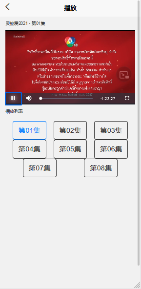

# 写一个h5视频网站

[](https://go.deta.dev/deploy)


做一个视频网站应该最终要的就是视频源，至于视频源从哪里来这是一个问题，不过这里提供一个很小的数据集，不要问我怎么来的，问就是网上来的

> 所有资源来源于网路，仅做技术交流，如有侵权，请联系我删除。


技术栈如下:

- 后端: Python + FastAPI 

- 前端: uniapp + videojs

- 部署: deta/docker-compose+traefik

  

在线地址: 

- https://u8hfyf.deta.dev

- https://youer_video.deta.dev

  

截图:




## 数据集

这里假设已经有一个数据源(test.json)，结果大致如下

```
[{'vod_id': '49069',
  'vod_cid': '36',
  'vod_name': '新双生花普通话',
  'vod_title': '',
  'vod_type': '',
  'vod_keywords': '',
  'vod_actor': '金伯莉·安妮·田舍利,詹姆斯·马',
  'vod_director': '内详',
  'vod_content': '内详',
  'vod_pic': 'https://img.52swat.cn/upload/vod/20210507-1/10b8897d7d7b6c2a5304a8867bb6bd4f.jpg',
  'vod_area': '泰国',
  'vod_language': '泰语',
  'vod_year': '2020',
  'vod_addtime': '2021-08-08 13:12:33',
  'vod_filmtime': 0,
  'vod_server': '',
  'vod_play': 'dbm3u8',
  'vod_url': '第01集$https://vod3.bdzybf3.com/20210507/VrRDCdH3/index.m3u8\r\n第02集$https://vod3.bdzybf3.com/20210507/yh8w9Xqs/index.m3u8\r\n第03集$https://vod3.bdzybf3.com/20210507/om8aOzQA/index.m3u8\r\n第04集$https://vod3.bdzybf3.com/20210507/NCclbdqE/index.m3u8\r\n第05集$https://vod3.bdzybf3.com/20210513/Kz2cHMtz/index.m3u8\r\n第06集$https://vod3.bdzybf3.com/20210513/UneQkeSi/index.m3u8\r\n第07集$https://vod3.bdzybf3.com/20210513/8jIVTzNl/index.m3u8\r\n第08集$https://vod3.bdzybf3.com/20210513/aFzZIwjK/index.m3u8\r\n第09集$https://vod3.bdzybf3.com/20210520/bc0eJaNM/index.m3u8\r\n第10集$https://vod3.bdzybf3.com/20210520/JGGTdkPl/index.m3u8\r\n第11集$https://vod3.bdzybf3.com/20210520/A9XEbzJC/index.m3u8\r\n第12集$https://vod3.bdzybf3.com/20210520/x5WeVe2s/index.m3u8\r\n第13集$https://vod8.wenshibaowenbei.com/20210526/81MdaJUe/index.m3u8\r\n 第14集$https://vod8.wenshibaowenbei.com/20210526/jxc2hQBx/index.m3u8\r\n第15集$https://vod8.wenshibaowenbei.com/20210603/D1UTn0YY/index.m3u8\r\n第16集$https://vod8.wenshibaowenbei.com/20210603/VCf6NvbC/index.m3u8\r\n第17集$https://vod8.wenshibaowenbei.com/20210604/afKgBDKk/index.m3u8\r\n第18集$https://vod8.wenshibaowenbei.com/20210604/7JHjaJ1B/index.m3u8\r\n第19集$https://vod8.wenshibaowenbei.com/20210609/vXi4i7LW/index.m3u8\r\n第20集$https://vod8.wenshibaowenbei.com/20210609/KibQMNAi/index.m3u8\r\n第21集$https://vod8.wenshibaowenbei.com/20210610/t7x2SAGV/index.m3u8\r\n第22集$https://vod8.wenshibaowenbei.com/20210610/PU5Nt4VD/index.m3u8\r\n第23集$https://vod8.wenshibaowenbei.com/20210617/anK2hTDK/index.m3u8\r\n第24集$https://vod8.wenshibaowenbei.com/20210617/iSj9E0ke/index.m3u8\r\n第25集$https://vod8.wenshibaowenbei.com/20210618/10teWp7R/index.m3u8\r\n第26集$https://vod8.wenshibaowenbei.com/20210618/38FYcSAt/index.m3u8\r\n第27集$https://vod8.wenshibaowenbei.com/20210624/yEnElEJb/index.m3u8\r\n第28集$https://vod8.wenshibaowenbei.com/20210624/PpOJ9Q1X/index.m3u8\r\n第29集$https://vod8.wenshibaowenbei.com/20210625/ibLJ8BVi/index.m3u8\r\n第30集$https://vod8.wenshibaowenbei.com/20210625/kR5MGUYa/index.m3u8\r\n第31集$https://vod8.wenshibaowenbei.com/20210701/zO7e308g/index.m3u8\r\n第32集$https://vod8.wenshibaowenbei.com/20210701/Ud62RiQr/index.m3u8\r\n第33集$https://vod8.wenshibaowenbei.com/20210701/wzi6elaq/index.m3u8\r\n第34集$https://vod8.wenshibaowenbei.com/20210701/4knnVJj7/index.m3u8\r\n第35集$https://vod8.wenshibaowenbei.com/20210708/cYqqEQl6/index.m3u8\r\n第36集$https://vod8.wenshibaowenbei.com/20210708/8WBVoFhM/index.m3u8',
  'vod_inputer': None,
  'vod_reurl': 'http://www.605zyw.net//?m=vod-detail-id-49069.html',
  'vod_length': 0,
  'vod_weekday': None,
  'vod_copyright': 0,
  'vod_state': '',
  'vod_version': '',
  'vod_tv': '',
  'vod_total': 0,
  'vod_continu': '共36集,完结',
  'vod_status': 1,
  'vod_stars': 0,
  'vod_hits': None,
  'vod_isend': 1,
  'vod_douban_id': 0,
  'vod_series': '',
  'list_name': '海外剧'}]
```

> 所有资源来源于网路，仅做技术交流，如有侵权，请联系我删除。


## 后端

因为我要做的是一个非常简单的视频网站，所以只需要提供几个接口就可以了

```python
# -*- coding: UTF-8 -*-
# @author youerning
# @email 673125641@qq.com

import logging
import json
from typing import List

from fastapi import FastAPI, Query, Body
from  fastapi.staticfiles import StaticFiles
from fastapi.responses import JSONResponse, HTMLResponse
from fastapi.middleware.cors import CORSMiddleware
from pydantic import BaseModel


LOG_LEVEL = logging.DEBUG
logger = logging.getLogger(__name__)
fmt = logging.Formatter("%(asctime)s - %(filename)s[line:%(lineno)d] - %(levelname)s: %(message)s")
console_handler = logging.StreamHandler()
console_handler.setFormatter(fmt)
logger.addHandler(console_handler)

logger.setLevel(LOG_LEVEL)
console_handler.setLevel(LOG_LEVEL)

# 加载本地数据源
with open("test.json", encoding="utf8") as rf:
    db = json.load(rf)


with open("index.html", encoding="utf8") as rf:
    html = rf.read()

app = FastAPI(
    title="Simple Video APP Backend",
    version="1.0.0",
)

app.mount("/static", StaticFiles(directory="static"), name="static")

origins = [
    "http://localhost",
    "http://localhost:8080",
]

app.add_middleware(
    CORSMiddleware,
    allow_origins=origins,
    allow_credentials=True,
    allow_methods=["*"],
    allow_headers=["*"],
)


# 响应数据结构
class ResponseModel(BaseModel):
    data: list

class SuccessResponseModel(ResponseModel):
    status: str = "ok"

class ErrorResponseModel(BaseModel):
    status: str = "error"
    msg: str


def parse_vod_urls(video: dict) -> list:
    vod_url = video.pop("vod_url", "")
    vod_links = []

    if not vod_url:
        logger.warning("the content of video[{}] is not vaild".format(video["_id"]))
        return vod_links

    name_urls = vod_url.split("\r\n")
    for name_url in name_urls:
        name, url = name_url.split("$")
        vod_links.append({"name": name, "url": url})

    return vod_links


@app.get("/", response_class=HTMLResponse)
def index_page():
    return html


@app.get("/api/search",
    status_code=200,
    response_model=SuccessResponseModel,
    response_model_exclude_none=True,
    responses={501: {"model": ErrorResponseModel}})
async def search(q: str = Query(..., title="query", description="The name of the video you want to search", max_length=30)):
    data = [item for item in db if q in item["vod_name"]]
    for video in data:
        video["vod_links"] = parse_vod_urls(video)
    return SuccessResponseModel(data=data)


@app.post("/api/videos/",
    status_code=200,
    response_model=SuccessResponseModel,
    response_model_exclude_none=True,
    responses={501: {"model": ErrorResponseModel}})
async def search_videos(video_ids: List[str] = Body(..., embed=True)):
    video_ids = list(set(video_ids))[:10]
    data = [item for item in db if item["vod_id"] in video_ids]
    for video in data:
        video["vod_links"] = parse_vod_urls(video)
    return SuccessResponseModel(data=data)


@app.get("/api/videos/{video_id}",
    status_code=200,
    response_model=SuccessResponseModel,
    response_model_exclude_none=True,
    responses={501: {"model": ErrorResponseModel}, 400: {"model": ErrorResponseModel}})
async def search_video(video_id: str):
    data = [item for item in db if item["vod_id"] == video_id]
    if not data:
        return JSONResponse(status_code=400, content={"msg": "video id do not exists"})

    data = data[0]
    data["vod_links"] = parse_vod_urls(data)
    return SuccessResponseModel(data=[data])
```


我这里是直接加载的json文件，现实情况当然是使用数据库比如mysql或者mongodb，又或者全文搜索引擎如elasticsearch, meilisearch, typesense。


## 前端

前端不用太复杂，只要两个页面即可，一个是搜索页面，一个是播放页面.

> 说实话，前端也不够好

目录结构如下:

```powershell
pages
└─index
    │  index.vue
    └─detail
            detail.vue
```


index.vue 代码如下:

```vu
<template>
	<view class="content">
		<uni-search-bar placeholder="搜索" @confirm="search"></uni-search-bar>
		<view>
			<scroll-view scroll-y="true" class="scroll-Y" @scrolltoupper="upper" @scrolltolower="lower"
			@scroll="scroll">
				<block v-for="item in data" >
					<uni-card
						:title="item.vod_name"
						:key="item.vod_id"
						:is-shadow="true"
						:extra="item.vod_addtime"
						:note="item.vod_continu"
						>
						<view class="detail" @click="() => gotoDetail(item.vod_id)">
							<image :src="item.vod_pic" mode="widthFix" class="index-image"></image>
							<text>{{"演员: " + item.vod_actor.slice(0, 30) + "..." + "\n\n"}}  {{item.vod_content}}</text>
						</view>
					</uni-card>
				</block>
			</scroll-view>
		</view>
	</view>
</template>

<script>
	export default {
		data() {
			return {
				video_ids: [],
				data: []
			}
		},
		onLoad() {
			var that = this
			uni.getStorage({
			    key: 'video_ids',
			    success: function (res) {
					this.video_ids = res.data
					console.log("获取缓存数据", this.video_ids)
					
					if (this.video_ids.length >= 1) {
						uni.request({
							url: "/api/videos",
							data: {
								video_ids: this.video_ids
							},
							method:"POST",
							success: (res) => {
								that.data = res.data.data
								// console.log(that.data)
							}
						})
					}
			    },
				fail: function(err) {
					// console.log(err)
					uni.setStorage({
					    key: 'video_ids',
					    data: [],
					    success: function () {
					        console.log('将历史记录重置为空数组');
					    }
					});
				}
			});
		},
		methods: {
			gotoDetail(vod_id) {
				console.log("click ", vod_id)
				uni.navigateTo({url: "/pages/index/detail/detail?vod_id=" + vod_id})
			},
			search(value) {
				// console.log(value)
				uni.request({
					url: '/api/search?q=' + value.value,
				}).then((res) => {
					this.data = res[1].data.data
					console.log(this.data)
					// console.log(res[])
				}).catch((err) => {
					uni.showToast({
					    title: '请求失败',
					    duration: 2000,
						icon: none
					});
				})
			}
		}
	}
</script>

<style>
	/* .content {
		padding:15upx 50upx 0upx 50upx;
	} */ 
	.detail {
		font-size: 30rpx;
		height: 350rpx;
		display: -webkit-flex;
		display: flex;
		align-items: flex-start;
		justify-content: space-around;
		flex-flow: row nowrap;
	}
	
	.detail image {
		width: 270rpx;
	}
	
	.detail text {
		padding-left: 10rpx;
		width: 450rpx;
		display: -webkit-box;
		overflow: hidden;
		text-overflow: ellipsis;
		word-wrap: break-word;
		white-space: normal !important;
		-webkit-line-clamp: 8;
		-webkit-box-orient: vertical;
	}
</style>

```


detail.vue代码如下:

```vue
<template>
	<view class="content">
		<text class="title">{{data.vod_name}}{{current_video.name? " - " + current_video.name : ""}}</text>
		<view class="videocontent">
			<view class="video-js" ref="video" />
		</view>
		<view class="title">播放列表</view>
		<!-- <view class="series">
			<button v-for="video_data in data.vod_links"
				:type="video_data.url == current_video.url ? 'primary' : 'defalut'"
				@click="() => changeUrl(video_data)"
				plain="true">{{video_data.name}}</button>
		</view>
		 -->
		<view class="grid col-5 padding-sm">
			<button v-for="video_data in data.vod_links"
				:type="video_data.url == current_video.url ? 'primary' : 'defalut'"
				@click="() => changeUrl(video_data)"
				plain="true"
				>{{video_data.name}}</button>
		</view>
	</view>
</template>

<script>
	export default {
		data() {
			return {
				current_video: {
					name: "",
					url: ""
				},
				data: {}
			}
		},
		methods: {
			changeUrl(video_data) {
				this.current_video = video_data
				var v = videojs('video')
				v.src([
					{type: "application/x-mpegURL", src: video_data.url},
				])
				v.play()
			}
		},
		mounted() {
			// this.current_video = this.data.vod_urls[0]
			var video = document.createElement('video')  
			this.video = video
			this.video.id = 'video'
			// video.style = 'width: 300px;height: 150px;'  
			this.video.controls = true  
			// var source = document.createElement('source')
			// source.src = this.current_video.url
			// this.video.appendChild(source)  
			this.$refs.video.$el.appendChild(video)  
			videojs('video')
		},
		onLoad: function(option) {
			// console.log("recive vod_id: ", option)
			this.video_id = option.vod_id
			uni.request({
				url: "/api/videos/" + option.vod_id
			})
			.then(res => {
				// console.log(res[1].data.data)
				this.data = res[1].data.data[0]
				// console.log(this.data)
				this.current_video = this.data.vod_links[0]
				this.changeUrl(this.current_video)
				
				// 缓存点击多的video id
				uni.getStorage({
				    key: 'video_ids',
				    success: function (res) {
						console.log("获取缓存数据", res)
						const video_ids = res.data.filter((val) => {
							if (val && val != this.video_id) {
								return true
							}
						})
						
						this.video_ids = [option.vod_id].concat(video_ids)
						console.log("缓存数据: ", this.video_ids)
						uni.setStorage({
						    key: 'video_ids',
						    data: this.video_ids,
						});	
				    }
				})
			})
			.catch(err => {
				console.log(err)
				uni.showToast({
					icon: "none",
					duration: 1500,
					title: "没有找到对应的视频内容"
				})
			})
			
		}
	}
</script>

<style>
	.content {
		padding: 0 30rpx;
	}
	
	.title {
		display: -webkit-box;
		padding: 20rpx 0;
		font-size: 24rpx;
		color: #434343;
	}
	
	.videocontent {
		display: flex;
		height: 400rpx;
		display: -webkit-flex;
		display: flex;
		align-items: center;
		justify-content: center;
		flex-flow:row nowrap;
	}
	
	.videocontent view{
		width: 100%;
		height: 100%;
	}
	.series {
		display: flex;
		justify-content: flex-start;
		flex-flow:row wrap;
		display: -webkit-flex;
	}
	
	.series button {
		width: 180rpx;
	}
</style>

```


index.html代码如下:

```html
<!DOCTYPE html>  
<html lang="zh-CN">  
    <head>  
        <meta charset="utf-8">  
        <meta http-equiv="X-UA-Compatible" content="IE=edge">  
        <meta name="viewport" content="width=device-width, user-scalable=no, initial-scale=1.0, maximum-scale=1.0, minimum-scale=1.0">  
        <title>  
            <%= htmlWebpackPlugin.options.title %>  
        </title>  
        <script>  
            document.addEventListener('DOMContentLoaded', function() {  
                document.documentElement.style.fontSize = document.documentElement.clientWidth / 20 + 'px'  
            })  
        </script>  
        <link rel="stylesheet" href="<%= htmlWebpackPlugin.options.baseUrl %>static/index.css" />  
        <link href="https://cdn.bootcdn.net/ajax/libs/video.js/7.14.2/alt/video-js-cdn.min.css" rel="stylesheet">  
        <script src="https://cdn.bootcdn.net/ajax/libs/video.js/7.14.2/alt/video.core.min.js"></script>  
        <script src="https://cdn.bootcdn.net/ajax/libs/videojs-contrib-hls/5.9.0/videojs-contrib-hls.js"></script>  
    </head>  
    <body>  
        <noscript>  
            <strong>Please enable JavaScript to continue.</strong>  
        </noscript>  
        <div id="app"></div>  
        <!-- built files will be auto injected -->  
    </body>  
</html>
```


## 部署

这里用两种方式部署

- deta: 一个免费的应用云平台，可以部署自己服务，支持自定义子域名或者使用自己的域名
- docker-compose + traefik


### Deta

代码请参考deta目录

非常推荐的一个小项目的部署方案，因为免费版本也就内存128mb, 但是做一个demo还是不错的。


#### 注册登录

注册登录之后会一个账号，还有一个project key，这里暂时用不到


#### 安装deta

参考 https://docs.deta.sh/docs/cli/install


#### 创建项目

```powershell
deta new video_site --python
```

创建完成之后会给一个自动生成的域名
```
Successfully created a new micro
{
        "name": "video_site",
        "runtime": "python3.7",
        "endpoint": "https://u8hfyf.deta.dev",
        "visor": "enabled",
        "http_auth": "disabled"
}
```


#### 目录结构

```
video_site
│  index.html
│  main.py
│  requirements.txt
│  test.json
│
├─.deta
│      prog_info
│
└─static
    └─static
        │  index.css
        │  logo.png
        │
        ├─fonts
        │      uni.75745d34.ttf
        │
        └─js
                chunk-vendors.7b2b4d3a.js
                index.d88f037c.js
                pages-index-detail-detail.c3068165.js
                pages-index-index.290eaeda.js
```

每个deta项目(Python)需要一个main.py以及requirements.txt


### 部署

最后在项目工作目录执行

```bash
deta deploy
```


### 小结

使用deta作为demo地址还是不错的，并且还有其他服务作为交互，比如deta base可以作为一个类redis key-value数据库使用，而deta drive可以作为一个网络空间使用。

> 大家多多注册吧，我怕它经营不善要倒闭 (捂脸)


## docker-compose + traefik
配置文件太多就不粘贴了

###  构建镜像
```bash
mkdir -p app
cp ../backend/* app/
cp ../frontend/app/unpackage/dist/build/h5/index.html app/
cp ../frontend/app/unpackage/dist/build/h5/static app
sed -i "s/127.0.0.1/db/" app/app.yaml

docker build -t video .
```


###  启动容器

```bash
docker-compose up
```


### 小结

有了docker或者说容器是的部署的环境问题得到很大的改善，环境一致干净，但是大规模的环境就需要编排工具，比如k8s，虽然编排的很快，但是网络流量处理是一个让人头疼的问题，所以Traefik应运而生，让配置反向代理变得有趣且简单，世界又变得美好了，而且Traefik支持的provider很多，比如docker，这样对于个人用户还是很友好的，如果有多个应用需要维护，可以很方便的维护这个统一的入口。


最后，Traefik跟Let's Encrypt的配合，使得ssl证书可以自动获得，甚至是通配符ssl证书，世界变得更美好了^_^


## 代码地址
https://github.com/youerning/blog/tree/master/video_site


## 总结

见小结。

