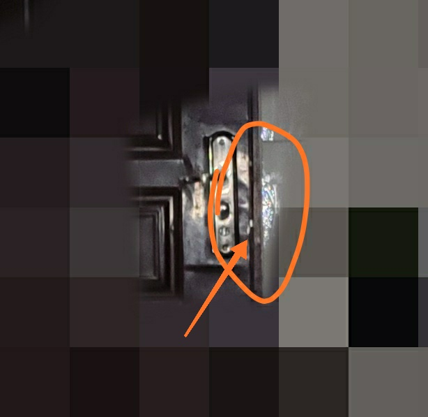
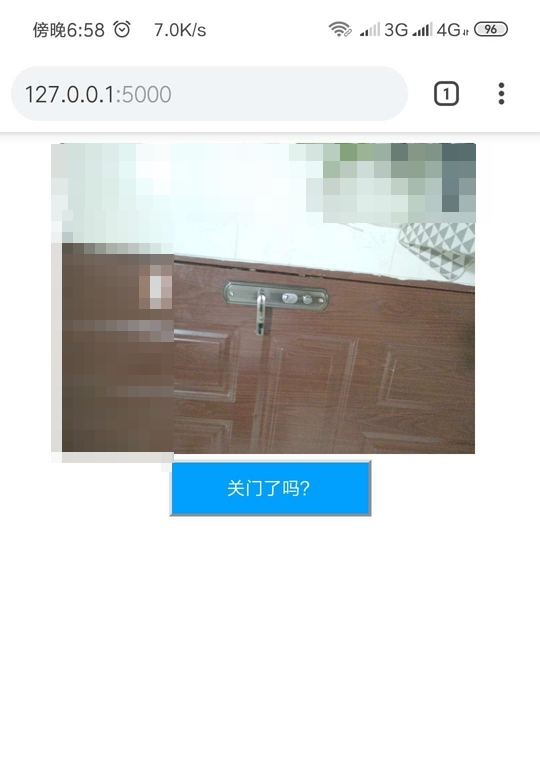

# 旧手机威力之看门狗

不知道大家是否有关门后又回到门口检查门是否关了的经历，反正我有，作为一个懒人应该采取一些措施，在不往回跑的前提下检查门是否关了。

> 几乎没有忘记关过门，但是强迫症逼死人:(

**解决方案**

远程控制联网手机在房内对门口拍照，然后查看图片检查是否关门. 远程方面使用web方式.

这里放一张截图:


如图所示，如果关门了，通过照片能看出是否关门了，这里拍摄的是打了小锁的情况。


**实施方案**

硬件:
- 时刻联网的旧手机
> 这里使用的红米note7 pro做的测试, 旧手机有点问题.

软件:
- termux 0.69
- termux-api 0.32
- juiceSSH(可选)
- python3
- frp(选择自己喜欢的内网穿透方式) 

## 环境准备
主要是手机APP安装以及APP里面Linux环境软件的安装

### 手机APP
手机安装termux, termux-api, juiceSSH

通过你中意的应用市场找到这两个app然后安装
> 建议通过Google商店安装, 不过可能有难度，需要自行研究

安装好之后可以通过自带的窗口或者通过JuiceSSH连接，因为JuiceSSH对于命令输入更友好

关于JuiceSSH或者电脑连接手机的Termux可以参考: [一个旧手机的威力](https://blog.51cto.com/youerning/2087099)

### Termux Linux环境
Linux包以及Python包

#### 安装termux-api用于访问手机相机
```
pkg install termux-api
```
> 一定要既安装手机APP的Termux-API, 也要通过上面命令安装termux-api

通过这个包我们可以获得一堆访问手机意见或者软件的访问API, 比如相机，短信，电话，震动之类的API.

可通过以下命令调用手机相机拍照

```
# 查看帮助
➜  ~ termux-camera-photo -h    
Usage: termux-camera-photo [-c camera-id] output-file
Take a photo and save it to a file in JPEG format.
  -c camera-id  ID of the camera to use (see termux-camera-info), default: 0

# 通过相机id为1的相机拍照，并保存相片到本地1.jpeg
termux-camera-photo -c 1 1.jpeg
```
至于你的哪个相机是前置哪个是后置，或者某个后置(后置可能有多个), 需要自己测试。

但是上面的照片是放在APK的存储空间里面，所以手机相册看不到，所以需要通过其他API将图片放到手机的本地存储。

执行以下命令后，会在加目录生成一个storage目录，通过这个目录我们可以在termux内访问手机的本地存储

```
# 手机应该会询问该APP可否访问手机存储
termux-setup-storage
```

然后我们就可以将将拍摄的图片移到外面,然后就可以通过相册或者文件管理器打开

```
cp 1.jpeg storage/downloads
```


> 注: 在执行相关命令的时候会弹出权限是否允许,需要手动点击允许, 不允许的话自然这些API或者说命令都没法用了.

Termux-API参考链接: [Termux-API](https://wiki.termux.com/wiki/Termux:API)


#### Python相关依赖
选择你自己喜欢的编程语言或者web框架都可以了，这里选择Python, flask实现web远程控制。

```
# 安装Python
pkg install python

# 安装flask pillow
pip install flask pillow
```
安装pillow是为了压缩图片。

如果安装sanic, pillow失败，可以考虑安装以下依赖(我安装了很多的其他库，所以确定哪个是一定必要的)

```
apt install python python-dev clang fftw libzmq libzmq-dev freetype freetype-dev libpng libpng-dev pkg-config zlib zlib-dev libiconv libiconv-dev curl
```


内网穿透也参考这篇文章: [一个旧手机的威力](https://blog.51cto.com/youerning/2087099)

至此我们完成了所有的准备工作。

## web远程控制
效果如下


由于我暂时没想好一个好的放置位置(跟房间布局有关)，所以暂时还没有实际应用，所以照片拍摄的照片是手持手机，然后远程控制拍摄。

### 代码实现
纯演示项目，如果觉得有意思自己完善吧。

为了尽可能的少代码，前端方面没使用任何第三方库。

目录结构
```
➜  ~ tree watchdog                
watchdog
├── app.py
├── static
│   ├── 2019-05-18-18-54-00.jpeg
│   └── latest.jpeg
└── templates
    └── index.html

2 directories, 4 files
```


代码app.py
```
from flask import Flask
import subprocess as sp
from datetime import datetime
from PIL import Image
from os import path
from flask import render_template
app = Flask(__name__)


@app.route("/")
def index():
    # 为了不缓存图片
    now = datetime.now()
    timestamp = now.timestamp()
    return render_template('index.html', timestamp=timestamp)


@app.route("/watch")
def watch():
    cwd = path.dirname(path.abspath("__file__"))
    static_dir = path.join(cwd, "static")
    now = datetime.now()
    date_str = now.strftime("%Y-%m-%d-%H-%M-%S")
    # 拍摄的照片保存位置
    img_path = path.join(static_dir, "{}.jpeg".format(date_str))
    print(img_path)
    # 拼凑出latest.png文件路径
    latest_img_path = path.join(static_dir, "latest.jpeg")
    print(latest_img_path)
    cmd = "termux-camera-photo -c 0 {}".format(img_path)
    retcode = sp.call(cmd, shell=True)

    if retcode != 0:
        return "failed"

    img = Image.open(img_path)
    # 根据实际图片压缩，自己测试
    new_img = img.resize((int(img.size[0] * 0.4), int(img.size[1] * 0.4)))
    try:
        new_img.save(latest_img_path)
    except Exception as e:
        print(e)
        return "failed"
    return "ok"


if __name__ == '__main__':
    app.run(host="0.0.0.0", debug=True)

```

index.html

```
<!DOCTYPE html>
<html>
<head>
    <title>Watch Dog</title>

    <meta charset="utf-8">
    <meta name="viewport" content="width=device-width, initial-scale=1, shrink-to-fit=no">
    <meta http-equiv="Pragma" content="no-cache">
    <meta http-equiv="Cache-Control" content="no-cache">
    <meta http-equiv="Expires" content="0">
    <style>
        .container {
            text-align: center;
        }

        img {
            width: 80%;
        }
        button{
            padding: 10px 40px;
            background: #09F;
            color: #FFF;
            text-decoration: none;
        }
    </style>

    <script type="text/javascript">
        function watch() {
            var xhttp = new XMLHttpRequest();
            xhttp.open("GET", "/watch", true)
            xhttp.onloadend = e => {
                var resp = xhttp.responseText
                alert(resp)
                if (resp == "ok") {
                    // 刷新页面
                    window.location.reload()
                }
            };  
            xhttp.send()
        }

    </script>
</head>
<body>
<div class="container">
    <!-- 加个时间戳为了强制更新图片 -->
    
    <br>
    <button onclick="watch()">关门了吗？</button>
</div>

</body>
</html>
```


在windows上安装一些需要编译的python库实在是件痛苦的事情，因为需要Microsoft Visual C++ 14.0, 而为了装这个又得需要装visual studio.


## 总结
总的来说流程如下
1. 安装必要的软件
2. 找一个合适的地方放置手机
3. 编写自己喜欢的远程控制方式
4. 内网穿透或者其他方式连接控制端


如果你喜欢的话也可以通过写一个APP的方式实现。

代码链接: [watchdog](https://github.com/youerning/blog/tree/master/watchdog)


