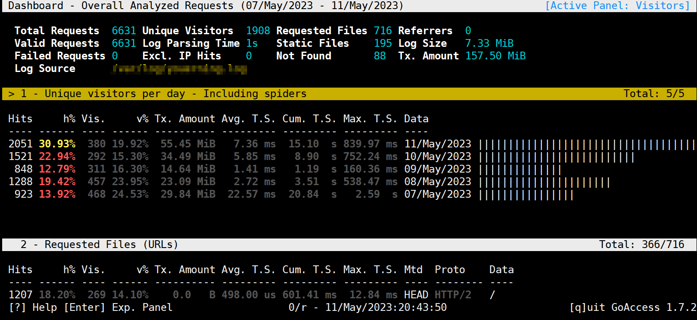
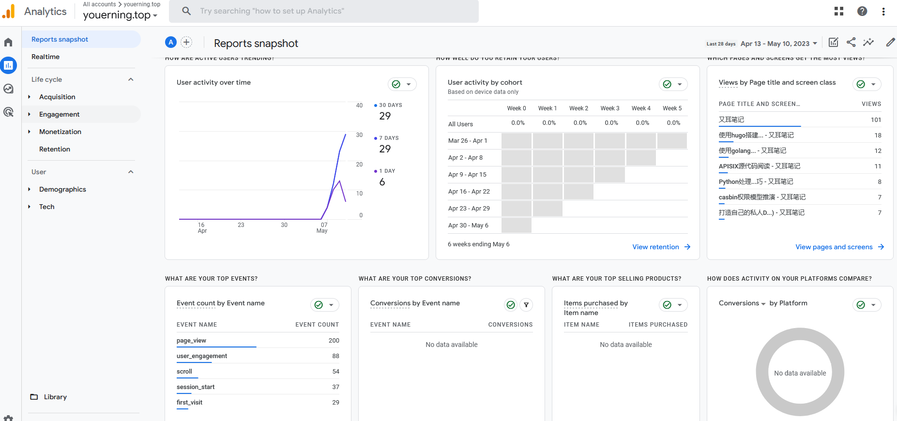
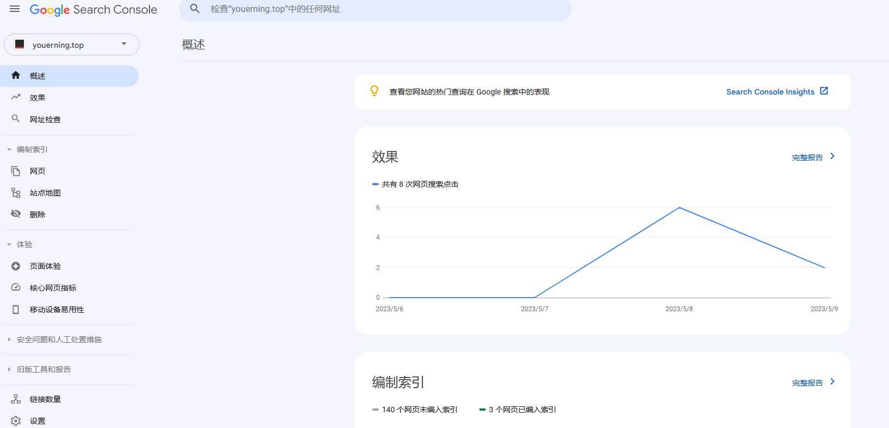
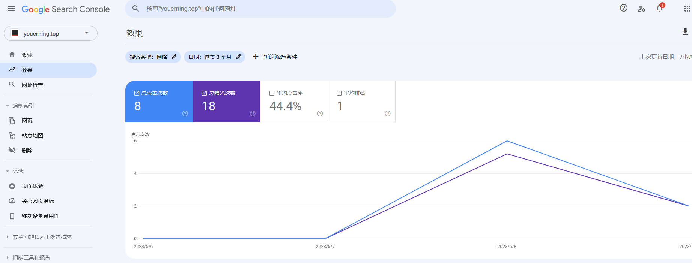

# 网站流量分析

网站搭建起来之后，总是要维护的，而网站的流量分析是其中一项比较重要的任务，通过网站的流量分析我们可以得到诸如"每天多少人访问?"，"哪个页面访问的最多?", "某个页面访问了多久?"，"PC端多还是手机端多?"的答案。

网站的流量分析，大致可从以下三个方面入手。

1. 访问日志
2. 用户在页面的停留和点击行为
3. 搜索引擎


## 请求日志

网站的访问日志是现成的数据集，很容易得到流量的方方面面，日志分析有很多工具，也很容易写脚本，这里主要介绍一个工具和一个简单的python脚本。


### GoAccess

GoAccess一个开箱可用的分析工具，当安装之后只需要一条命令即可实时分析和输出分析结果。

如果已安装GoAccess, 使用以下命令。

> 这里分析的caddy的日志，caddy的日志格式和nginx有点不同，GoAccess从1.4.4才开始支持caddy的日志格式!!!

```sh
goaccess --log-format CADDY localhost.log -o /path/to/you/webroot/goaccess.html
```

> 注意: 上述命令将goaccess.html放到了网站根目录, 所以可以直接访问httos://{你的域名}/goaccess.html进行访问。

显示效果如下:


> GoAccess官方的在线演示页面: https://rt.goaccess.io/


除此之外，GoAccess最常用的命令其实是在终端显示统计结果，命令如下，即不需要out参数。

```sh
goaccess --log-format CADDY localhost.log
```

这是终端的显示效果



> 注意: 终端显示可以按下键不断下拉.

如果你愿意的话，也能实时出事网页预览结果, 命令如下

```sh
goaccess --log-format CADDY localhost.log  -o /path/to/you/webroot/goaccess.html --real-time-html
```

GoAccess的安装使用可查阅官方文档，这里就赘述了。

GoAccess下载安装:   https://goaccess.io/download

GoAccess使用说明:   https://goaccess.io/man


### Python脚本

使用脚本分析访问日志还是很容易的，相较于其他解决方案而言不成熟, 不过优点是灵活。

caddy的一条日志如下:

```json
{
	"level": "info",
	"ts": 1683809163.1758618,
	"logger": "http.log.access.log1",
	"msg": "handled request",
	"request": {
		"remote_ip": "172.69.67.51",
		"remote_port": "63594",
		"proto": "HTTP/2.0",
		"method": "HEAD",
		"host": "youerning.top",
		"uri": "/",
		"headers": {
			"Cdn-Loop": ["cloudflare"],
			"Cache-Control": ["no-cache"],
			"Cf-Ipcountry": ["US"],
			"X-Forwarded-For": ["216.144.248.23"],
			"X-Forwarded-Proto": ["https"],
			"Accept": ["text/html,application/xhtml+xml,application/xml;q=0.9,*/*;q=0.8"],
			"Referer": ["https://youerning.top"],
			"Accept-Encoding": ["gzip"],
			"Accept-Language": ["en-US,en;q=0.8"],
			"Cf-Connecting-Ip": ["216.144.248.23"],
			"Cf-Ray": ["7c5a85c508a6aa34-DFW"],
			"Content-Length": ["0"],
			"Cf-Visitor": ["{\"scheme\":\"https\"}"],
			"User-Agent": ["Mozilla/5.0+(compatible; UptimeRobot/2.0; http://www.uptimerobot.com/)"]
		},
		"tls": {
			"proto": "h2",
			"server_name": "youerning.top"
		}
	},
	"user_id": "",
	"duration": 0.001344724,
	"size": 0,
	"status": 200,
	"resp_headers": {
		"Content-Length": ["30986"],
		"Server": ["Caddy"],
		"Alt-Svc": ["h3=\":443\"; ma=2592000"],
		"Etag": ["\"ruhtxgnwq\""],
		"Content-Type": ["text/html; charset=utf-8"],
		"Last-Modified": ["Thu, 11 May 2023 12:12:52 GMT"],
		"Accept-Ranges": ["bytes"]
	}
}
```

一般来说，我们比较在意请求路径和User-Agent, 而User-Agent只能**简单**的判断一下是否是爬虫, 因为大多数爬虫知道改User-Agent...


脚本如下:

```python
import json
import time
from urllib.parse import urlparse
from collections import Counter
from datetime import datetime, timedelta

from ua_parser.user_agent_parser import Parse as ua_parse

LAST_HOURS = 24 * 7
now = datetime.now()
analysis_start_time = now - timedelta(hours=LAST_HOURS)

user_agents = Counter()
# client_ips = Counter()
# hosts = Counter()
uris = Counter()
referers = Counter()
# statuses = Counter()
# durations = Counter()

with open(sys.argv[1], encoding="utf8") as rf:
    while True:
        ts = None
        line = rf.readline()
        if not line:
            break
        # 处理format没有指定为json时的日志
        if line.startswith("2"):
            start_index = line.find("{")
            if start_index == -1:
                print(f"日志格式错误(无法找到'{{'起始位置位置): {line}")
                continue
            ts_index = line.find(".")
            if ts_index == -1:
                print(f"日志格式错误(解析时间格式): {line}")
                continue

            try:
                # 2023/05/09 09:06:17.323
                ts = time.strptime(line[:ts_index], "%Y/%m/%d %H:%M:%S")
                ts = datetime(ts.tm_year, ts.tm_mon, ts.tm_mday, ts.tm_hour+8, ts.tm_min, ts.tm_sec, 0)
            except Exception as exc:
                print("错误的时间格式: ", exc, line)
                continue

            line = line[start_index:]
        try:
            record = json.loads(line)
        except Exception as exc:
            print(f"日志格式错误(解析json格式失败): {line}", exc)

        if not ts:
            ts = datetime.fromtimestamp(record["ts"])

        if ts< analysis_start_time:
            continue
        
        request: dict = record.get("request")
        if request.get("headers").get("User-Agent"):
            user_agent = request.get("headers").get("User-Agent")[0]
        else:
            user_agent = "Unknow"
        referer = request.get("headers").get("Referer")
        if referer:
            referer = referer[0]
            try:
                referers.update([urlparse(referer).netloc])
            except Exception as exc:
                print("解析referer失败:", referer, exc)

        user_agnet = ua_parse(user_agent).get("user_agent").get("family")
        user_agents.update([user_agent])
        # client_ips.update([request.get("remote_ip")])
        # hosts.update([request.get("host")])
        uris.update([request.get("uri")])
        # statuses.update([record.get("status")])
        # durations.update([record.get("duration")])


print("user agent: \n%s" % "\n".join([f"{n[0]}|{n[1]}" for n in user_agents.most_common(5)]))
print("uris: \n%s" % "\n".join([f"{n[0]}|{n[1]}" for n in uris.most_common(5)]))
print("referers: \n%s" % "\n".join([f"{n[0]}|{n[1]}" for n in referers.most_common(5)]))
```

结果输出如下:

```sh
user agent: 
Edge/12.246|1631
Mozilla/5.0+(compatible; UptimeRobot/2.0; http://www.uptimerobot.com/)|1201
Chrome/74.0.3729.169|608
Chrome/104.0.0.0/537.36|440
Firefox/112.0|275

uris: 
/|1664
/favicon.ico|90
/js/menu.js|80
/css/style.css|76
/page/2/|35
referers: 
youerning.top|3569
www.google.com|11
blog.51cto.com|3
youerning.top:8080|2
baidu.com|2
```


### 其他方案

#### ELK/EFK

如果手上资源足够并且应用众多，访问日志众多，可以搜索一下ELK, EFK等关键词来找到安装及使用文档，并通过它们来分析日志。这两个方案几乎是完全解决方案了，大小通吃，不过维护成本要大很多。


#### Loki + Grafana

这个方案没亲自使用过，但是看官方文档介绍觉得还是很不错的。


## 用户在页面的停留和点击行为的统计分析

访问日志虽然记录了用户的请求，但是无法直观的反应用户在页面花费的时间，比如页面停留了多久，比如是否滚动鼠标(滚动了鼠标，说明可能在看网页内容)等等，所以我们需要一些额外的工具来分析用户的访问行为，这些工具可选的很多，最出名的应该就是Google Analytics和百度统计了，不过笔者暂时还没接入百度统计，所以这里着重说明一下Google Analytics.


### Google Analytics

这是笔者的建站至今的分析数据(截止到2023/05/11还没一周...)




从Google Analytics 报告可以看到用户走势, 用户地区分布, 用户事件, 访问页面统计等等。


像这种大公司的服务好处在于，不用担心Google Analytics会停止服务，但是有两点需要注意，一是Google作为国外服务商，在国内那就是可能会被墙，二是有的浏览器插件会屏蔽加载Google Analytics的JavaScript，所以统计数据并不能完全说明自己的网站情况，不过这么好的东西，还免费，有啥可抱怨的。


### 其他方案

### 百度统计

百度一般有Google对应的产品，对应Google Analytics的产品叫做百度统计，百度统计自然是不错的，不过我暂时还没使用，所以就只是在这里列出来。


#### Piwik

开源的解决方案，现在有一个新名字了，叫做[*Matomo*](https://piwik.com/)。 缺点是需要自己维护(开源自然是这样.)，这有一定的维护成本，好处自然是什么都可控，并且不容易被屏蔽。


### 小结

有的网站因为业务性质可能不能全面使用外部的分析工具，所以可以选择自己维护一个类似的分析服务。


## 搜索引擎的入口统计分析
这个能选的就不多了，Google, Baidu, Bing应该占据几乎整个搜索市场份额了吧, 所以看自己的需求来选择吧，当然了，全选肯定也是没有问题的，笔者暂时只在Google的搜索控制台认领了自己域名[youerning.top](https://youerning.top)，认领不是太复杂，用Google账号登录 [控制台登录页面](https://search.google.com/search-console)即可。

下面看看[youerning.top](https://youerning.top)这个建站不到一周的搜索数据和页面收录情况。



可以看到还有140个页面没有收录， 但是实际搜索中发现不止三个。

而它的效果页面我们可以看到页面在被搜索后的点击率。



>  加个&hl=zh-Hans将显示改成中文!!!


除了登录搜索控制台，还可以直接在搜索页面查看网页的收录情况。


看截图发现一共收录了7个网页。


## 总结

将网站搭建起来只是万里长征第一步，如果对自己的网站有一定要求必然是需要持续的付出维护成本的，不过都2023年了，免费的，开源的，太多太多，大大的减轻了维护网站的成本。

终于我也称为一名站长了(好老好老的词了呀，当然了, 我也可以说是自媒体^_^)。
